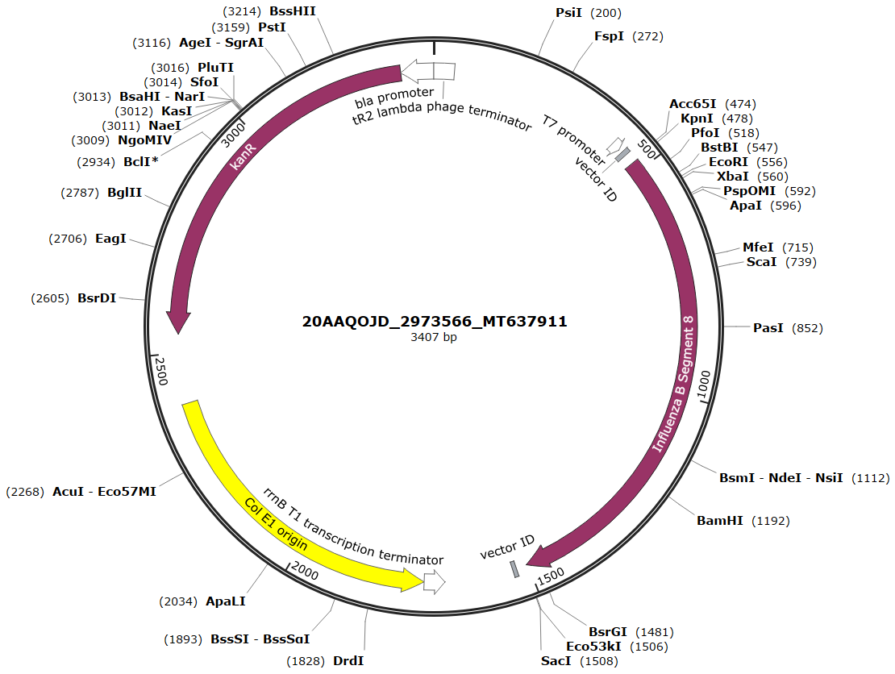
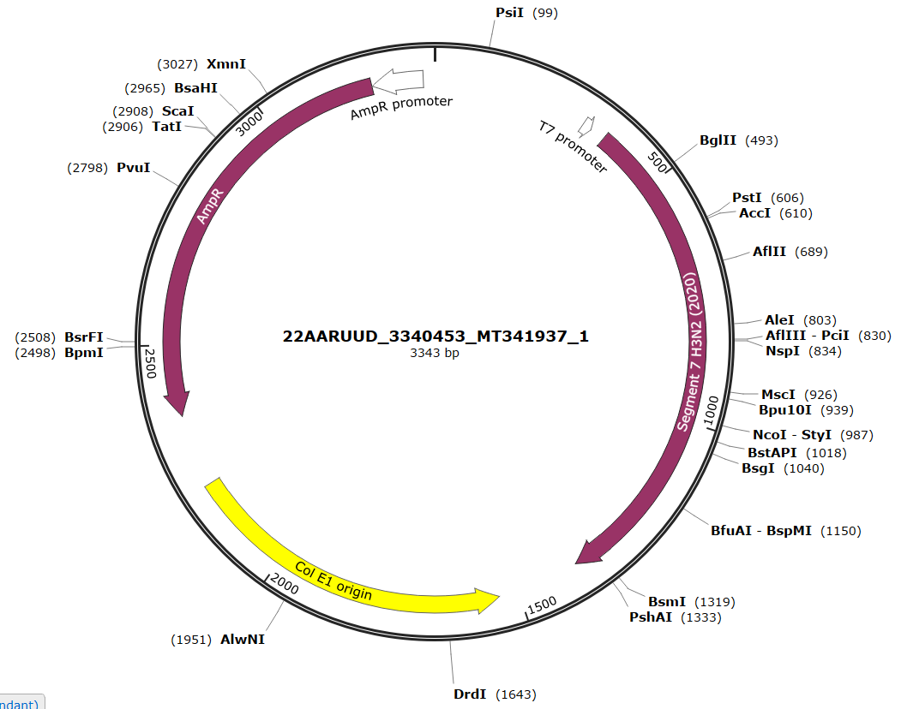

---
output:
  bookdown::pdf_document2:
    fig_caption: yes
    toc: TRUE
    toc_depth: 3
    fontsize: 12pt
    latex_engine: xelatex
bibliography: "Bachelor_quellen.bib"
biblio-style: apalike
citation_package: biblatex
link-citations: yes
urlcolor: RoyalBlue
linkcolor: RoyalBlue
header-includes:
  \usepackage{float}
  \usepackage[ngerman]{babel}
  \usepackage[onehalfspacing]{setspace}
  \usepackage[utf8]{inputenc}
  
---

```{r setup5, include=FALSE}
knitr::opts_chunk$set(echo = FALSE)

library(kableExtra)
library(ggplot2)
library(ggpubr)
library(tidyverse)
library(scales)
library(latex2exp)

```

\pagebreak

# Anhang


(ref:tab1) Mathematische Daten des TT-Wert Vergleichs für Abbildung \@ref(fig:infBetabl)
```{r tabeins}

tab1 <- read.csv2("daten/tab6.csv", fileEncoding="latin1", header = FALSE)

kable(tab1, booktabs = TRUE, col.names = NULL, format = "latex", escape = FALSE, caption = "(ref:tab1)") %>%
  add_header_above(c("Gruppe "= 1, "Werte"= 1, "Mittelwert"=1, "Shapio-Wilk-Test" =1, "Levene-Test"=1, "T-Test"=1, "Aussage"=1), line_sep=0) %>%
  kable_styling(latex_options = "hold_position") %>%
  kable_styling(latex_options = "scale_down") %>%
  footnote(general="ns = nicht Signifikant; s = signifikant", symbol = c("p = <0.05","p = <0.01", "p = <0.001"), symbol_manual = c('*', '**', '***'), fixed_small_size = TRUE, general_title = "Notiz:", escape= FALSE, footnote_as_chunk =TRUE)
```


(ref:tab2) Mathematische Daten des TT-Wert Vergleichs für Abbildung \@ref(fig:infBetabl)
```{r tabzwei}

tab1 <- read.csv2("daten/tab1.csv", fileEncoding="latin1", header = FALSE)

kable(tab1, booktabs = TRUE, col.names = NULL, format = "latex", escape = FALSE, caption = "(ref:tab1)") %>%
  add_header_above(c("Gruppe "= 1, "Werte"= 1, "Mittelwert"=1, "Shapio-Wilk-Test" =1, "Levene-Test"=1, "T-Test"=1, "Aussage"=1), line_sep=0) %>%
  kable_styling(latex_options = "hold_position") %>%
  kable_styling(latex_options = "scale_down") %>%
  footnote(general="ns = nicht Signifikant; s = signifikant", symbol = c("p = <0.05","p = <0.01", "p = <0.001"), symbol_manual = c('*', '**', '***'), fixed_small_size = TRUE, general_title = "Notiz:", escape= FALSE, footnote_as_chunk =TRUE)
```


(ref:tab3) Mathematische Daten des TT-Wert Vergleichs für Abbildung \@ref(fig:infBoptil)A
(ref:tabbesch) ns = nicht Signifikant; s= signifikant; untr.Konfid. = unteres Konfidenzintervall; obrs.Konfid. = oberes Konfidenzintervall
```{r tabdrei}

tab1 <- read.csv2("daten/tab2.csv", fileEncoding="latin1", header = FALSE)

kable(tab1, booktabs = TRUE, col.names = NULL, format = "latex", escape = FALSE, align = "c", caption = "(ref:tab2)") %>%
  add_header_above(c("Gruppe "= 1, "Werte"= 1, "Mittelwert"=1, "Shapio-Wilk-Test" =1, "Levene-Test"=1, "Anova-Test"=1), line_sep=0) %>%
  pack_rows("Vergleich der Gruppen", 4, 7) %>%
  kable_styling(latex_options = "hold_position") %>%
  kable_styling(latex_options = "scale_down") %>%
  footnote(general="(ref:tabbesch)", symbol = c("p = <0.05","p = <0.01", "p = <0.001"), symbol_manual = c('*', '**', '***'), fixed_small_size = TRUE, general_title = "Notiz:", escape= FALSE, footnote_as_chunk =TRUE, threeparttable = TRUE) %>%
  row_spec(4,hline_after=TRUE)
```


(ref:tab4) Mathematische Daten des TT-Wert Vergleichs für Abbildung \@ref(fig:infBoptil)B
```{r tabvier}

tab1 <- read.csv2("daten/tab3.csv", fileEncoding="latin1", header = FALSE)

kable(tab1, booktabs = TRUE, col.names = NULL, format = "latex", escape = FALSE, align = "c", caption = "(ref:tab3)") %>%
  add_header_above(c("Gruppe "= 1, "Werte"= 1, "Mittelwert"=1, "Shapio-Wilk-Test" =1, "Levene-Test"=1, "Anova-Test"=1), line_sep=0) %>%
  kable_styling(latex_options = "hold_position") %>%
  kable_styling(latex_options = "scale_down") %>%
   footnote(general="ns = nicht Signifikant; s = signifikant", symbol = c("p = <0.05","p = <0.01", "p = <0.001"), symbol_manual = c('*', '**', '***'), fixed_small_size = TRUE, general_title = "Notiz:", escape= FALSE, footnote_as_chunk =TRUE)
```

(ref:tab5) Mathematische Daten des TT-Wert Vergleichs für Abbildung \@ref(fig:..)
```{r tabfunf}

tab1 <- read.csv2("daten/tab4.csv", fileEncoding="latin1", header = FALSE)

kable(tab1, booktabs = TRUE, col.names = NULL, format = "latex", escape = FALSE, align = "c", caption = "(ref:tab4)") %>%
  add_header_above(c("Gruppe "= 1, "Werte"= 1, "Mittelwert"=1, "Shapio-Wilk-Test" =1, "Levene-Test"=1, "Anova-Test"=1), line_sep=0) %>%
  pack_rows("Vergleich der Gruppen", 4, 7) %>%
  kable_styling(latex_options = "hold_position") %>%
  kable_styling(latex_options = "scale_down") %>%
  footnote(general="(ref:tabbesch)", symbol = c("p = <0.05","p = <0.01", "p = <0.001"), symbol_manual = c('*', '**', '***'), fixed_small_size = TRUE, general_title = "Notiz:", escape= FALSE, footnote_as_chunk =TRUE, threeparttable = TRUE) %>%
  row_spec(4,hline_after=TRUE)
```

(ref:tab6) Mathematische Daten des TT-Wert Vergleichs für Abbildung \@ref(fig:infBetabl)
```{r tabsechs}

tab1 <- read.csv2("daten/tab9.csv", fileEncoding="latin1", header = FALSE)

kable(tab1, booktabs = TRUE, col.names = NULL, format = "latex", escape = FALSE, caption = "(ref:tab1)") %>%
  add_header_above(c("Gruppe "= 1, "Werte"= 1, "Mittelwert"=1, "Shapio-Wilk-Test" =1, "Levene-Test"=1, "T-Test"=1, "Aussage"=1), line_sep=0) %>%
  kable_styling(latex_options = "hold_position") %>%
  kable_styling(latex_options = "scale_down") %>%
  footnote(general="ns = nicht Signifikant; s = signifikant", symbol = c("p = <0.05","p = <0.01", "p = <0.001"), symbol_manual = c('*', '**', '***'), fixed_small_size = TRUE, general_title = "Notiz:", escape= FALSE, footnote_as_chunk =TRUE)
```


\pagebreak

\vspace*{2 cm}


```{r plasmidB, fig.align='center',message = FALSE, fig.cap= "\\textbf{Plasmidkarte des Influenza B Plasmides für den Influenza B RNA-Standard}", out.width= "100%", fig.show='hold', fig.scap="Plasmidkarte des Influenza B Plasmides"}




```

\pagebreak

\vspace*{2 cm}


```{r plasmidA937, fig.align='center',message = FALSE, fig.cap= "\\textbf{Plasmidkarte des Influenza A Plasmides für den Influenza H3N2 (2020) RNA-Standard}", out.width= "100%", fig.show='hold', fig.scap="Plasmidkarte des Influenza A Plasmides für den Influenza H3N2 (2020) RNA-Standard"}




```

\pagebreak

\vspace*{2 cm}


```{r plasmidA214, fig.align='center',message = FALSE, fig.cap= "\\textbf{Plasmidkarte des Influenza A Plasmides für den Influenza H1N1 (2020) RNA-Standard}", out.width= "100%", fig.show='hold', fig.scap="Plasmidkarte des Influenza A Plasmides für den Influenza H1N1 (2020) RNA-Standard"}

knitr::include_graphics("Bilder/InfA Plasmidkarte 214.PNG")


```


\pagebreak


