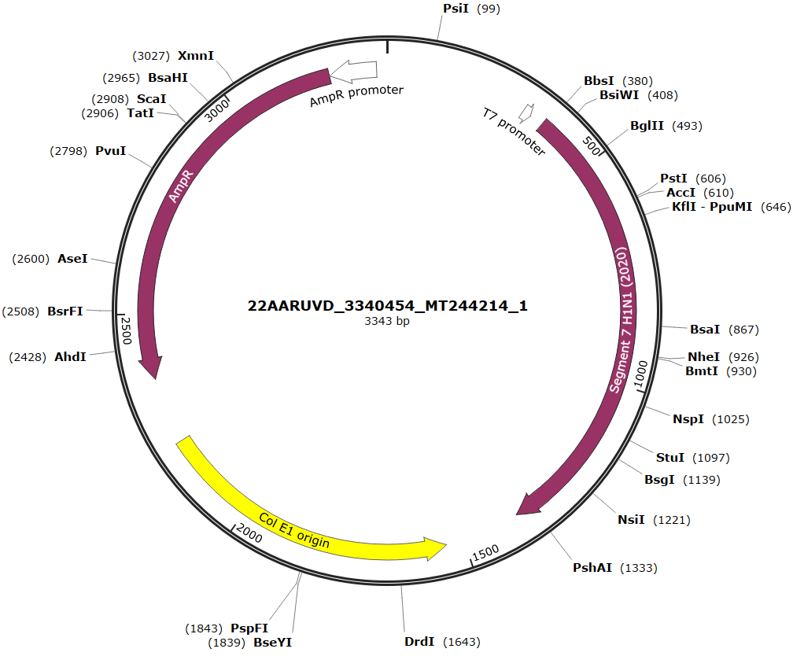

---
output:
  bookdown::pdf_document2:
    fig_caption: yes
    toc: TRUE
    toc_depth: 3
    fontsize: 12pt
    latex_engine: xelatex
bibliography: "Bachelor_quellen.bib"
biblio-style: apalike
citation_package: biblatex
link-citations: yes
urlcolor: RoyalBlue
linkcolor: RoyalBlue
header-includes:
  \usepackage{float}
  \usepackage[ngerman]{babel}
  \usepackage[onehalfspacing]{setspace}
  \usepackage[utf8]{inputenc}
  
---

```{r setup5, include=FALSE}
knitr::opts_chunk$set(echo = FALSE)

library(kableExtra)
library(ggplot2)
library(ggpubr)
library(tidyverse)
library(scales)
library(latex2exp)

```

\pagebreak

# Anhang

(ref:infBmischi) **Einfluss eines Mischschrittes nach 5 min auf die Influenza B 50 µl RT-RPA:** Normalisierte Fluoreszenzdaten der Influenza B RT-RPA im 50 µl Ansatz mit einem zusätzlichen Mischschritt nach 5 min (**grau**) und ohne zusätzliches Mischen (**schwarz**). Die Messung erfolgte bei 40 °C. Als Ausgangsmaterial wurden 10^4^ RNA-Kopien eingesetzt. Negativkontrollen sind mit **(- - -)** gekennzeichnet.

```{r infBmischi50, fig.show='hold',  out.width= "70%", message = FALSE, fig.cap="(ref:infBmischi)", fig.align='center', fig.scap="Einfluss eines Mischschrittes nach 5 min auf die Influenza B 50 µl RT-RPA"}

data <- read.csv2("Daten/infB_mischen_50ansatz.csv")


transformed <- data %>% 
  select(Zeit, ProbeA, ProbeB, ProbeC, ProbeD, ProbeE, ProbeF) %>%
  gather(key = "Proben", value = "Fluoreszenz", -Zeit)

transformed1 <- data %>% 
  select(Zeit, ProbeH, ProbeG) %>%
  gather(key = "Proben", value = "Fluoreszenz", -Zeit)

ggplot(transformed, aes(x=Zeit, y = Fluoreszenz)) +
  geom_line(aes(color = Proben)) +
  theme_minimal()+
   ylab("Fluoreszenz in mV")+
   xlab("Zeit in Minuten") +
   scale_color_manual(values = c("#000000", "#000000", "#000000", "#cccccc", "#cccccc", "#cccccc", "#000000", "#cccccc",
                                 "#cccccc", "#cccccc", "#cccccc", "#cccccc"))+
  geom_line(data=transformed1,aes(color = Proben), linetype="dashed")+
  theme(legend.position="none")
  
```


(ref:tab1) Mathematische Daten des TT-Wert Vergleichs für Abbildung \@ref(fig:infbscreening)
```{r tabeins}

tab1 <- read.csv2("daten/tab6.csv", fileEncoding="latin1", header = FALSE)

kable(tab1, booktabs = TRUE, col.names = NULL, format = "latex", escape = FALSE, caption = "(ref:tab1)") %>%
  add_header_above(c("Gruppe "= 1, "Werte"= 1, "Mittelwert"=1, "Shapio-Wilk-Test" =1, "Levene-Test"=1, "T-Test"=1, "Aussage"=1), line_sep=0) %>%
  kable_styling(latex_options = "hold_position") %>%
  kable_styling(latex_options = "scale_down") %>%
  footnote(general="ns = nicht Signifikant; s = signifikant", symbol = c("p = <0.05","p = <0.01", "p = <0.001"), symbol_manual = c('*', '**', '***'), fixed_small_size = TRUE, general_title = "Notiz:", escape= FALSE, footnote_as_chunk =TRUE)
```


(ref:tab2) Mathematische Daten des TT-Wert Vergleichs für Abbildung \@ref(fig:infBetabl)
```{r tabzwei}

tab1 <- read.csv2("daten/tab1.csv", fileEncoding="latin1", header = FALSE)

kable(tab1, booktabs = TRUE, col.names = NULL, format = "latex", escape = FALSE, caption = "(ref:tab2)") %>%
  add_header_above(c("Gruppe "= 1, "Werte"= 1, "Mittelwert"=1, "Shapio-Wilk-Test" =1, "Levene-Test"=1, "T-Test"=1, "Aussage"=1), line_sep=0) %>%
  kable_styling(latex_options = "hold_position") %>%
  kable_styling(latex_options = "scale_down") %>%
  footnote(general="ns = nicht Signifikant; s = signifikant", symbol = c("p = <0.05","p = <0.01", "p = <0.001"), symbol_manual = c('*', '**', '***'), fixed_small_size = TRUE, general_title = "Notiz:", escape= FALSE, footnote_as_chunk =TRUE)
```


(ref:tab3) Mathematische Daten des TT-Wert Vergleichs für Abbildung \@ref(fig:infbopti)A
(ref:tabbesch) ns = nicht Signifikant; s= signifikant; untr.Konfid. = unteres Konfidenzintervall; obrs.Konfid. = oberes Konfidenzintervall
```{r tabdrei}

tab1 <- read.csv2("daten/tab2.csv", fileEncoding="latin1", header = FALSE)

kable(tab1, booktabs = TRUE, col.names = NULL, format = "latex", escape = FALSE, align = "c", caption = "(ref:tab3)") %>%
  add_header_above(c("Gruppe "= 1, "Werte"= 1, "Mittelwert"=1, "Shapio-Wilk-Test" =1, "Levene-Test"=1, "Anova-Test"=1), line_sep=0) %>%
  pack_rows("Vergleich der Gruppen", 4, 7) %>%
  kable_styling(latex_options = "hold_position") %>%
  kable_styling(latex_options = "scale_down") %>%
  footnote(general="(ref:tabbesch)", symbol = c("p = <0.05","p = <0.01", "p = <0.001"), symbol_manual = c('*', '**', '***'), fixed_small_size = TRUE, general_title = "Notiz:", escape= FALSE, footnote_as_chunk =TRUE, threeparttable = TRUE) %>%
  row_spec(4,hline_after=TRUE)
```


(ref:tab4) Mathematische Daten des TT-Wert Vergleichs für Abbildung \@ref(fig:infbopti)B
```{r tabvier}

tab1 <- read.csv2("daten/tab3.csv", fileEncoding="latin1", header = FALSE)

kable(tab1, booktabs = TRUE, col.names = NULL, format = "latex", escape = FALSE, align = "c", caption = "(ref:tab4)") %>%
  add_header_above(c("Gruppe "= 1, "Werte"= 1, "Mittelwert"=1, "Shapio-Wilk-Test" =1, "Levene-Test"=1, "Anova-Test"=1), line_sep=0) %>%
  kable_styling(latex_options = "hold_position") %>%
  kable_styling(latex_options = "scale_down") %>%
   footnote(general="ns = nicht Signifikant; s = signifikant", symbol = c("p = <0.05","p = <0.01", "p = <0.001"), symbol_manual = c('*', '**', '***'), fixed_small_size = TRUE, general_title = "Notiz:", escape= FALSE, footnote_as_chunk =TRUE)
```

(ref:tab5) Mathematische Daten des TT-Wert Vergleichs für Abbildung \@ref(fig:infboptimisch)A
```{r tabfunf}

tab1 <- read.csv2("daten/tab4.csv", fileEncoding="latin1", header = FALSE)

kable(tab1, booktabs = TRUE, col.names = NULL, format = "latex", escape = FALSE, align = "c", caption = "(ref:tab5)") %>%
  add_header_above(c("Gruppe "= 1, "Werte"= 1, "Mittelwert"=1, "Shapio-Wilk-Test" =1, "Levene-Test"=1, "Anova-Test"=1), line_sep=0) %>%
  pack_rows("Vergleich der Gruppen", 4, 7) %>%
  kable_styling(latex_options = "hold_position") %>%
  kable_styling(latex_options = "scale_down") %>%
  footnote(general="(ref:tabbesch)", symbol = c("p = <0.05","p = <0.01", "p = <0.001"), symbol_manual = c('*', '**', '***'), fixed_small_size = TRUE, general_title = "Notiz:", escape= FALSE, footnote_as_chunk =TRUE, threeparttable = TRUE) %>%
  row_spec(4,hline_after=TRUE)
```

(ref:tab6) Mathematische Daten des TT-Wert Vergleichs für Abbildung \@ref(fig:infboptimisch)B
```{r tabsechs}

tab1 <- read.csv2("daten/tab9.csv", fileEncoding="latin1", header = FALSE)

kable(tab1, booktabs = TRUE, col.names = NULL, format = "latex", escape = FALSE, caption = "(ref:tab6)") %>%
  add_header_above(c("Gruppe "= 1, "Werte"= 1, "Mittelwert"=1, "Shapio-Wilk-Test" =1, "Levene-Test"=1, "T-Test"=1, "Aussage"=1), line_sep=0) %>%
  kable_styling(latex_options = "hold_position") %>%
  kable_styling(latex_options = "scale_down") %>%
  footnote(general="ns = nicht Signifikant; s = signifikant", symbol = c("p = <0.05","p = <0.01", "p = <0.001"), symbol_manual = c('*', '**', '***'), fixed_small_size = TRUE, general_title = "Notiz:", escape= FALSE, footnote_as_chunk =TRUE)
```

(ref:tab7) Mathematische Daten des TT-Wert Vergleichs für Abbildung \@ref(fig:infAsadsensi)
```{r tabsieben}

tab1 <- read.csv2("daten/tab10.csv", fileEncoding="latin1", header = FALSE)

kable(tab1, booktabs = TRUE, col.names = NULL, format = "latex", escape = FALSE, align = "c", caption = "(ref:tab7)") %>%
  add_header_above(c("Gruppe "= 1, "Werte"= 1, "Mittelwert"=1, "Shapio-Wilk-Test" =1, "Levene-Test"=1, "Anova-Test"=1), line_sep=0) %>%
  kable_styling(latex_options = "hold_position") %>%
  kable_styling(latex_options = "scale_down") %>%
   footnote(general="ns = nicht Signifikant; s = signifikant", symbol = c("p = <0.05","p = <0.01", "p = <0.001"), symbol_manual = c('*', '**', '***'), fixed_small_size = TRUE, general_title = "Notiz:", escape= FALSE, footnote_as_chunk =TRUE)
```

(ref:tab8) Mathematische Daten des TT-Wert Vergleichs für Abbildung \@ref(fig:infAvolumen)
```{r tabacht}

tab1 <- read.csv2("daten/tab12.csv", fileEncoding="latin1", header = FALSE)

kable(tab1, booktabs = TRUE, col.names = NULL, format = "latex", escape = FALSE, caption = "(ref:tab8)") %>%
  add_header_above(c("Gruppe "= 1, "Werte"= 1, "Mittelwert"=1, "Shapio-Wilk-Test" =1, "Levene-Test"=1, "T-Test"=1, "Aussage"=1), line_sep=0) %>%
  kable_styling(latex_options = "hold_position") %>%
  kable_styling(latex_options = "scale_down") %>%
  footnote(general="ns = nicht Signifikant; s = signifikant", symbol = c("p = <0.05","p = <0.01", "p = <0.001"), symbol_manual = c('*', '**', '***'), fixed_small_size = TRUE, general_title = "Notiz:", escape= FALSE, footnote_as_chunk =TRUE)
```

(ref:tab9) Mathematische Daten des TT-Wert Vergleichs für Abbildung \@ref(fig:infaopti)A
```{r tabneun}

tab1 <- read.csv2("daten/tab11.csv", fileEncoding="latin1", header = FALSE)

kable(tab1, booktabs = TRUE, col.names = NULL, format = "latex", escape = FALSE, align = "c", caption = "(ref:tab9)") %>%
  add_header_above(c("Gruppe "= 1, "Werte"= 1, "Mittelwert"=1, "Shapio-Wilk-Test" =1, "Levene-Test"=1, "Anova-Test"=1), line_sep=0) %>%
  pack_rows("Vergleich der Gruppen", 4, 7) %>%
  kable_styling(latex_options = "hold_position") %>%
  kable_styling(latex_options = "scale_down") %>%
  footnote(general="(ref:tabbesch)", symbol = c("p = <0.05","p = <0.01", "p = <0.001"), symbol_manual = c('*', '**', '***'), fixed_small_size = TRUE, general_title = "Notiz:", escape= FALSE, footnote_as_chunk =TRUE, threeparttable = TRUE) %>%
  row_spec(4,hline_after=TRUE)
```

(ref:tab10) Mathematische Daten des TT-Wert Vergleichs für Abbildung \@ref(fig:infaoptimisch)
```{r tabzehn}

tab1 <- read.csv2("daten/tab13.csv", fileEncoding="latin1", header = FALSE)

kable(tab1, booktabs = TRUE, col.names = NULL, format = "latex", escape = FALSE, align = "c", caption = "(ref:tab10)") %>%
  add_header_above(c("Gruppe "= 1, "Werte"= 1, "Mittelwert"=1, "Shapio-Wilk-Test" =1, "Levene-Test"=1, "Anova-Test"=1), line_sep=0) %>%
  pack_rows("Vergleich der Gruppen", 6, 16) %>%
  kable_styling(latex_options = "hold_position") %>%
  kable_styling(latex_options = "scale_down") %>%
  footnote(general="(ref:tabbesch)", symbol = c("p = <0.05","p = <0.01", "p = <0.001"), symbol_manual = c('*', '**', '***'), fixed_small_size = TRUE, general_title = "Notiz:", escape= FALSE, footnote_as_chunk =TRUE, threeparttable = TRUE) %>%
  row_spec(6,hline_after=TRUE)
```

(ref:tab11) Mathematische Daten des TT-Wert Vergleichs für Abbildung \@ref(fig:infasondenopti)
```{r tabelf}

tab1 <- read.csv2("daten/tab14.csv", fileEncoding="latin1", header = FALSE)

kable(tab1, booktabs = TRUE, col.names = NULL, format = "latex", escape = FALSE, caption = "(ref:tab11)") %>%
  add_header_above(c("Gruppe "= 1, "Werte"= 1, "Mittelwert"=1, "Shapio-Wilk-Test" =1, "Levene-Test"=1, "T-Test"=1, "Aussage"=1), line_sep=0) %>%
  kable_styling(latex_options = "hold_position") %>%
  kable_styling(latex_options = "scale_down") %>%
  footnote(general="ns = nicht Signifikant; s = signifikant", symbol = c("p = <0.05","p = <0.01", "p = <0.001"), symbol_manual = c('*', '**', '***'), fixed_small_size = TRUE, general_title = "Notiz:", escape= FALSE, footnote_as_chunk =TRUE)
```

(ref:tab12) Mathematische Daten des TT-Wert Vergleichs für Abbildung \@ref(fig:assymetriy)A
```{r tabzwelf}

tab1 <- read.csv2("daten/tab7.csv", fileEncoding="latin1", header = FALSE)

kable(tab1, booktabs = TRUE, col.names = NULL, format = "latex", escape = FALSE, caption = "(ref:tab12)") %>%
  add_header_above(c("Gruppe "= 1, "Werte"= 1, "Mittelwert"=1, "Shapio-Wilk-Test" =1, "Levene-Test"=1, "T-Test"=1, "Aussage"=1), line_sep=0) %>%
  kable_styling(latex_options = "hold_position") %>%
  kable_styling(latex_options = "scale_down") %>%
  footnote(general="ns = nicht Signifikant; s = signifikant", symbol = c("p = <0.05","p = <0.01", "p = <0.001"), symbol_manual = c('*', '**', '***'), fixed_small_size = TRUE, general_title = "Notiz:", escape= FALSE, footnote_as_chunk =TRUE)
```

(ref:tab13) Mathematische Daten des TT-Wert Vergleichs für Abbildung \@ref(fig:assymetriy)B
```{r tabdreizehn}

tab1 <- read.csv2("daten/tab8.csv", fileEncoding="latin1", header = FALSE)

kable(tab1, booktabs = TRUE, col.names = NULL, format = "latex", escape = FALSE, align = "c", caption = "(ref:tab13)") %>%
  add_header_above(c("Gruppe "= 1, "Werte"= 1, "Mittelwert"=1, "Shapio-Wilk-Test" =1, "Levene-Test"=1, "Anova-Test"=1), line_sep=0) %>%
  pack_rows("Vergleich der Gruppen", 4, 7) %>%
  kable_styling(latex_options = "hold_position") %>%
  kable_styling(latex_options = "scale_down") %>%
  footnote(general="(ref:tabbesch)", symbol = c("p = <0.05","p = <0.01", "p = <0.001"), symbol_manual = c('*', '**', '***'), fixed_small_size = TRUE, general_title = "Notiz:", escape= FALSE, footnote_as_chunk =TRUE, threeparttable = TRUE) %>%
  row_spec(4,hline_after=TRUE)
```

\pagebreak


```{r plasmidB, fig.align='center',message = FALSE, fig.cap= "\\textbf{Plasmidkarte des Influenza B Plasmides für den Influenza B RNA-Standard}", out.width= "100%",  fig.scap="Plasmidkarte des Influenza B Plasmides"}

knitr::include_graphics("Bilder/InfB Plasmidkarte.PNG")


```

\pagebreak


```{r plasmidA937, fig.align='center',message = FALSE, fig.cap= "\\textbf{Plasmidkarte des Influenza A Plasmides für den Influenza H3N2 (2020) RNA-Standard}", out.width= "100%", fig.scap="Plasmidkarte des Influenza A Plasmides für den Influenza H3N2 (2020) RNA-Standard"}

knitr::include_graphics("Bilder/InfA Plasmidkarte 937.PNG")


```

\pagebreak


```{r plasmidA214, fig.align='center',message = FALSE, fig.cap= "\\textbf{Plasmidkarte des Influenza A Plasmides für den Influenza H1N1 (2020) RNA-Standard}", out.width= "100%",  fig.scap="Plasmidkarte des Influenza A Plasmides für den Influenza H1N1 (2020) RNA-Standard"}




```


\pagebreak


 \textcolor{white}{Die Zyklenanzahl. Ab einer gewissen Produktmenge (ca. 0,3-1 pmol) kommt es zu einem Plateaueffekt, bei dem die Vermehrungsrate stark abnimmt. Dies hat verschiedene Gründe: Die Akkumulation von Endprodukten (DNA, Pyrophosphat) verlangsamt die Synthese, die Wahrscheinlichkeit des
Reannealing zweier fertiger DNA-Stränge reduziert die Neusynthese, die Substratkonzentration
nimmt ab (vor allem die Menge an intakten Nucleotiden), die Menge an intakter Polymerase nimmt
ab, es kommt zur Kompetition mit unspezifischen Produkten (wie Primerdimeren) und zur verstärkten Fehlhybridisierung. Tatsache ist, dass in diesem Moment die Zahl falscher Produkte steigt und
damit der Hintergrund. Außerdem tendiert das Produkt bei zu vielen Zyklen zum “Schmieren”, d.h.
neben dem gewünschten Produkt entstehen immer mehr falsche Produkte, die sich meist vom richtigen durch ihre Länge unterscheiden und auf dem Agarosegel später als Schmier ober- und unterhalb
der richtigen Bande sichtbar werden. Daher passt man für die besten Ergebnisse die Zahl der Zyklen
so an, dass die PCR beendet wird, wenn das Plateau erreicht wird. Viel hilft hier nicht viel. Temperaturabhängige Aktivität der Taq-Polymerase. Obwohl die thermostabilen Polymerasen ihr
Arbeitsoptimum im Bereich um 70 ˚C haben (bei der Taq liegt es bei 74 ˚C), sind sie auch bei anderen Temperaturen nicht inaktiv. So zeigt die Taq-Polymerase bei 70 ˚C eine Einbaurate von ca. 2800
Nucleotiden/min, bei 55 ˚C noch 1400 Nucleotiden/min, bei 37 ˚C 90 Nucleotiden/min und bei
22 ˚C immerhin noch etwa 15 Nucleotiden/min. Dies ermöglicht es beispielsweise, Programme mit
einem einzigen Annealing/Elongationsschritt bei 60 ˚C zu verwenden. Während die Restaktivität bei
niedrigen Temperaturen bei Verwendung der Taq-Polymerase kein Problem ist und die Ansätze nach
der Amplifikation problemlos bei Raumtemperatur über Nacht in der PCR-Maschine stehen können,
ohne sich zu verändern,
} 


