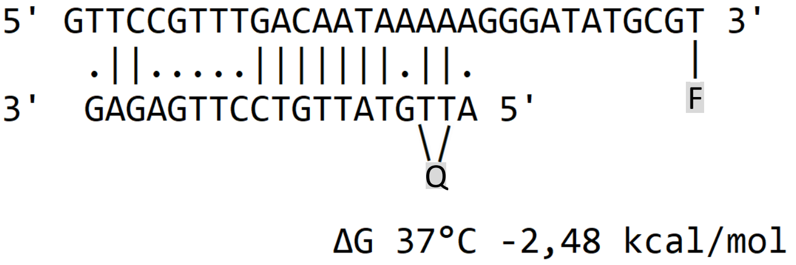

---
output:
  bookdown::pdf_document2:
    fig_caption: yes
    toc: TRUE
    toc_depth: 3
    fontsize: 12pt
    latex_engine: xelatex
bibliography: "Bachelor_quellen.bib"
csl: european-journal-of-taxonomy.csl
citation_package: biblatex
link-citations: yes
urlcolor: RoyalBlue
linkcolor: RoyalBlue
header-includes:
  \usepackage{float}
  \usepackage[ngerman]{babel}
  \usepackage[onehalfspacing]{setspace}
  \usepackage[utf8]{inputenc}
  
---

	
```{r setup657657, include=FALSE}
	knitr::opts_chunk$set(echo = FALSE)
	
```
	

\pagebreak


# Diskussion
	

Influenza Viren sind eine der bedeutendsten viralen Atemwegs-Infektionserkrankungen mit mehr als 300.000 jährlichen Todesfällen weltweit. Die Antivirale Therapie unterliegt einer starken Zeitanhängigkeit und muss spezifisch für die verschiedenen Subtypen angepasst werden, was eine frühzeitige Detektion für den Behandlungserfolg unerlässlich macht.   
Ziel der Arbeit ist es jeweils ein RT-RPA Nachweissystem zur Detektion der Influenza A und B Viren für die Point-of-care Diagnostik zu Entwickeln und dieses zu Optimieren. Zusätzlich sollte der Einfluss einer Primerasymmetrie und verschiedener Sondenmodifikationen auf die RT-RPA untersucht werden.   
Es konnten RT-RPA's für die Detektion der Influenza A und B Viren entwickelt werden, wobei die Influenza B RT-RPA als Pan-Influenza B Nachweis dient und die Influenza A RT-RPA die Subtypen H1N1 und H3N2 Detektieren kann. Des Weiteren konnte ein positiver Effekt einer Primerasymmetrie auf die RPA festgestellt werden, welcher jedoch im Zusammenhang mit der Hybridisierungsposition der Sonde steht. Ebenfalls konnte anhand der Influenza A RT-RPA ein Einfluss des Sondendesings hinsichtlich _dt-Quenched_ und _internally Quenched_ festgestellt werden, wobei die _dt-Quenched_ Sonde zu einer erhöhten Sensitivität im Vergleich zu der _internally Quenched_ Sonde führt.
	

## Einfluss von Basenfehlpaarung in Primern und Sonden auf die RT-RPA {#dissdesign}

Zur Differenzierung zwischen verschiedenen Influenza B Virus-Linien wurde bereits das Gen für das HA-Protein auf dem Gesomsegment 4 beschrieben [@Nakauchi2014]. Bei der Wahl eines Amplifikationsbereiches, welcher zur vewendung als Influenza B pan RT-RPA geeignet ist, wurde sich aufgrund der hohen Homologie von 97,7 % für das Genomsegment 8 entschieden. Dabei ist die Verwendung des gleichen Genomsegmentes in der Literatur für andere Amplifikationssysteme wie die RT-PCR beschrieben [@Goffard2008; @NCIRD2021]. Bei Influenza B liegt im Vergleich zu Influenza A eine geringere Mutationsrate vor und es wurden keine größeren Antigenenveränderungen der Oberflächenproteine beobachtet [@Chen2008; @Paterson2003]. Im ausgewählten Genomsegment 8 wurden über den selektierten Detektionsbereich starke Homologien (98,5 %) gefunden werden. Dementsprechend ist der gewählte Amplifikationsbereich wahrscheinlich geeignet alle Viruslinien zu detektieren und kann dadurch für das Pan-Influenza-B Virusdetektionssystem verwendet werden.    
Da das M1-Gen auf dem Genomsegment 7 durch seine Funktion das am stärksten Konservierte Gen ist [@McCauley1983], wurder dieser Bereich für die Influenza A RT-RPA ausgewählt um die beiden Subtpyen H1N1 und H3N2 zu detektieren. Dieser Genomabschnitt wird ebenfalls von RT-PCR-Systemen zur Detektion verwendet [@Daum2007; @Suwannakarn2008; @NCIRD2021]. Trotz der hohen Konservierung des Gens besitzt das Gensequenz-Alingment (Abbildung \@ref(fig:infAalign)) der beiden Subtypen H1N1 und H3N2 etliche Basenfehlpaarungen. Diese Fehlpaarungen sind schematisch in Abbildung \@ref(fig:infAalign) als rote Linien dargestellt. Die größte Homologie (90,4 %) ist im Bereich zwischen 10 bp und 250 bp zu beobachten. Aus diesem Grund wurden auch alle mittels PrimedRPA designten und von @Ehnts2013 entwickelten Primer in diesen Bereich gelegt.

(ref:alingmentinfa) **Alignment des Influenza A H1N1- und H3N2-Subtyps:** Alignement des Genomsegmentes 7 zwischen dem H1N1-Subtyp (GenBank Nr.: MT341937) und H3N2-Subtyp (GenBank Nr.: MT244214). Die Skala gibt die Sequenzlänge in bp an. Die roten Striche stehen für Basenfehlpaarungen im H1N1 Subtyp im Vergleich zum H3N2 Subtyp. Der orange markierte Bereich gibt den Sequenzabschnitt mit der größten Homologie an. 
	

```{r infAalign, fig.align='center', fig.cap= "(ref:alingmentinfa)", out.width= "100%", fig.scap= "Alignment zwischen den Influenza A H1N1- und H3N2-Subtyp:"}
	
	knitr::include_graphics("Bilder/Alingment infA.PNG")
	
```

Eine Strategie, um Basenfehlpaarungen auszugleichen kann die Verwendung von degenerierten Basen, d.h. einem Gemisch ähnlicher Primersequenzen in den entsprechenden Primern und Sonden sein. Dieses erleichtert die Hybridisierung verbessert somit die Amplifikation und wurde in dieser Arbeit gewählt um die Basenfehlpaarungen zu Komensieren [@Linhart2005]. Einen anderen Ansatz verfolgten @Liang2022, die zur Detektion der beiden Subtypen innerhalb einer RT-RPA zwei verschiedene Genomsegmente wählten [@Liang2022]. Jedoch verwendeten @Liang2022 zwei getrennte Reaktionen zum Nachweis der Influenza A Viren und ein Muliplex-Ansatz wäre nötig um eine Detektion innerhalb einer Reaktion durchzuführen. Im Gegensatz dazu benötigt die in dieser Arbeit entwickelte Influenza A RT-RPA nur eine Reaktion ohne Muliplex-Ansatz zur Detektion und kann so einfacher mit anderen Systemen als Multiplex kombiniert werden.
	

Wie in Abbildung \@ref(fig:infAsadsensi) zu erkennen ist, sind die ausgewählten Primer-Soden-Kombinationen des PrimedRPA Programms unbrauchbar. Bei der Influenza B RT-RPA (Abbildung \@ref(fig:infbscreening)) konnten hingegen alle ausgewählten zumindest klar positive Amplifikationen zeigen. Somit ist eine deutliche Differenz hinsichtlich der Funktionalität des PrimedRPA Programms für die Entwicklung von Primer-Sonden-Kombinationen zu beobachten. Dies könnte an den verwendeten Sequenzvorlagen liegen, da bei Influenza A im Gegensatz zu Influenza B etliche Basenfehlpaarungen in Sequenz vorhanden waren. Die entwickelten Primer wiesen jeweils bis zu 3 Basenfehlpaarungen über den Primer verteilt je nach Subtyp auf. In der Literatur konnte gezeigt werden, dass bis zu 6 Fehlpaarungen in RPA-Primern eine RPA nicht vollständig inhibieren [@Boyle2013]. Somit kann die unfunktionalität der Primer nicht durch die Anzahl der Basenfehlpaarungen erklärt werden. Des Weiteren konnten @Higgins2022 und @Daher2015 zeigen, dass vor allem Mismatches am 3’ und 5’-Ende des Primers die RPA entscheidend inhibieren [@Boyle2013; @Higgins2022]. Der Forward 1 Primer der Influenza A RT-RPA weis eine solche Fehlpaarung auf, welche durch die Einführung einer degenerierten Base vermieden wurde. Ebenfalls besitzt der von @Ehnts2013 entickelte Forward Primer (Forward E) eine Fehlpaarung am 3'-Ende welche einerseits durch 


Dies spricht gegen die Beobachtungen @Higgins2022 und @Daher2015, welche beschreiben, dass gerade Fehlpaarungen am 3'-Ende großen negativen Einfluss auf die RPA nehmen und somit die Primer ohne Fehlpaarung bessere Amplifikationen zeigen müssten. Jedoch bezogen sich beide Studien nur auf die Primer und ließen die Sonde außer Acht, welche jedoch ebenfalls Fehlpaarungen bei der Influenza A RT-RPA aufwies [@Boyle2013; @Higgins2022]. @Liu2019 konnte zeigen, dass Fehlpaarungen in der Sonde bis hin zu einer vollständigen Inhibierung und sogar zu falsch positiven Amplifikationen der RPA führen können [@Liu2019]. Das könnte eine mögliche Erklärung zur großen Diskrepanz, zwischen dem von Ehnts (2013) entwickelten RPA-System und dem mit PrimedRPA designten Primer-Sonden-Kombinationen innerhalb der Influenza A RT-RPA sein. Zwar besitzt die von @Ehnts2013 entickelte Sonde (Sonde E) ebenfalls Basenfehlpaarungen diese könnten jedoch die RT-RPA nur teilweise inhibieren, während die Fehlpaarungen der PrimedRPA-Sonden (Sonde 3.1 und Sonde 1.1) zu einer nichtunfunktionellen RT-RPA führen.  
Des Weiteren ist bei der Primerauswahl der Influenza  B RT-RPA (Abbildung \@ref(fig:infbscreening)) am Beispiel der beiden getesteten Sonden zu erkennen, dass nicht nur Basenfehlpaarungen sondern auch andere Einflüsse zu unterschiedlicher RPA-Performance führen. So kann einerseits einerseits die Hybridisierungsposition der Sonde im gleichen Amplifikationsbereich zu einer signifikanten Veränderung der Amplifikation führen [@Liu2019]. Andererseits kann die zu detektierende RNA, durch
Bildung von Sekundärstrukturen und somit durch eine sterische Hinderung die Amplifikation einschränken [@Saisuk2019]. So konnte beispielweise @Wei2003 innerhalb einer PCR zeigen, dass eine RNA-Sekundärstruktur trotz der hohen Temperaturen in der RT-PCR die Amplifikation inhibierte [@Wei2003].
Wie in Kapitel \@ref(InfAeinleitung) erwähnt sind die jeweiligen Enden eines Genomsegmentes komplementär zueinander und bilden im Virion eine Loop-Struktur aus [@Modrow2010]. Betrachtet man die Hybridisierungspositionen, der für die Influenza A RT-RPA entwickelten Primer und Sonden liegen diese am Anfang der Genomsequenz bei $\approx$ 50 bp bis $\approx$ 200 bp (Abbildung \@ref(fig:infAalign)), während die Influenza B RT-RPA Primer und Sonden mittig in der Sequenz bei $\approx$ 650 bp und $\approx$ 730 bp liegen. Somit könnte diese Loop-Struktur in vitro durch die setrische Hinderung eventuell die Amplifikation der Influenza A RT-RPA inhibieren, während Amplifikation der Influenza B RT-RPA durch seine lage nich beeinflusst wird. Damit könnte sich der Unterschied zwischen der Influenza A RT-RPA und der Influenza B RT-RPA erklären lassen, jedoch müssten RNA-Strukturanalysen durchgeführt werden um dies zu bestätigen.


	Ausblick Primerdesign
	    -> missmatches durch H1N1 und H3N2 (evtl. anderes Target diskutieren, polymerase oder so)  
	    -> alternativen diskutieren (gleiche sonde aber 2 Primer paare, wie die PCR das gemacht hat)  
	    
	 
	

## Mischzeitpunkt und Sensitivität in der RT-RPA mit reduzierten Reaktionsvolumen {#disslowrpa}
	
Durch geringe thermische Konfektion und durch den „*crowding agent*“ wird die Diffusion der Reagenzien während der RT-RPA erschwert und es kommt zu lokaler Reagenzien-Knappheit [@Lillis2016]. Deshalb wird ein zusätzlicher Mischschritt vorallem bei niedrigen Konzentration empfohlen, welcher zu einer erneuten Homogenisierung der Reaktion führt [@Piepenburg2006; @Lillis2016]. @Lillis2016 konnten konnte jedoch zeigen, dass eine Reduktion des Reaktionsvolumens auf 5 µl die Notwendigkeit des zusätzlichen Mischschrittes eleminiert [@Lillis2016]. Wie in Kapitel \@ref(infboptimisch) gezeigt wurde das klassische Reaktionsvolume von 50 µl auf 6,5 µl reduziert, was einem leicht höherem Volumen als dem vom @Lillis2016 entspricht. Beim Vergleich der Mischezeit in Bezug auf das unterschiedliche Volumen stellt sich heraus, dass der Mischschritt bei der low-volume RPA einen deutlichen Einfluss bei erst 10^1^ RNA-Kopien ausübt (siehe Abbildung \@ref(fig:infboptimisch)) und die maximale Fluoreszenz und die Anzahl der positiven Amplifikationen von 3/7 auf 7/7 verbessert. Im 50 µl Ansatz hingegen kann schon eine deutliche Verbesserung der Fluoreszenz und eine signifikante Verbesserung des TT-Wertes bei 10^4^ RNA-Kopien beobachtet werden. Somit konnte gezeit werden dass eine Volumenreduzierung, den Einfluss des Mischschrittes minimiert, dieser jedoch entgegen der Beobachtungen von @Lillis2016 bei niedrigen Konzentrationen (10^1^ und 10^0^) immernoch essentiell ist und zu deutlichen Verbesserungen der RPA führt. @Lillis2016 arbeiteten allerings mit einer geringeren Volumen (5 µl zu 6,5 µl) und ohne Mineralöl überschichtung, welches die Vergleichbarkeit schwierig macht. Es kann jedoch anhand den Daten in der vorliegenden Arbeit und den von @Lillis2016 festgestellt werden, dass eine Verringerung des Reaktionsvolumen die notwendigkeit des Mischschritts bei höheren Konzentrationen (10^4^ und 10^3^) eleminiert [@Lillis2016]. Eine mögliche Begründung liegt darin, dass einerseits durch das verringerte Volumen ein größeres Verhältnis zwischen hinzugefügter Probe und Reaktionsmix besteht und dadurch eine bessere Diffusion zwischen Probe und Reaktionsmix stattfindet. Andererseits führt das geringere Volumen zu einem größeren Oberflächen-Volumen Verhältnis, welches zu einer besseren Wärmeübertragung und dementsprechend einer stärkeren Konvektion führt [@Boeckh2017].
Des Weiteren zeigt die low-volume Influenza B RT-RPA, dass eine Reduktion des Reaktionsvolumens zu einer Sensitivitätserhöhung von über 50 % führt. Der ähnlicher Effekt konnte, wenn auch nicht in dieser Ausprägung, konnte ebenfalls durch @Lillis2016 nachgewiesen werden [@Lillis2016]. Die Sensitivitätsverbesserung lässt sich evetuell durch das erhöhte Verhältnis zwischen eingesetzter Probe und RPA-Reaktion und der erhöhten Konvektion erklären, welche zu einer bessere Diffusion in der Reaktion führen und somit Amplifikation positiv beeinflussen. 
Der low-volume RT-RPA Ansatz Ansatz bietet den Vorteil einere stärkerer Kostenreduzierung, da mit einer kommerziell erhältlichen RT-RPA-Reaktion acht Tests durchgeführt werden können. Dies macht die low-volume RPA gerade für Ressourcen limitierte Umgebungen attraktiv, da sie geringe Kosten pro Test zusammen mit einer möglichen Sensitivitätserhöhung kombiniert [@Lillis2016; @Jiang2021]. Zusätzlich eignent sich das verringerte Reaktionsvolumen von 6,5 µl für den Einsatz in 
mikrofluidischen Lab-on-a-chip Systemen, die mit 3D-gedruckten Detektionschips kombiniert werden könnten [@Behrmann2020b]. Dadurch erweitern sich ihre Applikationsmöglichkeiten in der POCT und Testsysteme können vereinfacht und verbessert werden [@Behrmann2020].
Jeodch könnte das reduzierte Volumen auch nachteilig in Bezug auf einen unspezifische Nukleinsäure-Hintergrund für die RPA sein. In der Literatur wird beschrieben, dass 400-500 ng DNA-Gehalt die RPA inhibieren [@Li2019; @Rohrman2015] wobei diese Inhibierung abhängig von der Template-Konzentration ist [@Clancy2015]. Dies könnte die low-volume RPA gerade bei niedrigen Konzentrationen einschränken, da durch das erhöhte Proben/RPA-Verhältnis auch das Verhältnis von in der Probe enthaltener Hintergrund-DNA steigt, somit eine höhere hintergrund DNA-Konzentration in der Reaktion herrscht und die low-volume RPA inhibiert werden könnte.   
Bisher konnten der low-Volume Ansatz nur bei der Influenza B RT-RPA im Zusammenhang mit der eingeführten Primer-asymmetrie optimiert werden. Ein Transfer des low-volume RPA-Ansatzes auf die Influenza A RT-RPA konnte im ersten Herangehen nicht erreicht werden, da höhere TT-Werte und einen linear erscheinenden Amplifikationsverlauf, welcher auf eine schlechte Kinetik deutet, als nachteilig eingestuft wurden.


Dementsprechend lässt sich sagen, dass die low-volume RPA nicht für alle RPA-Assays adaptierbar ist und somit die Applikation eingeschränkt wird. Des Weiteren wurde eine Verringerung des Reaktionsvolumens nur bei RNA-Viren beschrieben [@Lillis2016; @Behrmann2020], wodurch eine Adaption auf DNA basierte RPA's noch unklar ist.


## Vergleich der ermittelten Sensitivitäten mit PCR-Assays

Das analytische Detektionslimit der optimierten RT-RPA für den Influenza B Virus liegt in der klassichen RPA (50 µl) bei 31,6 bzw. im low-volume Ansatz (6,5 µl) bei 14,6 RNA-Kopien (Tabelle \@ref(infbsensver)). Im Vergleich zu der getesteten RT-PCR vom @NCIRD2021 konnte eine Differenz von nur 3 Kopien zum low-volume Ansatz festgestellt werden. Somit liegen beide Detektionslimits in der gleichen Größenordung. Bei dem Vergleich mit anderen RT-PCR Systemen, welche in der Literatur beschrieben sind, liegt das analytische Detektionslimit der RT-RPA eine Größenordnung unter den der RT-PCR [@Ni_2021; @Wu_2008]. Somit besitzt die entwickelte und für den low-volume Ansatz optimierte Influenza B RT-RPA eine vergleichbare bzw. niedrigere analytische Sensitivität wie die RT-PCR als Goldstandard in der Diagnostik. Beim Vergleich mit einer RT-RPA von @Liang2022 konnte ein ähnlichen Detektionslimit ermittelt werden, da beide Systeme einzelne RNA-Moleküle detektieren können (Abbildung \@ref(fig:infboptimisch)D) [@Liang2022].  
Die optimierte Influenza A RT-RPA differenziert im Vergleich zur Influenza B RT-RPA in puncto Sensitivität mit der untersuchten Influenza A RT-PCR (siehe Tabelle \@ref(tab:infasensver)). Sie zeigt eine deutlich schlechtere Sensitivität und liegt im Vergleich zur Literatur rund 10 - 100 mal über den Detektionslimits von PCR- und RPA-Assays  [@Wu_2008; @Ni_2021; @Liang2022]. Die vergleichsweise niedrige Sensitivität der hier weiterentwickelten Influenza A RT-RPA lässt sich möglicherweise wie in \@ref(dissdesign) diskutiert durch die erhöhte Anzahl an Basenfehlpaarungen in Primern und Sonde oder die eventuelle Bildung von Sekundärstrukturen erklären.  
Bei der Zugabe sogenannter „background“ Nukleinsäure (Abschnitt \@ref(sensitivitat)) zum Reaktionsgemisch, zur Simulation einer potentiellen Patientenprobe, konnte eine
deutlichen Verringerung in der low-volume Influenza B RT-RPA (siehe Tabelle \@ref(tab:infbsensver)) beobachet werden, während die Influenza A RT-RPA keine Reduktion aufweist (siehe Tabelle \@ref(tab:infasensver)). Eine Erklärung könnte die unterschiedlichen Reaktionsvolumina der verschiedenen RT-RPA-Assays zusammen mit dem eingeführten humanen Hintergrund liegen. Im Standardvolumen (50 µl) ist die DNA-Konzentrationen versuchsbedingt geachtelt und hat damit möglicherweise geringere inhibitorische Einflüsse. Wie in 1.2 erwähnt, können große Mengen an genomischer DNA die RPA inhibieren. Dabei hängt die Inhibierung neben der Konzentration der genomischen DNA auch von der Konzentration des eingesetzten zu amplifizierenden Materials ab [@Rohrman2015]. Da innerhalb der verwendete Nukleinsäure-Extraktionsmethode kein DNAse-Verdau Schritt durchführt wird (Quelle Qiagen!) bleibt die genomische DNA in den Extrakten erhalten. Durch das geringere Volumen des low-volme Ansatztes (6,5 µl) und dem gleichbleidenem Volumen der eingesetzten Probe könnte durch das höhere Proben-Reaktions-Verhältnis (1 µl Probe auf 5,5 µl Reaktion) eine geringere Menge an Hintergrund-DNA benötigt werden um die Reaktion zu inhibieren. Im Gegensatz dazu ist bei der klassischen RPA ein deutlich geringeres Proben-Reaktions-Verältnis (1 µl Probe auf 49 µl Reaktion) vorhanden, wodurch im Endeffekt eine geringere Hintergrund-DNA Konzentration in dem 50 µl Ansatz-Volumen vorhanden ist. Der Arbeit von @Rohrman2015 zufolge sorgt eine eingebrachte DNA-Konzentration von 500 ng in der klassichen RPA bei einer Template-Konzentrationen von 10^2^ RNA-Kopien für eine komplette Inhibierung der Detektion [@Rohrman2015]. Rechnet man die für die Inhibirung benötige Konzentration der genomischen DNA auf das Reaktionsvolumen des low-volume Ansatz runter, würden 62,5 ng ausreichen, um eine vollständige Inhibierung auszulösen. Die ermittelte DNA-Konzentration der Referenzproben liegt bei rund 45 ng/µl (Kapitel \@ref(infbsense)) und somit in einem ähnlichen Konzentrationsbereich. Eine Inhibierung der RPA im low-volume Ansatz bei niedrigen Kopien-Anzahlen scheint daher plausibel.  
Eine mögliche Erklärung für die Inhibierung bzw. Reduktion der RPA-Reaktion bei hohen Hintergrund-DNA Konzentrationen wären unspezifische Primer- oder Sonden-Hybridisierungen. Da die RPA an sich mit moderaten Temperaturen von 38°C - 44°C funktioniert, welche deutlich unter den Hybridisierungstemperaturen der PCR liegen, begünstigt das unspezifische Hybridisierungen der Primer bzw. Sonden. Dadurch würden diese für die eigentliche Reaktion nicht mehr zur Verfügung stehen. Dieser Effekt würde dabei stark von der Konzentration der Ziel-DNA abhängig sein, da höhere Template-Konzentrationen bei gleichbleibenden genomischen Hintergrund zu einer höheren Wahrscheinlichkeit einer spezifische Primer-Bindung führen. Dieser Zusammenhang wurde von @Rohrman2015 beobachtet, welches die Hypothese bekräftigt. Eine Erhöhung der Primer- bzw. Sonden-Konzentration könnte für spezifischere Bindungen und somit bessere Amplifikation auch in hohen genomischen DNA-Konzentration sorgen, jedoch müsst dies in einer weiteren Versuchsreihe untersucht werden und war nicht Teil dieser Arbeit.
Die in der Literatur beschriebenen Viruslasten für die Ziel-Influenza A Subtypen liegen bei allen Altersgruppen im Mittelwert bei rund 10^3,5^ Virus Kopien/µl Transportmedium (H1N1) und 10^3,3^ Virus Kopien/µl Transportmedium (H3N2) [@Rodrigues_Guimar_es_Alves_2020; @Ngaosuwankul2010] wobei eine Ausnahme die Patientengruppe unter zwei Jahren mit 10^2,67^ Virus Kopien/µl Transportmedium (H1N1) bildet [@Rodrigues_Guimar_es_Alves_2020]. Die beste Entnahmemethode sind dabei Nasopharyngeal-Abstriche, welche im Durchschnitt 10^5,0^ Virus Kopien/µl Transportmedium enthalten, während Nasal-Abstriche mit 103,8 Virus Kopien/µl und Rachen-Abstriche mit 103,4 Virus Kopien/µl deutlich geringere Viruslasten aufweisen @Ngaosuwankul2010. Die für die Influenza A ermittelte Sensitivität in den simulierten Referenzproben kann mit einem Detektionslimit von 147,5 RNA-Kopien für beide Subtypen (Tabelle \@ref(tab:infasensver)) nachweisen. Eventuelle Komplikationen könnten bei Patienten unter zwei Jahren aufkommen, da die Viruslast nahe an der Detektionsgrenze liegt. Für eine sichere Detektion ist generell ein nasopharyngealer Abstrich zu empfehlen, da dieser die größte Viruslast aufweist und damit falsch negative Ergebnisse am ehesten vermieden werden können. Für Influenza B konnte in einer Studie von @Rodrigues_Guimar_es_Alves_2020 eine durchschnittliche Viruslast in allen Altersgruppen von rund 103,5 Virus Kopien/µl festgestellt werden. Ausnahme bildeten dabei Patienten über 59 Jahren, da hier nur ein Datensatz verfügbar war und somit keine einheitliche Aussage getätigt werden konnte [@Rodrigues_Guimar_es_Alves_2020]. Eine andere Studie von @Tsou_2012 untersuchte die Viruslast speziell bei Kindern und konnte im Durchschnitt sehr geringe Werte von Durchschnittlich 3,9 Virus Kopien/µl feststellen. Jedoch wurden innerhalb dieser Studie große Schwankungen innerhalb der Viruslast festgestellt (zwischen 45 und 2 ∗ 106 Virus Kopien/ml) sowie eine negative Korrelation zwischen Viruslast und Zeitpunkt der Probenentnahme [@Tsou_2012]. 
Das ermittelte Detektionslimit für die Influenza B RT-RPA unter Verwendung der reinen, artifiziellen Standard RNA wäre mit 14,6 RNA-Kopien (Tabelle \@ref(tab:infbsensver)) in der Lage die meisten Patientenproben zu detektieren. Betrachtet man jedoch den starken Verlust der Sensitivität bei den Referenzproben mit genomischer humaner Hintergrund DNA könnten mögliche falsch Negative gerade bei Kinderpatienten auftreten. Hier liegt das ermittelte Detektionslimit von 1397 RNA-Kopien (Tabelle \@ref(tab:infbsensver)) weit über der von @Tsou_2012 ermittelten Viruslast für das Influenza B Virus. Nach @Rodrigues_Guimar_es_Alves_2020 könnten zwar alle Patienten, inklusive der Patienten unter zwei Jahren, detektiert werden, jedoch befindet sich hier die Viruslast am Detektionslimit. 
Generell lässt sich sagen, dass die entwickelte Influenza B RT-RPA laut Literatur ein zu hohes Detektionslimit besitzt um zuverlässig Influenza B detektieren zu können. Eine eventuelle Verbesserung des Detektionslimits in einem humanen DNA-Hintergrund könnte durch die Verwendung des 50 µl Ansatzes oder durch die Erhöhung der Primer- oder Sonden-Konzentration erreicht werden, jedoch müsste dies in weiteren Versuchen bestätigt werden. Zusätzlich sollte, um eine möglichst zuverlässige Detektion zu ermöglichen eine zeitnahe Proben Entnahme erfolgen, um möglichst hohe Viruslasten zu erreichen [@Tsou_2012].


## Entwicklung der asymmetrischen RT-RPA {#dissprimerass}
	
Eine asymmetrische Erhöhung der reverse Primer-Konzentration bei einer gleichbleibenden Forward Primer-Konzentration führt zu einer erhöhten Fluoreszenz (Kapitel \@ref(assymetrie)). Wie bereits beschrieben, sorgt die asymmetrische Verteilung der Primer vermutlich dazu, dass im Verlauf der Reaktion mehr einzelsträngige DNA in sense entsteht, wenn der forward-Primer (sense) in deutlich höheren Konzentration der Reaktion zur Verfügung steht. Der asymmetrische Ansatz innerhalb der RPA von @Wang_2019 zur Detektion von Fusarium proliferatum genutzt, um mittels eines enzymkatalysiertem Farbumschlags nachzuweisen [@Wang_2019]. @Kersting2014 kombinierte die asymmetrische RPA, um mit der entstandenen einzelsträngigen DNA ein Nachweis mittels Microarray durchzuführen [@Kersting2014]. Derzeit ist die Verwendung einer asymmetrischen Primerverteilung in Kombination mit fluoreszenzmarkierten Sonden in der Literatur nur innerhalb der qPCR bekannt. So konnte @Poddar2000 mithilfe von „*molecular beacon*“ nachweisen, dass durch eine 50-fache Primerasymmetrie, die zur Sonde komplementäre DNA-Sequenz zusätzlich als einzelsträngige DNA in höheren Mengen vorliegt. Dadurch konnten die „*molecular beacon*“ häufiger hybridisieren und somit ein stärkeres Fluoreszenzsignal erzeugen [@Poddar2000].  
In der hier vorliegenden Arbeit konnte vermutlich dass das von @Poddar2000 beschriebene Prinzip auf die RPA mittels Exo-Sonden angewendet werden. Die Experimente mit der RT-RPA für Influenza B legen dies nahe (Kapitel \@ref(infbassymet)). Die Erhöhung des Forward Primers (sense) (Abbildung \@ref(fig:assymetriy)A) führte wieder zu einer Aequimolaren aber im vergleich zur Standard-RPA erhöhten Primerverteilung. Dadurch wurde vermutlich keine erhöhte Menge an einzeltränger antisense DNA in der Reaktion gebildet und die Hybridisierungskinetik der Sonde wurde nicht erhöht. Dementsprechend ist auch ein Rückgang an Fluoreszenzsignal zu beobachten, da die Sonde zur Spaltung durch die Exonuklease ein Hybridisierungs-Event benötigt, welches nur noch während der Amplifikations-Reaktion der RPA stattfindet [@Lobato2018]. In diesem Versuchsansatz muss jedoch noch zusätzlich  die Reaktion der reversen Transkriptase betrachtet werden, da diese mit einer eigenen Enzymkinetik zur Bildung einer komplementäre DNA bei einer sense RNA den antisense Primer für seine Reaktion nutzt.  Bei dem vice versa Versuch den sense Primer betreffend (Abbildung \@ref(fig:assymetriy)B) trifft dies jedoch nicht zu. In dem weiteren Versuch konnte durch die Verwendung der Sonde (......), welche komplementär zum antisense Strang ist, gezeigt werden, dass nun eine Fluoreszenzignalerhöhung stattfindet, wenn der Forward primer asymmetrisch Erhöht wird und ein schwächeres Fluoreszenzsignal vorliegt wenn eine reverse Primer-Asymmetrie vorhanden ist. Demensptrechend liegt vermutlich bei der erhöhung des forward primers der komplimentäe anti sense Strang vermehrt und einzelsträning vor, wodurch die Hybridisationskinetik der Sonde begünstigt wird und mehr Sonde bei erfolgreicher Hybridisation gespalten wird. Dabei sind die Ergebnisse (verlgeich der beiden Sonden umgekehrt)


, dass die Hybridisierungsposition der Sonde mit der Primer-Asymmetrie zusammenhängt. Durch die Verwendung der Sonde (......), welche komplementär zum antisense Strang ist, konnte gezeigt werden, dass die assymetrische Erhöhung der forward primers zu einer Signal Erhöhung führt. 

Dieses Prinzip konnte ebenfalls auf die Influenza A RT-RPA übertragen werden, was beweist, dass die Asymmetrie nicht nur speziell Anhand der Influenza B RT-RPA nachweisbar ist, sondern allgemeiner angewandt werden kann. Jedoch wurde dieses Prinzip in dieserArbeit nur anhand der RT-RPA nachgewiesen. Eine Adaption auf eine DNA basierte RPA müsste noch untersucht werden, um allgemeingültige Aussagen treffen zu können


Im Umkehrschluss gilt dies für den antisense DNA Strang im zusammenhang mit dem reverse Primer (antisense). In diesem Versuchsansatz muss jedoch noch zusätzlich  die Reaktion der reversen Transkriptase betrachtet werden, da diese mit einer eigenen Enzymkinetik zur Bildung einer komplementäre DNA bei einer sense RNA den antisense Primer für seine Reaktion nutzt. Bei einem vice versa Versuch den sense Primer betreffend trifft dies jedoch nicht zu. 


	

## Einfluss der Exo-Sondenmodifikation auf die RT-RPA {#disssonde}
	

Die Sondenmodifikation der Exo-Sonde für die RPA unterliegt hinsichtlich Fluorophor- und Quencher-Position bestimmten Sequenz-Limitationen. So ist eine Kopplung des Fluorophors beziehungsweise des Quenchers an die
Purin-Basen (Adenin A, Guanin G) ungünstig, da die Kopplung theoretisch an der 8’-Position der Base erfolgt und so das Nukleosid in eine Syn-Konformation gezwungen würde. Dadurch kommt es zu einer Störung der Watson und Crick Basenpaarung, was die Hybridisierung der Sonde  erschwert [@Wagenknecht_2008]. Eine Kopplung an die Purin-Basen (Cytosin C, Thymin T) ist vorzuziehen, da es hier zu einer geringeren Beeinträchtigung kommt. Hierbei erfolgt die Kopplung an die 5’-Position, wodurch die Konformation des Nukleosids weitestgehend nicht beeinträchtigt wird. Sterische Hinderung zwischen Fluorophor und DNA können jedoch bei beiden Kopplungspositionen nicht ausgeschlossen werden [@Wagenknecht_2008]. Der Stand der Technik beschränkt sich im Moment auf T-gekoppelte Quencher und Sonden [@Faye2021; @Guo_2022; @TwistDx2018]. Die Nutzung des FRET-Mechanismus zur Detektion hängt sehr stark von der Distanz zwischen Quencher und Fluorophor ab [@Johansson_2003]. Daher benötigt die klassische RPA Sondensequenz dementsprechend zwei dicht nebeneinander liegende Thymin-Nukleotide. Die Anforderungen an die Sondensequenz ist weiterhin erhöht durch das zusätzliche Einbringen einer a-basische Seite und der Fluorophorposition. Letztere sollte nach der Literatur bei rund 30+ bp liegen [@Lobato2018]. So benötigt die Sonde bei rund 30 bp eine T-N-T Sequenz (N = beliebiges Nukleotid), wodurch die Auswahl der Sondenposition in den meisten Fällen deutlich eingeschränkt wird. Um diesem Problem zu entgehen, entwickelten @Behrmann2020 die _iQ_-Sonde, bei der das Quencher-Molekül an das Phosphat-Rückgrat der DNA gekoppelt wird (Abbildung \@ref(fig:probe)) und somit die starke Abhängigkeit von der T-N-T Sequenz umgangen wird. Somit können Exo-Sonden variabler an die Zielsequenz angepasst werden [@Behrmann2020]. 
In dieser Arbeit konnten deutliche Unterschiede innerhalb der Influenza A RT-RPA zwischen den beiden Sondentypen _iQ_-Sonde und _dT-Quenched_-Sonde ermittelt werden (Kapitel \@ref(einflprobe)). So führt die _dT-Quenched_-Sonde im Vergleich zu der _iQ_-Sonde zu einer Sensitivitätserhöhung von 50 % für beide Subtypen sowie ein erhöhte Fluoreszenzauslenkung. Des Weiteren besitzt die _iQ_-Sonde nach der normalisierung der Daten ein niedriges Hintergrundrauschen um den Wert 0, während die _iQ_-Sonde ein stetiges Hintergrundrauschen um die 50 Fluoreszenzeinheiten zeigte. Das unspezifische Hintergrundrauschen der _iQ_-Sonde ist dabei bei allen durchgeführten RT-RPA's in dieser Arbeit zu beobachten.  
Eine mögliche Hypothese für die höhere Fluoreszenzauslenkung und der Sensitivität der _dT-Quenched_-Sonde könnte im Zusammenhand mit der verwendeten Primer-Asymmetrie liegen. Durch die eingeführte Primer-Asymmetrie liegt der zur Sonde komplementäre DNA-Strang einzelsträngig vor [@Kersting2014]. Dementsprechend könnte die Sonde unabhängig von der Strangverdrängungsaktivität der Polymerase hybridisieren und im hybridisierten Zustand von der Exonuklease gespalten werden [@Lobato2018]. Nach der Spaltung würde keine Verdrängung durch die Polymerase stattfinden und die Sonden-Fragmente müssen sich durch Diffusion voneinander trennen. Durch den dT gekoppelten Quencher könnte im hybridisierten Zustand der Sonde eine sterische Abstoßung zwischen Quencher, Fluorophor und gegenüberliegender A Base bestehen. Bei der Spaltung der Sonde könnte diese sterische Abstoßung für eine bessere Diffusion des Quenchers von dem Fluorophor sorgen was möglicherweise zu einem erhöhtem Signal und zu einer besseren Detektion führt. 
Laut dieser Hypothese würde bei der von @Behrmann2020 entwickelten _iQ_-Sonde keine solche Abstoßung vorliegen, da der Quencher über das Phosphat-Zucker-Rückgrat der DNA gekoppelt ist und somit eventuell außerhalb der Doppelhelix liegt. Betrachtet man die mittlere Schmelztemperatur (Tm) des Quencher-Fragments der Influenza A Sonde (Sonde E, Tabelle \@ref(infaoligo)) liegt diese bei 53 °C (berechnet mittels xyz^[https://www.promega.de/resources/tools/biomath/tm-calculator/]). Dementsprechend würde nach der Spaltung der Sonde die Diffusion des Quencher-Fragments ohne weitere Abstoßungseffekte bei der gewählten Reaktionstemperatur von 42 °C geringer sein.   
Das beobachtete geringere Signal-Rauschen der Wasserkontrolle der dT-Quenched Sonde lässt sich vermutlich auf den erhöhten Abstand zwischen Fluorophor und Quencher zurückführen. Wie in der von @F_rster_1948 entwickelten Formel zu sehen, ist die Energie-Übertragungsrate ($F_{ kl }$) von der Fluoreszenzabklingzeit ($\tau_{ 0 }$), dem Förster-Radius ($R_{ 0 }$)  und dem Abstand zwischen Fluorophor und Quencher ($R_{ kl }$) abhängig (siehe Formel \@ref(eq:sieben)). $R_{ 0 }$ ist dabei für verschiedene Fluorophorpaare unterschiedlich und wird zur Vereinfachung $R_{ 0 }=1$ gesetzt [@F_rster_1948]. Dadurch wird die sehr starke Abhängigkeit von dem Abstand zwischen Fluorophor und Quencher verdeutlicht. Dementsprechend können kleine Veränderungen des Abstandes zu einem deutlich schlechteren Energietransfer, also zu einem schlechteren Fluoreszenz-Quenching führen. Da die _dT-Quenched_ Sonde durch die dT-Kopplung von Fluorophor und Quencher beide Moleküle näher zusammenbringt als es bei der _internally quenched_ Sonde der Fall ist, findet demnach eine besseres Quenching des Fluoreszenzsignals statt. Dieses drückt sich in dem in Abbildung \@ref(fig:infasondenopti) beobachteten geringeren Hintergrund-Signal aus.


\begin{equation}
F_{ kl }=\frac{ {R_{ 0 }}^{ 6 } }{\tau_{ 0 } * {R_{ kl }}^{ 6 } } \; \; \; \; \; \; \; mit \; \; \; \; R_{ 0 } =1 \; \; \; \; \; \; \; F_{ kl }=\frac{ 1 }{\tau_{ 0 } * {R_{ kl }}^{ 6 } }
(\#eq:sieben)
\end{equation}


Die Sondenmodifikation innerhalb der RPA hinsichtlich Fluorophor- und Quencher-Position unterliegt Sequenz-Limitationen. So ist eine Kopplung des Fluorophors beziehungsweise des Quenchers an die Purin-Basen (Adenin A, Guanin G) ungünstig, da die Kopplung an der 8'-Position erfolgt und so das Nukleosid in eine Synkonformation gezwungen wird. Dadurch kommt es zu einer Störung der Watsen und Crick Basenpaarung, was die Hybridisation erschwert [@Wagenknecht_2008]. Eine Kopplung an die Purin-Basen (Cytosin C, Thymin T) ist vorzuziehen, da es hier zu einer geringeren Beeinträchtigung kommt. Hierbei erfolgt die Kopplung an die 5'-Position, wodurch die Konformation des Nukleosids weitestgehend nicht beeinträchtigt wird. Sterischen Behinderungen zwischen Fluorophor und DNA können jedoch bei beiden Kopplungspositionen nicht ausgeschlossen werden [@Wagenknecht_2008]. Der Stand der Technik beschränkt und sich dabei auf T-gekoppelte Quencher und Sonden [@Faye2021; @Guo_2022; @TwistDx2018]. Da der FRET-Mechanismus zur Detektion des Fluoreszenzsignales sehr stark von der Distanz zwischen Quencher und Fluorophor abhängig ist [@Johansson_2003] benötigt die Sondensequenz dementsprechend zwei dicht nebeneinander liegende T Basen. zusätzlich werden die Anforderungen an die Sondensequenz noch durch die a-basische Seite, welche von der Exonuklease gespalten wird und der Fluorophorposition, welche bei rund 30+ bp liegen sollte [@Lobato2018] erschwert. So benötigt die Sonde bei rund 30 bp eine T-X-T Sequenz (X = beliebiges Nukleotid), wodurch die Sondenposition in den meisten Fällen deutlich eingeschränkt wird. Um diesem Problem zu entgehen entwickelten @Behrmann2020 die _internally quenched_ Sonde, bei welcher der Quencher an das Phosphat-Rückgrat der DNA gekoppelt wird (siehe Kapitel \@ref(modifikation)) und so die starke Abhängigkeit der T-X-T Sequenz umgangen wird. Somit können Exo-Sonden variabler an die Zielsequenz angepasst werden [@Behrmann2020]. In dieser Arbeit konnten deutliche Unterschiede zwischen den beiden Sondentypen ermittelt werden (siehe Abbildung \@ref(fig:infasondenopti)) So führt die _dT-Quenched_ Sonde zu einer höheren Sensitivität und zu einem niedrigeren Hintergrundsignal. Eine mögliche Hypothese für diese Beobachtung könnte im Zusammenhand mit der verwendeten Primer-Asymmetrie liegen. Durch die eingeführte Primer-Asymmetrie liegt der zur Sonde komplementäre DNA-Strang einzelsträngig vor. Dementsprechend kann die Sonde unabhängig von der Strangverdrängungsaktivität der Polymerase hybridisieren. Nach der Spaltung durch die Exonuklease findet keine Verdrängung durch die Polymerase statt und die Sonden-Fragmente müssen sich durch Diffusion voneinander trennen. Durch den dT gekoppelten Quencher besteht im hybridisierten Zustand der Sonde eine sterische Abstoßung zwischen Quecher, Fluorophor und gegenüberliegender A Base. Bei der Spaltung der Sonde sorgt diese sterische Abstoßung für eine bessere Diffusion des Quenchers von dem Fluorophor was zu einem erhöhtem Signal führt. Im Gegensatz dazu entsteht bei der von @Behrmann2020 entwickelten _internally quenched_ Sonde keine solche Abstoßung, da der Quencher über das Phosphat-Zucker-Rückgrat der DNA gekoppelt ist und somit außerhalb der Doppelhelix ragt. Betrachtet man die mittlere Schmelztemperatur (Tm) des Sonden-Fragments mit dem Quencher liegt diese bei 53 °C (berechnet online^[https://www.promega.de/resources/tools/biomath/tm-calculator/]). Dementsprechend würde nach der Spaltung der Sonde die Diffusion des Quencher-Fragments ohne weitere Abstoßungseffekte bei der gewählten Reaktionstemperatur von 42 °C deutlich erschwert werden. Das beobachtete geringere Signal-Rauschen der Negativkontrolle der _dT-Quenched_ Sonde lässt sich auf den erhöhten Abstand zwischen Fluorophor und Quencher zurückführen. Wie in der von @F_rster_1948 entwickelten Formel zu sehen, ist die Energie-Übertragungsrate ($F_{ kl }$) von der Fluoreszenzabklingzeit ($\tau_{ 0 }$), dem Förster-Radius ($R_{ 0 }$)  und dem Abstand zwischen Fluorophor und Quencher ($R_{ kl }$) abhängig (siehe Formel \@ref(eq:sieben)). $R_{ 0 }$ ist dabei für verschiedene Fluorophorpaare unterschiedlich und wird zur Vereinfachung $R_{ 0 }=1$ gesetzt [@F_rster_1948]. Dadurch wird die sehr starke Abhängigkeit von dem Abstand zwischen Fluorophor und Quencher deutlich. Dementsprechend können kleine Veränderungen des Abstandes zu einem deutlich schlechteren Energietransfer, also zu einem schlechteren Fluoreszenz-Quenching führen. Da die _dT-Quenched_ Sonde durch die dT-Kopplung von Fluorophor und Quencher beide Moleküle näher zusammenbringt als es bei der _internally quenched_ Sonde der Fall ist, findet demnach eine besseres Quenching des Fluoreszenzsignals statt. Dieses drückt sich in dem in Abbildung \@ref(fig:infasondenopti) beobachteten geringeren Hintergrund-Signal aus.
	

\begin{equation}
F_{ kl }=\frac{ {R_{ 0 }}^{ 6 } }{\tau_{ 0 } * {R_{ kl }}^{ 6 } } \; \; \; \; \; \; \; mit \; \; \; \; R_{ 0 } =1 \; \; \; \; \; \; \; F_{ kl }=\frac{ 1 }{\tau_{ 0 } * {R_{ kl }}^{ 6 } }
(\#eq:sieben)
\end{equation} 
	  
## Das Ditching innerhalb der RT-RPA
	

Die spontane Abnahme des Fluoreszenzsignals im späteren Verlauf der Messung konnte an mehreren Stellen dieser Arbeit beobachtet werden (siehe Abbildungen \@ref(fig:infbopti), \@ref(fig:infboptimisch)B, \@ref(fig:assymetriy)A, \@ref(fig:infbsensi)B, \@ref(fig:infaopti)B). Dabei scheint dieses Phänomen speziell innerhalb der RPA aufzutreten und wurde weder innerhalb der PCR, noch innerhalb anderen isothermen Amplifikationen (LAMP, NASBA etc.) beobachtet. @Lutz2010 beschrieben dieses Phänomen innerhalb der RPA als Ditching, lieferten jedoch keine weiteren Erklärungen zu dem Sachverhalt [@Lutz2010]. Das Ditching widerspricht dabei dem theoretisch ablaufendem Reaktionsverlauf. Durch die exponentielle Spaltung der Fluoreszenzsonden werden immer mehr Quencher-Fragmente von den Fluorophor-Fragmenten getrennt und somit (exponentiell) mehr Fluoreszenz-Signal detektierbar. Nach einiger Zeit sind alle Fluoreszenzsonden gespalten und das Fluoreszenz-Signal erreicht ein Plateau. Beim Ditching hingegen wird das Fluoreszenz-Signal vermindert und steigt nach kurzer Zeit darauf wieder an. Eine mögliche Erklärung für die Verminderung des Fluoreszenz-Signals könnten die erneute Zusammenlagerung von Fluorophor und Quencher sein, welche das Fluoreszenzsignal erneut Quenched. Dies kann mithilfe in einer Dimer-Bildung zwischen und Fluorophor- und Quencher-Fragment erklärt werden. Jedoch besitzt dieses Dimer eine Bindungsenergie ($\Delta G$) von nur -2,48 kcal/mol bei 37 °C und ist demnach bei 40 °C nicht sonderlich stabil (siehe Abbildung \@ref(fig:ditchingdimer)). Des Weiteren liegen Quencher und Fluorophor innerhalb des Dimers etliche Nukleotide voneinander entfernt, welches die Energie-Übertragungsrate durch die Entfernung immens verringert und somit das Quenching nahezu ausbleibt (siehe Kapitel \@ref(disssonde)).
	

(ref:dimerquench) **Dimerbildung der Influenza B Sonden-Fragmente:** Dimer des Fluorophor-Fragmentes mit dem Quencher-Fragment der Influenza B Sonde. Die Bindungsenergie ($\Delta G$) bei 37 °C wurde mit dem Programm PerlPrimer [@Marshall2004] berechnet. Fluorophor (F) und Quencher (Q) sind grau hinterlegt.
	

```{r ditchingdimer, fig.align='center', fig.cap= "(ref:dimerquench)", out.width= "65%", fig.scap= "Dimerbildung der Influenza B Sonden-Fragmente"}
	
	
	
```
	

Ein weiteres Problem liegt in der erneuten Steigung der Fluoreszenz. Dies würde bedeuten, dass die Zusammenlagerung von Quencher und Fluorophor reversibel und zeitabhänig für einen kurzen Zeitraum stattfindet. Des Weiteren wurde das Ditching innerhalb der Optimierung bei der Reaktionstemperatur, Mischzeitpunkt und Primer-Konzentration beobachtet (siehe Kapitel \@ref(infboptimierung)). Interessant ist dabei, dass es nur bei den optimalen Parametern, sprich bei der besten Amplifikation, beobachtet wurde. Gerade die eingeführte Primerasymmetrie führt, wie in Kapitel \@ref(dissprimerass) erklärt, dazu, dass mehr Sonde gespalten wird. Eine Erhöhung der Temperatur führt generell zu einer besseren Enzymkinetik [@Jaeger2018], somit ebenfalls zu einer schnelleren Amplifikation und dementsprechend zu einer erhöhten Spaltung der Sonde. Der zusätzliche Mischschritt beschleunigt durch die Homogenisierung ebenfalls die Reaktion und führt wie die anderen Parameter zu einer schnelleren Sondenspaltung. Dementsprechend scheint es einen Zusammenhang zwischen der Menge der gespaltenen Sonde und Ditching zu geben. Jedoch müsste dies in weiteren Experimenten bestätigt werden und generell die Faktoren, welche das Ditching beeinflussen genauer untersucht werden. Ebenfalls stellt die Zusammenlagerung des Fluorophors und Qucheners nur eine Hypothese für das beobachtete Phänomen dar. Der genaue physikalische und molekulare Mechanismus bleibt weiterhin unbekannt und müsste weiter untersucht werden.
	

	

	

	

## Automatische Auswertung der Amplifikationen mittels Statistik

Anahnd des Untersuchung der Primer und Sonden-Kandidaten für die Influenza A RT-RPA (Abbildung \@ref(fig:infAsadsensi)) und der Influenza B RT-RPA Mischschritt-Optimierung (Abbildung \@ref(fig:infboptimisch)C) konnte aufgezeigt werden, dasss die manuelle Einschätzung, ob Amplifikatonen qualitativ positiv bzw. negativ sind, schwierig ist. Dies kann zu Komplikationen führen, da je nach Anwender Grenzfälle ein bzw. ausgeschlossen werden und somit Falsch positive und falsch negative Testergebnisse entstehen.
Eine automatisierte statistische Auswertung soll die Anwedung unterstützen und für einheitliche Ergebnisse sorgen. Innerhalb der qPCR und RPA (quelle) wird dafür zumeist ein Schwellenwert verwendet, wobei Reaktionen als positiv gelten, wenn sie diesen Schwellenwert überschreiten [@Bustin2009]. Jedoch hängt diese Auswertungsmethode stark von der Wahl des Schwellenwerts ab, welcher je nach verwendetem Gerät und Hersteller anders berechnet bzw. bestimmt wird [@WaidiFolorusnoSule2020]. Zusätzlich kann die Fluoreszenzkurve einer Amplifikation von weiteren Zufallsfaktoren wie beispielsweise verschieden starke Fluorophore oder Sensorfehlern beeinflusst werden [@Spiess2015]. Dies kann dazu führen, dass starke Veränderungen des Schwellenwertes enstehen und aufgrund dessen je nach Gerät und Test unterschiedliche Ergebnisse entstehen und keine Vergleichbarkeit der Daten untereinander gegeben ist. In dieser Arbeit wurde dazu eine automatische Auswertung der Fluoreszenzdaten mit weiteren statistischen Tests, unabhängig vom Schwellenwert ergänzt und damit eine einheitliche, vergleichbare und nachvollziehbare Auswertung ermöglicht. Dazu wurde das chipPCR package von @Roediger2015 verwendet, dass ursprünglich für eine qPCR entwickelt wurde, jedoch auch für isotherme Amplifikationen beschrieben wurde [@Roediger2015].	Eine Anwendungslimitierung wurde @Moody2016 festgestellt, die bewiesen, dass sich die Kinetik der RPA von der der PCR unterscheidet [@Moody2016]. Demnach ist die Kinetik der Fluoreszenzgenerierung ebenfalls unterschiedlich zur PCR und die mathematischen Modelle, angepasst auf die PCR, lassen sich nur bedingt auf die RPA adaptieren. So konnte die Berechnung des Hintergrundrauschens nicht mit dem chipPCR package durchgeführt werden, da der zeitigere Anstieg der RPA bei hohen Template-Konzentrationen dazu führte, dass das Hintergrundruaschen zu hoch berechnet wurde und über der maximalen fluoreszenzauslenkung lag. Deshalb wurde die Methode von @Ritz2008 als Alternative verwendet. Der im chipPCR package enthaltene _lineare Regressions-Test_, welcher viele lineare Regressionen über die jeweilige Amplifikationskurve spannt und diese auswertet, lieferte fehlerhafte Ergebnisse und konnte deshalb hier nicht verwendet. Für die Berechnung eines geeigneten Schwellenwertes wurde auf eine Methode aus dem Immuno-Assay-Bereich von @Frey1998 zurückgegriffen, da sie die gesamten Fluoreszenzdaten der Negativkontrolle zur Berechnung benutzt und somit das in Kapitel \@ref(disssonde) beschriebene  steigende Hintergrundsingal der _iQ_-Sonde mit einberechnet [@Frey1998].
	  
	  
# Zusammenfassung und Ausblick


\pagebreak
