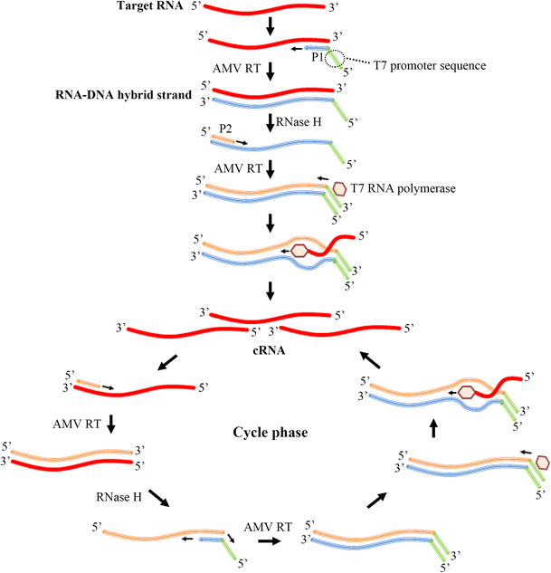

---
output:
  bookdown::pdf_document2:
    fig_caption: yes
    toc: TRUE
    toc_depth: 3
    fontsize: 12pt
    latex_engine: xelatex
bibliography: "Bachelor_quellen.bib"
biblio-style: apalike
citation_package: biblatex
link-citations: yes
urlcolor: RoyalBlue
linkcolor: RoyalBlue
header-includes:
  \usepackage{float}
  \usepackage[ngerman]{babel}
  \usepackage[onehalfspacing]{setspace}
  \usepackage[utf8]{inputenc}
  
---

```{r setup1, include=FALSE}
knitr::opts_chunk$set(echo = FALSE)

library(kableExtra)
library(ggplot2)
library(ggpubr)
library(tidyverse)
library(scales)
library(latex2exp)
```

\pagebreak
# Einleitung

## Viren - Die Gefahr aus dem nichts {#viren}

Infektionskrankheiten verursacht durch Viren oder multiresistente Keime sind eine ernstzunehmende Bedrohung für Menschen und staatliche Systeme. Dabei sorgen virale Epidemien und Pandemien wie die Spanische Grippe mit über 50 Millionen Toten [@Dharmapalan2020], das Chikungunya Virus mit mehr als 1,3 Millionen Infizierten [@Charrel2007], und die aktuelle SARS-CoV-2 Pandemie mit weit über 140 Millionen Infizierten [@Bai2021] für weltweite Krisen und Milliardenschäden [@Louie2009].  
Viren lassen sich näherungsweise als ca. 16 nm bis 200 nm große infektiöse Einheiten, mit einem \textcolor{red}{DNA oder RNA}-Genom beschreiben. Dieses ist von einer Virushülle umgeben, welche aus einer Proteinmatrix, dem sogenannten Capsid und je nach Virusart aus einer zusätzlichen Phospholipid-Doppelschicht mit eingebetteten Hüllproteinen besteht.

(ref:virusdat) **Schematische Darstellung eines behüllten Virus** Typischer Aufbau eines behüllten Virus mit Capsid, Membranhülle und Hüllproteinen. Das Virus-Genom wird von angelagerten Nukleoproteinen stabilisiert [@Modrow2010].

```{r virusbsp, fig.align='center', fig.cap= "(ref:virusdat)", out.width= "50%", fig.scap= "Schematische Darstellung eines behüllten Virus"}

knitr::include_graphics("Bilder/Virus Beispielbild.png")

```

Da Viren keinen eigenen Reproduktionsmechanismus besitzen, sind sie auf die Infizierung von Zellen angewiesen, damit sie mittels der Reproduktions Maschinerie des Wirtes die viralen Komponenten vervielfältigen können[@Modrow2010]. Eine beeindruckende Fähigkeit der Viren ist die Anpassung an neue Umgebungen und Wirte. Diese hängt in von ihrer hohen genetischen Variablilität und Mutationsrate ab, welche es ihnen erlaubt eine große Vielfalt zu erschaffen [@Sanjuan2016]. Dadurch bilden einige Viren stänig neue Varianten, welche durch ihre veränderten Infektionsstrukturen Immunlücken besetzten. Dadurch entstehen neue Infektionsherde und Pandemien @quelle
Die vorherrschende SARS-Cov-2 Pandemie hat zeigt, dass eine frühzeitige, schnelle und effiziente Detektion von viralen Krankheiten notwendig ist, um Gesundheitssysteme zu entlasten und Infektionsketten schnell zu unterbrechen [@Valera2021]. Dabei ist die Polymerase Ketten Reaktion (engl.: _Polymerase chain reaction_, PCR) die vorherrschende Testmethode in der medizinischen Diagnostik, da sie durch die Amplifikation von Nukleinsäuren hohe Spezifitäten und Sensitivitäten erreicht. Jedoch benötigt die PCR spezialisierte Laboratorien und geschultes Personal [@Brendish2015], sowie energieintensive Gerätschaften wodurch eine dezentrale Diagnostik erschwert wird [@Behrmann2020a]. Durch Transportwege oder aufwendige Protokolle besitzt die PCR oft eine Turnaround-Zeit von mehr als 24 Stunden [@Brendish2015; @Augustine2020]. Dadurch kann es schwierig werden, die Infektionsketten erfolgreich zu unterbrechen, da erkrankte Patienten binnen der 24h weitere Personen infizieren können [@Sharma2021]. Aus diesem Grund ist es wichtig, die Diagnostik mit sensitiven und kostengünstigen Alternativen zu ergänzen, welche vor Ort durchgeführt werden können mit das sogenanntem _Point of care testing_ (POCT) [@Goble2016]. Für das POCT werden isotherme Nukleinsäureamplifikationstechniken zur Detektion der Erreger immer interessanter, da sie im Vergleich zur PCR keine komplexen Geräte erfordern sowie kürzere Testzeiten anbieten. Diese werden dezentral für die Diagnostik verwendet, was zu einer schnelleren Detektion vor Ort und möglicherweise zu einer Unterbrechung von Infektionsketten führen kann[@Pumford2020;@Islam2022]. 

## Die Influenza Viren - Pandemieverursacher Nr. 1

Die "echte" Grippe, verursacht durch die Influenza Viren, als bekannteste Vertreter der Orthomyxovieren, ist eine der bedeutendsten Infektionskrankheiten mit mehr als 300000 Todesfällen weltweit [@RKI2019; @Uyeki2022].
Die Influenza Viren lassen sich, aufgrund verschiedener molekularer Eigenschaften und ihrer serologischen Charakteristika in die Tpyen A, B, C und D einteilen. Sie sind behüllte, einzelsträngige RNA-Viren. Die genomische RNA, welche in negativer Strang-Orientierung, also entgegen der 5´-3´ Leserichtung der Ribosomen vorliegt, ist in 8 unterschiedlich große Abschnitte unterteilt [@Modrow2010]. Von diesen können alle außer D, welcher nur Rinder und  Schweine als Wirt befällt [@Foni2017], Menschen infizieren und Krankheiten verursachen [@Javanian2021].  Typ A besitzt von den vier die höchste Virulenz [@Yoo2018] und ist für die meisten Infektionen bei Mensch und Tier verantwortlich. Dieser wird abermals in viele Subtypen anhand von den Oberflächenproteinen Hämagglutinin (HA) und Neuraminidase (NA) unterteilt, wovon die beiden Subtypen H1N1 und H3N2 derzeit in der Bevölkerung kursieren [@Javanian2021]. Influenza Typ B infiziert ausschließlich Menschen und kann zu schweren Krankheitsverläufen führen. Jedoch ist die Pandemiegefahr eingeschränkt, da er kein tierisches Reservoir besitzt und somit die Verbreitung gezielter begrenz werden kann. Bei Influenza B findet keine Einteilung in Subtypen statt, jedoch sind zwei genetisch differenzierbare Viruslinien (Victoria/2/1987-like und Yamagata/16/1988-like) bekannt [@Koutsakos2016]. Influenza Typ C besitzt ähnlich wie Influenza B keine Pandemie-Gefahr und ruft eher milde Krankheitsverläufe hervor. Bei Infektion von Kindern wurden jedoch Infektionen der unteren Atemwege beobachtet. Neben humanen Infektionen sind auch Schweine als Wirt bekannt [@Hause2013; @Njouom2019]. 


### Influenza A

Das Influenza A Virus  Das ca. 13.5 kb große, segmentierte Genom codiert dabei für mindestens 17 Proteine, wobei die 3´ und 5´ Regionen keine codogenen Bereiche enthalten, sondern komplementär zueinander sind. Dadurch bilden sie über eine kurze Distanz einen Doppelstrang aus, welcher als Signalsequenz bei Transkription dient [@Modrow2010; @Chen2018]. Von den 17 codierten Proteinen sind zehn essentiell , während der Rest als sogannante Accessoire-Proteine bezeichnet werden [@Vasin2014]. Der Aufbau des Virus sowie die essentiellen Proteine sind in Abbildung \@ref(fig:infAstruk) gezeigt. Die Accessoire-Proteinen sind, im Gegensaztz zu den essentiellen Proteinen, auf alternativen offenen Leserahmen (engl.: _open reading frame_, ORF) codiert, welche es Viren erlauben eine größere Protein-Vielfalt auf engen genomischen Raum, durch die "mehrfachverwendung" einer Nukleotid-Sequenz, zu expremieren. Die alternativen ORF's enstehen dabei durch verschiedene molekularbiologische Mechnanismen, wie beispielsweise _frame shifting_ bei welchem das Ribosom bei der translation eine Base überspringt und somit den Leseramen ändert, _readthrough_ bei dem das Ribosom ein Stopp-codon überspring, oder _internal Ribosom Entry_ wobei das Ribosom an ein interes Start-Codon druch eine sogenannte IRES (engl.: _internal ribosomal entry site_) rekrutiert wird, sowie einige weitere [@Firth2012]. Die bekannten Accessoire-Proteinen, wie beispielsweise die dem PA zugehörigen Proteine PA-X, PA-N155 und PA-N182 [@Jagger2012; @Muramoto2013] sind in Tabelle \@ref(tab:infbproteins) angegeben. 

(ref:label) **Schematischer Aufbau eines Influenza A Virus**: Schematische Darstellung eines Influenza A Virus mit den acht Genom-Segmenten. Das ca. 13.5 kb große, segmentierte Genom codiert dabei für 10 essentielle Proteine. Zu diesen zählen die Neuraminidase (NA), welche im Verlauf der Infektion für die Freisetzung der Viruspartikel verantwortlich ist, das Hämagglutinin (HA), welches bei der Infektion der Zelle eine Rolle spielt, das Matrixproteinen (M1), das Membranprotein (M2), die Nichtstrukturproteine NS1 und NS2, das nukleoprotein (NP), sowie die 3 Untereinheiten PA, Pb1 und Pb2 der RNA-Polymerase [@Luo2011; @Krammer2018]. Modifizierte nach @Krammer2018. 

```{r infAstruk, fig.align='center', fig.cap= "(ref:label)", out.width= "70%", fig.scap= "Schematischer Aufbau eines Influenza A Virus"}

knitr::include_graphics("Bilder/infA_Virus.png")

```


Die RNA-abhäninge RNA Polymerase des Influenza A Virus besteht wie in Abbildung \@ref(fig:infAstruk) gezeigt aus den 3 Unterheinheiten PA, PB1 und PB2, wobei die Gensequenz für PA auf dem Segment 3, für PB1 auf dem Segment 2 und PB2 auf dem Segment 1 codiert sind [@Krammer2018]. Das heterotrimer assoziert innerhalb des Virus mit den komplementären Sequenzen an der einzelnen Genomsegmentenden. Die verbleibende RNA wird von oligomeren NP's gebunden, welches auf Segment 5 codiert ist. Der resultierende RNA-Protein-Komplex ist in der Literatur als vRNP-Komplex (engl.: _viral ribonucleoprotein_) beschrieben [@Krammer2018; @Velthuis2016]. Kryoelektronenmikroskopische Untersuchungen des vRNP-Komplex zeigten eine doppel-helikae Struktur mit einer SChleife am nicht RNA-Polymerase assoziiertenEnde. Die Helix-Struktur wird dabei durch eine Assozitation von unterschiedlich polaren oligo-NP-Proteinen stabilisiert [@Arranz2012].
Das Virion des Influenza A Virus besteht wie in Abbildung \@ref() aus einer äußeren choletesterol haltigen doppel-Lipid Schicht, in welche die glycoproteine NA, HA und M2 integriert sind [@To2019; @Modrow2010]. \textcolor{red}{Hier schon erwähnen, dass die Membran vom wirt und nicht vom Virus stammt? Oder das doch lieber beim Infektionsmechanismus} Die darunter liegende Proteinmatrix besteht aus oligomeren M1-Proteinen, welche auf dem Genom-Segment 7 codiert sind. Dieses Matrixprotein dient als Angelpunkt und bindet alle anderen Struktur-bildenden Komponenten wie den vRNP-Komplex, die Membranbindenden Glycoproteine, sowie die Lipidmembran durch seine positive Polarität [@Kordyukova2018; @Chlanda2016]. Das M1-Protein erfüllt dadurch eine essentielle Rolle bei dem Zusammenbau des Virus und der nachfolgenden Umhüllung mit Wirts-Lipiden, dem sogenaannten _Budding_ [@Nayak2009].  Durch seine komplexe Funktion und die verschieden Bindungsdomänen für die anderen Strukturkomponenten, ist die Aminosäuresequenz des M1-Protein am stärksten im viralen Genom konserviert [@McCauley1983; @Kordyukova2018]. Das M2-Protein ist ein Ionen-Kanal, welcher im Verlauf der Virus-Infektion eine wichtige Rolle spielt. Einerseits wird durch eine Ansäuerung des Virusinneren die Freilassung des genetischen Materials mediiert und andererseits durch den pH-Wert regulierung um den Golgi-Apparat das Budding durch Konformationsänderung des HA zu vermitteln [@To2016; @Takeuchi1994].
Die oberflächen Proteine HA und NA sind am variablesten und spielen aus dem Grund bei der Klassifizierung der Influenza A Viren eine große Rolle [@Krammer2018]. Sie sind der Hauptangriffspunkt von neutralisierenden Antikörpern und lassen sich in verschiedene Subtypen einteilen. Derzeit sind 18 Subtypen der HA bekannt (H1-H18) und 11 Subtypen der NA (N1-N11), welche sich abermals in Untergruppen und Kladen unterteilen lassen [@Shao2017]. Während nur die Subtypen H1-H3 und N1-N2 für den Menschen relevant sind kann Geflügel von alles Subtpyen des INfluenza A Virus befallen werden [@Nicholson2003]. Die höhe Variabilität der HA und NA-Proteine lässt sich durch die spezielle RNA-Polymerase der Viren erklären. Diese besitzt eine hohe Fehlerate, wodurch es während der Replikation zu Mutationen kommt, welches wiederrum zu veränderten Oberflächenproteinen führt [@Luo2011]. Dieser Prozess ist als "Antigendrift" bekannt und führt dazu, dass neue Varianten dem Immunsystem von vorher Infizierten individuen entgehen kann [@Luo2011; @Axelsen2014]. Ein weiterer wichtiger Teil der generellen Variabilität des Influenza A Virus ist der sogenannte Antigenshift. Durch das Segmentierte Genom und die verschiednen tierischen Reservoirs kann bei gleichzeitiger Infektion ein Austausch einzelner Genomsegmente erfolgen. Dies führt zu einer spontanen neukombination der einzelnen Viruskomponenten und somit zu einer neuen HA, NA Subtyp-Kombination [@Kim2018]. 
\textcolor{red}{Abschluss satz nach dem Motto: deswegen ist Inlfuenza unberechenbar und kann pötzlich auftauchen oder so haha}

\textcolor{red}{Infektionsmechanismus? oder wird das zu lang?}

### Influenza B

Das Influenza B Virus ist ein ständiger Begeleiter des Influenza A Virus und co-zirkuliert zusammen mit dem Influenza A Virus in sesionalen Epidemien [@Sandt2015]. Jedoch liegt der Fokus der Forschung auf dem Influenza A Virus, da hier duch die etablierten tierischen Reservoirs ein deutlich erhöhtes Pandemierisiko besteht [@Zaraket2021; @Koutsakos2016]. Nichts desto trotz ist das Influenza B Virus für ca. 23 % aller Influenza-Erkrankungen mit einer besonders hohen mortilität bei Kindern (0 - 18 Jahre) von über 50 % verantwortlich [@Zaraket2021].  
Die Genomstruktur und der Aufbau der Influenza B Viren ist identisch mit dem des Influenza A Virus [@Hampson2006], jedoch unterscheiden sich die Proteine der Viren in Länge, Aminosäure-Komposition und Funktion [@Koutsakos2016]. So codiert das Influenza A Genom für mindestens 17 Proteine [@Vasin2014], während das leicht größere Genom des Influenza B Virus mit rund 14,6 kb nur 11 Proteine codiert [@Paterson2003; @Sandt2015]. Der Vergleich der einzelnen Proteine mit ihren entsprechenden Aminosäure(AS) -Längen ist in Tabelle \@ref(tab:infbproteins) gezeigt. 

(ref:infbcodings) Übersicht und Vergleich der Proteine von Influenza A und B (Modifiziert nach @Sandt2015)

```{r, infbproteins}
infbPSM <- read.csv2("InfB_codings.csv", header = FALSE, fileEncoding="latin1")
kable(infbPSM, booktabs = TRUE, col.names = NULL, caption = "(ref:infbcodings)") %>%
  add_header_above(c("RNA-Segment"= 1, "Protein"= 1, "Länge[AS]"=1, "Protein"=1, "Länge[AS]"=1, "Funktion"=1), line_sep=0) %>%
   add_header_above(c(" "= 1, "Influenza A"= 2, "Influenza B"=2, " "= 1)) %>%
  kable_styling(latex_options = "hold_position") %>%
  kable_styling(latex_options = "scale_down")%>%
  column_spec(6, width = "3in")%>%
  row_spec (1, hline_after = TRUE, extra_css = "border-bottom: 1px solid;") %>%
  row_spec (2, hline_after = TRUE, extra_css = "border-bottom: 1px solid;") %>%
  row_spec (5, hline_after = TRUE, extra_css = "border-bottom: 1px solid;") %>%
  row_spec (8, hline_after = TRUE, extra_css = "border-bottom: 1px solid;") %>%
  row_spec (9, hline_after = TRUE, extra_css = "border-bottom: 1px solid;") %>%
  row_spec (10, hline_after = TRUE, extra_css = "border-bottom: 1px solid;") %>%
  row_spec (12, hline_after = TRUE, extra_css = "border-bottom: 1px solid;") %>%
  row_spec (15, hline_after = TRUE, extra_css = "border-bottom: 1px solid;") %>%
   footnote( symbol = c("Y=C oder T; V=A, C oder T", "(ref:design)"), symbol_manual = c('*', '**', '***'), fixed_small_size = TRUE, general_title = "Notiz:", escape= FALSE, footnote_as_chunk =TRUE)

```


Die wichtigsten Unterschiede hierbei sind das NB-Protein, welches ein hochkonserviertes Protein mit Ionenkanalaktivität ist  sowie das BM2-Protein [@Sandt2015]. Letzteres ist ein kleines hydrophobes integrales Membranprotein, welches eine Ionenaktivität, ähnlich wie das M2-Protein bei INfluenza A, besitzt und essentiell für die Virus-Replikation ist [@Paterson2003; @Hatta2004]. Weitere Differenzen liegen unter anderem bei der RNA-Polymerase, welche zusätzlich unmethylierte gecappte mRNA's erkennen kann oder bei dem NP-Protein, welches deutliche strukturelle Unterschiede aufweist [@Koutsakos2016].
Des weiteren besitzt das Influenza B Virus eine langsamere Mutationsrate von geschätzt $0,14*10^-3$ bis $3,32*10^-3$ Substitutionen/Jahr/untersuchter Sequenz als Influenza A mit einer Mutationsrate von rund $2.68 ×10−3$ bis $12.50 ×10−3$ Substitutionen/Jahr/untersuchter Sequenz [@Chen2008]. Zusätzlich wurden bei dem Influenza B Virus keine großen Veränderungen der antigenen Oberflächenproteine beobachtet, was einerseits vermutlich daran liegt, dass keine tierischen Reservoirs vorhanden sind, andererseits kein Antigenshift mit den Influenza A Viren möglich ist [@Paterson2003].


## Nachweismethoden von Influenza

Trotz guter Impfungen und einem sich immer weiterentickeldem Gesundheitssystem bleiben respiratorische Erkrankungen hervorgerufen durch die Influenza Viren ein ernst zu nehmendes Problem. So liegen die geschätzen jährlichen Todesfälle im Zusammenhang mit respritarischen Erkrankungen verursacht durch Influenza Viren zwischen 290.000 und 650.000 [@Iuliano2018]. Aus diesem Grund ist eine zeitige Diagnostik entscheident um eine rechtzeite Behandlung zu gewährleisten [@Vemula2016].
Die Detektion der Influenzaviren kann über Antikörpertest, Serologischen Methoden, Zellkultur, und Nukleinsäure basierte Testverfahren wie Nukleinsäureamplifikation oder Sequenzierung erfolgen [@Vemula2016]. 
Bei serologischen Testverfahren wird auf entwickelte Antikörper im Serum des Patienten gegenüber den speziellen Virusproteinen wie HA, NA getestet. Dadurch ist es möglich, zwischen einzelnen Subtypen des Influenza A Virus zu unterscheiden [@WozniakKosek2014]. Jedoch sind serologische Tests für die klinische Diagnostik nicht empfehelnswert, da für ein Ergebnis mehrere Seren zu verschiedenen Zeitpunkten entnommen werden müssen, was eine schnellen Diagnostik verhindert [@Chow2019]. Ebenso ist die Zellkultur, bei welcher spezielle Zelllinien mit der Patientenprobe inkubiert und über eine markierte Antikörper nachgewiesen werden, nicht für die Diagnostik geeignet, da sie trotz hoher spezifität und sensitivität längere Inkubationszeiten zur Folge hat [@Chow2019; @Vemula2016].
Bei den Antikörpertests wie dem direkten fluoreszenz Antikörper Assay (engl.: _direct fluorescence antibody assay_, DFA) wird die dem Patienten entnommene Probe mittels fluoreszenzmarkierter Antikörper auf Influenza spezifische Antigene untersucht. Diese kostengünstige Testmethode liefert bei kurzen Testzeiten von 2-4 h ein Ergebniss mit Sensitivien ab 70 % aufwärst [@Kim2013]. Sie sind zusammen mit Nukleinsäure amplifizierende Methoden (engl.: _nucleic acid amplification techniques_, NAAT), welche als Goldstandard in der klinischen Diagnostik gelten, die empfohlenen Methoden zur detektion von Influenzaviren [@Uyeki2018].

## Nukleinsäure amplifizierende Methoden - NAAT

Nachweis-Methoden mit hohen Sensitivitäten und Spezifitäten sind essentiell für eine genaue Diagnose und medizische Behandlung. Dabei sind Nukleinsäure amplifizierende Methoden (engl.: _nucleic acid amplification techniques_, NAAT) ein mächtiges Werkzeug um genau diese Ziele zu erreichen [@Kang2022]. Hierbei werden einzelne DNA/RNA-Moleküle detektiert und das Signal über verschiedenste Methoden, wie PCR oder isotherme Amplifikation verstärkt [@Kang2022; @Oezay2021]. Des Weiteren sind  Benutzerfreundlichkeit, robust, schnell, sowie --> auf die POCT herleiten --> Paper based tests usw.


### Die Polymerase Kettenreaktion {#RTPCR}

Die PCR, entwickelt von @Mullis1986 ist eine Methode zur Amplifikation von DNA. Dies war ein Meilenstein in der Molekularbiologie, erstmals konnten Nukleinsäuren vermehrt werden und somit für Genetik, Forensik und Diagnostik verwendet werden [@Ganova2021]. Das Prinzip der PCR beruht dabei auf zwei ca. 20 bp großen Oligonukleotiden, den sogenannten Primern, welche spezifisch an ein komplementäres DNA-Fragment binden und von einer Polymerase verlängert werden. Ein Primerpaar, bestehend aus Forward (in Leserichtung der Amplifikation) und reverse (entgegengesetzt der Leserichtung) Primer flankiert jeweils einen definierten DNA-Abschnitt, welcher in einer PCR amplifiziert wird [@Ableitner2018]. Der Reaktionsmechanismus der PCR besteht aus 3 Zyklen; der 1) DNA-Denaturierung, der 2) Primerhybridisierung und der 3) Elongation. Im ersten Schritt werden mittels hoher Temperatur (~95°C) die Wasserstoffbrückenbindungen der DNA aufgebrochen und die DNA denaturiert. Bei dem Hybridisations schritt  (Temperatur auf 55 - 65 °C) kommt es zum sogenannten _annealing_, der Anlagerung der Primer an die DNA [@Sreejith2018]. Dabei ist der Vorwärtsprimer komplementär zu einer Sequenz auf dem Sense-Strang der DNA und der Rückwärtsprimer komplementär zu einer Sequenz auf dem Antisense-Strang [@Muelhardt2009]. Im nachfolgenden Amplifikationsschritt bindet die Polymerase bei ~72°C die gebundenen Primer und synthetisiert neue Nukleotide anhand der komplementären DNA-Vorlage an den Primer. So werden diese erweitert und somit die DNA verdoppeln. Anschließend wird eine erneute DNA-Denaturierung durchgeführt und ein PCR-Zyklus ist abgeschlossen. Für eine erfolgreiche Amplifikation werden mehrere Zyklen hintereinander durchgeführt, wodurch die DNA jedes mal verdoppelt/ \textcolor{red}{exponentiell vermehrt} wird [@Sreejith2018]. Die amplifizierte DNA am Ende der PCR kann klassischerweise mittels Gel-Elektrophorese nachgewiesen werden [@Wood1994].
Da DNA abhängige DNA Polymerasen keine RNA als Ausgangsmaterial erkennt, wird eine zusätzliche reverse Transkriptase (RT)-Reaktion der PCR vorangestellt, um auch RNA Proben mittels dieser Methode analysieren zu können. Bei der RT kommt es zur Umschreibung der RNA in cDNA . Die DNA kann anschließend über den beschriebenen PCR-Mechanismus amplifiziert werden [@Muelhardt2009; @OtextquotesingleDriscoll1993]. Diese erweiterte PCR wird als reverse Transkriptase PCR (RT-PCR) bezeichnet [@Bustin2005].


Eine weitere besondere Form der PCR ist die quantitative PCR (qPCR). Hierbei wird dem PCR-Reaktionsmix ein fluoreszierendes Reportermolekül, wie beispielsweise ein interkalierender Fluoreszenzfarbstoff, oder fluoreszenzmarkierte Oligonukleotide zugesetzt [@Ma2021]. Goldstandard der qPCR sind die fluoreszenzmarkierte Oligonukleotide, die sogenannten Sonden, welche spezifisch innerhalb des zu amplifizierenden Bereichs hybridisieren [@Ranasinghe2005].
Das Prinzip der Fluoreszenzsonden beruht dabei auf der Interaktion eines Fluorophors und einem sogenannten Quencher, welche sich innerhalb der Sonde in räumlicher Nähe befinden. Der Quencher ist ein weiteres fluoreszierendes Molekül, welches von der Emission des Reportermoleküls über einen Förster-Resonanzenergietransfer (FRET) angeregt wird und dadurch verhindert, dass die Fluoreszenz des Reportermoleküls detektiert werden kann [@Ranasinghe2005]. Durch die Exonukleaseaktivität der Polymerase wird die hybridisierte Sonde hydrolysiert, wodurch Fluorophor und Quencher räumlich  voneinander getrennt werden [@Thornton2011]. Der Quencher blockiert  das Signal des Reportermoleküls nicht mehr und das Fluoreszenzsignal kann detektiert werden. Dabei steht das freiwerdende Fluoreszenzsignal im Verhähltnis zur amplifizierten DNA, was eine die Echtzeit-Verfolgung der Nukleinsäureamplifikation erlaubt.  Durch die Einführung eines fluoreszenz-Schwellenwertes, dem sogenannten ct-Wert (engl.: _cycle threshold_), welcher von dem ersten Fluoreszenzsignal, welches sich vom Grundrauschen abhebt, überschritten wird, lässt sich der DNA-Gehalt der Reaktion mit der Reaktionszeit verknüfpen. Somit ermöglich die qPCR eine quantifizierung der amplifizierten DNA-Menge [@Lovatt2002; @Bustin2000]. 


### Isotherme Amplifikation

Wie bereits in \@ref(viren) erwähnt unterliegt die PCR einigen Limitationen, die sie für die POCT weniger geeignet machen. Isotherme Amplifikationstechniken bieten eine Alternative für die POCT [@Kang2022]. Eine vereinfachte Handhabungen sowie die gleichbende Reaktionstemperatur ermöglicht Nukleinsäuren mit einfachen Gerätschaften wie beispielsweise sogar einem Wasserbad zur vervielfältigen. Seit den 1990 Jahren wurden viele isotherme Methoden entwickelt, welche unterschiedliche Eigenschaften kombinieren und somit ein Repertoire für verschiedenste Applikationen bildet [@Zhao2015]. In dem folgenden Kapiteln werden ausgewählte  isotherme goldstandard Methoden für einen kleinen Überblick vorgestellt.

### Schleifenvermittelte isotherme Amplifikation 
Die erstmal im Jahr 2000 von @Notomi2000 entwickelte Schleifenvermittelte isotherme Amplifikation (engl.: _loop mediated isothermal amplifikation_, LAMP) ist eine effektive isotherme Amplifikationsmethode von DNA bei einer Konstanten Temperatur von 60 - 65 °C. Im Gegensatz zur der PCR werden bei der LAMP 4 bis 6 Primer verwendet, um die Nukleinsäure zu amplifizieren. Dadurch erreicht die LAMP einerseits sehr hohe Spezifitäten, da die 4 essenziellen Primer binden müssen, andererseits aber hohe Anforderung an die Optimierung und das Primer-Design [@Soroka2021]. Die Primer werden dabei in innere Primer, äußere Primer und sogenannte Loop Primer unterteilt. [@Nagamine2002]. Die äußeren Primer, bestehend aus forward und reverse Primer sind zweigeteilt, wobei der 3´-Teil jedes Primers komplementär zum jeweiligen Strang (forward- / reverse-Strang) ist. Der zweite Teil der Primer hingegen ist komplementär zu einer Stelle auf dem gegenüberliegenden DNA-Strang. Diese Zweiteilung der Primer sorgt im späteren Verlauf der Reaktion für die Bildung einer Hantel ähnlichen Struktur. Die äußeren Primer, ebenfalls bestehend aus forward und reverse Primer binden weiter außen auf dem DNA-Doppelstrang und liegen in niedrigerer Konzentration vor als die inneren Primer. Zusätzlich können optional die Loop Primer verwendet werden, welche in den Köpfen der gebildeten Hantelstruktur binden [@Huang2020]. Ebenfalls nötig für die Amplifikation ist eine DNA-Polymerase, welche eine hohe DNA-Strang Verdrängungs-Aktivität besitzt [@Park2022].  
Der Reaktionsmechanismus der LAMP kann in zwei Phasen unterteilt werden; der nicht zyklischen Phase und der zyklischen Phase. Im ersten Schritt der nicht zyklische Phase hybridisiert einer der inneren Primer mit seinem 3´-Ende an die zu amplifizierende DNA. Dadurch kann eine Strangverlängerung des Primers durch die Polymerase stattfinden und mithilfe der Strang Verdrängungs-Aktivität wird der ursprüngliche Doppelstrang abgelöst. Anschließend bindet der äußere Primer hinter dem neu entstandenen Doppelstrang, es findet abermals eine Strangverlängerung statt und der innere Primer mit der neu synthetisierten DNA wird verdrängt. Der nun entstandene DNA-Einzelstrang besitzt an einem Ende die Sequenz des inneren Primers, und bildet durch den hinteren komplementären Teil des Primers eine Schleife aus.
Der beschriebene Amplifikations-Schritt wird mit den entgegen gesetzten inneren und äußeren Primern wiederholt, sodass eine einzelsträngige DNA entsteht, welche an beiden Enden die Sequenzen der inneren Primer besitzt. Dadurch nimmt diese einzelsträngige DNA, die oben erwähnte Form einer Hantel an und der nicht zyklische Teil der Amplifikation ist damit beendet [@Parida2008].  

(ref:label3) **Primer-Bindungsstellen und Hantelstruktur der LAMP**: **A**: Primerdesign und -bindungsstellen der LAMP. Die inneren Primer besitzen zwei Bindungsstellen auf den unterschiedlichen Strängen der DNA. Die Äußeren Primer liegen "hinter" den inneren und sorgen im Verlauf der Strangverlängerung für eine Verdrängung des DNA-Strangs. **B**: Hantelstruktur als Ausgangspunkt der zyklischen Phase. Die verschiedenen Bindestellen dienen als Startpunkte einer Amplifikation, wodurch eine exponentielle Amplifikation erreicht wird. Modifiziert nach @Soroka2021 

```{r LAMP, fig.align='center', fig.cap= "(ref:label3)", out.width= "70%", fig.scap= "Primer-Bindungsstellen und Hantelstruktur der LAMP"}

knitr::include_graphics("Bilder/LAMP_struktur.PNG")

```

Die gebildete Hantelstruktur dient in der zweiten Phase der Amplifikation als Startpunkt. Hier können nun die verschiedenen Primer gleichzeitig binden und somit die Ziel-DNA exponentiell vervielfältigen. Ebenfalls dient das 3'-Ende der Hantelstruktur als Primer und somit als Startpunkt für die Polymerase. Im Verlauf der Reaktion entstehen verschiedenste Strukturen wie Konkatemere und blumenkohlähnliche Strukturen mit vielen Schleifen [@Soroka2021; @Silva2019]. Ebenfalls kann durch das zusätzliche Einbringen der Loop Primer, die Anzahl der Startpunkte abermals erhöht werden, was zu einer erhöhten Reaktionsgeschwindigkeit führt [@Nagamine2002]. 
Eine Amplifikation von RNA ist ebenfalls unproblematisch möglich, jedoch muss eine Reverse Transkriptase Reaktion vor der LAMP vorgeschaltet werden [@Chander2014].   
Zur Detektion der Amplifikation können kolorimetrische Fluoreszenzfarbstoffe wie Calcein, welche vor der Messung zugegeben werden [@Tomita2008] oder Fluoreszenzfarbstoffen wie SYBR Green I, welche nach Abschluss der Amplifikation zugegeben werden [@Iwamoto2003] verwendet werden. Durch die eine hohe DNA-Endkonzentration von 10-20 µg am Ende der Reaktion kann eine Auswertung mit dem bloßen Auge erfolgen [@Parida2008]. Ebenfalls kann die Messung der Trübung für den Nachweis einer Positiven Reaktion verwendet werden. Durch die extrem hohe Menge an synthetisierter DNA entstehen große Mengen an Pyrophosphat, welches Magnesium-Ionen bindet und bei hohen Konzentrationen ausfällt. Diese Fällung führt zu einer Trübung der Reaktionsmixtur, welche wiederum quantifiziert werden kann [@Mori2001].


### Nukleinsäure sequenz-basierte Amplifikation
Die Nucleinsäure sequenz-basierte Amplifikation ( engl.: _nucleic acid sequence-based amplification_, NASBA), auch bekannt unter _self-sustained sequence replication_ (3SR) ist eine auf der Transkription basierende, isotherme Amplifikationsmethode zum Nachweis von Nukleinsäuren [@Deiman2002]. Die erstmals von @Guatelli1990 erwähnte Methode beruht dabei auf einem Enzym-mix bestehend aus einer reversen Transkriptase (RT), des avian myeloblastosis Virus, der RNAse H und einer T7 DNA abhängigen RNA-Polymerase (DdRp) [@Deiman2002]. Eine Besonderheit der NASBA liegt im ersten Schritt der Methode. Hier bindet ein ca. 45 bp langer Primer 1 an das 3´-Ende einer einzelsträngigen RNA. Dadurch eignet sich die NASBA besonders zum Nachweis von RNA-Molekülen, da diese direkt zum Start der Reaktion benötigt werden. Durch diese Eigenschaft unterscheidet sich die NSABA zu anderen Amplifikationsmethoden, wo ein RT-Schritt vorgeschalten werden muss [@Compton1991; @Bachman2013; @Zhang2021]. Dabei hybridisieren nur 20 bp am 3´-Ende des Primers, da sie komplementär zur Ziel-RNA sind. Das 5-Ende hingegen besitzt eine Promotor-Erkennungssequenz für die DdRp. Nachdem der Primer gebunden hat, wird eine cDNA bei einer Temperatur von 41 °C von der im Reaktionsmix enthaltenen RT synthetisiert. Das entstandene cDNA/RNA-Hybrid wird anschließend von der RNAse H verdaut, sodass der einzelsträngige DNA-Anteil mit der Promotorsequenz im Reaktionsmix enthalten ist. Ein zweiter 20 bp langer Primer2, welcher komplementär zur DNA ist, hybridisiert und die RT vervollständigt den DNA-Doppelstrang. Die nun aktive, doppelsträngige T7-Promotorsequenz, rekrutiert die DdRp, welche um die 100 RNA-Kopien pro DNA-\textcolor{red}{Template} erzeugt. Die neu entstandenen RNA-Moleküle gehen in den ersten Zyklus der NASBA ein, indem der Primer2 hybridisiert, die RT ein cDNA/RNA hybrid erzeugt und der RNA-Anteil durch die RNAse H hydrolysiert wird. An diese cDNA bindet wiederum Primer1 und die RT vervollständigt den DNA-Doppelstrang, sodass der Promotor wieder aktiv wird und neue RNA-Kopien erstellt werden können [@Compton1991].  

(ref:label2) **Schematischer Reaktionsmechanismus der NASBA**: Schematische Darstellung des Reaktionsmechanismus der NASBA mit der Initialen Phase und der zyklischen Phase. Die Anfängliche RNA wird durch die Hybridisation von Primern in ein DNA/RNA hybrid überführt, dieses über einen RNAse verdau und erneute DNA Synthese in einen DNA-Doppelstrang umgewandelt. Durch den auf dem Doppelstrang aktiven Promotor werden viele RNA-Kopien erzeugt, welche in den Amplifikationszyklus eingehen. Modifiziert nach @Zhong2018.

```{r NASBA, fig.align='center', fig.cap= "(ref:label2)", out.width= "49%", fig.scap= "Schematischer Reaktionsmechanismus der NASBA"}



```


Die Amplifikation von DNA-Molekülen als Ausgangsmaterial mittels NASBA ist ebenfalls möglich, jedoch mit einem erhöhten Aufwand und zusätzlichen Denaturierung-Schritten [@Malek1994]. Hierbei hybridisiert nach einem initialen Denaturierungsschritt bei 95 °C Primer1 mit der Ziel-DNA und wird durch die frisch dazugegebene RT verlängert. Da kein cDNA/RNA hybrid entstanden ist, kann die RNAse nicht den Gegenstrang hydrolysieren und ein weiterer Denaturierungsschritt ist nötig. Durch die hohen Temperaturen wird jedoch die RT inaktiviert, wodurch sie mit den anderen Enzymen neu zugegeben werden muss. Anschließend bindet Primer2, der Doppelstrang wird vervollständigt und die DdRp kann über den aktiven Promotor RNA-Kopien erstellen [@Deiman2002].  
Zur Detektion und Quantifizierung der amplifizierten RNA können spezielle hybridisations-Sonden sogenannte "Molecular-Beacon" verwendet werden [@Deiman2002]. Diese Besitzen die Struktur einer Stem-Loop, wobei das eine Ende mit einem Reporterfluorophor und das andere Ende mit einem Quencher gekoppelt sind. Die Stem-Loop ist dabei so ausgebildet, dass die beiden Enden der Sonde komplementär zueinander sind und somit Reporterfluorophor und Quencher in direkter Nähe zueinander liegen, wodurch der FRET-Effekt einsetzt. Die Sequenz innerhalb der ausgebildeten Schleife ist komplementär zu einer Region auf dem zu detektierenden RNA-Molekül. Bei der Bindung der Sonde an die Zielregion öffnet sich die Schleife, Reporterfluorophor und Quencher werden voneinander getrennt und ein Fluoreszenzsignal kann detektiert werden [@Omran2022].

### Rekombinase Polymerase Amplifikation {#rpa}

Die von [@Piepenburg2006] entwickelte Rekombinase Polymerase Amplifikation (RPA) ist ein von dem Replikationszyklus der T4 Bakteriophage angepasstes isothermales Amplifikationssystem [@Li2019]. Der Mechanismus beruht dabei auf einem Zusammenspiel aus mehreren Enzymen (recombinase, recombinase loading factor, single-stranded binding protein und DNA-Polymerase), welche die vervielfältigung von DNA koordinieren [@Li2019; @anquelle]. Im ersten Schritt bindet die T4 UvsX Rekombinase mithilfe des T4 UvsX Rekombinase Co-Enzyms unter ATP verbrauch an einzelsträngige Primer [@Daher2016; @Lobato2018]. Der entstandene Rekombinase-Primer-Komplex migriert entlang doppelsträngiger DNA und sucht zu den gebundenen Primern homologe Sequenzen. Wird ein homologer Bereich gefunden, verdängt der Komplex den Doppelstrang und bindet mithilfe des Primers unter Bildung einer D-Schleife an den homologen DNA-Einzelstrang. Der Rekombinase-Komplex dissoziert nach erfolgreicher Primerbindung unter ATP verbrauch und kann wieder an neue Primer binden. Eine rehybridisierung und die damit verbundene Verdärnung des gebundenen Primer durch den abgespalten DNA-Einzelstrang wird durch die Anlagerung von single stranded binding Proteins (SSB's) an diesen Verhindert [@Babu2018]. Anschließend bindet die DNA-Polymersae (Sau DNA polymerase, abgeleitet von dem Bakterium _staphylococcus aureus_) an das freie 3'-OH Ende des hybridisierten Primers und verlängert diesen komplementär zur DNA. Dabei besitzt die Sau DNA Polymerase eine Strangverdängungsaktivität, wodurch die den DNA-Doppelstrang weiter aufbrechen und somit die Verlängerung des Primers fortsetzten kann. Dies führt zu einer exponentiellen Amplifikation der DNA [@Babu2018; @Tan2022].


(ref:labeasfas) **Schematischer Reaktionsmenismus der RPA**: **A:** Bildung der Rekombinase-Primer-Komplexe unter ATP verbrauch. **B:** Migration der Rekombinase-Primer-Komplexe entlang der Ziel DNA bis zu den homologen Primersequenzen. **C:** Insertion des Rekombinase-Primer-Komplexes in die doppelsträngige DNA mit der Bindung des Primer an die komplimentäre Sequenz. **D:** Stabilisierung der einzelsträngigen DNA durch die SSB's. **E:** Dissoziierung der Rekombinase nach erfolgreicher Primerbindung und beginn der Amplifikation durch die Polymerase. **F:** Fortschreiten der Amplifikation bis zwei neue komplimentäre doppelstränige DNA-Moleküe vorliegen und der Mechanismus von vorne beginnen kann. Modifiziert nach @Lobato2018.

```{r RPA, fig.align='center', fig.cap= "(ref:labeasfas)", out.width= "49%", fig.scap= "Schematischer Reaktionsmenismus der RPA"}

knitr::include_graphics("Bilder/RPA-Reaktion.png")

```

Um unter anderem eine Dissoziierung des Rekombinase-Primer-Kompexes zu unterbinden und so die Amplifikation zu beschleunigen wird ein Polyethylen Glucol (PEG) mit hohem molekularem Gewicht, ein sogenannter "Crowding-Agent" verwendet [@Lobato2018; @Lillis2016]. Dieser trägt zu einer Viskosität der Reaktionslösung bei und erschwert so die Diffusion. Zusammen mit den niedrigen Reaktionstemperaturen von ~40 °C und der dadurch geringen Thermischen Konvektion kann es zur lokalen Reagenzien-Knappheit kommen, wodurch eine minderung der Amlifikationsrate ensteht. Aus diesem Grund kann vorallem bei niedrigen DNA-Konzentrationen ein zusätzlicher Mischschritt während der laufenden RPA-Reaktion erforderlich sein [@Lillis2016]. Ebenfalls kann Analog zur RT-PCR, die RPA mit einer Reversen Transkripase Reaktion kombiniert werden um RNA zu verfielfältigen [@Yoo2021].  
Ein wichtiger Punkt der RPA ist das spezielle Primerdesign. Im gegensatz zur PCR werden hier längere Oligonukeotide (zwischen 30 - 35 bp) verwendet, welche ein Amplifikationsbereich von wenigen 100 Nukleotiden einspannen [@Li2019]. Ein automatisiertes Programm für das Design der RPA-Primer ist in der Literatur beschrieben [@Higgins2018]. Es konnte gezeigt werden, dass bis zu drei Nukleotid-Missmatches in den jeweiligen Primern, die Detektion nicht beeinflussen [@Boyle2013], auch wenn eine Studie von @Higgins2022 zum Schluss kam, dass viel mehr die Kombination der Missmatches als die Anzahl einen Einfluss auf die Reaktion hat [@Higgins2022]. 

Detektion der RPA

Eine weitere Applikation der RPA ist die solid phase RPA, bei welcher einer der beiden Primer auf einer Oberfläche immobilisiert wird. Diese Applikation erlaubt ein besseres Multiplexing, da die verschiedenen Reaktionen räumlich getrennt voneinander Ablaufen können [@Rio2014]. Die Detektion kann hierbei Elektrochemisch [@Rio2016], Kolorimetrisch [@Yamanaka2017] oder markierungsfrei über Ring-Resonatoren [@Shin2013] erfolgen. Ebenfalls ist es möglich RPA mithilfe von lateral flow Plattformen zu kombinieren um mit dem bloßen Auge auswertbare Tests zu entwickeln [@Lobato2018; @Heeroma2020]. 


## Ziel der Arbeit

Das Projekt R&C.net befasst sich mit der Erstellung eines mobilen Kofferlabors für die Point of Care Diagnostik und vor Ort Analytik. Schwerpunkt bildet dabei die Detektion viraler Atemwegs-Infektionserkrankungen. Ziel der Arbeit ist es, jeweils ein RPA-System für den Einsatz im Kofferlabor zum Nachweis der Influenza A und B Viren zu entwickeln. Dabei soll das Influenza A System die relevanten Subtypen H3N2 und H1N1 nachweisen können und die Influenza B RPA alle PAN-Influenza B Viren detektieren können. Die Entwicklung der RPA-Systeme unterteilt sich dabei in das Design von Primer-Sonden-Sets, welche anschließend auf Eignung geprüft werden, sowie Sensitivitäts- und Spezifitätstest des geeigneten Systems. weiterführend soll die Wirksamkeit der Entwickelten RPA-Systeme in einem klinischen Probenhintergrund getestet und die Sensitivität mit PCR-Systemen für die Detektion der gleichen Viren verglichen werden. Um diese Tests durchführen zu können ist die _in vitro_ Erstellung einer artifizieller viraler RNA notwendig. Des Weiteren ist es ein Ziel Optimierungsschritte zur Verbesserung der RPA-Performance der entwickelten Systeme vorzunehmen. Dabei sollen Reaktionstemperatur, Mischzeitpunkt der Reaktion sowie Ansatzvolumen im Vergleich zwischen 50 µl und 6 µl (8tel Ansatz) untersucht werden. Zusätzlich soll überprüft werden, ob eine Primerassymetrie einen positiven Einfluss auf die Reaktion ausübt.


\pagebreak


