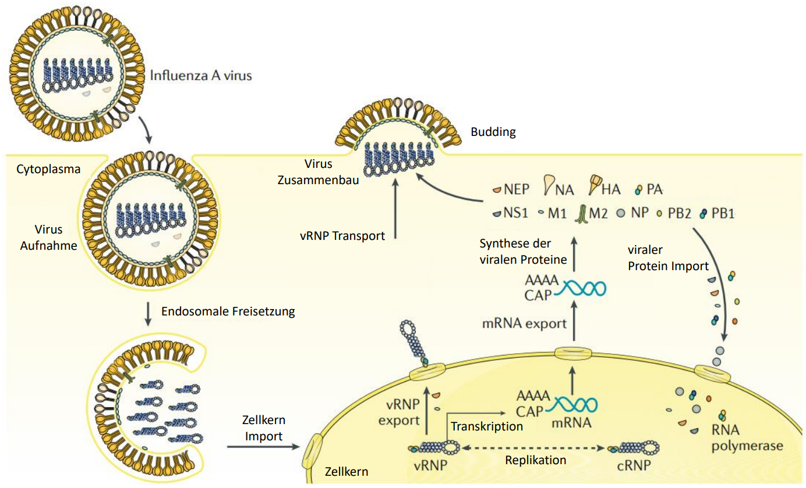
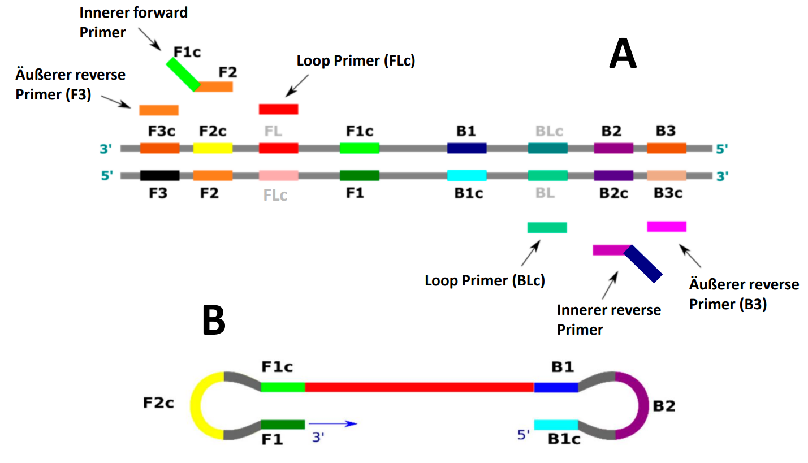
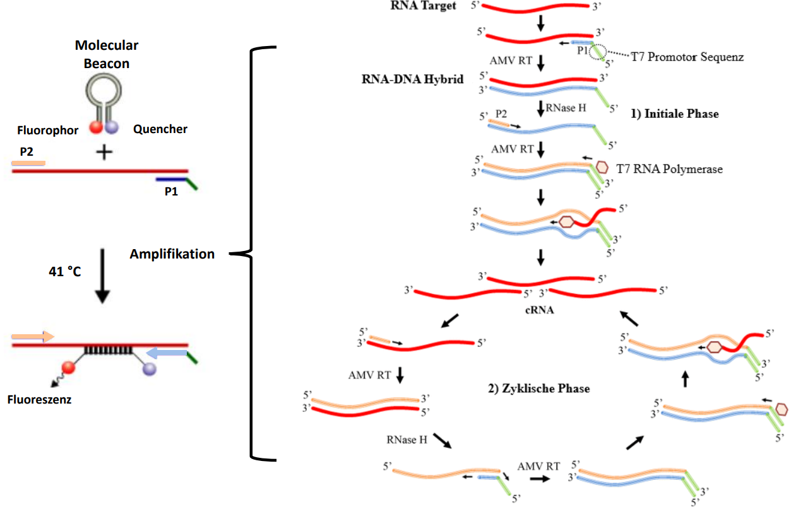

---
output:
  bookdown::pdf_document2:
    fig_caption: yes
    toc: TRUE
    toc_depth: 3
    fontsize: 12pt
    latex_engine: xelatex
bibliography: "Bachelor_quellen.bib"
csl: european-journal-of-taxonomy.csl
citation_package: biblatex
link-citations: yes
urlcolor: RoyalBlue
linkcolor: RoyalBlue
header-includes:
  \usepackage{float}
  \usepackage[ngerman]{babel}
  \usepackage[onehalfspacing]{setspace}
  \usepackage[utf8]{inputenc}
  
---

```{r setup1, include=FALSE}
knitr::opts_chunk$set(echo = FALSE)

library(kableExtra)
library(ggplot2)
library(ggpubr)
library(tidyverse)
library(scales)
library(latex2exp)
```

\pagebreak


# Einleitung

## Viren - Die Gefahr aus dem nichts {#viren}

Infektionskrankheiten verursacht durch Viren oder multiresistente Keime sind ernstzunehmende Bedrohungen für Menschen wie auch staatliche Systeme. Dabei sorgen gerade virale Epidemien und Pandemien, wie die Spanische Grippe mit über 50 Millionen Toten [@Dharmapalan2020], das Chikungunya Virus mit mehr als 1,3 Millionen Infizierten [@Charrel2007], und die aktuelle SARS-CoV-2 Pandemie mit weit über 140\thinspace Millionen Infizierten [@Bai2021] für weltweite Krisen und Milliardenschäden [@Louie2009].  
Viren sind ca. 16 nm bis 200 nm große infektiöse Einheiten, mit einem DNA oder RNA-Genom. Dieses wird von Nucleoproteinen stabilisiert und ist von einer Proteinmatrix, dem sogenannten Capsid umgeben. Je nach Virusart wird das Capsid von einer zusätzlichen Phospholipid-Doppelschicht, der sogenannten Membranhülle, mit eingebetteten Membranproteinen umhüllt (siehe Abbildung \@ref(fig:virusbsp)). Dabei bilden Membranhülle und Capsid das Nucleocapsid [@Modrow2010].

(ref:virusdat) **Schematische Darstellung eines behüllten Virus** Das Virus-Genom wird von Nucleoproteinen gebunden und liegt innerhalb des Capsids vor. Das Capsid ist von der Membranhülle umgeben, in welcher Membranproteine eingelagert sind [@Modrow2010].

```{r virusbsp, fig.align='center', fig.cap= "(ref:virusdat)", out.width= "50%", fig.scap= "Schematische Darstellung eines behüllten Virus"}

knitr::include_graphics("Bilder/Virus Beispielbild.png")

```

Da Viren keinen eigenen Stoffwechsel besitzen, sind sie auf die Infektion von Wirtszellen angewiesen, damit sie mittels der Stoffwechselprozesse des Wirtes ihre viralen Komponenten vervielfältigen können [@Modrow2010]. Eine beeindruckende Fähigkeit der Viren ist die Anpassung an neue Umgebungen und Wirte. Diese hängt von der jeweiligen Variabilität und Mutationsrate ab, welche es ihnen erlaubt eine große genetische Vielfalt zu erschaffen [@Sanjuan2016]. Dadurch bilden einige Viren ständig neue Varianten aus, die durch veränderte Infektionsstrukturen Immunlücken besetzen und dadurch Infektionsherde und Pandemien hervorrufen [@Lyons2018; @Cosar2022].   
Die SARS-CoV-2 Pandemie hat gezeigt, dass eine frühzeitige, schnelle und effiziente Detektion von viralen Krankheiten notwendig ist, um Infektionsketten schnell zu unterbrechen und Gesundheitssysteme zu entlasten [@Valera2021]. Dabei ist die quantitative Echtzeit Polymerase-Kettenreaktion (engl.: _quantitativ real-time Polymerase chain reaction_, qPCR) die vorherrschende Testmethode in der medizinischen Diagnostik, da sie durch die Amplifikation von Nukleinsäuren hohe Sensitivitäten und Spezifitäten erreicht. Jedoch benötigt die qPCR spezialisierte Laboratorien mit energieintensiven Gerätschaften und geschultes Personal, sowie aufwendige Präparationsprotokolle, wodurch eine dezentrale Diagnostik erschwert wird [@Behrmann2020a; @Brendish2015; @Augustine2020]. Zusätzlich fallen lange Transportwege zu zentralen Laboren an, bei denen sich „*Turnaround*"-Zeiten von mehr als 24 h ergeben können [@Brendish2015]. Dadurch kann das Unterbrechen von Infektionsketten erschwert werden, da erkrankte Patienten binnen der 24 h weitere Personen infizieren können [@Sharma2021]. Aus diesem Grund ist es wichtig, die Routine-Diagnostik mit sensitiven und kostengünstigen Alternativen zu ergänzen, welche vor Ort als _point-of-care testing_ (POCT) durchgeführt werden können [@Goble2016]. Für das POCT werden isotherme Nukleinsäureamplifikationstechniken zur Detektion der Erreger immer interessanter, da diese im Vergleich zur qPCR keine komplexen Geräte benötigen und kürzere Testzeiten bieten können. Diese können dezentral für die Diagnostik eingesetzt werden, was zu einer schnelleren Detektion am „*point of care*" führt. Durch den zielgerichteten Nachweis der Erreger können erkrankte Personen direkt identifiziert werden und somit möglicherweise eine Unterbrechung der Infektionsketten erreicht werden [@Pumford2020;@Islam2022]. 

## Die Influenza Viren - Pandemieverursacher Nr. 1 {#virengern}

Die „echte" Grippe, verursacht durch die Influenza Viren, als bekanntester Vertreter der Orthomyxoviren, ist eine der bedeutendsten Infektionskrankheiten mit jährlichen Todesfällen zwischen 290.000 und 650.000 weltweit [@RKI2019; @Iuliano2018].
Die Influenza Viren werden, aufgrund verschiedener molekularer Eigenschaften und serologischen Charakteristika, in die Typen A, B, C und D eingeteilt. Sie sind behüllte, einzelsträngige RNA-Viren. Die genomische RNA, welche in negativer Strang-Orientierung, also entgegen der 5´-> 3´ Leserichtung der Ribosomen vorliegt, ist in 8 unterschiedlich große Abschnitte, sogenannte Segmente unterteilt [@Modrow2010; @Alberts2017]. Alle Virus-Typen sind humanpathogen, außer D, der nur bei Rindern und Schweinen nachgewiesen wurde [@Foni2017; @Javanian2021]. Typ A besitzt die höchste Virulenz [@Yoo2018] und ist für die meisten Infektionen bei Mensch und Tier verantwortlich. Dieser wird abermals in viele Subtypen, anhand der Oberflächenproteinen Hämagglutinin (HA) und Neuraminidase (NA) unterteilt. Derzeit sind 18 Subtypen der HA (H1 - H18) und 11 Subtypen der NA (N1 - N11) bekannt, welche sich in Untergruppen und Kladen unterteilen lassen [@Shao2017]. Während nur die Subtypen H1 - H3 und N1 - N2 für den Menschen relevant sind, kann Geflügel von allen Subtypen des Influenza A Virus befallen werden [@Nicholson2003]. Derzeit kursieren die beiden Subtypen H1N1 und H3N2 in der Bevölkerung [@Javanian2021]. Die hohe Variabilität der HA und NA-Proteine lässt sich durch die spezielle RNA-Polymerase der Viren erklären. Diese besitzt eine hohe Replikations-Fehlerrate, welche zu veränderten Oberflächenproteinen und damit neuen Virusmutanten führt [@Luo2011]. Dieser Prozess wird als „Antigendrift" bezeichnet und führt dazu, dass neue Varianten dem Immunsystem von vorher infizierten entgehen können [@Luo2011; @Axelsen2014]. Eine Besonderheit des Influenza A Virus ist der sogenannte „Antigenshift". Durch das segmentierte Genom und die verschiedenen tierischen Reservoirs kann bei gleichzeitiger Infektion verschiedener Subtypen ein Austausch einzelner Genomsegmente erfolgen. Dies führt zu einer spontanen Neukombination der einzelnen Viruskomponenten und somit zu einer neuen HA, NA Subtyp-Kombination [@Kim2018]. Besonders interessant sind dabei Schweine, da sie sowohl als Wirt von den Humanen- als auch den Geflügel-Varianten dienen und somit eine Art „Mischgefäß" für den Antigenshift darstellen.  
Influenza Typ B infiziert ausschließlich Menschen und kann auch zu schweren Krankheitsverläufen führen. Jedoch ist die Pandemiegefahr eingeschränkter, da dieser Typ kein tierisches Reservoir besitzt und somit die Verbreitung gezielter begrenzt werden kann. Bei Influenza B findet keine Einteilung in Subtypen statt, jedoch sind zwei genetisch differenzierbare Viruslinien (Victoria/2/1987-like und Yamagata/16/1988-like) bekannt [@Koutsakos2016]. Influenza Typ C besitzt, ähnlich wie Influenza B, keine Pandemie-Gefahr und ruft meistens milde Krankheitsverläufe hervor. Jedoch wurden bei Kindern Infektionen der unteren Atemwege mit schweren Verläufen beobachtet [@Njouom2019]. Neben humanen Infektionen sind auch Schweine als Wirt bekannt [@Hause2013]. 


### Influenza A {#InfAeinleitung}

Das segmentierte Genom des Influenza A Virus ist ca. 13,5 kb groß und codiert für mindestens 17 Proteine, wobei die 3´ und 5´ Regionen keine codogenen Bereiche enthalten, sondern komplementär zueinander sind. Dadurch bilden sie über eine kurze Distanz einen Doppelstrang aus, welcher als Signalsequenz bei der Transkription dient [@Modrow2010; @Chen2018]. Von den 17 codierten Proteinen sind zehn essentiell, während der Rest als sogenannte Accessoire-Proteine bezeichnet wird [@Vasin2014]. Zu den essenziellen Proteinen zählen die NA, die im Verlauf der Infektion für die Freisetzung der Viruspartikel verantwortlich ist, das HA, welches bei der Infektion der Zelle eine Rolle spielt, das Matrixprotein (M1), das Membranprotein (M2), das Nichtstrukturprotein 1 (NS1), das _nuclear export protein_ (NEP), das Nukleoprotein (NP), sowie die 3 Untereinheiten der RNA-Polymerase PA, Pb1 und Pb2 [@Luo2011; @Krammer2018]. Der Aufbau des Virus sowie die Anordnung der essenziellen Proteine auf den Genom-Segmenten sind in Abbildung \@ref(fig:infAstruk) gezeigt. Die Accessoire-Proteine sind, im Gegensatz zu den essentiellen Proteinen, auf alternativen offenen Leserahmen (engl.: _open reading frame_, ORF) codiert. Diese erlauben es Viren, eine größere Protein-Vielfalt auf engem genomischen Raum durch die „Mehrfachverwendung" einer Nukleotid-Sequenz zu exprimieren. Die alternativen ORF's entstehen dabei durch verschiedene molekularbiologische Mechanismen, wie beispielsweise durch _frame shifting_ bei welchem das Ribosom während der Translation eine Base überspringt und somit den Leserahmen ändert, durch einen _readthrough_ bei dem das Ribosom ein Stopp-codon überspringt, oder durch ein _internal Ribosom Entry_, wobei das Ribosom an ein internes Start-Codon durch eine sogenannte IRES (engl.: _internal ribosomal entry site_) rekrutiert wird [@Firth2012]. Zu den Accessoire-Proteinen zählen beispielsweise die dem PA zugehörigen Proteine PA-X, PA-N155 und PA-N182 [@Jagger2012; @Muramoto2013]. Die RNA-abhängige RNA-Polymerase des Influenza A Virus besteht, wie in Abbildung \@ref(fig:infAstruk) gezeigt, aus den 3 Untereinheiten PA, PB1 und PB2, wobei die Gensequenz für PA auf dem Segment 3, für PB1 auf dem Segment 2 und PB2 auf dem Segment 1 codiert ist [@Krammer2018]. Das Heterotrimer assoziiert innerhalb des Virus mit den komplementären Sequenzen an den einzelnen Genomsegmentenden. Die verbleibende RNA wird von oligomeren NP's gebunden, welches auf dem Segment 5 codiert ist. Der resultierende RNA-Protein-Komplex ist in der Literatur als vRNP-Komplex (engl.: _viral ribonucleoprotein_) beschrieben [@Krammer2018; @Velthuis2016]. Kryoelektronenmikroskopische Untersuchungen des vRNP-Komplex zeigten eine doppel-helikale Struktur mit einer Schleife am nicht RNA-Polymerase assoziierten Ende [@Arranz2012]. 
Das Virion des Influenza A Virus besteht aus einer äußeren Cholesterol-haltigen Doppellipidschicht, in welche die Glykoproteine NA, HA und M2 integriert sind [@To2019; @Modrow2010]. Die darunter liegende Proteinmatrix besteht aus oligomeren M1-Proteinen, welche auf dem Genom-Segment 7 codiert sind. Dieses Matrixprotein dient als Angelpunkt und bindet alle anderen Struktur-bildenden Komponenten wie den vRNP-Komplex, die membranbindenden Glykoproteine, sowie die Lipidmembran durch seine positive Polarität [@Kordyukova2018; @Chlanda2016]. Das M1-Protein erfüllt dadurch eine essenzielle Rolle bei dem Zusammenbau des Virus und der nachfolgenden Umhüllung mit Wirts-Lipiden, dem sogenannten _Budding_ [@Nayak2009].  Durch seine komplexe Funktion und den verschiedenen Bindungsdomänen für die anderen Strukturkomponenten ist die Aminosäuresequenz des M1-Proteins am stärksten im viralen Genom konserviert [@McCauley1983; @Kordyukova2018]. Das M2-Protein ist ein Ionen-Kanal, welcher im Verlauf der Virus-Infektion eine wichtige Rolle spielt [@To2016; @Takeuchi1994]. 

(ref:label) **Schematischer Aufbau eines Influenza A Virus**: Das Influenza A Virus besteht aus 8\thinspace Genom-Segmenten, die für die 10 essentiellen Proteine codieren. Zu diesen zählen die Neuraminidase (NA), das Hämagglutinin (HA), das Matrixprotein (M1), das Membranprotein (M2), das Nichtstrukturprotein NS1, das _nuclear export protein_ NEP, das Nukleoprotein (NP), sowie die 3 Untereinheiten PA, Pb1 und Pb2 der RNA-Polymerase [@Luo2011; @Krammer2018]. Die Zahlen geben das das jeweilige Genomsegment an. Bild modifiziert nach @Krammer2018. 

```{r infAstruk, fig.align='center', fig.cap= "(ref:label)", out.width= "70%", fig.pos="H", fig.scap= "Schematischer Aufbau eines Influenza A Virus"}

knitr::include_graphics("Bilder/infA_Virus1.png")

```

Der Replikationsmechanismus des Influenza A Virus beginnt mit der Bindung des HA an endständige N-Acetyl-Neuraminsäuren auf der Oberfläche von Wirts-Zellen [@Modrow2010]. Durch die Bindung wird das Virus über die Bildung eines Endosoms in die Zelle aufgenommen [@Krammer2018]. Durch den geringen pH-Wert im Endosom gibt es eine Konformationsänderung in den HA-Proteinen was dazu führt, dass das Virus mit dem Endosom fusioniert. Gleichzeitig erfährt das M2-Protein eine Konformationsänderung, wodurch ein Ionen-Kanal entsteht und durch Protoneninflux der pH-Wert im Virus-Inneren gesenkt wird [@Matsuoka2013]. Dadurch dissoziiert das M1 Protein von dem vRNP-Komplex und das Virus-Genom gelangt ins Cytoplasma [@Chauhan2022; @Matsuoka2013] Die Genomsegmente werden in den Zellkern transportiert, wo die Transkription durch die viruseigene Polymerase (PA, Pb1 und Pb2) sowie die Replikation über ein positiv orientiertes, komplementäres Ribonuklein-Komplex-Intermediat (engl.: _complementary ribonucleoprotein_, cRNP) stattfindet (Abbildung \@ref(fig:indareplolabel))[@Krammer2018]. Durch ein sogenanntes „*cap-snatching*", vermittelt vom Pb2, werden 5'-cap Strukturen der Wirts mRNAs an die eigene virale RNA gebracht und so die Transkription initialisiert. Am 3'-Ende gerät die Pb1 Untereinheit in eine Art „stottern" wodurch eine Polyadenylierung erfolgt [@Chauhan2022]. Die gecappten und polyadenylierten viralen mRNAs gelangen ins Cytoplasma, wo durch die Wirtsribosomen neue virale Proteine synthetisiert werden. Die Polymerase-Proteine (PA, Pb1 und Pb2) und die NP-Proteine werden erneut in den Zellkern importiert, um die Transkription weiter zu beschleunigen [@Krammer2018]. Die Proteine M2, HA und NA wandern zur Zellmembran und integrieren in diese. Das NS2 und M1 Protein werden in den Zellkern rekrutiert, wo sie die den vRNP-Komplex mit den Genomsegmenten binden und den Export zur Zell-Membran koordinieren. [@Chauhan2022;@Krammer2018]. Dort angekommen findet der Zusammenbau und das Budding (die Umhüllung mit der Zellmembran mit den integrierten HA, NA und M2-Proteinen) des Virions statt. Über die katalytische Aktivität des NA, welches terminale N-Acetyl-Neuraminsäuren von der Wirts-Zelle spaltet, wird das neue Virion freigegeben [@Matsuoka2013; @Chauhan2022].


(ref:indareplolabel) **Vereinfachte Darstellung des Influenza Replikationszyklus:** Das Virus gelangt über Endozytose und Endosombildung ins Zellinnere, und gibt das Genom ins Zellinnere. Die virale RNA wandert mit dem vRNP-Komplex in den Zellkern und die Transkription wird gestartet. Die virale mRNA wird im Cytoplasma zu viralen Proteinen translatiert, welche mit dem vRNP-Komplex neue Virionen bilden und die Zelle über das Budding verlassen.
HA, Hämagglutinin; M1, Matrixprotein; M2, Membranprotein; NA, Neuraminidase; NEP, _nuclear export protein_; NP, Nucleoprotein; NS1, Nichtstruktur Protein; PB1, PB2 und PA, virale RNA-Polymerase. Bild modifiziert nach @Krammer2018.

```{r infArepli, fig.align='center', fig.cap= "(ref:indareplolabel)", out.width= "80%", fig.scap= "Vereinfachte Darstellung des Influenza Replikationstyklus"}



```


### Influenza B

Innerhalb von saisonalen Epidemien ist das Influenza B Virus ein ständiger Begleiter des Influenza A Virus und co-zirkuliert mit diesem [@Sandt2015]. Jedoch liegt der Fokus der Forschung auf dem Influenza\thinspace A Virus, da hier durch die etablierten tierischen Reservoirs ein deutlich erhöhtes Pandemierisiko besteht [@Zaraket2021; @Koutsakos2016]. Dessen ungeachtet ist das Influenza B Virus für ca. 23 % aller Influenza-Erkrankungen mit einer besonders hohen Sterblichkeit von über 50 % bei Kindern (0 - 18 Jahre) verantwortlich [@Zaraket2021].  
Die Genomstruktur und der Aufbau der Influenza B Viren ist identisch mit dem des Influenza A Virus (siehe Abbildung \@ref(fig:infAstruk)) [@Hampson2006]. Jedoch unterscheiden sich die Proteine der Virus-Typen in Länge, Aminosäure-Komposition und Funktion [@Koutsakos2016]. So ist das Genom des Influenza B Virus mit rund 14,6 kb leicht größer und codiert für 11 Proteine [@Paterson2003; @Sandt2015]. Dabei bleiben die 10 essenziellen Proteine erhalten (siehe Abbildung \@ref(fig:infAstruk)) während viele Accessoire-Proteine wegfallen [@Sandt2015]. Der wichtigste Unterschied zwischen Influenza B und Influenza A liegt in zwei Proteinen, welche nur in dem Influenza B Virus enthalten sind. So codiert das Segment 6 ein NB-Protein, welches ein hochkonserviertes Protein mit Ionenkanalaktivität ist, sowie das auf Segment 7 codierte BM2-Protein [@Sandt2015]. Letzteres ist ein kleines hydrophobes integrales Membranprotein, das eine Ionenkanalaktivität besitzt, ähnlich wie das M2-Protein bei Influenza A, und essenziell für die Virus-Replikation ist [@Paterson2003; @Hatta2004]. Außerdem unterscheidet sich Influenza B durch seine RNA-Polymerase, welche zusätzlich unmethylierte, gecappte mRNAs erkennen kann sowie bei dem NP-Protein, welches deutliche strukturelle Unterschiede aufweist [@Koutsakos2016].
Des Weiteren besitzt das Influenza B Virus eine geringere Mutationsrate als Influenza A [@Chen2008]. Zudem wurden bei dem Influenza B Virus keine großen Veränderungen der antigenen Oberflächenproteine beobachtet, was einerseits vermutlich daran liegt, dass keine tierischen Reservoirs vorhanden sind, andererseits kein Antigenshift mit den Influenza A Viren möglich ist [@Paterson2003].


(ref:infbcodings) Übersicht und Vergleich der Proteine von Influenza A und B (Modifiziert nach @Sandt2015)

```{r, infbproteins}
#infbPSM <- read.csv2("InfB_codings.csv", header = FALSE, fileEncoding="latin1")
#kable(infbPSM, booktabs = TRUE, col.names = NULL, caption = "(ref:infbcodings)") %>%
 # add_header_above(c("RNA-Segment"= 1, "Protein"= 1, "Länge[AS]"=1, "Protein"=1, "Länge[AS]"=1, "Funktion"=1), line_sep=0) %>%
   #add_header_above(c(" "= 1, "Influenza A"= 2, "Influenza B"=2, " "= 1)) %>%
 # kable_styling(latex_options = "hold_position") %>%
 # kable_styling(latex_options = "scale_down")%>%
 # column_spec(6, width = "3in")%>%
  #row_spec (1, hline_after = TRUE, extra_css = "border-bottom: 1px solid;") %>%
#  row_spec (2, hline_after = TRUE, extra_css = "border-bottom: 1px solid;") %>%
 # row_spec (5, hline_after = TRUE, extra_css = "border-bottom: 1px solid;") %>%
 # row_spec (8, hline_after = TRUE, extra_css = "border-bottom: 1px solid;") %>%
#  row_spec (9, hline_after = TRUE, extra_css = "border-bottom: 1px solid;") %>%
 # row_spec (10, hline_after = TRUE, extra_css = "border-bottom: 1px solid;") %>%
#  row_spec (12, hline_after = TRUE, extra_css = "border-bottom: 1px solid;") %>%
 # row_spec (15, hline_after = TRUE, extra_css = "border-bottom: 1px solid;") %>%
 #  footnote( symbol = c("Y=C oder T; V=A, C oder T", "(ref:design)"), symbol_manual = c('*', '**', '***'), fixed_small_size = TRUE, general_title = "Notiz:", escape= FALSE, footnote_as_chunk =TRUE)

```


## Proteinbasierte Nachweismethoden von Influenza

Respiratorische Erkrankungen, hervorgerufen durch die Influenza Viren, bleiben, trotz Impfungen und einem sich weiterentwickelndem Gesundheitssystem, ein ernst zu nehmendes Problem. Die Behandlung ist dabei zeitabhängig und Medikamente wie Oseltamivir sollten in den ersten 48h nach Symptombeginn verabreicht werden [@Whitley2007]. Des Weiteren sind einige Medikamente wie Amantadin spezifisch bei dem Influenza A Virus zu verabreichen [@Swierczynska2022]. Aus diesem Grund ist eine zeitige und spezifische Diagnostik entscheidend für eine rechtzeitige Behandlung [@Vemula2016].
Die Detektion der Influenza Viren erfolgt über Standardverfahren wie Antikörpertests, serologischen Methoden, Zellkultur sowie Nukleinsäure basierte Testverfahren wie qPCR  oder Sequenzierung [@Vemula2016]. 
Bei serologischen Testverfahren wird auf Antikörper im Serum des Patienten untersucht, die gegen spezielle Virusproteine (HA oder NA) gerichtet sind. Dadurch können einzelne Subtypen des Influenza A Virus unterschieden werden [@WozniakKosek2014]. Jedoch benötigen serologische Tests für ein adäquates Ergebnis, mehrere Seren eines Patienten zu verschiedenen Zeitpunkten. Dies verhindert ein schnelles Ergebnis und ist somit für die Routine-Diagnostik ungeeignet [@Chow2019]. Die Diagnostik mittels Zellkultur benötigt spezielle Zelllinien und Präparationen. Ein solches System ist dadurch nicht die erste Wahl für eine Schnelldiagnostik, da hier trotz hoher Spezifität und Sensitivität, längere Inkubationszeiten notwendig sind [@Chow2019; @Vemula2016].
Bei den Antikörpertests wie dem direkten Fluoreszenz Antikörper Assay (engl.: _direct fluorescence antibody assay_, DFA) wird die dem Patienten entnommene Probe mittels fluoreszenzmarkierter Antikörper auf Influenza spezifische Antigene untersucht. Diese kostengünstige Testmethode liefert bei kurzen Testzeiten von 2\thinspace -\thinspace 4\thinspace h ein Ergebnis mit Sensitivitäten ab 70 % aufwärts [@Kim2013]. Weiterhin können Influenza detektierende Schnelltests (engl.: _rapid influenza diagnosis tests_, RIDT), welche binnen 30 Minuten ein Ergebnis liefern, oder _lateral flow_-basierte Schnelltests für die POCT verwendet werden [@Lin2022; @Han2020]. Die Antikörpertests unterliegen jedoch Limitationen. So besitzen sie einerseits geringe Sensitivitäten und sind andererseits spezifisch für ein Antigen (HA oder NA). Wie in Kapitel \@ref(virengern) beschrieben, unterliegt besonders Influenza A Mutationen durch den Antigenshift und Antigendrift, wodurch vor allem in Pandemien neue Varianten der Antigene entstehen. Diese können nicht mehr von den Antikörpertests detektiert werden und es kommt zu falsch negativen Ergebnissen [@Lin2022; @Yi2013]. 

\pagebreak

## Nukleinsäure amplifizierende Methoden zur Detektion von Influenza

Nachweis-Methoden mit hohen Sensitivitäten und Spezifitäten sind essenziell für eine genaue Diagnose und medizinische Behandlung. Dabei sind Nukleinsäure amplifizierende Methoden (engl.: _nucleic acid amplification techniques_, NAAT) zusammen mit Antikörpertests der Goldstandard in der klinischen Diagnostik und die empfohlenen Methoden zur Detektion von Influenza Viren [@Uyeki2018]. Innerhalb der NAAT werden einzelne Nukleinsäure-Moleküle über Polymerase-Kettenreaktion (engl.: _polymerase chain reaction_) oder isotherme Amplifikation vermehrt (amplifiziert) und so ein Signal erzeugt. Somit ist es möglich spezifisch einzelne Nukleinsäure-Moleküle nachzuweisen [@Kang2022; @Oezay2021].
Für die Influenza Diagnostik wird routinemäßig RT-PCR (reverse-Transkriptase-PCR) eingesetzt, jedoch werden auch isotherme Assays, wie LAMP (engl.: _loop mediated isothermal amplifikation_) oder NASBA (engl.: _nucleic acid sequence-based amplification_) beschrieben [@Vemula2016]. Gerade die RT-PCR zeigt ähnlich hohe Sensitivitäten wie die Zellkultur und die serologischen Tests und ist somit den Antikörpertests vorzuziehen. Durch die Wahl konservierter Sequenzbereiche können NAAT weniger anfällig gegenüber veränderten Proteinstrukturen sein, da falsch negative Ergebnisse, hervorgerufen durch neue Varianten, vermieden werden können [@WozniakKosek2014]. 

### Die Polymerase Kettenreaktion - PCR {#RTPCR}

Die PCR, entwickelt von @Mullis1986, ist eine Methode zur Amplifikation von DNA. Sie war ein Meilenstein in der Molekularbiologie, da erstmals Nukleinsäuren spezifisch vermehrt und somit für Genetik, Forensik und Diagnostik verwendet werden konnten [@Ganova2021]. Das Prinzip der PCR beruht auf einem Konzept von zwei ca. 20 bp großen Oligonukleotiden, den sogenannten Primern, welche einen bestimmten Sequenzbereich flankieren. Sie binden spezifisch an ein komplementäres DNA-Fragment und werden von einer DNA-abhängigen DNA-Polymerase verlängert. Das sogenannte Primerpaar, besteht aus forward (komplementär zu einer Sequenz auf dem Sense-Strang) und reverse (komplementär zu einer Sequenz auf dem Antisense-Strang) Primer [@Muelhardt2009]. Der grundlegende Reaktionsmechanismus der PCR besteht aus 3 Zyklen; der 1) DNA-Denaturierung, der 2) Primerhybridisierung („*annealing*") und der 3) Elongation (Abbildung \@ref(fig:PCRmecha)). Im ersten Schritt werden mittels hoher Temperatur ($\approx$ 95 °C) die Wasserstoffbrückenbindungen der DNA aufgeschmolzen und diese damit denaturiert. Bei dem Hybridisations-Schritt (55 - 65 °C) kommt es zum sogenannten „*annealing*", d.h. der Anlagerung der Primer an die DNA [@Sreejith2018]. Im nachfolgenden Amplifikationsschritt ($\approx$ 72 °C) bindet die thermostabile Taq-Polymerase (Taq, abgeleitet von _Thermus aquaticus_) an das 3'-OH Ende der beiden angelagerten Primer, wobei die Primer anhand der komplementären DNA verlängert werden und der Target DNA-Doppelstrang verdoppelt wird [@Clark2009]. Somit ist ein Zyklus abgeschlossen und ein Neuer beginnt mit einer erneuten DNA-Denaturierung. Für eine erfolgreiche Amplifikation werden bis zu 45 Zyklen hintereinander durchgeführt, wodurch die DNA jedes Mal verdoppelt und damit exponentiell vermehrt wird [@Sreejith2018]. Klassischerweise wird die amplifizierte DNA am Ende der PCR mittels Gelelektrophorese nachgewiesen [@Wood1994].  
Da die bei der Standard PCR verwendeten Taq-Polymerase keine RNA als Ausgangsmaterial erkennt, wird eine zusätzliche reverse Transkriptase (RT)-Reaktion der PCR benötigt. Bei der RT kommt es zur Umschreibung der RNA in eine komplementäre DNA (engl.: _complementary DNA_, cDNA), welche anschließend über den beschriebenen PCR-Mechanismus amplifiziert werden kann [@Muelhardt2009; @OtextquotesingleDriscoll1993]. Diese Erweiterung der PCR wird als RT-PCR bezeichnet [@Bustin2005].  

(ref:PCRlabel) **Reaktionsmechanismus der 3-Stufen PCR:** Die PCR ist schematisch mit angefügter Temperaturkurve dargestellt, bestehend aus den 3 Schritten:   
1) DNA-Denaturierung: Die doppelsträngige DNA (blau) wird bei $\approx$ 95 °C denaturiert.  
2) Primerhybridisierung: es können Primer (rot) bei 50 °C an die einzelsträngige DNA binden   
3) Elongation: Die Primer werden vom 3'-Ende mittels der Taq-Polymerase bei 72 °C verlängert (rote Pfeile), bis zwei doppelsträngige DNA-Moleküle vorliegen. Bild modifiziert nach @Lopes2020

```{r PCRmecha, fig.align='center', fig.cap= "(ref:PCRlabel)", out.width= "60%", fig.pos="H", fig.scap= "Reaktionsmechanismus der 3-Stufen PCR"}

knitr::include_graphics("Bilder/PCR1.png")

```

Ein weiterer Fortschritt der PCR ist die qPCR. Hierbei wird dem PCR-Reaktionsmix ein fluoreszierendes Reportermolekül, wie beispielsweise ein interkalierender Fluoreszenzfarbstoff, oder fluoreszenzmarkierte Oligonukleotide, zugesetzt [@Ma2021]. Goldstandard der qPCR sind die fluoreszenzmarkierte Oligonukleotide, die sogenannten Sonden, die spezifisch innerhalb des zu amplifizierenden Bereichs hybridisieren können [@Ranasinghe2005].  
Das Prinzip dieser Fluoreszenzsonden beruht dabei auf der Interaktion eines Fluorophors (Reportermolekül) mit einem sogenannten Quencher, welche sich innerhalb der Sonde in einer bestimmten räumlichen Nähe befinden. Der Quencher ist ein weiteres Molekül, das die Emissionsenergie (Fluoreszenz) des Reportermoleküls über einen Förster-Resonanzenergietransfer (FRET) aufnimmt und dadurch verhindert, dass die Fluoreszenz des Reportermoleküls ohne eine räumliche Trennung detektiert werden kann [@Ranasinghe2005]. Durch die  5'-3'-Exonukleaseaktivität der Taq-Polymerase wird die hybridisierte Sonde innerhalb der Elongation hydrolysiert, wodurch Fluorophor und Quencher räumlich voneinander getrennt werden und das Fluoreszenzsignal detektiert werden kann [@Thornton2011]. Mit dem freiwerdenden Fluoreszenzsignal wird ein bestimmtes Verhältnis zur amplifizierten DNA quantitativ abgeleitet, so dass eine Echtzeit-Verfolgung der Nukleinsäureamplifikation ermöglicht wird. Durch die Einführung eines Fluoreszenzemissions-Schwellenwertes, dem sogenannten c~q~-Wert (engl.: _cycle quantification_), welcher an einem bestimmten Zeitpunkt von dem Fluoreszenzsignal überschritten wird, lässt sich ein bestimmter DNA-Gehalt der Reaktion mit der Reaktionszeit verknüpfen [@Lovatt2002; @Bustin2000].

\pagebreak

### Isotherme Amplifikationstechniken

Isotherme Amplifikationstechniken (IA) können Nukleinsäuren bei einer gleichbleibenden Temperatur amplifizieren [@Kang2022]. Sie bieten dadurch eine vereinfachte Handhabungsmöglichkeit, wodurch die Durchführung technisch vereinfacht und damit geringere Anforderungen an Gerätschaften und Personal möglich ist. Infolgedessen werden preisintensive PCR-Thermocycler, nicht benötigt, wodurch IA's eine Alternative für die POCT und der dezentralen Diagnostik bieten. [@Boonbanjong2022; @Behrmann2020a; @Zhao2015]. Ab den 1990er Jahren wurden viele isotherme Methoden als Alternative zur PCR entwickelt, die unterschiedliche Aspekte kombinieren und somit für verschiedenste Applikationen ein Repertoire bilden [@Zhao2015]. So kann die Influenza Diagnostik mit IA bereits ergänzt werden [@Vemula2016]. Besonders hervorzuheben unter den IA ist die RPA (engl.: _recombinase polymerase amplification_). Sie verbindet viele positive Effekte und biete eine robuste, simple und effektive Plattform für die POCT  [@Gloekler2021; @Li2019]. Eine Auswahl der gängigsten Methoden als Goldstandard wie die LAMP, NASBA sowie die RPA, die in dieser Arbeit weiterentwickelt wurde, werden in den folgenden Kapiteln vorgestellt.


### Schleifenvermittelte isotherme Amplifikation - LAMP
Die erstmalig im Jahr 2000 von @Notomi2000 entwickelte LAMP ist die am meisten publizierte IA. Die LAMP amplifiziert DNA bei einer konstanten Temperatur von 60 - 65 °C. Anders als z.B. bei der PCR werden bei der LAMP vier bis sechs Primer verwendet, wodurch sie zwar einerseits sehr hohe Spezifitäten erreicht, andererseits aber dadurch hohe Anforderungen an das Primer-Design sowie deren Optimierung bestehen [@Soroka2021]. Die LAMP-Primer werden in innere Primer, äußere Primer und sogenannte Loop Primer unterteilt. [@Nagamine2002]. Die Primerpaare binden jeweils an unterschiedlichen Regionen der Ziel-DNA (siehe Abbildung \@ref(fig:LAMP)) und erfüllen verschiedene Aufgaben [@Huang2020]. Die DNA-Amplifikation der LAMP ist enzymatisch mittels einer DNA-abhängigen DNA-Polymerase realisiert, welche im Gegensatz zur Taq-DNA-Polymerase eine hohe DNA-Strang Verdrängungs-Aktivität besitzt [@Park2022; @Thornton2011].  
Der Reaktionsmechanismus der LAMP kann grundsätzlich in zwei Phasen unterteilt werden; der nicht zyklischen Phase und der zyklischen Phase. Im ersten Schritt der nicht zyklischen Phase hybridisiert einer der inneren Primer mit seinem 3´-Ende an die zu amplifizierende DNA (siehe Abbildung \@ref(fig:LAMP)). Dadurch kann eine Strangverlängerung des Primers durch die Polymerase stattfinden und mithilfe der Strangverdrängungsaktivität wird der ursprüngliche Doppelstrang abgelöst. Anschließend bindet der äußere Primer und es findet abermals eine Strangverlängerung statt, bei der der innere Primer mit der neu synthetisierten DNA verdrängt wird. Der entstandene DNA-Einzelstrang besitzt an einem Ende die Sequenz des inneren Primers, und bildet durch den hinteren komplementären Teil des Primers eine Schleife (engl.: _loop_) aus.
Der eben beschriebene Amplifikationsschritt findet auch mit den entgegen gesetzten inneren und äußeren Primern statt. Dadurch entsteht ein DNA-Fragment, welches die oben erwähnte Form einer Hantel besitzt (Abbildung \@ref(fig:LAMP))[@Parida2008].   
Die gebildete Hantelstruktur dient in der zweiten Phase der Amplifikation, der zyklischen Phase, als Startpunkt. Hier können die verschiedenen Primer gleichzeitig binden und somit die Ziel-DNA exponentiell vervielfältigen. Ebenfalls dient das 3'-Ende der Hantelstruktur als weiterer Startpunkt für die Polymerase. Im Verlauf der Reaktion entstehen verschiedenste Strukturen wie Konkatemere und blumenkohlähnliche Strukturen mit weiteren Schleifen [@Soroka2021; @Silva2019]. Durch das zusätzliche Einbringen der Loop Primer, kann die Anzahl der Startpunkte abermals erhöht werden, was zu einer erhöhten Amplifikationsgeschwindigkeit führt [@Nagamine2002].  
Die LAMP zeichnet sich durch hohe DNA-Endkonzentration von 10 - 20 µg pro 25 µl Ansatz am Ende der Reaktion aus, wodurch eine Auswertung mit dem bloßen Auge über bestimmte Methoden erfolgen kann [@Parida2008]. So kann die Quantifizierung der Amplifikation einerseits über kolorimetrische Fluoreszenzfarbstoffe wie Calcein [@Tomita2008] oder andererseits über Fluoreszenzfarbstoffen wie SYBR Green I [@Iwamoto2003] realisiert werden. Ebenfalls kann die Messung der Trübung für den Nachweis einer positiven Reaktion verwendet werden. Während der Amplifikation entstehen große Mengen an Pyrophosphat, das Magnesium-Ionen bindet und bei hohen Konzentrationen ausfällt, was zu einer sichtbaren Trübung der Reaktionsmixtur führt [@Mori2001].

(ref:label3) **Primer-Bindungsstellen und Hantelstruktur der LAMP**:   
**A**: Primerdesign und -bindungsstellen der LAMP. Die inneren Primer besitzen zwei Bindungsstellen auf den unterschiedlichen Strängen der DNA. Die äußeren Primer liegen „hinter" den inneren und sorgen im Verlauf der Strangverlängerung für eine Verdrängung des DNA-Strangs.   
**B**: Hantelstruktur als Ausgangspunkt der zyklischen Phase. Die verschiedenen Bindestellen dienen als Startpunkte einer Amplifikation, wodurch eine exponentielle Amplifikation erreicht wird. Bild modifiziert nach @Soroka2021 

```{r LAMP, fig.align='center', fig.cap= "(ref:label3)", out.width= "70%", fig.scap= "Primer-Bindungsstellen und Hantelstruktur der LAMP"}



```

### Nukleinsäure sequenz-basierte Amplifikation - NASBA
Die NASBA ist eine auf der Transkription basierende, isotherme Amplifikationsmethode zum Nachweis von RNA Ausgangsmaterial (engl.: _template_) [@Deiman2002; @Compton1991]. Im Gegensatz zur PCR benötigt die NASBA keinen vorhergehenden RT-Schritt, da die NASBA RNA als Ausgangsmaterial benötigt und damit ideal zur Detektion von Influenza Viren ist, welche RNA-Genome aufweisen [@Compton1991;@Moore2004; @Bachman2013]. Die erstmals von @Guatelli1990 erwähnte Methode beruht dabei auf einem Enzym Mix bestehend aus einer RT des Alpharetrovirus, der RNAse H und der T7 DNA-abhängigen RNA-Polymerase (engl.: _DNA-dependent RNA-polymerase_, DdRp) [@Deiman2002]. Eine Besonderheit der NASBA liegt im ersten Schritt der Methode. Hier bindet ein ca. 45 bp langer DNA-Primer an das 3´-Ende der einzelsträngigen RNA. Dabei hybridisieren nur 20 bp am 3´-Ende des Primers, da sie komplementär zur Ziel-RNA sind. Das 5-Ende besitzt hingegen eine DdRp Promotor Sequenz. Der hybridisierte DNA-Primer wird von der im Reaktionsmix enthaltenen RT verlängert (41 °C) und es entsteht ein cDNA/RNA-Hybrid. Der RNA-Anteil wird anschließend von der RNAse H verdaut, sodass der einzelsträngige cDNA-Anteil mit der Promotorsequenz erhalten bleibt. Ein zweiter 20 bp langer Primer (komplementär zur cDNA) hybridisiert und vervollständigt mittels RT den DNA-Doppelstrang. Die nun aktive, doppelsträngige T7-Promotorsequenz, rekrutiert die DdRp, die viele RNA-Kopien des DNA-Templates erzeugt (Abbildung \@ref(fig:NASBA)). Die neu entstandenen RNA-Moleküle reihen sich in diesen Zyklus ein und es kommt zur exponentiellen Amplifikation (Abbildung\thinspace \@ref(fig:NASBA))[@Compton1991].  
Zur Echtzeitdetektion und Quantifizierung der amplifizierten RNA können spezielle Hybridisierungs-Sonden sogenannte „*Molecular Beacon*" verwendet werden [@Deiman2002]. Diese besitzen die Struktur einer Haarnadel, wobei das eine Ende mit einem Reporterfluorophor und das andere Ende mit einem Quencher gekoppelt sind. Die Haarnadel-Struktur ist dabei so ausgebildet, dass die beiden Enden der Sonde komplementär zueinander sind und somit Reporterfluorophor und Quencher in direkter Nähe zueinander liegen, wodurch der FRET-Effekt einsetzt (Abbildung \@ref(fig:NASBA)). Die Sequenz innerhalb der ausgebildeten Schleife ist komplementär zu einer Region auf dem zu detektierenden RNA-Molekül. Bei der Bindung der Sonde an die Zielregion öffnet sich die Schleife, Reporterfluorophor und Quencher werden voneinander getrennt und ein Fluoreszenzsignal kann detektiert werden [@Omran2022].

(ref:label2) **Schematischer Reaktionsmechanismus und Detektion der Nukleinsäure sequenz-basierte Amplifikation (NASBA)**: Die NASBA lässt sich einteilen in die 1) initiale Phase und die 2)\thinspace zyklische Phase. Die Template-RNA (rot) bildet durch die Hybridisation von Primer P1 ein cDNA/RNA Hybrid, welches über einen RNAse-Verdau und erneute DNA-Synthese in einen DNA-Doppelstrang umgewandelt wird. Durch den auf dem Doppelstrang aktiven Promotor (grün) werden viele RNA-Kopien erzeugt, welche in den Amplifikationszyklus eingehen. In diesem entsteht abermals ein DNA/RNA Hybrid, welches durch RNAse H-Verdau und DNA-Synthese in deinen DNA-Doppelstrang mit aktivem Promotor überführt wird. Die Detektion erfolgt über „*Molecular Beacon*", welche mit der komplementären Sequenz im Inneren der Schleife an die Ziel-RNA hybridisieren. Dadurch werden Quencher (grau) und Fluorophor (rot) voneinander getrennt und ein Fluoreszenzsignal kann detektiert werden. Bild modifiziert nach @Zhong2018 und @PREMIER2023.


```{r NASBA, fig.align='center', fig.cap= "(ref:label2)", out.width= "85%", fig.pos= "H", fig.scap= "Schematischer Reaktionsmechanismus der Nukleinsäure sequenz-basierte Amplifikation (NASBA)"}



```


\pagebreak

### Rekombinase Polymerase Amplifikation - RPA {#rpa}

Die von @Piepenburg2006 entwickelte RPA ist ein von dem Replikationszyklus der T4 Bakteriophage angepasstes isothermes Amplifikationssystem [@Li2019]. Der Mechanismus der Vervielfältigung der DNA beruht dabei auf einem koordinierten Zusammenspiel der Rekombinase und dem Rekombinase loading factor der T4 Bakteriophage, den single-stranded binding proteinen (SSB) und der Sau-DNA-Polymerase (abgeleitet von _Staphylococcus aureus_)[@Li2019]. Im ersten Schritt bindet die T4 UvsX Rekombinase mithilfe des T4 UvsX Rekombinase Co-Enzyms unter ATP-Verbrauch an einzelsträngige DNA-Primer [@Daher2016; @Lobato2018]. Der entstandene Rekombinase-Primer-Komplex migriert entlang doppelsträngiger DNA und sucht die zu den gebundenen Primern homolog komplementäre Sequenzen (Abbildung \@ref(fig:RPA)B). Wird ein Bereich gefunden, verdrängt der Komplex den Doppelstrang und bindet mithilfe des Primers unter Bildung einer D-Schleife an den komplementären DNA-Einzelstrang. Der Rekombinase-Komplex dissoziiert nach erfolgreicher Primerbindung unter ATP Verbrauch und kann wieder an neue Primer binden (Abbildung \@ref(fig:RPA)C-E). Eine Rehybridisierung und die damit einhergehende Verdrängung des gebundenen Primers durch den abgespalten DNA-Einzelstrang wird durch die Anlagerung von SSB's an den Einzelstrang verhindert [@Babu2018]. Anschließend bindet die Sau-DNA-Polymerase an das freie 3'-OH Ende des hybridisierten Primers und verlängert diesen komplementär zur DNA (Abbildung \@ref(fig:RPA)F). Sie besitzt eine Strangverdängungsaktivität, wodurch der DNA-Doppelstrang weiter aufgebrochen wird und somit die Verlängerung des Primers fortgesetzt wird. Dies führt zu zwei neu synthetisierten doppelsträngigen DNA-Molekülen, welche erneut in die oben beschriebene Reaktion eingehen und so zur exponentiellen Amplifikation führen [@Babu2018; @Tan2022].


(ref:labeasfas) **Schematischer Reaktionsmechanismus der RPA**: Im ersten Reaktionsschritt der RPA bildet sich der Rekombinase-Primer-Komplex (**A**), welcher entlang der doppelsträngigen DNA migriert (**B**). Wird eine zu den Primern homologe Sequenz gefunden, wird der Primer an die komplementäre DNA-Sequenz gebunden (**C**) und die SSB stabilisieren die verdrängte einzelstängige DNA (**D**). Die Polymerase bindet an die Primer (**E**) und verlängert diese (**F**). Bild modifiziert nach @Lobato2018.


```{r RPA, fig.align='center', fig.cap= "(ref:labeasfas)", out.width= "60%", fig.pos= "H", fig.scap= "Schematischer Reaktionsmechanismus der RPA"}

knitr::include_graphics("Bilder/RPA-Reaktion.png")

```

\pagebreak

Um die Dissoziierung des Rekombinase-Primer-Komplexes zu unterbinden und die Amplifikation zu beschleunigen wird Polyethylen Glycol (PEG) als sogenanntes „*crowding-agent*" verwendet [@Lobato2018; @Lillis2016]. Dieses trägt zu einer Viskosität der Reaktionslösung bei und erschwert so die Diffusion. Zusammen mit den niedrigen Reaktionstemperaturen von $\approx$ 40 °C und der dadurch geringen thermischen Konvektion kann es zur lokalen Reagenzien-Knappheit kommen, wodurch eine Verminderung der Amplifikationsrate entsteht. Vor allem bei niedrigen DNA-Konzentrationen kann deshalb ein zusätzlicher Mischschritt während der laufenden RPA-Reaktion erforderlich sein [@Lillis2016]. Ähnlich wie bei der PCR benötigt die RPA eine RT-Reaktion, um RNA als Templat zu verwenden [@Yoo2021].  
Ein wichtiger Punkt der RPA ist das spezielle Primerdesign. Im Gegensatz zur PCR werden hier längere Oligonukleotide (zwischen 30 - 35 bp) verwendet, die einen Amplifikationsbereich von wenigen 100 bp flankieren [@Li2019]. Für das Design der RPA-Primer ist ein automatisiertes Programm beschrieben [@Higgins2018]. Innerhalb des Primerdesigns konnte gezeigt werden, dass bis zu drei Nukleotid-Fehlpaarungen pro Primer, die RPA nicht beeinflussen [@Boyle2013]. Jedoch konnte von @Higgins2022 gezeigt werden, dass Art und Lage der Fehlpaarungen größeren Einfluss als die Anzahl auf die RPA besitzen [@Higgins2022].  
Die Detektion der RPA kann nach Ablauf der Reaktion über eine Agarose-Gelelektrophorese oder in „*real time*" während der Reaktion durch die Zugabe von spezifischen Sonden erfolgen. Man unterscheidet für die RPA verschiedene Sondentypen, wie die Exonuklease (Exo)-Sonde oder die Formamidopyrimidin DNA Glykosylase (fpg)-Sonde [@Babu2018; @Powell2018]. Das Prinzip der Sonden beruht ähnlich wie der PCR auf dem FRET-Prinzip zwischen einem Fluorophor und einem Quencher [@Ranasinghe2005; @Lobato2018]. Bei der ca. 50 bp großen Exo-Sonde findet im Gegensatz zur PCR keine vollständige Hydrolyse, sondern die zielgerichtete Spaltung der Sonde an einer a-basischen Seite nach der Hybridisierung am DNA-Doppelstrang, durch die Exonuklease III statt. Die a-basische Seite ist dabei so angeordnet, dass sie zwischen Fluorophor und Quencher liegt und beide durch die Spaltung räumlich getrennt werden [@Lobato2018; @Thornton2011]. Um zu vermeiden, dass die Sonde insgesamt als Primer fungieren kann, wird das 3'-Ende blockiert. Die Spaltung durch die Exonuklease erzeugt jedoch ein weiteres unblockiertes 3'-Ende, welches als Primer in die Amplifikationsreaktion eingehen kann [@Daher2016]. Die fpg-Sonde ist mit ca. 35 bp kleiner als die exo-Sonde, funktioniert jedoch nach dem gleichen Prinzip. Hier ist das Fluorophor direkt an das a-basische Nukleotid gekoppelt. Die Spaltung wird durch eine 8-Oxoguanine DNA Glykosylase katalysiert, wodurch das Fluorophor von der Sonde abgespalten wird. Dabei entsteht kein neues 3'-Ende (Abbildung \@ref(fig:rpaprobes)). Allerdings wurden bei RPA-Systemen mit fpg-Sonden geringere Sensitivitäten als bei Exo-Sonden beobachtet [@Daher2016].  
Eine weitere Applikation der RPA ist die Festphasen- („*solid phase*") RPA, bei welcher einer der beiden Primer auf einer Oberfläche immobilisiert wird. Diese Applikation erlaubt ein besseres Multiplexing, da die verschiedenen Reaktionen räumlich getrennt voneinander Ablaufen können [@Rio2014]. Die Detektion kann hierbei elektrochemisch [@Rio2016], kolorimetrisch [@Yamanaka2017] oder markierungsfrei über Ring-Resonatoren [@Shin2013] erfolgen. Ebenfalls ist es möglich RPA mithilfe von lateral flow Plattformen zu kombinieren, um mit dem bloßen Auge auswertbare Tests zu entwickeln [@Lobato2018; @Heeroma2020]. Hierbei wird eine andere Sonde, die Endonuklease IV (nfo)-Sonde, verwendet, die eine a-basische Seite besitzt und am 5'-Ende mit einem Carboxyfluorescein (FAM)-Fluorophor markiert ist. Anstelle der Exonuklease wird hier die Endonuklease IV zur Spaltung eingesetzt. Zusammen mit Biotin markierten reverse Primern entstehen doppelt markierte Amplifikate (FAM und Biotin), welche über eine Biotin-Streptavidin Interaktion an die _lateral flow_ Oberfläche gebunden werden und über Anti-FAM Antikörper nachgewiesen werden (Abbildung \@ref(fig:rpaprobes))[@Daher2016].


(ref:rpaprobetypes) **Vergleichende Darstellung der RPA-Sondentypen:** Die quantitative Detektion der RPA kann über A) exo-Sonden oder B) fpg-Sonden erreicht werden sowie die Detektion über lateral flow mittels C) nfo-Sonde.  
**A, B:** Über eine enzymatische Aktivität wird die a-basische Seite gespalten, somit Fluorophor und Quencher getrennt und ein Fluoreszenzsignal kann detektiert werden.  
**C:** Durch Spaltung der Sonde entstehen mit FAM und Biotin markierte Amplifikate, welche über Avidin gebunden werden und über Antikörper nachgewiesen werden. FAM, Carboxyfluorescein; THF, a-basische Seite.

```{r rpaprobes, fig.align='center', fig.cap= "(ref:rpaprobetypes)", out.width= "90%", fig.pos="H", fig.scap= "Vergleichende Darstellung der RPA-Sondentypen"}

knitr::include_graphics("Bilder/RPA_Sonden_übersicht1.png")

```

\pagebreak

## Ziel der Arbeit

Ein aktuelles BMBF-Projekt befasst sich mit der Point-of-Care Diagnostik respiratorischer Viren. Zur Vor-Ort Analytik sollen mittels des isothermen RPA-Detektionssystems die verschiedenen Viren in einem mobilen Kofferlabor beprobt werden.
Ziel dieser Arbeit ist es, jeweils ein Rekombinase Polymerase Amplifikations Assay zum Nachweis der Influenza Viren A und B zu entwickeln. Die Assays sollen für Influenza A die relevanten Subtypen H3N2 und H1N1 nachweisen können sowie für Influenza B als Pan-Influenza B fungieren. Dafür sollten Primer-Sonden-Kombinationen designt und diese in einem Auswahlverfahren getestet werden. Die analytische Sensitivität und Spezifität der jeweiligen Systeme sollte mittels in vitro synthetisierter RNA-Standards ermittelt, so die Systeme charakterisiert und mit entsprechenden PCR-Systemen verglichen werden. Weitere Parameter, wie Reaktionstemperatur, Mischzeitpunkt der Reaktion, Ansatzvolumen sowie der Einfluss von asymmetrischen Primer-Konzentrationen sollten für die isothermen Assays zum Einsatz im Kofferlabor optimiert werden.  Zusätzlich sollen Auswirkungen unterschiedlicher Sondenmodifikationen charakterisiert werden. Anhand simulierter („*gespikter*“) Proben sollte die Eignung für die klinische Diagnostik der optimierten RT-RPAs geprüft werden.


\pagebreak

