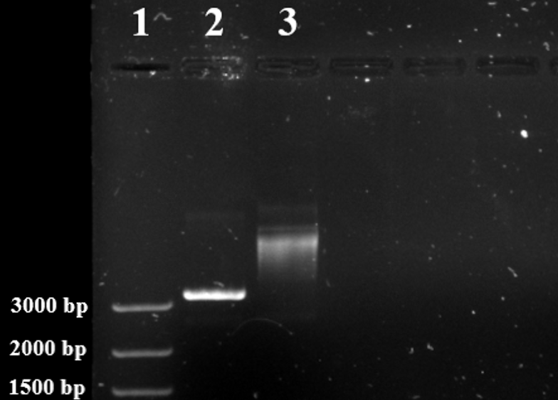

---
output:
  bookdown::pdf_document2:
    fig_caption: yes
    toc: TRUE
    toc_depth: 3
    fontsize: 12pt
    latex_engine: xelatex
bibliography: "Bachelor_quellen.bib"
biblio-style: apalike
citation_package: biblatex
link-citations: yes
urlcolor: RoyalBlue
linkcolor: RoyalBlue
header-includes:
  \usepackage{float}
  \usepackage[ngerman]{babel}
  \usepackage[onehalfspacing]{setspace}
  \usepackage[utf8]{inputenc}
  \usepackage{xcolor}
  
---

```{r setup3, include=FALSE}
knitr::opts_chunk$set(echo = FALSE)

library(kableExtra)
library(ggplot2)
library(ggpubr)
library(tidyverse)
library(scales)
library(latex2exp)


```

# Ergebnisse

Ziel war es ein RT-RPA-System zur Detektion von Influenza A und B Viren zu Entwickeln und zu Optimieren. Dazu wurden Primer- und Sonden-Kombinationen designt und diese in einem Screeningverfahren getestet. Anhand eines Primer-Sonden-Sets erfolgte die Optimierung in den Parametern: Reaktionsvolumen, Reaktionstemperatur und Mischzeitpunkt. Zusätzlich wurde der Effekt einer Primerasymetrie Anhand der Influenza B RT-RPA untersucht und für beide RT-RPA-Systeme optimiert. Die Optimierten RT-RPA-Systeme wurden anschließend auf Sensitivität und Spezifität getestet sowie mit einem entsprechenden RT-PCR-System verglichen.

## Entwicklung und Optimierung der Influenza B RT-RPA

### Herstellung der Influenza B Virus Standrad-RNA

Für den Vergleich zwischen der RT-PCR und der RT-RPA sowie der variierenden Parameter ist es notwendig, standardisierte Virus-RNA mit einer definierten Konzentration herzustellen. Dabei diente ein artifizielles DNA-Plasmid mit der inserierten Virus-Sequenz als Ausgangsmaterial. Dieses wurde in _E. coli_ transformiert, durch Kultivierung vermehrt und anschließend mittels verschiedener Methoden zur Virus-RNA transkribiert.

Zum Beginn der Arbeit war bereits ein mit dem Influenza B Plasmid (Plasmidkarte siehe Anhang \@ref(fig:plasmidB)) transformierter _e. coli_ Stamm vorhanden. Dieser wurde kultiviert und anschließend das Influenza B Plasmid extrahiert (Kapitel \@ref(isolation)). Durch eine anschließende Sanger-Sequenzierung (Kapitel \@ref(sequenzierung)) der Influenza B Virussequenz auf dem extrahierten DNA-Plasmid konnten Sequenzfehler ausgeschlossen werden und die korrekte Virus-Sequenz bestätigt werden. In Vorbereitung, für die _in Vitro_ Transkription wurde das Plasmid durch einen Restriktionsverdau linearisiert und in einem Agarose-Gel auf Überprüft (Kapitel \@ref(verdau)). Das Kontrollgel (siehe Abbildung \@ref(fig:infBverdau)A) weist zwei unterschiedlich große DNA-Banden auf. Das linearisierte Plasmid in Spur 2 zeigt eine Bande bei ~3400 bp, was mit der Plasmidgröße von 3407 bp übereinstimmt (siehe Plasmidkarte \@ref(fig:plasmidB) im Anhang). Das unverdaute Kontrollplasmid in Spur 3 weist eine Bande bei weit über 4000 bp auf. Daraus lässt sich schließen, dass die Linearisierung durch den Restriktionsverdau erfolgreich war. Das linearisierte Plasmid wurde von Puffer und Enzymrückständen befreit (Kapitel \@ref(cleaning)) und über eine _in vitro_ Transkription mithilfe des auf dem Plasmid befindlichen T7-Promotors(Kapitel \@ref(transkription)) in RNA überführt. Die synthetisierte virale RNA wurde im letzten Schritt mit dem RiboGreen Assay (Kapitel \@ref(ribogreen)) quantifiziert. Die Kalibriergerade des RiboGreen Assays ist in Abbildung \@ref(fig:infBverdau)B dargestellt. Es ergab sich eine Geradengleichung von $𝑦 = 22+3,6𝑥$ mit einem Bestimmtheitsmaß R^2^ von 0,99. Mithilfe der Gradengleichung konnte für die synthetisierte RNA eine Konzentration von $476.0 \pm 7, 8$ ng/ml ermittelt und somit eine Kopienanzahl von $2, 2 * 10^8$ RNA-Kopien/µl berechnet werden.

```{r infBverdau, fig.align='center',message = FALSE, fig.cap= "\\textbf{Kontrollgel und Ribogreen Kalibrationsgerade der Influenza B Standardherstellung:} \\textbf{A:} DNA-Banden des Kontrollgels für den Restriktionsverdau des Influenza B Plasmids mit verdautem Plasmid (2), unverdautem Kontrollplasmid (3) und mitgeführter DNA-Leiter (1). Das linearisierte Plasmid läuft bei ca. 3400 bp und somit unter dem mitgeführten ungeschnittenem Kontrollplasmid. Bild ist digital bearbeitet. \\textbf{B:} Kalibrationsgerade des Ribogreen-Assays mit angefügter Geradengleichung, Korrelationskoeffizienten und p-Wert. Das graue Band zeigt das 95 \\%-ige Konfidenzintervall der linearen Funktion. Alle Messungen wurden mit n=4 durchgeführt. ", out.width= "49%", fig.show='hold', fig.scap="Kontrollgel und Ribogreen Kalibrationsgerade der Influenza B Standardherstellung"}




data <- read.csv2("Daten/V_0027.csv")

ggplot(data, aes(konz, fluo)) +
  geom_point() +
  geom_smooth(method = "lm") +
  theme_minimal()+
   ylab("Fluoreszenz")+
   xlab("Konzentration") +  
  stat_cor(label.y = 2700, 
           aes(label = paste(after_stat(rr.label), after_stat(p.label), sep = "~`,`~"))) +
  stat_regline_equation(label.y = 2400)+
  annotate(geom="text", x=10, y=3500, label="B", color="black", size=12)


```

\pagebreak

### Entwicklung der Influenza B RT-RPA Primer und Sonden {#infbprimer}

Für die Influenza B RT-RPA wurden mithilfe der Software PrimedRPA insgesamt 9 verschiedene Primer und 2 Sonden entwickelt. Die Sequenzen sind in Tabelle \@ref(tab:infboligo) mit entsprechenden Modifikationen und der 3´-Position auf der Virus-Sequenz (GenBank Nr.: MT637911) gezeigt. Aus den angegebenen Oligonukleotiden ergeben sich insgesamt 10 Primer-Sonden-Kombinationen. Davon bestehen 2 Kombinationen aus Sonde 1.1 mit Forward 1 und Reverse 1.1 und Reverse 1.2. Die restlichen 8 Kombinationen setzten sich aus Sonde 3.1, Forward 1 oder Forward 2 und Reverse 3.3 - 3.15 zusammen. 


(ref:design) Modifiziert wie in Kapitel \@ref(modifikation) beschrieben.
```{r, infboligo}
RPAoligo <- read.csv2("infB_oligos.csv", header = FALSE)
kable(RPAoligo, booktabs = TRUE, col.names = NULL, format = "latex", escape = FALSE, caption = "Entwickelte Primer und Sonden für die Influenza B RT-RPA") %>%
  add_header_above(c("Name"= 1, "Sequenz (5´->3´)"= 1, "3´-Position"=1, "Modifikation"=1), line_sep=0) %>%
  column_spec(4, width = "1.5in")%>%
  kable_styling(latex_options = "hold_position") %>%
  kable_styling(latex_options = "scale_down") %>%
  footnote( symbol = c("Y=C oder T; 1: Repoterfluorophor; 2: a-basische Seite; 3: Quencher" , "(ref:design)"), symbol_manual = c('*', '**', '***'), fixed_small_size = TRUE, general_title = "Notiz:", escape= FALSE, footnote_as_chunk =TRUE)
```

(ref:etablB) **Primerscreening der entwickelten Influenza B RT-RPA Primer-Sonden-Kombinationen:** Normalisierte Fluoreszenzdaten des Primerscreenings (n=3) für die in Tabelle \@ref(tab:infboligo) angegeben Primer und Sonden. Alle Kombinationen mit Sonde 3.1 sind in **grau** dargestellt. Die Kombinationen mit Sonde 1.2, Foward 1 und Reverse 1.2 ist in **schwarz (- - -)** und die Kombination mit Sonde 1.2, Forward 1 und Reverse 1.1 in **schwarz (**\textbf{\textemdash}**)**  dargestellt. Alle Negativkontrollen sind mit **(**$\cdot - \cdot$**)** gekennzeichnet.

```{r infbscreening, fig.show='hold', message = FALSE, warning=FALSE, results=FALSE, fig.cap="(ref:etablB)", out.width= "70%", fig.align='center', fig.scap="Primerscreening der entwickelten Influenza B RT-RPA Primer-Sonden-Kombinationen."}
data <- read.csv2("daten/infb_primer_screening.csv")

zehn7 <- data %>% 
  select(Zeit, X1071,	X1072,	X1073,	X1074,	X1075,	X1076,	X1077) %>%
  gather(key = "Proben", value = "Fluoreszenz", -Zeit)

zehn6 <- data %>% 
  select(Zeit, X1061,	X1062,	X1063,	X1064,	X1065,	X1066,	X1067) %>%
  gather(key = "Proben", value = "Fluoreszenz", -Zeit)

zehn5 <- data %>% 
  select(Zeit,  X1051,	X1052,	X1053,	X1054,	X1055,	X1056,	X1057) %>%
  gather(key = "Proben", value = "Fluoreszenz", -Zeit)

zehn4 <- data %>% 
  select(Zeit, X1041,	X1042,	X1043,	X1044,	X1045,	X1046,	X1047) %>%
  gather(key = "Proben", value = "Fluoreszenz", -Zeit)

zehn3 <- data %>% 
  select(Zeit, X1031,	X1032,	X1033,	X1034,	X1035,	X1036,	X1037) %>%
  gather(key = "Proben", value = "Fluoreszenz", -Zeit)

zehn2 <- data %>% 
  select(Zeit, X1021,	X1022,	X1023,	X1024,	X1025,	X1026,	X1027) %>%
  gather(key = "Proben", value = "Fluoreszenz", -Zeit)

zehn1 <- data %>% 
  select(Zeit,	X1011,	X1012,	X1013,	X1014,	X1015,	X1016,	X1017) %>%
  gather(key = "Proben", value = "Fluoreszenz", -Zeit)

zehn0 <- data %>% 
  select(Zeit, X1001,	X1002,	X1003,	X1004,	X1005,	X1006,	X1007) %>%
  gather(key = "Proben", value = "Fluoreszenz", -Zeit)

zehnnk <- data %>%
  select(Zeit, nk1,	nk2,	nk3,	nk4,	nk5,	nk6,	nk7,	nk8, nk9) %>%
  gather(key = "Proben", value = "Fluoreszenz", -Zeit)
  
transformed <- rbind(zehn5, zehn4, zehn3, zehn2, zehn1, zehn0)

transformed1 <- rbind(zehn7)

transformed2 <- rbind(zehn6)

transformed3 <- rbind(zehnnk)


ggplot(transformed, aes(x=Zeit, y = Fluoreszenz)) +
  geom_line(aes(color = Proben), linewidth = 0.3) +
  theme_minimal()+
   ylab("Fluoreszenz in mV")+
   xlab("Zeit in Minuten")+
  scale_color_manual(values = c("#000000", "#000000", "#cccccc", "#cccccc", "#cccccc", "#cccccc", "#cccccc", "#cccccc", 
                                "#cccccc", "#cccccc", "#cccccc", "#cccccc", "#cccccc", "#cccccc", "#cccccc", "#cccccc",  
                                "#cccccc", "#cccccc", "#cccccc", "#cccccc", "#cccccc", "#cccccc", "#cccccc",  
                                "#cccccc", "#cccccc", "#cccccc", "#cccccc", "#cccccc", "#cccccc", "#cccccc",  
                                "#cccccc", "#cccccc", "#cccccc", "#cccccc", "#cccccc", "#cccccc", "#cccccc",  
                                "#cccccc", "#cccccc", "#cccccc", "#cccccc", "#cccccc", "#cccccc", "#cccccc",  
                                "#cccccc", "#cccccc", "#cccccc", "#cccccc", "#cccccc", "#cccccc", "#cccccc",  
                                "#000000", "#000000", "#000000", "#000000", "#000000", "#000000", "#000000",
                                 "#000000", "#000000", "#000000", "#000000", "#000000", "#000000", "#000000"))+
  theme(legend.position="none")+
  geom_line(data=transformed1,aes(color = Proben), linetype="solid")+
  geom_line(data=transformed2,aes(color = Proben), linetype="dashed")+
  geom_line(data=transformed3,aes(color = Proben), linetype="dotdash")
  annotate(geom="text", x=11, y=6, label="A", color="black", size=12)
```

Die entwickelten Primer-Sonden-Kombinationen wurden in einem Screening Verfahren mittels RT-RPA auf Amplifikation getestet (Kapitel \@ref(RPAnormal)) um die beste Primer-Sonden-Kombinationen. Die Fluoreszenzdaten sind in Abbildung \@ref(fig:infbscreening) gezeigt. Die Kombinationen mit Sonde 1.1 (schwarz) zeichnen sich durch einen steileren Anstieg und höhere Fluoreszenzwerte im vergleich zu den Kombinationen mit Sonde 3.1 (grau) aus. Des Weiteren lässt sich bei der Kombination mit Reverse 1.1 (schwarz, durchgezogen) ein signifikant niedrigerer Anstieg als bei der Kombination mit Reverse 1.2 (schwarz, gestrichelt) beobachten. Die Mittelwerte der TT-Werte für die jeweiligen Kombinationen liegen bei $3,33 \pm 0,07$ min (Reverse 1.1) und $4,27 \pm 0,07$ min (Reverse 1.2). Die rechnerischen Daten des TT-Wert Vergleichs  sind in Tabelle \@ref(tab:tabeins) im Anhang gezeigt. Die Kombination mit Reverse 1.2 erreicht im Verlauf höhere Fluoreszenzintensitäten, jedoch deutet ein zeitigerer Anstieg, sprich niedrigere TT-Werte, auf eine schnellere Amplifikation. Aus diesem Grund wurde die Kombination mit Reverse 1.1 zusammen und Forward 1 und Sonde 1.1 (schwarz, durchgezogen) als bestmöglich eingestuft und für alle nachfolgenden Versuche \textcolor{red}{Ergebnisse} in diesem Kapitel verwendet.

### Optimierung der Influenza B RT-RPA {#infboptimierung}

**Verringerung des Reaktionsvolumen (low-volume Ansatz)**

Für die Verringerung des Reaktionsvolmens, wurden das in \@ref(infbprimer) entwickelte Primer-Sonden-Set auf den low-volume  Ansatz überführt (siehe \@ref(8telRPA)). Die Fluoreszenzdaten der Messung zusammen mit einer Referenz (50 µl Ansatz) sind in Abbildung \@ref(fig:infBetabl) gezeigt. Es ist zu erkennen, dass die low-volume  RPA (schwarz) im Vergleich zu der 50 µl RPA (grau) im Verlauf der Reaktion an Fluoreszenzintensität verliert. Es konnte kein signifikanter Unterschied der Anstiegszeit zwischen den beiden Reaktionsvolumen festgestellt werden. Die Mittelwerte der TT-Werte liegen bei $3,36 \pm 0.01$ min (50 µl RPA) und $3,47 \pm 0,14$ min (low-volume  RPA). Die rechnerischen Daten des TT-Wert Vergleichs sind in Tabelle \@ref(tab:tabzwei) im Anhang gezeigt.

(ref:infBebasl) **Optimierung des Reaktionsvolumens der Influenza B RT-RPA:** Normalisierte Fluoreszenzdaten der Influenza B RT-RPA im low-volume -Ansatz **(schwarz)** bei 40 °C in n=6 (siehe \@ref(8telRPA)) mit dem in \@ref(infbprimer) entwickeltem Primer-Sonden-Set. Als Virus-RNA wurden 10^7^ RNA-Kopien des hergestellten Standards eingesetzt. Als Referenz wurde der 50 µl Ansatz (**grau**) mit den gleichen Reaktionsparametern in n=3 mitgeführt. Alle Negativkontrollen sind mit **(- - -)** gekennzeichnet.

```{r infBetabl, fig.show='hold',  out.width= "70%", message = FALSE, fig.cap="(ref:infBebasl)", fig.align='center', fig.scap="Optimierung des Reaktionsvolumens der Influenza B RT-RPA"}

data <- read.csv2("daten/V_0041.csv")


transformed <- data %>% 
  select(Zeit, ProbeA, ProbeB, ProbeC, ProbeD, ProbeE, ProbeF, ProbeJ, ProbeK,	ProbeL) %>%
  gather(key = "Proben", value = "Fluoreszenz", -Zeit)

transformed1 <- data %>% 
  select(Zeit, ProbeH, ProbeI, ProbeG) %>%
  gather(key = "Proben", value = "Fluoreszenz", -Zeit)

ggplot(transformed, aes(x=Zeit, y = Fluoreszenz)) +
  geom_line(aes(color = Proben)) +
  theme_minimal()+
   ylab("Fluoreszenz in mV")+
   xlab("Zeit in Minuten") +
   scale_color_manual(values = c("#000000", "#000000", "#000000", "#000000", "#000000", "#000000", "#000000", "#000000",
                                 "#cccccc", "#cccccc", "#cccccc", "#cccccc"))+
  geom_line(data=transformed1,aes(color = Proben), linetype="dashed")+
  theme(legend.position="none")
  
```

\pagebreak

**Optimierung der Reaktionstemperatur**

Die Optimierung der Reaktionstemperatur erfolgte im Temperaturintervall zwischen 38-42 °C (siehe \@ref(optimierungT)). Die Fluoreszenzdaten der Messungen bei den verschiedenen Temperaturen sind in Abbildung \@ref(fig:infbopti)A gezeigt. Die entwickelte Influenza B RT-RPA zeigt bei 38 °C (hellgrau) einen signifikant späteren Anstieg und somit höhere TT-Werte als bei 40 °C (schwarz) oder 42 °C (grau). Zwischen den Messungen bei 40 °C und 42 °C konnte hingegen keine signifikante Änderung des TT-Wertes festgestellt werden. Die Mittelwerte der TT-Werte für die jeweiligen Temperaturen liegen bei $5,26 \pm 0,06$ min (38 °C), $3,57 \pm 0,20$ min (40 °C) und $3,63 \pm 0,13$ min (42 °C). Die rechnerischen Daten des TT-Wert Vergleichs sind in Tabelle \@ref(tab:tabdrei) im Anhang gezeigt. Zusätzlich besitzt die Reaktion bei 40 °C im Durschnitt die höchste maximale Fluoreszenzintesität am Ende der Messung. Aus diesen Gründen wurde eine Reaktionstemperatur von 40 °C als Optimal festgelegt. Des Weiteren ist bei der Messung bei 42 °C eine Abnahme der Fluoreszenz im späteren Verlauf der Reaktion (~13 min) zu beobachten. Ebenfalls zeigt die Messung bei 40 °C bei 4 von 7 Reaktionen eine Fluoreszenzabnahme, die setzt jedoch später bei ~16 min ein. Dieses Phänomen wird in der weiteren Arbeit als "Ditching" bezeichnet.

**Einführung einer Reverse-Primer Asymetrie**

Das Einführen einer Primer-Asymetrie sowie die Optimierung dieser wurde anhand des Reverse Primers wie in \@ref(optimierungP) beschrieben durchgeführt. Die Fluoreszenzdaten der variierenden Primer-Konzentrationen sind in Abbildung \@ref(fig:infbopti)B gezeigt. Es ist zu erkennen, dass eine asymetrisch erhöhte reverse Primer-Konzentration mit einer erhöhten Fluoreszenzintensität im Vergleich zu der Referenz (keine Veränderte Reverse Primer-Konzentration, hellgrau) einhergeht. Eine signifikante Veränderung des TT-Wertes konnte nicht beobachtet werden. Die Mittelwerte der TT-Werte der einzelnen Parameter liegen bei $3,39 \pm 0,07$ min (Referenz), $3,43 \pm 0,07$ min (1,5 -fach Reverse Primer-Konzentration) und $3,63 \pm 0,13$ min (2 -fach Reverse Primer-Konzentration). Die mit dem roten Pfeil markierte Amplifikation konnte über den TT-Wert als Ausreißer identifiziert werden und wurde nicht weiter berücksichtigt. Die rechnerischen Daten des TT-Wert Vergleichs sind in Tabelle \@ref(tab:tabvier) im Anhang gezeigt. Weiterhin lässt sich erkennen, dass bei einer doppelten Reverse Primer-Konzentration (grau) der Ditching-Effekt nach ~12 min bei 4/6 Reaktionen einsetzt. Um diesen Effekt während der Messung zu vermeiden wurde eine reverse Primer-Konzentration von 1,5 -fach (schwarz) als optimal festgelegt. 

(ref:infboptimierung) **Optimierung der Reaktionstemperatur und der Primerasymetrie**: Normalisierte Fluoreszenzdaten der Influenza B RT-RPA im low-volume -Ansatz. **A:** Optimierung der Reaktionstemperatur bei 38 °C (hellgrau), 40 °C (schwarz) und 42 °C (grau). Messung in n=6 pro Temperatur. Negativkontrollen sind mit **(- - -)** gekennzeichnet. **B:** Optimierung der Primerasymetrie mit 1,5 -fach erhöhter Reverse Primer-Konzentration (schwarz) und 2 -fach erhöhter Reverse Primer-Konzentration (grau) sowie mitgeführter Referenz (hellgrau, 1X Primer-Konzentration). Messung in n=6 pro Konzentration. Ausreißer sind mit einem roten Pfeil markiert. Negativkontrollen sind mit **(- - -)** gekennzeichnet.  

```{r infbopti,  fig.show='hold', message = FALSE, warning=FALSE, results=FALSE, fig.cap="(ref:infboptimierung)", out.width= "49%", fig.align='center', fig.scap="Optimierung der Reaktionstemperatur und der Primerassymetrie."}
data1 <- read.csv2("daten/V_0045_ges.csv")


transformed <- data1 %>% 
  select(Zeit, ProbeA, ProbeB, ProbeC, ProbeD, ProbeE, ProbeF, ProbeH, ProbeI,	ProbeJ, ProbeK,	ProbeL,	ProbeM,	ProbeO,	ProbeP,	ProbeR,	ProbeS,	ProbeT) %>%
  gather(key = "Proben", value = "Fluoreszenz", -Zeit)

transformed1 <- data1 %>%
  select(Zeit,ProbeG, ProbeN,	ProbeQ, ProbeU) %>%
   gather(key = "Proben", value = "Fluoreszenz", -Zeit)

ggplot(transformed, aes(x=Zeit, y = Fluoreszenz)) +
  geom_line(aes(color = Proben)) +
  theme_minimal()+
   ylab("Fluoreszenz in mV")+
   xlab("Zeit in Minuten") +
   scale_color_manual(values = c("#000000", "#000000", "#000000", "#000000", "#000000", "#000000", "#000000",
                                 "#adb5bd", "#adb5bd", "#adb5bd", "#adb5bd", "#adb5bd", "#adb5bd", "#adb5bd",
                                 "#e9ecef", "#e9ecef", "#e9ecef", "#e9ecef", "#e9ecef", "#e9ecef", "#e9ecef"))+
  theme(legend.position="none")+
  geom_line(data=transformed1,aes(color = Proben), linetype="dashed")+
  annotate("text", x=2, y=500, label= "A",col="black", size=12)

data2 <- read.csv2("daten/V_0056.csv")


transformed <- data2 %>% 
  select(Zeit, ProbeA, ProbeB, ProbeC, ProbeD, ProbeE, ProbeF, ProbeI,	ProbeJ, ProbeK,	ProbeL,	ProbeM, ProbeN,	ProbeQ,	ProbeR,	ProbeS,	ProbeT,	ProbeU, ProbeV) %>%
  gather(key = "Proben", value = "Fluoreszenz", -Zeit)

transformed2 <- data2 %>%
  select(Zeit,ProbeG, ProbeH, ProbeO,	ProbeP, ProbeW, ProbeX) %>%
   gather(key = "Proben", value = "Fluoreszenz", -Zeit)

ggplot(transformed, aes(x=Zeit, y = Fluoreszenz)) +
  geom_line(aes(color = Proben)) +
  theme_minimal()+
   ylab("Fluoreszenz in mV")+
   xlab("Zeit in Minuten") +
   scale_color_manual(values = c("#e9ecef", "#e9ecef", "#e9ecef", "#e9ecef", "#e9ecef", "#e9ecef", "#e9ecef", "#e9ecef",
                                 "#000000", "#000000", "#000000", "#000000", "#000000", "#000000", "#000000", "#000000",
                                 "#adb5bd", "#adb5bd", "#adb5bd", "#adb5bd", "#adb5bd", "#adb5bd", "#adb5bd", "#adb5bd"))+
  theme(legend.position="none")+
  geom_line(data=transformed2,aes(color = Proben), linetype="dashed")+
  annotate("text", x=2, y=700, label= "B",col="black", size=12)+
  geom_segment(aes(x = 6.5, y = 45, xend = 5, yend = 50), linejoin = "round", size = 1.2, colour = "red",
                  arrow = arrow(length = unit(0.3, "cm")))


```

**Optminierung der Mischzeit**

Wie in \@ref(rpa) beschrieben kann ein zusätzlicher Mischschritt während der Reaktion zu einer erhöhten Amplifikation und somit zu einer besseren Detektion führen. Um den zusätzlichen Mischschritt für die Influenza B RT-RPA zu optimieren wurden jeweils Mischzeitpunkte nach 3 min, 4 min und 5 min untersucht (siehe \@ref(optimischen)). Die Fluoreszenzdaten sind in Abbildung \@ref(fig:infboptimisch)A dargestellt. Es ist zu erkennen, dass der Mischschritt nach drei Minuten (grau, durchgezogen) im Vergleich zu der Referenz (schwarz, durchgezogen) ohne Mischen zu signifikant höheren TT-Werten führt. Die TT-Werte liegen hier bei $5,90 \pm 0,19$ min (Referenz) und $7,21 \pm 0,70$ min (Mischen nach 3 min). Weiterhin weist der Anstieg der Reaktion im Vergleich zu Referenz mehr Linearität auf und verliert größtenteils die typische sigmoidale Kurvenform. Die Mischzeiten nach vier Minuten (grau, gestrichelt) und fünf Minuten (schwarz, gestrichelt) besitzen untereinander keine signifikant unterschiedlichen TT-werte, weisen jedoch mit zusammengefasst $5,04 \pm 0,19$ min eine signifikante Differenz zur Referenz auf. Die rechnerischen Daten des TT-Wert Vergleichs sowie die einzelnen Mittelwerte der TT-Werte sind in Tabelle \@ref(tab:tabfunf) im Anhang gezeigt. Wird der Mischzeitpunkt nach fünf Minuten betrachtet, besitzt dieser zusammen mit der Referenz die höchste Fluoreszenzintensität am Ende der Messung und im Vergleich zu dem Mischzeitpunk nach vier Minuten den steilsten Anstieg der Fluoreszenz während der Messung. Aus diesem Gründen wurde der Mischzeitpunkt nach 5 Minuten als Optimal festgelegt.  
Damit der Effekt des Mischens bei niedriger Konzentration untersucht werden kann, wurden RT-RPA's mit einem Mischschritt nach fünf Minuten bei eingesetzten RNA-Konzentration von 10^2^ Kopien/µl (siehe Abbildung \@ref(fig:infboptimisch)B) und 10^1^ Kopien/µl (siehe Abbildung \@ref(fig:infboptimisch)C) durchgeführt (siehe \@ref(optimischen)). Bei 10^2^ Kopien/µl besitzen die Reaktionen mit einem Mischschritt (schwarz) signifikant niedrigere TT-werte ($6,53 \pm 0,25$ min) als die Referenz (grau) ohne zusätzlichen Mischschritt ($7,35 \pm 0,58$ min). Die rechnerischen Daten des TT-Wert vergleichs sind in Tabelle \@ref(tab:tabsechs) im Anhang gezeigt. Des Weiteren ist bei der Messung mit Mischschritt ein Ditching nach ~16 Minuten bei 6 von 7 Reaktionen zu beobachten.  
Bei dem Versuch mit 10^1^ Kopien/µl ist bei der Messung mit Mischschritt (schwarz) eine deutlich erhöhte Fluoreszenzintensität im Vergleich zu der Referenz (grau) ohne Mischen zu erkennen. Hier zeigt sich klar ein positiver Effekt des des Mischen auf die RT-RPA. Der eingeführte Mischschritt erhöht die Sensitivität der Reaktion von 3 von 7 positiv (Referenz) auf 7 von 7 Positiv.
Da alle Messungen der Mischzeit im low-volume Ansatz durchgeführt wurden, wurde der Einfluss des Mischschrittes nach 5 min im 50 µl Ansatz untersucht. 

Zusammengefasst lassen sich für die Influenza B RT-RPA eine Reaktionstemperatur von 40 °C, eine 1,5 -fach asymetrisch erhöhte reverse Primer-Konzentration und ein zusätzlicher Mischschritt nach fünf Minuten als optimal festlegen.

(ref:infbmischenas) **Optimierung der Mischzeit für die Influenza B RT-RPA:** Normalisierte Fluoreszenzdaten der Optimierung des zusätzlichen Mischschrittes während der Messung. **A**: RT-RPA mit einem zusätzlichen Mischschritt nach 3 min (grau, durchgezogen), 4 min (grau, gestrichelt), 5 min (schwarz gestrichelt) sowie der Referenz ohne Mischen (schwarz, durchgezogen) bei einer eingesetzten RNA-Konzentration von 10^3^ Kopien/µl. Ausreißer sind mit einem roten Pfeil markiert. Alle Messungen wurden in n=6 durchgeführt. Negativkontrollen sind mit **(**$\cdot - \cdot$**)** dargestellt. **B** Vergleich zwischen der Influenza B RT-RPA mit einem zusätzlichen Mischschrittes nach 5 min (schwarz) und einer RT-RPA ohne zusätzliches Mischen (grau) bei eingesetzten 10^2^ RNA-Kopien/µl. Messung in n=7 durchgeführt. Negativkontrollen sind mit **(- - -)** gekennzeichnet. **C**: Vergleich zwischen der Influenza B RT-RPA mit einem zusätzlichen Mischschrittes nach 5 min (schwarz) und einer RT-RPA ohne zusätzliches Mischen (grau) bei eingesetzten 10^1^ RNA-Kopien/µl. Messung in n=6 durchgeführt. Negativkontrollen sind mit **(- - -)** gekennzeichnet. 
 
```{r infboptimisch, fig.show='hold', message = FALSE, warning=FALSE, results=FALSE, fig.cap="(ref:infbmischenas)", out.width= "49%", fig.align='center', fig.scap="Optimierung der Mischzeit für die Influenza B RT-RPA."}
data <- read.csv2("Daten/infB_mischung.csv")


transformed <- data %>% 
  select(Zeit, ProbeA, ProbeB, ProbeC, ProbeD, ProbeE, ProbeF, ProbeG, ProbeH, ProbeQ,	ProbeR, ProbeS,	ProbeT,	ProbeU, ProbeV,	ProbeW,	ProbeX) %>%
  gather(key = "Proben", value = "Fluoreszenz", -Zeit)

transformed1 <- data %>% 
  select(Zeit, ProbeI,	ProbeJ, ProbeK,	ProbeL,	ProbeM, ProbeN,	ProbeO,	ProbeP) %>%
  gather(key = "Proben", value = "Fluoreszenz", -Zeit)

transformed3 <- data %>% 
  select(Zeit, Probe17,	Probe18,	Probe19,	Probe20,	Probe21,	Probe22,	Probe23,	Probe24) %>%
  gather(key = "Proben", value = "Fluoreszenz", -Zeit)

transformed2 <- data %>% 
  select(Zeit, nk1, nk2, nk3, nk4, nk5, nk6, nk7, nk8) %>%
  gather(key = "Proben", value = "Fluoreszenz", -Zeit)

ggplot(transformed, aes(x=Zeit, y = Fluoreszenz)) +
  geom_line(aes(color = Proben)) +
  theme_minimal()+
   ylab("Fluoreszenz in mV")+
   xlab("Zeit in Minuten") +
   scale_color_manual(values = c("#000000", "#000000", "#000000", "#000000", "#cccccc", "#cccccc", "#cccccc", "#cccccc",
                                 "#000000", "#000000", "#000000", "#000000", "#000000", "#000000", "#000000", "#000000",
                                 "#000000", "#000000", "#000000", "#000000", "#000000", "#000000", "#000000", "#000000",
                                 "#cccccc", "#cccccc", "#cccccc", "#cccccc", "#cccccc", "#cccccc", "#cccccc", "#cccccc",
                                 "#cccccc", "#cccccc", "#cccccc", "#cccccc", "#cccccc", "#cccccc", "#cccccc", "#cccccc"))+
  geom_line(data=transformed1,aes(color = Proben), linetype="dashed")+
  geom_line(data=transformed3,aes(color = Proben), linetype="dashed")+
  geom_line(data=transformed2,aes(color = Proben), linetype="dotdash")+
  theme(legend.position="none")+
geom_segment(aes(x = 17, y = 130, xend = 17.5, yend = 100), linejoin = "round", size = 1.2, colour = "red",
                  arrow = arrow(length = unit(0.3, "cm")))+
geom_segment(aes(x = 19, y = 80, xend = 18.5, yend = 50), linejoin = "round", size = 1.2, colour = "red",
                  arrow = arrow(length = unit(0.3, "cm")))+
   annotate("text", x=2, y=400, label= "A",col="black", size=12)


data1 <- read.csv2("Daten/V_0063.csv")


transformed <- data1 %>% 
  select(Zeit, ProbeB, ProbeC, ProbeD, ProbeE, ProbeF, ProbeG, ProbeH, ProbeI, ProbeJ, ProbeK,	ProbeL,	ProbeM, ProbeN, ProbeO) %>%
  gather(key = "Proben", value = "Fluoreszenz", -Zeit)

transformed1 <- data1 %>%
  select(Zeit, ProbeP,	ProbeA) %>%
   gather(key = "Proben", value = "Fluoreszenz", -Zeit)

ggplot(transformed, aes(x=Zeit, y = Fluoreszenz)) +
  geom_line(aes(color = Proben)) +
  theme_minimal()+
   ylab("Fluoreszenz in mV")+
   xlab("Zeit in Minuten") +
   scale_color_manual(values = c("#cccccc", "#cccccc", "#cccccc", "#cccccc", "#cccccc", "#cccccc", "#cccccc", "#cccccc",
                                 "#000000", "#000000", "#000000", "#000000", "#000000", "#000000", "#000000", "#000000"))+
  geom_line(data=transformed1,aes(color = Proben), linetype="dashed")+
  annotate("text", x=2, y=400, label= "B",col="black", size=12)+
  theme(legend.position="none")


data2 <- read.csv2("Daten/V_0064.csv")


transformed <- data2 %>% 
  select(Zeit, ProbeB, ProbeC, ProbeD, ProbeE, ProbeF, ProbeG, ProbeH, ProbeI, ProbeJ, ProbeK,	ProbeL,	ProbeM, ProbeN, ProbeO) %>%
  gather(key = "Proben", value = "Fluoreszenz", -Zeit)

transformed1 <- data1 %>%
  select(Zeit, ProbeP,	ProbeA) %>%
   gather(key = "Proben", value = "Fluoreszenz", -Zeit)

ggplot(transformed, aes(x=Zeit, y = Fluoreszenz)) +
  geom_line(aes(color = Proben)) +
  theme_minimal()+
   ylab("Fluoreszenz in mV")+
   xlab("Zeit in Minuten") +
   scale_color_manual(values = c("#cccccc", "#cccccc", "#cccccc", "#cccccc", "#cccccc", "#cccccc", "#cccccc", "#cccccc",
                                 "#000000", "#000000", "#000000", "#000000", "#000000", "#000000", "#000000", "#000000"))+
  geom_line(data=transformed1,aes(color = Proben), linetype="dashed")+
  annotate("text", x=2, y=400, label= "C",col="black", size=12)+
  theme(legend.position="none")


  
```


### Einfluss der Primerassymetrie auf die RT-RPA {#infbassymet}

Wie in \@ref(infboptimierung) gezeigt wurde, führt eine asymetrische Erhöhung des Reverse Primers zu einer Erhöhung des Fluoreszenzsignals. Um den Einfluss der generellen Primer-Konzentration auf die RPA zu untersuchen, wurde eine RT-RPA mit doppelter forward und reverse Primer-Konzentration (siehe \@ref(assymetrie)) durchgeführt. Die Fluoreszenzdaten sind in Abbildung \@ref(fig:assymetriy)A dargestellt. Es ist zu erkennen, dass eine generelle Erhöhung von Forward und Reverse Primer (grau) wieder zu einer niedrigeren Fluoreszenzintensität im Vergleich zu einer asymetrischen Reverse Primer-Konzentration (schwarz) führt. Eine signifikante Veränderung der TT-Werte konnte nicht ermittelt werden. So liegen die TT-Werte für die Messung mit 2 -fach-Reverse Primer bei $3,40 \pm 0,14$ min und bei der Messung mit doppelter Primer-Konzentration bei $3,48 \pm 0,21$ min. Die markierte Amplifikationskurve (roter Pfeil) konnte als Ausreißer identifiziert werden und wurde in der Berechnung nicht berücksichtigt. Die rechnerischen Daten des TT-Wert Vergleichs sind in Tabelle \@ref(tab:tabzwelf) im Anhang gezeigt.  
Eine Vermutung war, dass die Hybridisation der Sonde an den Sense oder Anti-Sense Strang den DNA in Verbindung mit der Primer-Asymetrie und der daraus resultierenden erhöhten Fluoreszenzintensität steht. Um dies zu überprüfen wurde eine erneute Messreihe mit einer am entgegengesetzten Strang hybridisierenden Sonde durchgeführt (siehe \@ref(assymetrie)). Die Fluoreszenzdaten der Messungen sind in Abbildung \@ref(fig:assymetriy)B gezeigt. Es ist zu erkennen, dass hier die erhöhte Reverse Primer-Konzentration (hellgrau) die niedrigste Fluoreszenz im Vergleich zur Referenz (grau) und der erhöhten Forward Primer-Konzentration (schwarz) zeigt. Die asymerisch erhöhte Forward Primer-Konzentration zeigt hingegen die höchsten Fluoreszenzwerte und dementsprechend die beste Signalgenerierung. Des Weiteren besitzt die erhöhte Forward Primer-Konzentration signifikant niedrigere TT-Werte mit $3,25 \pm 0,05$ min als die Referenz ($3,63 \pm 0,19$ min) und die erhöhte reverse Primer-Konzentration ($3,76 \pm 0,34$). \textcolor{red}{Daraus resultierend besteht ein Zusammenhang zwischen der Hybridisierungsposition der Sonde und der Primerassymetrie.} Die rechnerischen Daten des TT-Wert Vergleichs sind in Tabelle \@ref(tab:tabdreizehn) im Anhang dargestellt.


(ref:assymetry) **Einfluss der Primerasymetrie auf der RT-RPA:** Normalisierte Fluoreszenzdaten der Influenza B RT-RPA. **A**: Einfluss einer generellen Primer-Konzentrationserhöhung auf die Influenza B RT-RPA. Die doppelte Primer-Konzentration (jeweils 42 µM im PSM, siehe \@ref(8telRPA)) ist in Grau dargestellt, während die asymetrische Erhöhung des Reverse Primer als Vergleich in schwarz mitgeführt ist. Alle Messungen wurden in mindestens n=6 durchgeführt. Über den TT-Wert konnte die markierte Amplifikation (roter Pfeil) als Ausreißer identifiziert werden. Negativkontrollen sind mit **(- - -)** gekennzeichnet. **B**: Messung der Influenza B RT-RPA bei asymetrisch erhöhter Reverse (hellgrau) und forward (schwarz) Primer-Konzentration mit der in \@ref(assymetrie) angegebenen Sonde. Als Referenz (grau) wurde eine RT-RPA mit normaler Primer-Konzentration mitgeführt. Alle Messungen wurden in n=7 durchgeführt. Negativkontrollen sind mit **(- - -)** gekennzeichnet.


```{r assymetriy,  fig.show='hold', message = FALSE, warning=FALSE, results=FALSE, fig.cap="(ref:assymetry)", out.width= "49%", fig.align='center', fig.scap="Einfluss der Primerassymetrie auf der RT-RPA"}
data1 <- read.csv2("Daten/V_0065.vergleich.csv")


transformed <- data1 %>% 
  select(Zeit, ProbeA, ProbeB, ProbeC, ProbeD, ProbeE, ProbeF, ProbeG, ProbeI,	ProbeJ, ProbeK,	ProbeL,	ProbeM, ProbeN) %>%
  gather(key = "Proben", value = "Fluoreszenz", -Zeit)

transformed1 <- data1 %>%
  select(Zeit,ProbeH,	ProbeO, ProbeP) %>%
   gather(key = "Proben", value = "Fluoreszenz", -Zeit)

ggplot(transformed, aes(x=Zeit, y = Fluoreszenz)) +
  geom_line(aes(color = Proben)) +
  theme_minimal()+
   ylab("Fluoreszenz in mV")+
   xlab("Zeit in Minuten") +
   scale_color_manual(values = c("#000000", "#000000", "#000000", "#000000", "#000000", "#000000", "#000000", "#000000",
                                 "#cccccc", "#cccccc", "#cccccc", "#cccccc", "#cccccc", "#cccccc", "#cccccc", "#cccccc"))+
  theme(legend.position="none")+
  geom_line(data=transformed1,aes(color = Proben), linetype="dashed")+
  annotate("text", x=2, y=530, label= "A",col="black", size=12)+
  geom_segment(aes(x = 14, y = 150, xend = 13, yend = 180), linejoin = "round", size = 1.2, colour = "red",
                  arrow = arrow(length = unit(0.5, "cm")))

data2 <- read.csv2("daten/V_0068.csv")


transformed <- data2 %>% 
  select(Zeit, ProbeA, ProbeB, ProbeC, ProbeD, ProbeE, ProbeF,ProbeG, ProbeI,	ProbeJ, ProbeK,	ProbeL,	ProbeM, ProbeN, ProbeO,	ProbeQ,	ProbeR,	ProbeS,	ProbeT,	ProbeU, ProbeV, ProbeW) %>%
  gather(key = "Proben", value = "Fluoreszenz", -Zeit)

transformed2 <- data2 %>%
  select(Zeit, ProbeH, 	ProbeP, ProbeX) %>%
   gather(key = "Proben", value = "Fluoreszenz", -Zeit)

ggplot(transformed, aes(x=Zeit, y = Fluoreszenz)) +
  geom_line(aes(color = Proben)) +
  theme_minimal()+
   ylab("Fluoreszenz in mV")+
   xlab("Zeit in Minuten") +
   scale_color_manual(values = c("#adb5bd", "#adb5bd", "#adb5bd", "#adb5bd", "#adb5bd", "#adb5bd", "#adb5bd", "#adb5bd",
                                 "#e9ecef", "#e9ecef", "#e9ecef", "#e9ecef", "#e9ecef", "#e9ecef", "#e9ecef", "#e9ecef",
                                 "#000000", "#000000", "#000000", "#000000", "#000000", "#000000", "#000000", "#000000"))+
  theme(legend.position="none")+
  geom_line(data=transformed2,aes(color = Proben), linetype="dashed")+
  annotate("text", x=2, y=450, label= "B",col="black", size=12)
  


```


### Ermittlung der Sensitivität der Influenza B RT-RPA {#infbsense}

Die Ermittlung der Sensitivität für die Influenza B RT-RPA erfolgte mit den im Kapitel \@ref(infboptimierung) ermittelten optimalen Reaktionsparametern nach beschriebener Methode (siehe \@ref(sensitivitat)). Die Fluoreszenzdaten der Sensitivitätsmessung sowie das mithilfe der Probit-Analyse (siehe \@ref(probit)) ermittelte Detektionslimit sind in Abbildung \@ref(fig:infbsensi) gezeigt. Für die Influenza B RT-RPA konnte berechnet werden, dass das System mit einer 95 %igen Wahrscheinlichkeit 31,6 Virus RNA-Kopien detektieren kann. Des Weiteren konnte eine Kalibriergerade für die TT-Werte im Zusammenhang mit der Reaktionszeit mit einem R^2^ = 0,93 und einer Geradengleichung von $y=11 - 1,3x$ ermittelt werden. Der angegebene p-Wert ist <<0,05 was einen signifikanten linearen Zusammenhang aussagt.  
Zusätzlich wurde die Sensitivität für den low-volume Ansatz der Influenza B RT-RPA mit den gleichen Reaktionsparametern ermittelt und ein Vergleich zu dem 50µl Ansatz gezogen. Die Messung erfolgte nach der beschriebenen Methode (siehe \@ref(sensitivitat)). Es konnte eine Detektionslimit von 14,6 Kopien ermittelt werden. Die erstellte Kalibriergerade für die TT-Werte im Zusammenhang mit der Reaktionszeit besitzt ein R^2^ von 0,92 und eine Geradengleichung von $y=9,4 - 0,95x$. Die über den Boxplot-Test (siehe \@ref(tt-wert)) ermittelten Ausreißer der TT-Werte (siehe rote Pfeile in \@ref(fig:infbsensi)B) wurden innerhalb der Kalibriergerade nicht berücksichtigt. Der angegebene p-Wert ist ebenfalls <<0,05 was einen signifikanten linearen Zusammenhang aussagt. Für die RT-RPA im low-volume Ansatz konnte eine Verbesserung des Detektionslimits um 15 Kopien beziehungsweise 54 % nachgewiesen werden.   
Damit ein Vergleich zur PCR als Standardmethode in der Diagnostik herangezogen werden kann wurde die in \@ref(rtpcr) beschriebene RT-PCR für das Influenza B Virus auf die Sensitivität getestet (Kapitel \@ref(sensitivitat)). Das Detektionslimit der RT-PCR liegt bei 11,4 Kopien. Somit liegt die Detektionsgrenze des PCR-Systems 22 %  bzw. 3,2 Kopien unter der optimierten RPA im low-volume Ansatz. Da sowohl die RPA als auch die PCR mit dem artifiziellen RNA-Standard, jedoch nicht mit realen Patientenproben getestet wurden, kann das ermittelte Detektionslimit nicht auf Patientenproben angewendet werden. Um eine eventuelle Veränderung des Detektionslimits mit klinischen Proben zu untersuchen wurden simulierte Kontrollproben (extrahierte humane RNA mit zugesetztem RNA-Standard) erstellt (Kapitel \@ref(klinischeproben)) und mit diesen eine erneute Sensitivitätsanalyse im low-volume Ansatz durchgeführt (Kapitel \@ref(sensitivitat)). Zusätzlich zu der Negativkontrolle wurde eine Kontrollprobe ohne zugesetzte virale RNA mitgeführt, um auf unspezifische Reaktionen zu kontrollieren. Innerhalb der Kontrollproben konnten alle Proben mit einer RNA-Konzentration von 10^3^ Kopien/µl detektiert werden, jedoch keine der Proben mit 10^2^ RNA-Kopien. Dementsprechend liegt das Detektionslimit bei 1397 Kopien. Eine Kreuzreaktivität mit dem humanen RNA-Probenhintergrund konnte nicht festgestellt werden.


Zur besseren Übersichtlichkeit ist der Vergleich der verschiedenen ermittelten Sensitivitäten in Tabelle \@ref(tab:infbsensver) dargestellt.

```{r, infbsensver}

achtRPA <- read.csv2("infBsensi_vergleich.csv", header = FALSE, fileEncoding="latin1")

kable(achtRPA, booktabs = TRUE, col.names = NULL, caption = "Vergleich der verschiedenen Sensitivitätsmessungen der Influenza B RT-RPA") %>%
  kable_styling(latex_options = "hold_position") %>%
  add_header_above(c("Messung"= 1, "Ermitteltes Detektionslimit"= 1), line_sep=0)

```


\definecolor{d73027}{HTML}{d73027}
\definecolor{f46d43}{HTML}{f46d43}
\definecolor{fdae61}{HTML}{fdae61}
\definecolor{fee090}{HTML}{fee090}
\definecolor{abd9e9}{HTML}{abd9e9}
\definecolor{74add1}{HTML}{74add1}
\definecolor{4575b4}{HTML}{4575b4}
\definecolor{333388}{HTML}{333388}
\definecolor{313695}{HTML}{313695}


(ref:infosensi) **Sensitivitätsanalyse der Influenza B RT-RPA**: **A,B:** Normalisierte Fluoreszenzdaten der Sensitivitätsmessung in einer dekadischen Verdünnungsreihe mit \textcolor{313695}{$10^7$}, \textcolor{333388}{$10^6$}, \textcolor{4575b4}{$10^5$}, \textcolor{74add1}{$10^4$}, \textcolor{abd9e9}{$10^3$}, \textcolor{fee090}{$10^2$}, \textcolor{fdae61}{$10^1$} und \textcolor{f46d43}{$10^0$} RNA-Kopien pro Messung sowie \textcolor{d73027}{Negativkontrollen} für den 50 µl Ansatz (A) und den low-volume Ansatz (B). Jede Verdünnung wurde mit mindestens n=3 (50 µl Ansatz) bzw. n=7 (low-volume Ansatz) gemessen. Ausreißer des low-volume Ansatzes bei $10^7$ und $10^4$ (roter Pfeil) wurden in der Auswertung nicht berücksichtigt. **C,D:** Probit-Analyse der Amplifikationsdaten für den 50 µl Ansatz (C) und den low-volume Ansatz (D). Die schwarz durchgezogene Linie zeigt, die Probit-Regression der RT-RPA. Die schwarzen gestreiften Linien beschreiben das oberer und untere Konfidenzintervall der Probit-Regression. Die rot gestreifte Linie zeigt die ermittelte Sensitivitätsgrenze, bei welcher 95 % der Amplifikationen positiv sind. **E,F:** Linearer Zusammenhang der Ct-Werte über die Konzentration mit angefügter Geradengleichung, Bestimmtheitsmaß und p-Wert für den 50 µl Ansatz (E) und den low-volume Ansatz (F). Das graue Band zeigt das 95 %-ige Konfidenzintervall der linearen Funktion. Ct-Werte der Ausreißer sowie von negativen Amplifikationen wurden vernachlässigt und sind nicht dargestellt. 


```{r infbsensi,  fig.show='hold', message = FALSE, warning=FALSE, results=FALSE, fig.cap="(ref:infosensi)", out.width= "49%", fig.align='center', fig.scap="Etablierung der Influenza B RPA im Original- und low-volume -Ansatz."}


data <- read.csv2("daten/V_0080.probit1.csv")

zehn7 <- data %>% 
  select(Zeit, X1071,	X1072,	X1073,	X1074,	X1075,	X1076,	X1077) %>%
  gather(key = "Proben", value = "Fluoreszenz", -Zeit)

zehn6 <- data %>% 
  select(Zeit, X1061,	X1062,	X1063,	X1064,	X1065,	X1066,	X1067) %>%
  gather(key = "Proben", value = "Fluoreszenz", -Zeit)

zehn5 <- data %>% 
  select(Zeit,  X1051,	X1052,	X1053,	X1054,	X1055,	X1056,	X1057) %>%
  gather(key = "Proben", value = "Fluoreszenz", -Zeit)

zehn4 <- data %>% 
  select(Zeit, X1041,	X1042,	X1043,	X1044,	X1045,	X1046,	X1047) %>%
  gather(key = "Proben", value = "Fluoreszenz", -Zeit)

zehn3 <- data %>% 
  select(Zeit, X1031,	X1032,	X1033,	X1034,	X1035,	X1036,	X1037) %>%
  gather(key = "Proben", value = "Fluoreszenz", -Zeit)

zehn2 <- data %>% 
  select(Zeit, X1021,	X1022,	X1023,	X1024,	X1025,	X1026,	X1027) %>%
  gather(key = "Proben", value = "Fluoreszenz", -Zeit)

zehn1 <- data %>% 
  select(Zeit,	X1011,	X1012,	X1013,	X1014,	X1015,	X1016,	X1017) %>%
  gather(key = "Proben", value = "Fluoreszenz", -Zeit)

zehn0 <- data %>% 
  select(Zeit, X1001,	X1002,	X1003,	X1004,	X1005,	X1006,	X1007) %>%
  gather(key = "Proben", value = "Fluoreszenz", -Zeit)

zehnnk <- data %>%
  select(Zeit, nk1,	nk2,	nk3,	nk4,	nk5,	nk6,	nk7,	nk8) %>%
  gather(key = "Proben", value = "Fluoreszenz", -Zeit)
  
transformed <- rbind(zehn7, zehn6, zehn5, zehn4, zehn3, zehn2, zehn1, zehn0, zehnnk)


ggplot(transformed, aes(x=Zeit, y = Fluoreszenz)) +
  geom_line(aes(color = Proben), size = 0.3) +
  theme_minimal()+
   ylab("Fluoreszenz in mV")+
   xlab("Zeit in min")+
  scale_color_manual(values = c("#d73027", "#d73027", "#d73027", "#d73027", "#d73027", "#d73027", "#d73027", "#d73027", 
                                "#f46d43", "#f46d43", "#f46d43", "#f46d43", "#f46d43", "#f46d43", "#f46d43",  
                                "#fdae61", "#fdae61", "#fdae61", "#fdae61", "#fdae61", "#fdae61", "#fdae61",  
                                "#fee090", "#fee090", "#fee090", "#fee090", "#fee090", "#fee090", "#fee090",
                                "#abd9e9", "#abd9e9", "#abd9e9", "#abd9e9", "#abd9e9", "#abd9e9", "#abd9e9",  
                                "#74add1", "#74add1", "#74add1", "#74add1", "#74add1", "#74add1", "#74add1",  
                                "#4575b4", "#4575b4", "#4575b4", "#4575b4", "#4575b4", "#4575b4", "#4575b4",
                                "#333388", "#333388", "#333388", "#333388", "#333388", "#333388", "#333388",
                                "#313695", "#313695", "#313695", "#313695", "#313695", "#313695", "#313695"))+
  theme(legend.position="none")+
  annotate("text", x=2, y=900, label= "B",col="black", size=12)


data <- read.csv2("daten/V_0062.probit2.csv")

zehn7 <- data %>% 
  select(Zeit, X1071,	X1072,	X1073,	X1074,	X1075,	X1076,	X1077) %>%
  gather(key = "Proben", value = "Fluoreszenz", -Zeit)

zehn6 <- data %>% 
  select(Zeit, X1061,	X1062,	X1063,	X1064,	X1065,	X1066,	X1067) %>%
  gather(key = "Proben", value = "Fluoreszenz", -Zeit)

zehn5 <- data %>% 
  select(Zeit,  X1051,	X1052,	X1053,	X1054,	X1055,	X1056,	X1057) %>%
  gather(key = "Proben", value = "Fluoreszenz", -Zeit)

zehn4 <- data %>% 
  select(Zeit, X1041,	X1042,	X1043,	X1044,	X1045,	X1046,	X1047) %>%
  gather(key = "Proben", value = "Fluoreszenz", -Zeit)

zehn3 <- data %>% 
  select(Zeit, X1031,	X1032,	X1033,	X1034,	X1035,	X1036,	X1037) %>%
  gather(key = "Proben", value = "Fluoreszenz", -Zeit)

zehn2 <- data %>% 
  select(Zeit, X1021,	X1022,	X1023,	X1024,	X1025,	X1026,	X1027) %>%
  gather(key = "Proben", value = "Fluoreszenz", -Zeit)

zehn1 <- data %>% 
  select(Zeit,	X1011,	X1012,	X1013,	X1014,	X1015,	X1016,	X1017) %>%
  gather(key = "Proben", value = "Fluoreszenz", -Zeit)

zehn0 <- data %>% 
  select(Zeit, X1001,	X1002,	X1003,	X1004,	X1005,	X1006,	X1007) %>%
  gather(key = "Proben", value = "Fluoreszenz", -Zeit)

zehnnk <- data %>%
  select(Zeit, nk1,	nk2,	nk3,	nk4,	nk5,	nk6,	nk7,	nk8) %>%
  gather(key = "Proben", value = "Fluoreszenz", -Zeit)
  
transformed <- rbind(zehn7, zehn6, zehn5, zehn4, zehn3, zehn2, zehn1, zehn0, zehnnk)


ggplot(transformed, aes(x=Zeit, y = Fluoreszenz)) +
  geom_line(aes(color = Proben), size = 0.3) +
  theme_minimal()+
   ylab("Fluoreszenz in mV")+
   xlab("Zeit in min")+
  scale_color_manual(values = c("#d73027", "#d73027", "#d73027", "#d73027", "#d73027", "#d73027", "#d73027", "#d73027", 
                                "#f46d43", "#f46d43", "#f46d43", "#f46d43", "#f46d43", "#f46d43", "#f46d43",  
                                "#fdae61", "#fdae61", "#fdae61", "#fdae61", "#fdae61", "#fdae61", "#fdae61",  
                                "#fee090", "#fee090", "#fee090", "#fee090", "#fee090", "#fee090", "#fee090",
                                "#abd9e9", "#abd9e9", "#abd9e9", "#abd9e9", "#abd9e9", "#abd9e9", "#abd9e9",  
                                "#74add1", "#74add1", "#74add1", "#74add1", "#74add1", "#74add1", "#74add1",  
                                "#4575b4", "#4575b4", "#4575b4", "#4575b4", "#4575b4", "#4575b4", "#4575b4",
                                "#333388", "#333388", "#333388", "#333388", "#333388", "#333388", "#333388",
                                "#313695", "#313695", "#313695", "#313695", "#313695", "#313695", "#313695"))+
  theme(legend.position="none")+
  geom_segment(aes(x = 7.5, y = 280, xend = 8.5, yend = 300), linejoin = "round", size = 1.2, colour = "red",
                  arrow = arrow(length = unit(0.3, "cm")))+
  geom_segment(aes(x = 16.5, y = 105, xend = 16, yend = 45), linejoin = "round", size = 1.2, colour = "red",
                  arrow = arrow(length = unit(0.3, "cm")))+
  annotate("text", x=2, y=900, label= "A",col="black", size=12)


get_estimate <- function (mod, p_level= c(0.1, 0.5, 0.9, 0.95, 0.99)) {
  ### Calculate heterogeneity correction to confidence intervals according to Finney, 1971, (p.72, eq. 4.27; also called "h")
  het = deviance(mod)/df.residual(mod) ; if(het < 1){het = 1}
  # Heterogeneity cannot be less than 1
  # R sets dispersion paramerter 1 by default #so I use 1, change if needed
  ## Extract slope and intercept
  summary <- summary(mod, dispersion= 1, cor = F) # summary(mod, dispersion= het, cor = F)  # summary might change if het is lot > 1
  intercept <- summary$coefficients[1] ; interceptSE <- summary$coefficients[3]
  slope     <- summary$coefficients[2] ;     slopeSE <- summary$coefficients[4]
  z.value <- summary$coefficients[6]
  #N <- sum(mdf$total) # or for m3 #  N <- nrow(md_binary) #this needs to be fixed: getting data from outside the supplied variables

  ## Intercept (alpha)  ## Slope (beta)
  b0 <- intercept   ;   b1 <- slope
  ## Slope variance  # Intercept variance  # Slope intercept covariance
  vcov = summary(mod)$cov.unscaled
  var.b0<-vcov[1,1] ;  var.b1<-vcov[2,2] ; cov.b0.b1<-vcov[1,2]

  ## Adjust alpha depending on heterogeneity (Finney, 1971, p. 76)
  alpha= 0.05  # fixed, otherwise # 1-conf.level  # e.g. if conf.level = 0.95
  if(het > 1) {talpha = -qt(alpha/2, df=df.residual(mod))} else {talpha = -qnorm(alpha/2)}

  ## Calculate g (Finney, 1971, p 78, eq. 4.36) ## "With almost all good sets of data, g will be substantially smaller than 1.0 and  seldom greater than 0.4."
  g <- het * ((talpha^2 * var.b1)/b1^2)

  ## Estimate   for all LD levels based on probits in eta ~~~~~~~~~~~|
  ## (Robertson et al., 2007, pg.27; or "m" in Finney, 1971, p. 78)  |
  eta = family(mod)$linkfun(p_level)   #  probit distribution curve  |   p_levels = c(0.5, 0.9, 0.95, 0.99)
  eta_conc = (eta - b0)/b1  #  returns the conc or dose at p level   |   b0 = intercept ; b1 = slope
  ##----- this section was critical to my calculation _______________|  No way could I have got this estimate without this(@Mihail Pyatinskyi) post.
  # term theta.hat replaced by eta_conc here, for my convenience

  ## Calculate correction of fiducial limits according to Fieller method (Finney, 1971, p. 78-79. eq. 4.35)
  const1 <- (g/(1-g))*(eta_conc + cov.b0.b1/var.b1) # const1 <- (g/(1-g))*(eta_conc -   cov.b0.b1/var.b1)
  const2a <- var.b0 + 2*cov.b0.b1*eta_conc + var.b1*eta_conc^2 - g*(var.b0 - (cov.b0.b1^2/var.b1))
  const2 <- talpha/((1-g)*b1) * sqrt(het * (const2a))

  ## Calculate the confidence intervals LCL=lower, UCL=upper (Finney, 1971, p. 78-79. eq. 4.35)
  LCL <- (eta_conc + const1 - const2)
  UCL <- (eta_conc + const1 + const2)
  ##
  # Calculate variance (Robertson et al., 2007, pg. 27)
  var.eta_conc <- (1/(eta_conc^2)) * ( var.b0 + 2*cov.b0.b1*eta_conc + var.b1*eta_conc^2 )
  xtxt = cbind(p_level,conc_est=eta_conc, LCL=LCL, UCL=UCL, variance=var.eta_conc, sd.eta_conc=sqrt(var.eta_conc))
  return (xtxt)}


RPA_probit_data <- read.csv2("daten/probit_v0080.csv")


# Regression der Probitfunktion an die binären Messergebnisse

ProbitMod <- glm(Positive ~ Copy, data=RPA_probit_data, family=binomial(link="probit"))

probit_wert <- get_estimate(ProbitMod,0.95)
probit_wert = as.data.frame(probit_wert)

# Berechnung des 95% Wertes

# Berechnung der Datenpunkte der Probitfunktion

Probit_data <- get_estimate(ProbitMod,seq(from=0.0001, to=0.9999, by=0.0001))

Probit_data_f <- data.frame(Probit_data)

f <- fitted(ProbitMod)
write.table(f, "clipboard", sep="\t")

ggplot() +
    geom_line(data=Probit_data_f,aes(x=conc_est, y=p_level)) +
    geom_line(data=Probit_data_f,aes(x=LCL, y=p_level), linetype = 2) +
    geom_line(data=Probit_data_f,aes(x=UCL, y=p_level), linetype = 2) +
    theme_minimal() +
    xlab("RNA Kopien") + ylab("Prozentual Positiv")+
    geom_segment(aes(x= probit_wert$conc_est[1], y=0, xend=probit_wert$conc_est[1], yend=0.95), col="#BC3C29FF", linetype=4) +
    geom_segment(aes(x=1, y=0.95, xend=probit_wert$conc_est[1], yend=0.95), col="#BC3C29FF", linetype=4)+
  scale_x_continuous(limits=c(0,100), expand=c(0,0)) +
  annotate("text", x=39, y=0.1 , label= "31,6 Kopien",colour = "#BC3C29FF")+
  annotate("text", x=90, y=1, label= "C",col="black", size=12)


RPA_probit_data <- read.csv2("daten/probit2.csv")


# Regression der Probitfunktion an die binären Messergebnisse

ProbitMod <- glm(Positive ~ Copy, data=RPA_probit_data, family=binomial(link="probit"))

probit_wert <- get_estimate(ProbitMod,0.95)
probit_wert = as.data.frame(probit_wert)

# Berechnung des 95% Wertes

# Berechnung der Datenpunkte der Probitfunktion

Probit_data <- get_estimate(ProbitMod,seq(from=0.0001, to=0.9999, by=0.0001))

Probit_data_f <- data.frame(Probit_data)

f <- fitted(ProbitMod)
write.table(f, "clipboard", sep="\t")

ggplot() +
    geom_line(data=Probit_data_f,aes(x=conc_est, y=p_level)) +
    geom_line(data=Probit_data_f,aes(x=LCL, y=p_level), linetype = 2) +
    geom_line(data=Probit_data_f,aes(x=UCL, y=p_level), linetype = 2) +
    theme_minimal() +
    xlab("RNA Kopien") + ylab("Prozentual Positiv")+
    geom_segment(aes(x= probit_wert$conc_est[1], y=0, xend=probit_wert$conc_est[1], yend=0.95), col="#BC3C29FF", linetype=4) +
    geom_segment(aes(x=1, y=0.95, xend=probit_wert$conc_est[1], yend=0.95), col="#BC3C29FF", linetype=4)+
  scale_x_continuous(limits=c(0,100), expand=c(0,0)) +
  annotate("text", x=22, y=0.1 , label= "14,6 Kopien",colour = "#BC3C29FF")+
  annotate("text", x=90, y=1, label= "D",col="black", size=12)


data <- read.csv2("daten/regression_v0080.csv")


ggplot(data, aes(konz, ct)) +
  geom_point() +
  geom_smooth(method = "lm") +
  theme_minimal()+
   ylab("TT-Wert")+
   xlab("Konzentration") +
  scale_x_log10(breaks = trans_breaks('log10', function(x) 10^x),
                  labels = trans_format('log10', math_format(10^.x)))+
  stat_cor(label.y = 6, 
           aes(label = paste(..rr.label.., ..p.label.., sep = "~`,`~"))) +
  stat_regline_equation(label.y = 5)+
  annotate("text", x=5000000, y=12, label= "E",col="black", size=12)

data <- read.csv2("daten/regression2_mit_ausreißer.csv")


ggplot(data, aes(konz, ct)) +
  geom_point() +
  geom_smooth(method = "lm") +
  theme_minimal()+
   ylab("TT-Wert")+
   xlab("Konzentration") +
  scale_x_log10(breaks = trans_breaks('log10', function(x) 10^x),
                  labels = trans_format('log10', math_format(10^.x)))+
  stat_cor(label.y = 5.5, 
           aes(label = paste(..rr.label.., ..p.label.., sep = "~`,`~"))) +
  stat_regline_equation(label.y = 5)+
  annotate("text", x=5000000, y=10, label= "F",col="black", size=12)


```


\pagebreak

## Entwicklung und Optimierung der Influenza A RT-RPA

### Herstellung der Influenza A Virus Standard-RNA 

Damit die Gruppe der Influenza A Viren ausreichend untersucht und abgedeckt werden kann, wurden RNA-Standards von den aktuell vorherrschenden Subtypen H1N1 und H3N2 erstellt. Alle nachfolgenden Schritte dieses Kapitels wurden für beide RNA-Standards gleich durchgeführt.   
Für die Erstellung der viralen Standard-RNA's wurden im ersten Schritt die entsprechenden Virus-Sequenzen als teil eines DNA-Plasmids  in _E. coli_ transformiert (siehe \@ref(transformation)). Anschließend wurden die transformierten Bakterien kultiviert und die Plasmid-DNA extrahiert (siehe \@ref(isolation)). Durch eine anschließende Sequenzierung (siehe \@ref(sequenzierung)) konnten Sequenzfehler durch Mutationen ausgeschlossen und die Integrität der Sequenz bestätigt werden. Im nächsten Schritt wurden die extrahierte Plasmide-DNA durch einen Restriktionsverdau linearisiert (siehe \@ref(verdau)) und somit für die _in vitro_ Transkription vorbereitet. Das zur Überprüfung der Linearisierung durchgeführte Agarose-Gel ist in Abbildung \@ref(fig:infAverdau) dargestellt. Die verdauten Plasmide zeigen eine DNA-Bande bei ~ 3300 bp. Dieses stimmt mit der Plasmidgröße von 3343 bp für beide Plasmide überein (siehe Plasmidkarten \@ref(fig:plasmidA937), \@ref(fig:plasmidA214) im Anhang). Die ungeschnittenen, mitgeführten Kontrollplasmide aus der vorherigen Plasmid-DNA Extraktion weisen eine Bande zwischen 5000 bp und 6000 bp auf. Dies lässt auf eine erfolgreiche Linearisierung der Plasmide schließen. Zur Weiteren Vorbereitung der linearisierten Plasmid-DNA für die _in vitro_ Transkription und als Nachbehandlung von den Restriktionsverdau wurden aus der DNA  Enzym- und Pufferrückständen entfernt (siehe \@ref(cleaning)). Die gereinigte DNA wurde im nächsten Schritt mithilfe des auf dem Plasmid befindlichen T7-Promotors zu RNA _in vitro_ Transkribiert und die Ausgangs-DNA durch eine DNAse-Behandlung beseitigt (siehe \@ref(transkription)). In der nachfolgenden Aufreinigung wurde die Nukleinsäure abermals von Puffer und Enzymrückständen befreit. Die reine, artifiziell erstellte virale RNA wurde im letzten Schritt nach mithilfe des RiboGreen-Assays quantifiziert (siehe \@ref(ribogreen)). Die Kalibriergerade des RiboGreen Assays ist in Abbildung \@ref(fig:infAverdau)B dargestellt. Es konnte eine Geradengleichung von $𝑦 = -190+3,8𝑥$ mit einem Bestimmtheitsmaß R^2^ von 0,99 ermittelt werden. Mithilfe dieser konnte für die artifiziell erstellten viralen RNA's Konzentration von $365,3 \pm  32,4$ ng/ml (H1N1-Subtyp) beziehungsweise $247,9 \pm 22,1$ ng/ml (H3N2-Subtyp) berechnet werden. Somit konnten entsprechende RNA-Kopienanzahlen von $2,0 * 10^8$ (H1N1-Subtyp) und $1,4 * 10^8$ (H3N2-Subtyp) Kopien/µl erhalten werden.

(ref:infaverA) **Kontrollgel des Restriktionsverdaus und RiboGreen Kalibrationsgerade der Influenza A Standardherstellung**: **A**: DNA-Banden des Kontrollgels für den Restriktionsverdau der Influenza A Plasmide. DNA-Banden des verdautem Plasmids des H3N2 Standards (2) mit unbehandelter Kontrolle (3) sowie verdautem Plasmid des H1N1 Standards (4) mit Kontrollplasmid (5). Die Mitgeführten DNA-Leitern sind in Spur 1 (100 bp plus DNA-Leiter) und 6 (1 kb DNA-Leiter). Bild digital bearbeitet. **C** Kalibrationsgeraden des RiboGreen-Assays mit angefügter Geradengleichung, Korrelationskoeffizienten und p-Wert. Das graue Band zeigt das 95 %-ige Konfidenzintervall der linearen Funktion. Alle Messungen wurden mit n=5 durchgeführt.   
 

```{r infAverdau, message = FALSE, fig.show='hold', fig.cap="(ref:infaverA)", out.width= "49%", fig.align='center', fig.scap="Kontrollgel des Restriktionsverdaus und Ribogreen Kalibrationsgeraden der Influenza A Plasmide."}

knitr::include_graphics("Bilder/infA_verdau.png")

data <- read.csv2("Daten/V_0085.csv")

ggplot(data, aes(konz, fluo)) +
  geom_point() +
  geom_smooth(method = "lm") +
  theme_minimal()+
   ylab("Fluoreszenz")+
   xlab("Konzentration") +  
  stat_cor(label.y = 2700, 
           aes(label = paste(after_stat(rr.label), after_stat(p.label), sep = "~`,`~"))) +
  stat_regline_equation(label.y = 2400)+
  annotate(geom="text", x=10, y=3500, label="B", color="black", size=12)

```

\pagebreak

### Entwicklung der Influenza A RT-RPA Primer und Sonden {#infaprimerdes}

Mithilfe des PrimedRPA-Programms (siehe \@ref(desing)) konnten für die Influenza A RT-RPA insgesamt 8 Primer und 2 Sonden entwickelt werden. Die Sequenzen sowie die Position des 3'-Endes auf der Referenzsequenz (H3N2-Subtyp; GenBank Nr.: MT244214) sind in Tabelle \@ref(tab:infaoligo) angegebenen. Dabei konnten mit Sonde 3 zwei Kombinationen bestehend aus Forward 3 und Reverse 3.1 und 3.2 und mit Sonde 1 sechs Kombinationen mit  Forward 1 oder 2 zusammen mit Reverse 1.1 - 1.8 ermittelt werden.  


(ref:weiter) Primer/Sonden modifiziert nach @Ehnts2013

(ref:weiter11) Mit PrimedRPA designte Primer (siehe \@ref(desing))

```{r, infaoligo}
RPAoligo <- read.csv2("infA_oligos.csv", header = FALSE)
kable(RPAoligo, booktabs = TRUE, col.names = NULL, format = "latex", escape = FALSE, caption = "Entwickelte Primer und Sonden für die Influenza A RT-RPA") %>%
  add_header_above(c("Name"= 1, "Sequenz (5´->3´)"= 1, "3´-Position"=1, "Modifikation"=1), line_sep=0) %>%
  column_spec(4, width = "1.5in")%>%
  pack_rows("(ref:weiter11)", 1, 10) %>%
  pack_rows("(ref:weiter)", 11, 15) %>%
  kable_styling(latex_options = "hold_position") %>%
  kable_styling(latex_options = "scale_down") %>%
  footnote( symbol = c("Y=C oder T; 1: Repoterfluorophor; 2: a-basische Seite; 3: Quencher" , "(ref:design)"), symbol_manual = c('*', '**', '***'), fixed_small_size = TRUE, general_title = "Notiz:", escape= FALSE, footnote_as_chunk =TRUE)
```

Die insgesamt 8 Kombinationen wurden mittels eines Primerscreenings (siehe \@ref(screening)) auf Amplifikation getestet. Die Fluoreszenzdaten sind in Abbildung \@ref(fig:infAsadsensi) in Grau gezeigt. Es ist zu erkennen, dass die entwickelten Primer/Sonden-Kombinationen einen linearen Fluoreszenzverlauf mit einem Anstieg zwischen 7-10 Minuten aufweisen. Die maximale Fluoreszenzintensität am Ende der Reaktion liegt um die 100-150 Fluoreszenzeinheiten. Bei der anschließenden Analyse (siehe \@ref(chipPCR)) konnten 3 der 8 Kombinationen keine positiven Amplifikationen aufweisen. Da die Fluoreszenzdaten aller Primer/Sonden-kombinationen ähnlichkeiten aufweisen wurde keine der Kombination als passen gewählt. Alternativ wurde die Primer/Sonden-Kombination von @Ehnts2013 mit degenerierten Basen modifiziert und auf Amplifikation getestet. Zusätzlich wurde die Kombination um zwei weitere alternative Forward Primer (Forward E.2 und Forward E.3) ergänzt (siehe Tabelle \@ref(tab:infaoligo)). Die Fluoreszenzdaten der drei neuen Primer/Sonden-Kombinationen sind in Schwarz in Abbildung \@ref(fig:infAsadsensi) gezeigt. Dabei zeigen die Kombination mit den alternativen Forward Primer (schwarz, gestrichelt und schwarz, gepunktet) leicht niedrigere Fluoreszenzintensitäten am Ende der Messung als die Kombination mit dem Forward E Primer (schwarz, durchgezogen). Ein signifikanter Unterschied zwischen den TT-Werten konnte nicht festgestellt werden. Somit liegt der Mittelwert der TT-Werte der Kombinationen bei $3,18 \pm 0,08$ min. Die rechnerischen Daten des TT-Wert Vergleichs sowie die einzelnen Mittelwerte der TT-Werte sind in Tabelle \@ref(tab:tabsieben) im Anhang gezeigt.  
Die Primer/Sonden-Kombination bestehend aus Forward E, Reverse E und Sonde E wurde infolgedessen als bestmöglich eingestuft und für alle weiteren Versuch in diesem Kapitel verwendet.


(ref:etablA) **Primerscreening der entwickelten Influenza A RT-RPA Primer-Sonden-Kombinationen:** Normalisierte Fluoreszenzdaten des Primerscreenings (n=3) für die in Tabelle \@ref(tab:infaoligo) angegeben Primer und Sonden. Alle Kombinationen der mit PrimedRPA designten Primer und Sonden sind in \textcolor{gray}{\textbf{grau}} dargestellt. Die Kombinationen abstammend vom entwickelten System von @Ehnts2013 sind in **Schwarz** dargestellt, wobei die Kombination mit Forward E in **schwarz (**\textbf{\textemdash}**)**, die Kombination mit Forward E.2 in **schwarz (- - -)** und die Kombination mir Forward E.3 in **schwarz (. . .)** abgebildet sind.  Alle Negativkontrollen sind mit **(**$\cdot - \cdot$**)** gekennzeichnet.

```{r infAsadsensi,  fig.show='hold', message = FALSE, warning=FALSE, results=FALSE, fig.cap="(ref:etablA)", out.width= "70%", fig.align='center', fig.scap="Primerscreening der entwickelten Influenza A RT-RPA Primer-Sonden-Kombinationen."}

data <- read.csv2("Daten/infa_primer_screening.csv")

zehn7 <- data %>% 
  select(Zeit, X1071,	X1072,	X1073,	X1074,	X1075,	X1076,	X1077) %>%
  gather(key = "Proben", value = "Fluoreszenz", -Zeit)

zehn6 <- data %>% 
  select(Zeit, X1061,	X1062,	X1063,	X1064,	X1065,	X1066,	X1067) %>%
  gather(key = "Proben", value = "Fluoreszenz", -Zeit)

zehn5 <- data %>% 
  select(Zeit,  X1051,	X1052,	X1053,	X1054,	X1055,	X1056,	X1057) %>%
  gather(key = "Proben", value = "Fluoreszenz", -Zeit)

zehn4 <- data %>% 
  select(Zeit, X1041,	X1042,	X1043,	X1044,	X1045,	X1046,	X1047) %>%
  gather(key = "Proben", value = "Fluoreszenz", -Zeit)

zehn3 <- data %>% 
  select(Zeit, X1031,	X1032,	X1033,	X1034,	X1035,	X1036,	X1037) %>%
  gather(key = "Proben", value = "Fluoreszenz", -Zeit)

zehn2 <- data %>% 
  select(Zeit, X1021,	X1022,	X1023,	X1024,	X1025,	X1026,	X1027) %>%
  gather(key = "Proben", value = "Fluoreszenz", -Zeit)

zehn1 <- data %>% 
  select(Zeit,	X1011,	X1012,	X1013,	X1014,	X1015,	X1016,	X1017) %>%
  gather(key = "Proben", value = "Fluoreszenz", -Zeit)

zehn0 <- data %>% 
  select(Zeit, X1001,	X1002,	X1003,	X1004,	X1005,	X1006,	X1007) %>%
  gather(key = "Proben", value = "Fluoreszenz", -Zeit)

zehnnk <- data %>%
  select(Zeit, nk1,	nk2,	nk3,	nk4,	nk5,	nk6,	nk7,	nk8) %>%
  gather(key = "Proben", value = "Fluoreszenz", -Zeit)
  
transformed <- rbind(zehn7, zehn6, zehn5, zehn4, zehn3)

transformed1 <- rbind(zehn2, zehnnk)

transformed2 <- rbind(zehn1)

transformed3 <- rbind(zehn0)

ggplot(transformed, aes(x=Zeit, y = Fluoreszenz)) +
  geom_line(aes(color = Proben), size = 0.3) +
  theme_minimal()+
   ylab("Fluoreszenz in mV")+
   xlab("Zeit in min")+
  scale_color_manual(values = c("#000000", "#000000", "#000000", "#000000", "#000000", "#000000", "#000000", "#000000", 
                                "#000000", "#000000", "#000000", "#000000", "#000000", "#000000", "#000000", 
                                "#000000", "#000000", "#000000", "#000000", "#000000", "#000000", "#000000",  
                                "#000000", "#000000", "#000000", "#000000", "#000000", "#000000", "#000000",  
                                "#cccccc", "#cccccc", "#cccccc", "#cccccc", "#cccccc", "#cccccc", "#cccccc",  
                                "#cccccc", "#cccccc", "#cccccc", "#cccccc", "#cccccc", "#cccccc", "#cccccc",  
                                "#cccccc", "#cccccc", "#cccccc", "#cccccc", "#cccccc", "#cccccc", "#cccccc",  
                                "#cccccc", "#cccccc", "#cccccc", "#cccccc", "#cccccc", "#cccccc", "#cccccc",
                                 "#cccccc", "#cccccc", "#cccccc", "#cccccc", "#cccccc", "#cccccc", "#cccccc"))+
  theme(legend.position="none")+
  geom_line(data=transformed1,aes(color = Proben), linetype="solid")+
  geom_line(data=transformed2,aes(color = Proben), linetype="dashed")+
  geom_line(data=transformed3,aes(color = Proben), linetype="dotdash")


```


### Optimierung der Influenza A RT-RPA {#optiA}

**Verringerung des Reaktionsvolumen (low-volume Ansatz)**

Für die Optimierung des Reaktionsvolumen wurde das modifizierte Ehnts Primer/Sonden-Set (siehe \@ref(infaprimerdes)) auf Amplifikation im low-volume Ansatz getestet (siehe \@ref(8telRPA)). Die Fluoreszenzdaten sind in Abbildung \@ref(fig:infAvolumen) dargestellt. Zum Vergleich wurde eine RT-RPA im 50 µl Ansatz (siehe \@ref(RPAnormal)) mitgeführt. Es ist zu erkennen, dass im low-volume Ansatz die Fluoreszenzintensität im Vergleich zum 50 µl Ansatz niedriger ausfällt. Des Weiteren geht im low-volume Ansatz die Sigmoidalität der Amplifikationskurve verloren und die Fluoreszenzverlauf nimmt Großteils einen linearen Anstieg an. Zusätzlich konnte ein Signifikanter Unterschied zwischen den TT-Werten des 50 µl Ansatzes ($3,17 \pm 0,12$ min) und des low-volume Ansatzes ($4,19 \pm 0,43$ min) ermittelt werden. Die rechnerischen Daten des TT-Wert Vergleichs sind in Tabelle \@ref(tab:tabacht) im Anhang gezeigt. Somit besitzt der 50 µl Ansatz höhere Fluoreszenzwerte, einen zeitigeren Anstieg und einen typischere Amplifikationskurve als der low-volume Ansatz. Aus diesem Grund konnten wurde eine Reaktion im 50 µl Ansatz als optimaler gewählt.


(ref:infAvolumen) **Optimierung des Reaktionsvolumens der Influenza A RT-RPA:** Normalisierte Fluoreszenzdaten der Influenza A RT-RPA im low-volume -Ansatz **(schwarz)** bei 42 °C in n=6 (siehe \@ref(8telRPA)) mit dem in \@ref(infaprimerdes) angegebenen Primer-Sonden-Set. Als Virus-RNA wurden 10^8^ RNA-Kopien des Standards eingesetzt. Als Referenz wurde der 50 µl Ansatz (\textcolor{gray}{\textbf{grau}}) mit den gleichen Reaktionsparametern in n=3 mitgeführt. Alle Negativkontrollen sind mit **(- - -)** gekennzeichnet.

```{r infAvolumen,  fig.show='hold', message = FALSE, warning=FALSE, results=FALSE, fig.cap="(ref:infAvolumen)", out.width= "70%", fig.align='center', fig.scap="Optimierung des Reaktionsvolumens der Influenza A RT-RPA"}
data1 <- read.csv2("daten/infA_8tel.csv")


transformed <- data1 %>% 
  select(Zeit , ProbeB, ProbeC, ProbeD, ProbeF, ProbeG, ProbeH, ProbeJ, ProbeK,	ProbeL) %>%
  gather(key = "Proben", value = "Fluoreszenz", -Zeit)


transformed2 <- data1 %>%
  select(Zeit,ProbeA, ProbeE,	ProbeI) %>%
   gather(key = "Proben", value = "Fluoreszenz", -Zeit)

ggplot(transformed, aes(x=Zeit, y = Fluoreszenz)) +
  geom_line(aes(color = Proben)) +
  theme_minimal()+
   ylab("Fluoreszenz in mV")+
   xlab("Zeit in Minuten") +
   scale_color_manual(values = c("#000000", "#000000", "#000000", "#000000", 
                                 "#000000", "#000000", "#000000", "#000000", 
                                 "#cccccc", "#cccccc", "#cccccc", "#cccccc"))+
  theme(legend.position="none")+
  geom_line(data=transformed2,aes(color = Proben), linetype="dashed")


```


**Optimierung der Reaktionstemperatur**

Die Optimierung der Reaktionstemperatur (siehe \@ref(optimierungT)) wurde im Temperaturintervall von 38 °C  bis 42 °C durchgeführt. Die Fluoreszenzdaten sind in Abbildung \@ref(fig:infaopti)A gezeigt. Generell ist zu erkennen, dass eine Erhöhung der Temperatur zu einem niedrigeren TT-Wert führt. So besitzt die RT-RPA bei 42 °C (schwarz) mit einem TT-Mittelwert von $3,69 \pm 0,11$ min einen signifikant zeitigeren Anstieg als die Reaktion bei 40 °C mit einem TT-Mittelwert von $4,28 \pm 0,12$ min. Die signifikant höchsten TT-Werte mit $4,76 \pm 0,11$ min wurden für die RT-RPA bei 38 °c ermittelt. Die rechnerischen Daten des TT-Wert Vergleichs sind in Tabelle \@ref(tab:tabneun) im Anhang gezeigt. Des Weiteren zeigt die Reaktion bei 38 °C einen Verlust an maximaler Fluoreszenzintensität am Ende der Messung im Vergleich zu den Reaktionen bei 40 °C und 42 °C. Im Umkehrschluss zeigt sich, dass eine Erhöhung der Temperatur zu zeitigeren Anstiegen und höheren Fluoreszenzintensitäten führt. Aus diesem Grund wurde 42 °C als optimale Reaktionstemperatur festgelegt.

**Optimierung der Primer-Konzentration**

Wie in den Kapitel \@ref(infboptimierung) und \@ref(infbassymet) gezeigt führt eine asymetrische Erhöhung der Reverse Primer-Konzentration zu höheren Fluoreszenzwerten. Um diesen Effekt für die Influenza A RT-RPA zu nutzen wurde eine Optimierung der Reverse Primer-Konzetration mit den Paramteren 1,5 -fach- und 2 -fach-Erhöht durchgeführt (siehe \@ref(optimierungP)). Die Fluoreszenzdaten sind in Abbildung \@ref(fig:infaopti)B gezeigt. Es ist zu erkennen, dass eine Erhöhung der Reverse Primer-Konzentration wie erwartet zu einer Erhöhung der maximalen Fluoreszenzintensität führt. So ist eine Erhöhung der Fluoreszenz zwischen der 1,5 -fach erhöhten Primer-Konzetration (schwarz) und der Referenz mit normaler Primer-Konzentration (hellgrau) um rund 750 Einheiten zu beobachten. Eine weitere Erhöhung um rund 300 Fluoreszenzeinheiten ist bei der 2 -fach erhöhten Reverse Primer-Konzentration zu sehen. Ein Vergleich der TT-Werte war durch die begrenzte Probenanzahl der Doppelbestimmung nicht möglich. Jedoch liegen alle TT-Werte um $3,71 \pm 0,27$ min und keine markanten Unterschiede sind zu erkennen. Des Weiteren lässt sich bei der 2 -fach erhöhten reverse Primer-Konzentration ein anfängliches Dichting beobachten (markiert durch den roten Pfeil). Um dieses Phänomen bei zukünftigen Messungen zu vermeiden, wurden eine 1,5 -fach erhöhte Reverse Primer-Konzentration als Optimal festgelegt.

(ref:infaoptimierung) **Optimierung der Reaktionstemperatur und der Primerassymetrie der Influenza A RT-RPA**: Normalisierte Fluoreszenzdaten der Influenza A RT-RPA im 50 µl Ansatz. **A:** Optimierung der Reaktionstemperatur bei 38 °C (hellgrau), 40 °C (grau) und 42 °C (schwarz). Messung in n=3 pro Temperatur. Negativkontrollen sind mit **(- - -)** gekennzeichnet. **B:** Optimierung der Primerassymetrie mit 1,5 -fach erhöhter Reverse Primer-Konzentration (schwarz) und 2 -fach erhöhter Reverse Primer-Konzentration (grau) sowie mitgeführter Referenz (hellgrau, 1X Primer-Konzentration). Messung in n=2 pro Konzentration. Der rote Pfeil zeigt anfängliches Ditching bei der der 2 -fach erhöhten Reverse Primer-Konzentration.

```{r infaopti,  fig.show='hold', message = FALSE, warning=FALSE, results=FALSE, fig.cap="(ref:infaoptimierung)", out.width= "49%", fig.align='center', fig.scap="Optimierung der Reaktionstemperatur und der Primerassymetrie der Influenza A RT-RPA."}
data1 <- read.csv2("daten/infA_temp.csv")


transformed <- data1 %>% 
  select(Zeit, ProbeA, ProbeB, ProbeC, ProbeF, ProbeG, ProbeH,	ProbeJ, ProbeK,	ProbeL) %>%
  gather(key = "Proben", value = "Fluoreszenz", -Zeit)

transformed1 <- data1 %>%
  select(Zeit,ProbeD, ProbeE,	ProbeI) %>%
   gather(key = "Proben", value = "Fluoreszenz", -Zeit)

ggplot(transformed, aes(x=Zeit, y = Fluoreszenz)) +
  geom_line(aes(color = Proben)) +
  theme_minimal()+
   ylab("Fluoreszenz in mV")+
   xlab("Zeit in Minuten") +
   scale_color_manual(values = c("#000000", "#000000", "#000000", "#000000", 
                                 "#adb5bd", "#adb5bd", "#adb5bd", "#adb5bd", 
                                 "#e9ecef", "#e9ecef", "#e9ecef", "#e9ecef"))+
  theme(legend.position="none")+
  geom_line(data=transformed1,aes(color = Proben), linetype="dashed")+
  annotate("text", x=2, y=1100, label= "A",col="black", size=12)

data2 <- read.csv2("daten/V_0088.csv")


transformed <- data2 %>% 
  select(Zeit, Probe1, Probe2, Probe3, Probe4, Probe5, Probe6) %>%
  gather(key = "Proben", value = "Fluoreszenz", -Zeit)

ggplot(transformed, aes(x=Zeit, y = Fluoreszenz)) +
  geom_line(aes(color = Proben)) +
  theme_minimal()+
   ylab("Fluoreszenz in mV")+
   xlab("Zeit in Minuten") +
   scale_color_manual(values = c("#e9ecef", "#e9ecef", 
                                 "#000000", "#000000", 
                                 "#adb5bd", "#adb5bd"))+
  theme(legend.position="none")+
  geom_segment(aes(x = 14.7, y = 2000, xend = 15.7 , yend = 1850), linejoin = "round", size = 1.2, colour = "red",
                  arrow = arrow(length = unit(0.5, "cm")))+
  annotate("text", x=2, y=2000, label= "B",col="black", size=12)


```


**Optimierung Mischen**

Für die Optimierung des Mischschrittes für die Influenza A RT-RPA wurden 5 Messungen bei den Mischzeitpunkten 7 min, 5 min, 3 min, 2 min und 90 sek durchgeführt (siehe \@ref(optimischen)). Die Fluoreszenzdaten sind in Abbildung \@ref(fig:infaoptimisch) gezeigt. Wie in Abbildung \@ref(fig:infaoptimisch)A zu sehen führen die Mischzeiten bei 5 min (grau, durchgezogen) und 7 min (schwarz, durchgezogen) zu einer deutlich niedrigeren Fluoreszenz im Vergleich zur Referenz ohne Mischen (grau, gestrichelt). Dabei hebt sich die RT-RPA mit einem Mischschritt nach 7 Minuten nicht von den mitgeführten Negativkontrollen ab und weist in der Auswertung (siehe \@ref(chipPCR)) keine positive Reaktion auf. Die RT-RPA-Reaktionen mit einem Mischschritt nach 5 Minuten zeigen in der Auswertung positive Amplifikationen, weisen jedoch mit TT-Werten von $15,04 \pm 1,53$ min signifikant höhere TT-Werte als die Referenz ($9,05 \pm 0,58$ min) auf. Des weiteren ist ein plötzlicher Abfall der Fluoreszenz bei den beiden Messreihen (markiert durch einen roten Pfeil) zu erkennen, welcher jedoch nicht als Ditching bewertet wird sondern von der Unterbrechung der Messung zusammen mit dem Mischschritt herrührt. Die Messungen mit einem Mischschritt nach 3 Minuten zeigen im Gegensatz zu den Messungen mit einem Mischen nach 5 min beziehungsweise 7 min ähnliche Fluoreszenzwerte wie die Referenz. Ein signifikanter Unterschied zwischen den TT-Werten konnte nicht festgestellt werden. Werden die Mittelwerte der beiden Messreihen mit $9,05 \pm 0,58$ min (Referenz) und $8,00 \pm 0,73$ min (Mischen nach 3 min) einzeln betrachtet ist ein zeitigerer jedoch nicht signifikanter Anstieg bei der Messreihe mit Mischen nach 3 min zu erkennen. In Abbildung \@ref(fig:infaoptimisch)B sind die Messreihen mit einem zusätzlichen Mischschritt nach 90 sek und 2 min zusammen mit der Referenz gezeigt. Hier ist zu erkennen, dass der Mischschritt nach 90 Sekunden zu einer niedrigeren Fluoreszenz im Vergleich zur Referenz führt und zusätzlich eher einen linearen Fluoreszenzverlauf während der Reaktion besitzt. Der Mischschritt nach 2 Minuten führt als einziger untersuchter Mischschritt zu einer höheren Fluoreszenzintensität am Ende der Messung als die Referenz. Bei dem Vergleich der TT-Werte zwischen den beiden Versuchsreihen konnte jedoch kein signifikanter Unterschied festgestellt werden. Betrachtet man allerdings die Mittelwerte der TT-Werte mit $7,77 \pm 0,34$ min (Mischen nach 2 min) und $9,05 \pm 0,58$ min (Referenz) einzeln, lässt sich, ähnlich wie bei dem Mischschritt nach 3 min, ein zeitigerer Anstieg bei dem Mischschritt nach 2 min erkennen. Dadurch und durch die höchsten Fluoreszenzintensitäten am Ende der Messung wurde ein Mischschritt nach 2 Minuten als Optimal festgelegt. Die rechnerischen Daten des TT-Wert Vergleichs sind in Tabelle \@ref(tab:tabzehn) im Anhang gezeigt.


(ref:infamischenas) **Optimierung der Mischzeit für die Influenza A RT-RPA:** Normalisierte Fluoreszenzdaten der Optimierung des zusätzlichen Mischschrittes während der Messung. **A**: RT-RPA mit einem zusätzlchen Mischschritt nach 3 min (schwarz, gestichelt), 5 min (grau, durchgezogen), 7 min (schwarz, durchgezogen) sowie der Referenz ohne Mischen (grau, gestrichelt) bei einer eingesetzten RNA-Konzentration von 10^3^ Kopien/µl.  Alle Messungen wurden in n=3 durchgeführt. Die Abnahme der Fluoreszenz nach dem Mischschritt ist mit einem roten Pfeil markiert. Negativkontrollen sind mit **(**$\cdot - \cdot$**)** dargestellt. **B** Vergleich zwischen den Mischzeiten nach 90 Sek. (hellgrau) und 120 sek. (schwarz) mit angefügter Referenz ohne Mischen (grau, gestichelt) bei einer eingesetzten RNA-Konzentration von 10^3^ Kopien/µl. Alle Messungen wurden in n=3 durchgeführt. Negativkontrollen sind mit **(**$\cdot - \cdot$**)** dargestellt. 

```{r infaoptimisch, fig.show='hold', message = FALSE, warning=FALSE, results=FALSE, fig.cap="(ref:infamischenas)", out.width= "49%", fig.align='center', fig.scap="Optimierung der Mischzeit für die Influenza A RT-RPA."}

data <- read.csv2("Daten/infA_mischung.csv")


transformed <- data %>% 
  select(Zeit, ProbeL,	ProbeM, ProbeN, ProbeG, ProbeH, ProbeI) %>%
  gather(key = "Proben", value = "Fluoreszenz", -Zeit)

transformed1 <- data %>% 
  select(Zeit, ProbeQ,	ProbeR,	ProbeS) %>%
  gather(key = "Proben", value = "Fluoreszenz", -Zeit)

transformed2 <- data %>% 
  select(Zeit, ProbeB, ProbeC, ProbeD) %>%
  gather(key = "Proben", value = "Fluoreszenz", -Zeit)

transformednk <- data %>% 
  select(Zeit, ProbeA, ProbeF,	ProbeK,	ProbeP) %>%
  gather(key = "Proben", value = "Fluoreszenz", -Zeit)

ggplot(transformed, aes(x=Zeit, y = Fluoreszenz)) +
  geom_line(aes(color = Proben)) +
  theme_minimal()+
   ylab("Fluoreszenz in mV")+
   xlab("Zeit in Minuten") +
   scale_color_manual(values = c("#cccccc", "#cccccc", "#cccccc", "#cccccc", "#000000", "#000000", "#000000", "#000000",
                                 "#cccccc", "#cccccc", "#cccccc", "#cccccc", "#000000", "#000000", "#000000", "#000000"))+
  geom_line(data=transformed1,aes(color = Proben), linetype="dashed")+
  geom_line(data=transformed2,aes(color = Proben), linetype="dashed")+
  geom_line(data=transformednk,aes(color = Proben), linetype="dotdash")+
  theme(legend.position="none")+
  geom_segment(aes(x = 4, y = -30, xend = 5, yend = -10), linejoin = "round", size = 1.2, colour = "red",
                  arrow = arrow(length = unit(0.5, "cm")))+
  geom_segment(aes(x = 8.7, y = -10, xend = 7.7, yend = 10), linejoin = "round", size = 1.2, colour = "red",
                  arrow = arrow(length = unit(0.5, "cm")))+
  annotate("text", x=2, y=330, label= "A",col="black", size=12)


transformed3 <- data %>% 
  select(Zeit,	ProbeV,	ProbeW,	ProbeX,	Probe19,	Probe20,	Probe21) %>%
  gather(key = "Proben", value = "Fluoreszenz", -Zeit)

transformednk2 <- data %>% 
  select(Zeit, ProbeA,	ProbeU,	Probe18) %>%
  gather(key = "Proben", value = "Fluoreszenz", -Zeit)


ggplot(transformed3, aes(x=Zeit, y = Fluoreszenz)) +
  geom_line(aes(color = Proben)) +
  theme_minimal()+
   ylab("Fluoreszenz in mV")+
   xlab("Zeit in Minuten") +
   scale_color_manual(values = c( "#e9ecef", "#e9ecef", "#e9ecef", "#e9ecef", "#adb5bd", "#adb5bd", "#adb5bd", "#adb5bd",
                                  "#000000", "#000000", "#000000", "#000000"))+
  geom_line(data=transformed2,aes(color = Proben), linetype="dashed")+
  geom_line(data=transformednk2,aes(color = Proben), linetype="dotdash")+
  theme(legend.position="none")+
  annotate("text", x=2, y=330, label= "B",col="black", size=12)

  
```


### Ermittlung der Sensitivität der Influenza A RT-RPA {#infasese}


Die Sensitivitätsanalyse und das daraus resultierende Detektionslimit wurden mit den in Kapitel \@ref(optiA) ermittelten optimalen Reaktionsparametern für den H1N1- und H3N2-Subtyp berechnet (siehe \@ref(sensitivitat)). Dabei wurde der Schwellenwert für den p-Wert des Shapiro-Wilk-Test in Kapitel \@ref(chipPCR) auf 0,05 angepasst. Die Fluoreszenzdaten der Sensitivitätsmessungen mit den linearen zusammenhängen der ermittelten TT-Werte sowie den berechneten Detektionslimits sind in Abbildung \@ref(fig:infasensi) dargestellt. Für beide Subtypen konnten jeweils 2 von 3 positive Amplifikationen bei einer eingesetzten RNA-Konzentration von $2*10^2$ Kopien/µl detektiert werden. Bei niedrigeren RNA-Konzentrationen konnten keine weiteren positiven Amplifikationen erfasst werden. In dem Fluoreszenzdaten für den H1N1-Subtyp (siehe Abbildung \@ref(fig:infasensi)A) ist ein linearer Anstieg der Fluoreszenz bei der eingesetzten RNA-Konzentration von 10^1^ Kopien/µl zu beobachten (markiert mit rotem Pfeil), welcher eine maximale Fluoreszenzintensität von über 950 Einheiten erreicht. Dieser konnte jedoch nicht als positiv ermittelt werden, und es liegt die Vermutung nahe, dass der Anstieg einem Messfehler des Gerätes zugrunde liegt. Der Zusammenhang der TT-Werte über die Zeit lässt sich für beide Subtypen mit der linearen Gleichung von $y=11-1,2x$ beschreiben. Der Messfehler sowie generell negative Amplifikationen wurden hierbei vernachlässigt. Bei beiden Subtypen liegt der ermittelte p-Wert <<0,05, was einen starken und signifikanten linearen Zusammenhang aussagt. Das Bestimmtheitsmaß der linearen Regression liegt jeweils bei $R^2=0,79$ (H1N1-Subtyp) und $R^2=0,69$ (H3N2-Subtyp). Das mithilfe der Probit-Analyse berechnete 95 %-ige Detektionslimit für die Influenza A RT-RPA liegt für beide Subtypen bei 251,1 RNA-Kopien.   
Damit ein Vergleich zur PCR als Standardmethode in der Diagnostik herangezogen werden kann wurde das Detektionslimit (siehe \@ref(sensitivitat)) für beide Subtypen von dem in \@ref(rtpcr) beschriebene RT-PCR System für das Influenza A Virus ermittelt. Die berechneten 95 %-igen Detektionslimits liegen bei 13,1 RNA-Kopien (H1N1-Subtyp) und 32,2 RNA-Kopien (H3N2-Subtyp). Dies entspricht einer Verbesserung von 238 Kopien für den H1N1-Subtyp beziehungsweise 219,9 Kopien für den H3N2-Subtyp.   
Wie in Kapitel \@ref(infbsense) anhand der Influenza B RT-RPA gezeigt werden konnte, führt ein humaner Probenhintergrund zu einer Verringerung des Detektionslimits. Um dies für die Influenza A RT-RPA zu bestätigen und zu untersuchen, wurde eine Sensitivitätsanalyse mit simulierten Kontrollproben (siehe \@ref(klinischeproben)) durchgeführt. Dabei wurde neben der Negativkontrolle mit zugesetztem Wasser eine Kontrollprobe ohne zugesetzte Influenza A RNA mitgeführt um Kreuzreaktionen mit der humanen RNA zu untersuchen. Es konnte

(ref:infasensi) **Sensitivitätsanalyse der Influenza A RT-RPA**: **A,B:** Normalisierte Fluoreszenzdaten der Sensitivitätsmessung in einer dekadischen Verdünnungsreihe mit \textcolor{313695}{$10^7$}, \textcolor{333388}{$10^6$}, \textcolor{4575b4}{$10^5$}, \textcolor{74add1}{$10^4$}, \textcolor{abd9e9}{$10^3$}, \textcolor{fee090}{$10^2$}, \textcolor{fdae61}{$10^1$} und \textcolor{f46d43}{$10^0$} RNA-Kopien pro Messung mit dem H1N1-Standard (A) und dem H3N2-Standard (B) sowie \textcolor{d73027}{Negativkontrollen}. Jede Verdünnung wurde mit n=3 gemessen. Ausreißer bei $10^7$ und $10^4$ (roter Pfeil) wurden in der Auswertung nicht berücksichtigt.  **C,D:** Linearer Zusammenhang der Ct-Werte über die Konzentration mit angefügter Geradengleichung, Bestimmtheitsmaß und p-Wert für den H1N1-Standard (C) und den H3N2-Standard (D). Das graue Band zeigt das 95 %-ige Konfidenzintervall der linearen Funktion. Ct-Werte von negativen Amplifikationen wurden vernachlässigt und sind nicht gezeigt. **E:** Probit-Analyse der Amplifikationsdaten für den H1N1 und H3N2-Standard. Die schwarz durchgezogene Linie zeigt, die Probit-Regression der RT-RPA. Die rot gestreifte Linie zeigt die ermittelte Sensitivitätsgrenze, bei welcher 95 % der Amplifikationen positiv sind.

```{r infasensi,  fig.show='hold', message = FALSE, warning=FALSE, results=FALSE, fig.cap="(ref:infasensi)", out.width= "49%", fig.align='center', fig.scap="Sensitivitätsanalyse der Influenza A RT-RPA."}

data <- read.csv2("daten/V_0137.probit.csv")

zehn7 <- data %>% 
  select(Zeit, X1071,	X1072,	X1073,	X1074,	X1075,	X1076,	X1077) %>%
  gather(key = "Proben", value = "Fluoreszenz", -Zeit)

zehn6 <- data %>% 
  select(Zeit, X1061,	X1062,	X1063,	X1064,	X1065,	X1066,	X1067) %>%
  gather(key = "Proben", value = "Fluoreszenz", -Zeit)

zehn5 <- data %>% 
  select(Zeit,  X1051,	X1052,	X1053,	X1054,	X1055,	X1056,	X1057) %>%
  gather(key = "Proben", value = "Fluoreszenz", -Zeit)

zehn4 <- data %>% 
  select(Zeit, X1041,	X1042,	X1043,	X1044,	X1045,	X1046,	X1047) %>%
  gather(key = "Proben", value = "Fluoreszenz", -Zeit)

zehn3 <- data %>% 
  select(Zeit, X1031,	X1032,	X1033,	X1034,	X1035,	X1036,	X1037) %>%
  gather(key = "Proben", value = "Fluoreszenz", -Zeit)

zehn2 <- data %>% 
  select(Zeit, X1021,	X1022,	X1023,	X1024,	X1025,	X1026,	X1027) %>%
  gather(key = "Proben", value = "Fluoreszenz", -Zeit)

zehn1 <- data %>% 
  select(Zeit,	X1011,	X1012,	X1013,	X1014,	X1015,	X1016,	X1017) %>%
  gather(key = "Proben", value = "Fluoreszenz", -Zeit)

zehn0 <- data %>% 
  select(Zeit, X1001,	X1002,	X1003,	X1004,	X1005,	X1006,	X1007) %>%
  gather(key = "Proben", value = "Fluoreszenz", -Zeit)

zehnnk <- data %>%
  select(Zeit, nk1,	nk2,	nk3,	nk4,	nk5,	nk6,	nk7,	nk8) %>%
  gather(key = "Proben", value = "Fluoreszenz", -Zeit)
  
transformed <- rbind(zehn7, zehn6, zehn5, zehn4, zehn3, zehn2, zehn1, zehn0, zehnnk)


ggplot(transformed, aes(x=Zeit, y = Fluoreszenz)) +
  geom_line(aes(color = Proben), size = 0.3) +
  theme_minimal()+
   ylab("Fluoreszenz in mV")+
   xlab("Zeit in min")+
  scale_color_manual(values = c("#d73027", "#d73027", "#d73027", "#d73027", "#d73027", "#d73027", "#d73027", "#d73027", 
                                "#f46d43", "#f46d43", "#f46d43", "#f46d43", "#f46d43", "#f46d43", "#f46d43",  
                                "#fdae61", "#fdae61", "#fdae61", "#fdae61", "#fdae61", "#fdae61", "#fdae61",  
                                "#fee090", "#fee090", "#fee090", "#fee090", "#fee090", "#fee090", "#fee090",
                                "#abd9e9", "#abd9e9", "#abd9e9", "#abd9e9", "#abd9e9", "#abd9e9", "#abd9e9",  
                                "#74add1", "#74add1", "#74add1", "#74add1", "#74add1", "#74add1", "#74add1",  
                                "#4575b4", "#4575b4", "#4575b4", "#4575b4", "#4575b4", "#4575b4", "#4575b4",
                                "#333388", "#333388", "#333388", "#333388", "#333388", "#333388", "#333388",
                                "#313695", "#313695", "#313695", "#313695", "#313695", "#313695", "#313695"))+
  theme(legend.position="none")+
  geom_segment(aes(x = 9.5, y = 700, xend = 10, yend = 625), linejoin = "round", size = 1.2, colour = "red",
               arrow = arrow(length = unit(0.3, "cm")))+
  annotate("text", x=2, y=950, label= "A",col="black", size=12)


data <- read.csv2("daten/V_0138.probit.csv")

zehn7 <- data %>% 
  select(Zeit, X1071,	X1072,	X1073,	X1074,	X1075,	X1076,	X1077) %>%
  gather(key = "Proben", value = "Fluoreszenz", -Zeit)

zehn6 <- data %>% 
  select(Zeit, X1061,	X1062,	X1063,	X1064,	X1065,	X1066,	X1067) %>%
  gather(key = "Proben", value = "Fluoreszenz", -Zeit)

zehn5 <- data %>% 
  select(Zeit,  X1051,	X1052,	X1053,	X1054,	X1055,	X1056,	X1057) %>%
  gather(key = "Proben", value = "Fluoreszenz", -Zeit)

zehn4 <- data %>% 
  select(Zeit, X1041,	X1042,	X1043,	X1044,	X1045,	X1046,	X1047) %>%
  gather(key = "Proben", value = "Fluoreszenz", -Zeit)

zehn3 <- data %>% 
  select(Zeit, X1031,	X1032,	X1033,	X1034,	X1035,	X1036,	X1037) %>%
  gather(key = "Proben", value = "Fluoreszenz", -Zeit)

zehn2 <- data %>% 
  select(Zeit, X1021,	X1022,	X1023,	X1024,	X1025,	X1026,	X1027) %>%
  gather(key = "Proben", value = "Fluoreszenz", -Zeit)

zehn1 <- data %>% 
  select(Zeit,	X1011,	X1012,	X1013,	X1014,	X1015,	X1016,	X1017) %>%
  gather(key = "Proben", value = "Fluoreszenz", -Zeit)

zehn0 <- data %>% 
  select(Zeit, X1001,	X1002,	X1003,	X1004,	X1005,	X1006,	X1007) %>%
  gather(key = "Proben", value = "Fluoreszenz", -Zeit)

zehnnk <- data %>%
  select(Zeit, nk1,	nk2,	nk3,	nk4,	nk5,	nk6,	nk7,	nk8) %>%
  gather(key = "Proben", value = "Fluoreszenz", -Zeit)
  
transformed <- rbind(zehn7, zehn6, zehn5, zehn4, zehn3, zehn2, zehn1, zehn0, zehnnk)


ggplot(transformed, aes(x=Zeit, y = Fluoreszenz)) +
  geom_line(aes(color = Proben), size = 0.3) +
  theme_minimal()+
   ylab("Fluoreszenz in mV")+
   xlab("Zeit in min")+
  scale_color_manual(values = c("#d73027", "#d73027", "#d73027", "#d73027", "#d73027", "#d73027", "#d73027", "#d73027", 
                                "#f46d43", "#f46d43", "#f46d43", "#f46d43", "#f46d43", "#f46d43", "#f46d43",  
                                "#fdae61", "#fdae61", "#fdae61", "#fdae61", "#fdae61", "#fdae61", "#fdae61",  
                                "#fee090", "#fee090", "#fee090", "#fee090", "#fee090", "#fee090", "#fee090",
                                "#abd9e9", "#abd9e9", "#abd9e9", "#abd9e9", "#abd9e9", "#abd9e9", "#abd9e9",  
                                "#74add1", "#74add1", "#74add1", "#74add1", "#74add1", "#74add1", "#74add1",  
                                "#4575b4", "#4575b4", "#4575b4", "#4575b4", "#4575b4", "#4575b4", "#4575b4",
                                "#333388", "#333388", "#333388", "#333388", "#333388", "#333388", "#333388",
                                "#313695", "#313695", "#313695", "#313695", "#313695", "#313695", "#313695"))+
  theme(legend.position="none")+
  annotate("text", x=2, y=500, label= "B",col="black", size=12)


data <- read.csv2("daten/regression H1N1.csv")


ggplot(data, aes(konz, ct)) +
  geom_point() +
  geom_smooth(method = "lm") +
  theme_minimal()+
   ylab("TT-Wert")+
   xlab("Konzentration") +
  scale_x_log10(breaks = trans_breaks('log10', function(x) 10^x),
                  labels = trans_format('log10', math_format(10^.x)))+
  stat_cor(label.y = 5.5, 
           aes(label = paste(..rr.label.., ..p.label.., sep = "~`,`~"))) +
  stat_regline_equation(label.y = 5)+
  annotate("text", x=5000000, y=10, label= "C",col="black", size=12)


data <- read.csv2("daten/regression H3N2.csv")


ggplot(data, aes(konz, ct)) +
  geom_point() +
  geom_smooth(method = "lm") +
  theme_minimal()+
   ylab("TT-Wert")+
   xlab("Konzentration") +
  scale_x_log10(breaks = trans_breaks('log10', function(x) 10^x),
                  labels = trans_format('log10', math_format(10^.x)))+
  stat_cor(label.y = 5.5, 
           aes(label = paste(..rr.label.., ..p.label.., sep = "~`,`~"))) +
  stat_regline_equation(label.y = 5)+
  annotate("text", x=5000000, y=10, label= "C",col="black", size=12)


get_estimate <- function (mod, p_level= c(0.1, 0.5, 0.9, 0.95, 0.99)) {
  ### Calculate heterogeneity correction to confidence intervals according to Finney, 1971, (p.72, eq. 4.27; also called "h")
  het = deviance(mod)/df.residual(mod) ; if(het < 1){het = 1}
  # Heterogeneity cannot be less than 1
  # R sets dispersion paramerter 1 by default #so I use 1, change if needed
  ## Extract slope and intercept
  summary <- summary(mod, dispersion= 1, cor = F) # summary(mod, dispersion= het, cor = F)  # summary might change if het is lot > 1
  intercept <- summary$coefficients[1] ; interceptSE <- summary$coefficients[3]
  slope     <- summary$coefficients[2] ;     slopeSE <- summary$coefficients[4]
  z.value <- summary$coefficients[6]
  #N <- sum(mdf$total) # or for m3 #  N <- nrow(md_binary) #this needs to be fixed: getting data from outside the supplied variables

  ## Intercept (alpha)  ## Slope (beta)
  b0 <- intercept   ;   b1 <- slope
  ## Slope variance  # Intercept variance  # Slope intercept covariance
  vcov = summary(mod)$cov.unscaled
  var.b0<-vcov[1,1] ;  var.b1<-vcov[2,2] ; cov.b0.b1<-vcov[1,2]

  ## Adjust alpha depending on heterogeneity (Finney, 1971, p. 76)
  alpha= 0.05  # fixed, otherwise # 1-conf.level  # e.g. if conf.level = 0.95
  if(het > 1) {talpha = -qt(alpha/2, df=df.residual(mod))} else {talpha = -qnorm(alpha/2)}

  ## Calculate g (Finney, 1971, p 78, eq. 4.36) ## "With almost all good sets of data, g will be substantially smaller than 1.0 and  seldom greater than 0.4."
  g <- het * ((talpha^2 * var.b1)/b1^2)

  ## Estimate   for all LD levels based on probits in eta ~~~~~~~~~~~|
  ## (Robertson et al., 2007, pg.27; or "m" in Finney, 1971, p. 78)  |
  eta = family(mod)$linkfun(p_level)   #  probit distribution curve  |   p_levels = c(0.5, 0.9, 0.95, 0.99)
  eta_conc = (eta - b0)/b1  #  returns the conc or dose at p level   |   b0 = intercept ; b1 = slope
  ##----- this section was critical to my calculation _______________|  No way could I have got this estimate without this(@Mihail Pyatinskyi) post.
  # term theta.hat replaced by eta_conc here, for my convenience

  ## Calculate correction of fiducial limits according to Fieller method (Finney, 1971, p. 78-79. eq. 4.35)
  const1 <- (g/(1-g))*(eta_conc + cov.b0.b1/var.b1) # const1 <- (g/(1-g))*(eta_conc -   cov.b0.b1/var.b1)
  const2a <- var.b0 + 2*cov.b0.b1*eta_conc + var.b1*eta_conc^2 - g*(var.b0 - (cov.b0.b1^2/var.b1))
  const2 <- talpha/((1-g)*b1) * sqrt(het * (const2a))

  ## Calculate the confidence intervals LCL=lower, UCL=upper (Finney, 1971, p. 78-79. eq. 4.35)
  LCL <- (eta_conc + const1 - const2)
  UCL <- (eta_conc + const1 + const2)
  ##
  # Calculate variance (Robertson et al., 2007, pg. 27)
  var.eta_conc <- (1/(eta_conc^2)) * ( var.b0 + 2*cov.b0.b1*eta_conc + var.b1*eta_conc^2 )
  xtxt = cbind(p_level,conc_est=eta_conc, LCL=LCL, UCL=UCL, variance=var.eta_conc, sd.eta_conc=sqrt(var.eta_conc))
  return (xtxt)}


RPA_probit_data <- read.csv2("daten/probit H1N1.csv")

# Regression der Probitfunktion an die binären Messergebnisse

ProbitMod <- glm(Positive ~ Copy, data=RPA_probit_data, family=binomial(link="probit"))

probit_wert <- get_estimate(ProbitMod,0.95)
probit_wert = as.data.frame(probit_wert)

# Berechnung des 95% Wertes

# Berechnung der Datenpunkte der Probitfunktion

Probit_data <- get_estimate(ProbitMod,seq(from=0.0001, to=0.9999, by=0.0001))

Probit_data_f <- data.frame(Probit_data)

f <- fitted(ProbitMod)
write.table(f, "clipboard", sep="\t")

ggplot() +
    geom_line(data=Probit_data_f,aes(x=conc_est, y=p_level)) +
    #geom_line(data=Probit_data_f,aes(x=LCL, y=p_level), linetype = 2) +
    #geom_line(data=Probit_data_f,aes(x=UCL, y=p_level), linetype = 2) +
    theme_minimal() +
    xlab("RNA kopien") + ylab("Prozentual Positiv")+
    geom_segment(aes(x= probit_wert$conc_est[1], y=0, xend=probit_wert$conc_est[1], yend=0.95), col="#BC3C29FF", linetype=4) +
    geom_segment(aes(x=1, y=0.95, xend=probit_wert$conc_est[1], yend=0.95), col="#BC3C29FF", linetype=4)+
    geom_point(data=RPA_probit_data, aes(x=RNA, y=prob), size=3)+
  scale_x_continuous(limits=c(0,1000), expand=c(0,0)) +
  annotate("text", x=335, y=0.1 , label= "251,1 Kopien",colour = "#BC3C29FF")
#Zitation: Sktript entwickelt von Ole Bährmann, beschrieben durch (quelle vom Coronapaper), modifiziert und an meine Daten angespasst durch mich


```

\pagebreak

### Einfluss des Sondendesigns auf die RT-RPA

Wie in Kapitel \@ref(desing) beschrieben können Sonden für die RT-RPA als _internally Quenched_ und als _dt-Quenched_ modifiziert werden. Damit untersucht werden kann, ob das unterschiedliche Sondendesign einen Einfluss auf die RT-RPA hat wurde eine Influenza RT-RPA mit beide Sondentypen durchgeführt. Die Fluoreszenzdaten sind in Abbildung \@ref(fig:infasondenopti) gezeigt. Es ist zu erknennen, dass die _dt-quenched_ Sonde höhere fluoreszenzwerte im Verlauf der Reaktion annimmt. Des Weiteren zeigt die Negativkontrolle der _inernally Quenched_ Sonde ein leicht steigendes unspezifisches Signal-Rauschen, während das Rauschen _dt-quenched_ Sonde deutlich darunter liegt. Des Weiteren lässt sich ein signifikanter Unterschied zwischen den TT-Werten mit $4,89 \pm 0,07$ min (*internally Quenched*) und $4,53 \pm 0,05$ min (*dT-Quenched*) feststellen. Somit lässt sich sagen, dass die _dT-Quenched_ Sonde generell zu einer besseren Fluoreszenz und zu einem zeitigeren Signal führt. Die rechnerischen Daten des TT-Wert Vergleichs sind in Tabelle \@ref(tab:tabelf) im Anhang gezeigt.  
Um den Effekt der _dT-Quenched_ Sonde auf die Sensitivität zu untersuchen wurde eine Sensitivitätsanalyse analog zu Kapitel \@ref(infasese) mit der _dT-Quenched_ Sonde durchgeführt. Mit der neuen Sonde konnten alle Reaktion mit einer RNA-Ausgangskonzentration
von $2*10^2$ Kopien/µl als positiv Detektiert werden. Dementsprechend liegt das 95 %-ige Detektionslimit für beide Subtypen bei 147,5 RNA-Kopien. Das Entspricht einer Sensitivitätsverbesserung von 61 % für den H1N1 Subtyp beziehungsweise 49 % für den H3N2 Subtyp.


(ref:sondenopti) **Einfluss der Sondenmodifikation auf die Influenza A RT-RPA**: Normalisierte Fluoreszenzdaten des Vergleichs zwischen der _interally Quenched_ Sonde (grau) und der _dT-quenched_ Sonde (schwarz, Modifikationen siehe Abbildung \@ref(fig:probe)) mithilfe der Influenza A RT-RPA. Die Messung wurde dabei mit den in Kapitel \@ref(optiA) festgelegten optimalen Reaktionsparametern bei einer eingesetzten RNA-Konzentration von 10^3^ Kopien/µl (H1N1-Standard) in n=3 durchgeführt. Negativkontrollen sind mit **(- - -)** gekennzeichnet.

```{r infasondenopti,  fig.show='hold', message = FALSE, warning=FALSE, results=FALSE, fig.cap="(ref:sondenopti)", out.width= "70%", fig.align='center', fig.scap="Einfluss der Sondenmodifikation auf die Influenza A RT-RPA."}
data1 <- read.csv2("daten/infA_sondenvergleich.csv")


transformed <- data1 %>% 
  select(Zeit, ProbeB, ProbeC, ProbeD, ProbeF, ProbeG, ProbeH) %>%
  gather(key = "Proben", value = "Fluoreszenz", -Zeit)

transformed1 <- data1 %>%
  select(Zeit,ProbeA, ProbeE) %>%
   gather(key = "Proben", value = "Fluoreszenz", -Zeit)

ggplot(transformed, aes(x=Zeit, y = Fluoreszenz)) +
  geom_line(aes(color = Proben)) +
  theme_minimal()+
   ylab("Fluoreszenz in mV")+
   xlab("Zeit in Minuten") +
   scale_color_manual(values = c("#cccccc", "#cccccc", "#cccccc", "#cccccc", 
                                 "#000000", "#000000", "#000000", "#000000"))+
  theme(legend.position="none")+
  geom_line(data=transformed1,aes(color = Proben), linetype="dashed")


```

\pagebreak


