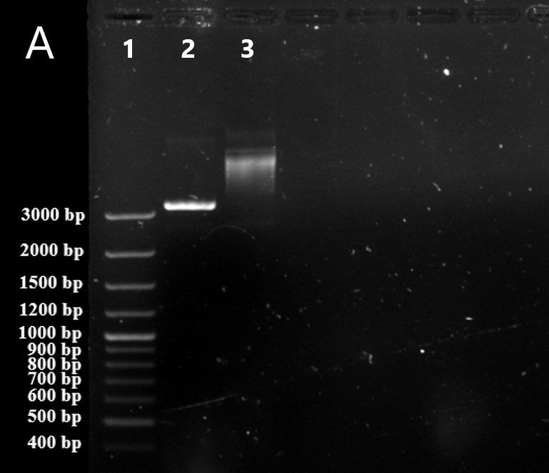

---
output:
  bookdown::pdf_document2:
    fig_caption: yes
    toc: TRUE
    toc_depth: 3
    fontsize: 12pt
    latex_engine: xelatex
bibliography: "Bachelor_quellen.bib"
biblio-style: apalike
citation_package: biblatex
link-citations: yes
urlcolor: RoyalBlue
linkcolor: RoyalBlue
header-includes:
  \usepackage{float}
  \usepackage[ngerman]{babel}
  \usepackage[onehalfspacing]{setspace}
  \usepackage[utf8]{inputenc}
  
---

```{r setup3, include=FALSE}
knitr::opts_chunk$set(echo = FALSE)

library(kableExtra)
library(ggplot2)
library(ggpubr)
library(tidyverse)
library(scales)
library(latex2exp)


```

# Ergebnisse


\definecolor{d73027}{HTML}{d73027}
\definecolor{f46d43}{HTML}{f46d43}
\definecolor{fdae61}{HTML}{fdae61}
\definecolor{fee090}{HTML}{fee090}
\definecolor{abd9e9}{HTML}{abd9e9}
\definecolor{74add1}{HTML}{74add1}
\definecolor{4575b4}{HTML}{4575b4}
\definecolor{333388}{HTML}{333388}
\definecolor{313695}{HTML}{313695}


Zur Detektion der Influenza A und B Viren sollte je ein isothermes Amplifikationssystem mit einem kombinierten reversen Transkriptionsschritt als RT-RPA-System entwickelt und für eine spätere POCT Anwendung optimiert werden. Zuerst wurden Primer und Sonden zur Detektion der H3N2 und H1N1 Influenza A Subtypen, sowie aller Influenza B  entwickelt und diese in verschiedenen Kombinationen auf Eignung mit dem RPA-Standard Protokoll geprüft. Dabei sollte ein besonderes Augenmerk auf den low-Volume Ansatz gelegt werden, da dieser für POCT Applikation besser geeignet ist.
Zur Optimierung und Erhöhung der analytischen Sensitivität der erfolgreich getesteten Primer-Sonden-Sets wurden verschiedene Parameter wie Reaktionsvolumen, Reaktionstemperatur sowie verschiedene Mischzeitpunkt untersucht. Die ermittelten optimalen Parameter wurden in einer abschließenden Untersuchung der Sensitivität und Spezifität charakterisiert und mit entsprechenden RT-PCR-Referenzsystemen verglichen.  

* Auf Eignung geprüft umschreiben


## Entwicklung und Optimierung der Influenza B RT-RPA

### Überprüfung und Konzentrationsbestimmung der Influenza B Virus Standrad-RNA

Standardisierte Virus-RNA wurde für die Vergleichbarkeit zwischen beispielsweise der RT-PCR und der RT-RPA sowie der variierenden Parameter in einer definierten Konzentration hergestellt (Kapitel \@ref(transformation) - \@ref(ribogreen)). Das artifizielle DNA-Plasmid mit der inserierten Influenza B-Sequenz wurde mittels Sanger-Sequenzierung überprüft (Kapitel \@ref(sequenzierung), Daten nicht gezeigt). Dadurch konnten Sequenzfehler ausgeschlossen werden \textcolor{red}{und die Integrität der Virus-Sequenz bestätigt werden}. Für die in vitro Transkription wurde das Plasmid weiterhin durch einen Restriktionsverdau linearisiert und die Linearisierung in einem Agarose-Gel  überprüft (Kapitel \@ref(verdau), Abbildung \@ref(fig:infBverdauA)). Das linearisierte Plasmid (Spur 2) zeigt eine Bande bei ~3400 bp, was mit der Plasmidgröße von 3407 bp übereinstimmt (siehe Plasmidkarte \@ref(fig:plasmidB) im Anhang). Das unverdaute Kontrollplasmid (Spur 3) weist eine Bande von mehr als 4000 bp auf. Daraus lässt sich schließen, dass die Linearisierung durch den Restriktionsverdau erfolgreich war. Das linearisierte Plasmid wurde dann mithilfe des T7-Promotors auf dem Plasmid _in vitro_ transkribiert und gereinigt (Kapitel \@ref(transkription)). Die so synthetisierte virale RNA wurde schlussendlich mit dem RiboGreen Assay (Kapitel \@ref(ribogreen)) quantifiziert. Die Kalibriergerade des RiboGreen Assays ist in \@ref(fig:infBverdauB) dargestellt. Es ergab sich eine Geradengleichung der Kalibriergerade von $𝑦 = 22 + 3,6𝑥$ mit einem Bestimmtheitsmaß von 0,99. Mithilfe der Gradengleichung konnte für die synthetisierte RNA eine Konzentration von $476.0 \pm 7,8 ng/ml$ ermittelt und somit die  Menge der synthetisierten Kopien auf $2,2 * 10^8$ RNA-Kopien/µl bestimmt werden.

(ref:infbstandard) **Kontrollgel und RiboGreen Kalibrationsgerade des Influenza B Standards:** \linebreak
**A:** DNA-Banden des Kontrollgels für die Linearisierung des Influenza B Plasmids mit verdautem Plasmid (2), unverdautem Kontrollplasmid (3) und mitgeführter DNA-Leiter (1). Das linearisierte Plasmid läuft bei ca. 3400 bp und somit unter dem mitgeführten ungeschnittenem Kontrollplasmid. Bild ist digital bearbeitet. \linebreak
**B:** Kalibrationsgerade des Ribogreen-Assays mit angefügter Geradengleichung, Korrelationskoeffizienten und p-Wert. Das graue Band zeigt das 95 %-ige Konfidenzintervall der linearen Funktion. Alle Messungen wurden mit n=4 durchgeführt.


```{r infBverdau, fig.align='center',message = FALSE, fig.cap= "(ref:infbstandard)", out.width= "49%", fig.show='hold', fig.scap="Kontrollgel und Ribogreen Kalibrationsgerade des Influenza B Standards"}




data <- read.csv2("Daten/V_0027.csv")

ggplot(data, aes(konz, fluo)) +
  geom_point() +
  geom_smooth(method = "lm") +
  theme_minimal()+
  theme(axis.text = element_text(size=12), axis.title = element_text(size=12))+
   ylab("Fluoreszenz")+
   xlab("Konzentration") +  
  stat_cor(label.y = 2700, 
           aes(label = paste(after_stat(rr.label), after_stat(p.label), sep = "~`,`~")), size = 5) +
  stat_regline_equation(label.y = 2400, size = 5)+
  annotate(geom="text", x=10, y=3500, label="B", color="black", size=12)


```

### Untersuchung der Influenza B RT-RPA Primer und Sonden {#infbprimer}

Für die Pan-Influenza B RT-RPA wurden mithilfe der Software PrimedRPA insgesamt 9 verschiedene Primer und 2 Sonden ausgesucht (Kapitel \@ref(desing), Tabelle \@ref(infboligo). Aus den angegebenen Oligonukleotiden ergeben sich insgesamt 10 Primer-Sonden-Kombinationen. Davon bestehen 2 Kombinationen aus Sonde 1.1 mit Forward 1 und Reverse 1.1 und Reverse 1.2. Die anderen 8 Kombinationen setzten sich aus Sonde 3.1, Forward 3 bzw. Forward 4 und Reverse 3.3 - 3.15 zusammen. 


(ref:design) Modifiziert wie in Kapitel \@ref(modifikation) beschrieben.
```{r, infboligo}
RPAoligo <- read.csv2("infB_oligos.csv", header = FALSE)
kable(RPAoligo, booktabs = TRUE, col.names = NULL, format = "latex", escape = FALSE, caption = "Entwickelte Primer und Sonden für die Influenza B RT-RPA") %>%
  add_header_above(c("Name"= 1, "Sequenz (5´->3´)"= 1, "3´-Position"=1, "Modifikation"=1), line_sep=0) %>%
  column_spec(4, width = "1.5in")%>%
  kable_styling(latex_options = "hold_position") %>%
  kable_styling(latex_options = "scale_down") %>%
  footnote( symbol = c("Y=C oder T; 1: Repoterfluorophor; 2: a-basische Seite; 3: Quencher" , "(ref:design)"), symbol_manual = c('*', '**', '***'), fixed_small_size = TRUE, general_title = "Notiz:", escape= FALSE, footnote_as_chunk =TRUE)
```

Zur Bestimmung einer geeigneten Primer-Sonden-Kombination wurden die 10 ausgewählten Kombinationen mittels des Standard-Protokolls der RT-RPA getestet (Kapitel \@ref(screening)). Die Fluoreszenzdaten dazu sind in Abbildung \@ref(fig:infbscreening) gezeigt. Die Kombinationen mit Sonde 3.1 (grau) zeigen streuende Ansteigszeiten zwischen 3,3 min - 7,4 min und eine durschnittliche Fluoreszenzauslenkung von rund 450 Einheiten. Die zwei Kombinationen mit Sonde 1.1 (schwarz) zeichnen sich hingegen durch einen steileren Anstieg und höhere Fluoreszenzwerte von 900 bis über 1000 Einheiten im Vergleich zu den Kombinationen mit Sonde 3.1 aus. Bei der Kombination mit Reverse 1.1 (schwarz, durchgezogen) ist dabei ein signifikant niedrigerer Anstieg als bei der Kombination mit Reverse 1.2 (schwarz, gestrichelt) beobachten. Die Mittelwerte der TT-Werte Werte (statistische Auswertung, Tabelle \@ref(tab:tabeins), Anhang)  für die jeweiligen Kombinationen liegen bei $3,33 \pm 0,07$ min (Reverse 1.1) und $4,27 \pm 0,07$ min (Reverse 1.2) und zeigen eine geringe Streuung um den Mittelwert. Alle Wasserkontrollen zeigen keine merkliche Fluoreszenzauslenkung und dementsprechend keine unspezifische Amplifikation. Durch die höhre Fluoreszenzauslenkung bei den Kombinationen mit Sonde 1.1 wurden diese den Kombinationen mit Sonde 3.1 vorgezogen. Dabei erreicht Die Kombination mit Reverse 1.2, Forward 1 und Sonde 1.1 im Verlauf der Messung eine höhere Fluoreszenzauslenkung, besitzt jedoch signifikant höhere Anstiegszeiten. Da ein zeitigerer Anstieg (d.h. niedrigere TT-Werte) auf eine schnellere Amplifikation deutet, wurde die Kombination mit Reverse 1.1, Forward 1 und Sonde 1.1 (schwarz, durchgezogen) ausgewählt und für die weiteren Influenza B RT-RPAs verwendet.

(ref:etablB) **Primerscreening der entwickelten Influenza B RT-RPA Primer-Sonden-Kombinationen:** Normalisierte Fluoreszenzdaten des Primerscreenings (n=3) für die in Tabelle \@ref(tab:infboligo) angegeben Primer und Sonden. Alle Kombinationen mit Sonde 3.1 sind in **grau** dargestellt. Die Kombinationen mit Sonde 1.2, Foward 1 und Reverse 1.2 ist in **schwarz (- - -)** und die Kombination mit Sonde 1.2, Forward 1 und Reverse 1.1 in **schwarz (**\textbf{\textemdash}**)**  dargestellt. Alle Negativkontrollen sind mit **(**$\cdot - \cdot$**)** gekennzeichnet.

```{r infbscreening, fig.show='hold', message = FALSE, warning=FALSE, results=FALSE, fig.cap="(ref:etablB)", out.width= "70%", fig.align='center', fig.scap="Primerscreening der entwickelten Influenza B RT-RPA Primer-Sonden-Kombinationen."}
data <- read.csv2("daten/infb_primer_screening.csv")

zehn7 <- data %>% 
  select(Zeit, X1071,	X1072,	X1073,	X1074,	X1075,	X1076,	X1077) %>%
  gather(key = "Proben", value = "Fluoreszenz", -Zeit)

zehn6 <- data %>% 
  select(Zeit, X1061,	X1062,	X1063,	X1064,	X1065,	X1066,	X1067) %>%
  gather(key = "Proben", value = "Fluoreszenz", -Zeit)

zehn5 <- data %>% 
  select(Zeit,  X1051,	X1052,	X1053,	X1054,	X1055,	X1056,	X1057) %>%
  gather(key = "Proben", value = "Fluoreszenz", -Zeit)

zehn4 <- data %>% 
  select(Zeit, X1041,	X1042,	X1043,	X1044,	X1045,	X1046,	X1047) %>%
  gather(key = "Proben", value = "Fluoreszenz", -Zeit)

zehn3 <- data %>% 
  select(Zeit, X1031,	X1032,	X1033,	X1034,	X1035,	X1036,	X1037) %>%
  gather(key = "Proben", value = "Fluoreszenz", -Zeit)

zehn2 <- data %>% 
  select(Zeit, X1021,	X1022,	X1023,	X1024,	X1025,	X1026,	X1027) %>%
  gather(key = "Proben", value = "Fluoreszenz", -Zeit)

zehn1 <- data %>% 
  select(Zeit,	X1011,	X1012,	X1013,	X1014,	X1015,	X1016,	X1017) %>%
  gather(key = "Proben", value = "Fluoreszenz", -Zeit)

zehn0 <- data %>% 
  select(Zeit, X1001,	X1002,	X1003,	X1004,	X1005,	X1006,	X1007) %>%
  gather(key = "Proben", value = "Fluoreszenz", -Zeit)

zehnnk <- data %>%
  select(Zeit, nk1,	nk2,	nk3,	nk4,	nk5,	nk6,	nk7,	nk8, nk9) %>%
  gather(key = "Proben", value = "Fluoreszenz", -Zeit)
  
transformed <- rbind(zehn5, zehn4, zehn3, zehn2, zehn1, zehn0)

transformed1 <- rbind(zehn7)

transformed2 <- rbind(zehn6)

transformed3 <- rbind(zehnnk)


ggplot(transformed, aes(x=Zeit, y = Fluoreszenz)) +
  geom_line(aes(color = Proben), linewidth = 0.3) +
  theme_minimal()+
   ylab("Fluoreszenz in mV")+
   xlab("Zeit in Minuten")+
  scale_color_manual(values = c("#000000", "#000000", "#cccccc", "#cccccc", "#cccccc", "#cccccc", "#cccccc", "#cccccc", 
                                "#cccccc", "#cccccc", "#cccccc", "#cccccc", "#cccccc", "#cccccc", "#cccccc", "#cccccc",  
                                "#cccccc", "#cccccc", "#cccccc", "#cccccc", "#cccccc", "#cccccc", "#cccccc",  
                                "#cccccc", "#cccccc", "#cccccc", "#cccccc", "#cccccc", "#cccccc", "#cccccc",  
                                "#cccccc", "#cccccc", "#cccccc", "#cccccc", "#cccccc", "#cccccc", "#cccccc",  
                                "#cccccc", "#cccccc", "#cccccc", "#cccccc", "#cccccc", "#cccccc", "#cccccc",  
                                "#cccccc", "#cccccc", "#cccccc", "#cccccc", "#cccccc", "#cccccc", "#cccccc",  
                                "#000000", "#000000", "#000000", "#000000", "#000000", "#000000", "#000000",
                                 "#000000", "#000000", "#000000", "#000000", "#000000", "#000000", "#000000"))+
  theme(legend.position="none")+
  theme(axis.text = element_text(size=12), axis.title = element_text(size=12))+
  geom_line(data=transformed1,aes(color = Proben), linetype="solid")+
  geom_line(data=transformed2,aes(color = Proben), linetype="dashed")+
  geom_line(data=transformed3,aes(color = Proben), linetype="dotdash")
  annotate(geom="text", x=11, y=6, label="A", color="black", size=12)
```

### Optimierung der Influenza B RT-RPA {#infboptimierung}

**Verringerung des Reaktionsvolumen (low-volume Ansatz)**

Wie bereits beschrieben, kann die Reduktion des Reaktionsvolumen zu einer Unabhänhikeit des Mischschrittes und einer erhöhten Sensitivität führen [@Lillis2016]. Neben der Kostenersparnis kann das geringe Volumen in mikrofluidische Applikationen eingebracht werden und somit für Lab-on-a-chip Applikationen innerhalb der POCT eingesetzt werden [@Behrmann2020]. Zur Prüfung, ob die in Kapitel \@ref(infbprimer) ausgewählte Primer-Sonden-Kombination für die POCT auf den low-volume Ansatz adaptiert werden kann, wurde eine Reduzierung des Reaktionsvolumens untersucht (Kapitel \@ref(reaktadapt)). In Abbildung \@ref(fig:infBetabl) ist der Vergleich der klassichen RPA (50 µl) zum low-Volume Ansatz (6,5 µl) bei einer Kopientahl von 10^7^ RNA-Kopien/µl dargestellt. Der low-volume Ansatz (schwart) zeigt im Vergleich zur Standard RT-RPA (grau) eine geringere Auslenkung der Fluoreszenz. Jedoch konnte keine signifikante Veränderung der TT-Werte zwischen den beiden Reaktionsvolumen festgestellt werden. Die Mittelwerte der TT-Werte (statistische Auswertung, Tabelle \@ref(tab:tabzwei), Anhang) liegen bei $3,36 \pm 0.01$ min (50 µl RT-RPA) und $3,47 \pm 0,14$ min (low-volume RT-RPA). Trotz der verringerten Fluoreszenzintensität wurde der low-volume -Ansatz in den folgenden Experimenten verwendet, da dieser für spätere geplante Lab-on-a-chip Applikationen besser geeignet ist und die Kostenreduzierung für Ressourecn limittierte Settings vorteilhaft ist.

(ref:infBebasl) **Optimierung des Reaktionsvolumens der Influenza B RT-RPA:** Normalisierte Fluoreszenzdaten der Influenza B RT-RPA bei 40 °C im low-volume -Ansatz (schwarzn n=6) sowie im 50 µl Ansatz (grau, n=3) sind dargestellt. Als Virus-RNA wurden 10^7^ RNA-Kopien eingesetzt. Alle Negativkontrollen sind mit **(- - -)** gekennzeichnet.

```{r infBetabl, fig.show='hold',  out.width= "70%", message = FALSE, fig.cap="(ref:infBebasl)", fig.align='center', fig.scap="Optimierung des Reaktionsvolumens der Influenza B RT-RPA"}

data <- read.csv2("daten/V_0041.csv")


transformed <- data %>% 
  select(Zeit, ProbeA, ProbeB, ProbeC, ProbeD, ProbeE, ProbeF, ProbeJ, ProbeK,	ProbeL) %>%
  gather(key = "Proben", value = "Fluoreszenz", -Zeit)

transformed1 <- data %>% 
  select(Zeit, ProbeH, ProbeI, ProbeG) %>%
  gather(key = "Proben", value = "Fluoreszenz", -Zeit)

ggplot(transformed, aes(x=Zeit, y = Fluoreszenz)) +
  geom_line(aes(color = Proben)) +
  theme_minimal()+
  theme(axis.text = element_text(size=12), axis.title = element_text(size=12))+
   ylab("Fluoreszenz in mV")+
   xlab("Zeit in Minuten") +
   scale_color_manual(values = c("#000000", "#000000", "#000000", "#000000", "#000000", "#000000", "#000000", "#000000",
                                 "#cccccc", "#cccccc", "#cccccc", "#cccccc"))+
  geom_line(data=transformed1,aes(color = Proben), linetype="dashed")+
  theme(legend.position="none")
  
```


**Optimierung der Reaktionstemperatur**

Das Temperaturoptimung der RPA kann je nach System und Nachweisziel variieren [@Li2019]. Zur Optimierung der Reaktionstemperatur für die Influenza B RT-RPA wurden Reaktionstemperaturen zwischen 38-42 °C im low-volume Ansatz untersucht (Kapitel \@ref(optimierungT)).
Die Fluoreszenzdaten dazu sind in Abbildung \@ref(fig:infbopti)A dargestellt. Die Influenza B RT-RPA zeigt bei 38 °C (blau) einen signifiaknt späteren Anstieg im Vergleich zu den Reaktionen bei 40 °C (gelb) und 42 °C (orange). Die Mittelwerte der TT-Werte (statistische Auswertung, Tabelle \@ref(tab:tabdrei), Anhang) für die jeweiligen Temperaturen liegen bei $5,26 \pm 0,06$ min (38 °C), $3,57 \pm 0,20$ min (40 °C) und $3,63 \pm 0,13$ min (42 °C). Zwischen den Amplifikationskurven von 40 °C und 42 °C konnten keine signifikanten Unterschiede der TT-Werte ermittelt werden. Bei der 40 °C Amplifikationskurve kann im Durchschnitt eine höhere maximale Fluoreszenzauslenkung beobachtet werden. Die Reaktionen bei 38 °C und 42 °C weisen hingegen niedrigere, jedoch ähnlich hohe Fluoreszenzauslenkungen auf. Bei den 42 °C Messdaten ist eine Abnahme der Fluoreszenz im späteren Verlauf der Amplifikation ca. 13 min) zu beobachten. Auch bei der Reaktionstemperatur von 40 °C kann bei 4 von 7 Reaktionen diese Fluoreszenzabnahme beobachtet werden, welche jedoch später (bei ca. 16 min) einsetzt. Diese Fluoreszenzabnahme im späteren Verlauf der Messung wird in dieser Arbeit als Ditching bezeichnet. Aufgrund der höchsten Fluoreszenzauslenkung, wurde die Reaktionstemperatur bei 40 °C als optimal festgelegt und für die weiteren Influenza B RT-RPAs verwendet.


(ref:infboptimierungt) **Optimierung der Reaktionstemperatur für die Influenza B RT-RPA**: Normalisierte Fluoreszenzdaten der Influenza B RT-RPA im low-volume Ansatz bei 42 °C (orange), 40 °C (gelb) und 38 °C (blau), je n=6. Negativkontrollen sind mit **(- - -)** gekennzeichnet.


```{r infboptit,  fig.show='hold', message = FALSE, warning=FALSE, results=FALSE, fig.cap="(ref:infboptimierungt)", out.width= "70%", fig.align='center', fig.scap="Optimierung der Reaktionstemperatur für die Influenza B RT-RPA"}
data1 <- read.csv2("daten/V_0045_ges.csv")


transformed <- data1 %>% 
  select(Zeit, ProbeA, ProbeB, ProbeC, ProbeD, ProbeE, ProbeF, ProbeH, ProbeI,	ProbeJ, ProbeK,	ProbeL,	ProbeM,	ProbeO,	ProbeP,	ProbeR,	ProbeS,	ProbeT) %>%
  gather(key = "Proben", value = "Fluoreszenz", -Zeit)

transformed1 <- data1 %>%
  select(Zeit,ProbeG, ProbeN,	ProbeQ, ProbeU) %>%
   gather(key = "Proben", value = "Fluoreszenz", -Zeit)

ggplot(transformed, aes(x=Zeit, y = Fluoreszenz)) +
  geom_line(aes(color = Proben)) +
  theme_minimal()+
  theme(axis.text = element_text(size=12), axis.title = element_text(size=12))+
   ylab("Fluoreszenz in mV")+
   xlab("Zeit in Minuten") +
   scale_color_manual(values = c("#fee090", "#fee090", "#fee090", "#fee090", "#fee090", "#fee090", "#fee090",
                                 "#f46d43", "#f46d43", "#f46d43", "#f46d43", "#f46d43", "#f46d43", "#f46d43",
                                 "#abd9e9", "#abd9e9", "#abd9e9", "#abd9e9", "#abd9e9", "#abd9e9", "#abd9e9"))+
  theme(legend.position="none")+
  geom_line(data=transformed1,aes(color = Proben), linetype="dashed")+
  annotate("text", x=2, y=500, label= "A",col="black", size=12)


```

tsadsafalsd


```{r infbopti,  fig.show='hold', message = FALSE, warning=FALSE, results=FALSE, fig.cap="(ref:infboptimierung)", out.width= "70%", fig.align='center', fig.scap="Optimierung der Reaktionstemperatur und der Primerassymetrie."}
data2 <- read.csv2("daten/V_0056.csv")


transformed <- data2 %>% 
  select(Zeit, ProbeA, ProbeB, ProbeC, ProbeD, ProbeE, ProbeF, ProbeI,	ProbeJ, ProbeK,	ProbeL,	ProbeM, ProbeN,	ProbeQ,	ProbeR,	ProbeS,	ProbeT,	ProbeU, ProbeV) %>%
  gather(key = "Proben", value = "Fluoreszenz", -Zeit)

transformed2 <- data2 %>%
  select(Zeit,ProbeG, ProbeH, ProbeO,	ProbeP, ProbeW, ProbeX) %>%
   gather(key = "Proben", value = "Fluoreszenz", -Zeit)

ggplot(transformed, aes(x=Zeit, y = Fluoreszenz)) +
  geom_line(aes(color = Proben)) +
  theme_minimal()+
   ylab("Fluoreszenz in mV")+
   xlab("Zeit in Minuten") +
   scale_color_manual(values = c("#e9ecef", "#e9ecef", "#e9ecef", "#e9ecef", "#e9ecef", "#e9ecef", "#e9ecef", "#e9ecef",
                                 "#000000", "#000000", "#000000", "#000000", "#000000", "#000000", "#000000", "#000000",
                                 "#adb5bd", "#adb5bd", "#adb5bd", "#adb5bd", "#adb5bd", "#adb5bd", "#adb5bd", "#adb5bd"))+
  theme(legend.position="none")+
  geom_line(data=transformed2,aes(color = Proben), linetype="dashed")+
  annotate("text", x=2, y=700, label= "B",col="black", size=12)+
  geom_segment(aes(x = 6.5, y = 45, xend = 5, yend = 50), linejoin = "round", size = 1.2, colour = "red",
                  arrow = arrow(length = unit(0.3, "cm")))


```


**Optimierung der Mischzeit**

Wie in \@ref(rpa) beschrieben kann ein zusätzlicher Mischschritt während der Reaktion zu einer erhöhten Amplifikation und somit zu einer besseren Detektion führen. Um im asymmetrischen, low-volume Ansatz (6,5µl) den zusätzlichen Mischschritt für die Influenza B RT-RPA als Einflussfaktor zu identifizieren wurden einerseits verschiedene Mischzeitpunkte nach 5 min, 4 min und 3 min und andererseits unterschiedliche RNA-Konzentrationen (von 10^3^ Kopien bis 10^0^ Kopien pro Ansatz) in den jeweiligen Reaktion untersucht (Kapitel \@ref(optimischen)). Die Fluoreszenzdaten der Untersuchung sind in Abbildung \@ref(fig:infboptimisch)A bei einer Template-Konzentration von 10^3^ dargestellt. Es ist zu erkennen, dass der Mischschritt nach drei Minuten (blau) im Vergleich zu der Referenz (ohne Mischen, gelb) ohne Mischen zu signifikant höheren TT-Werten führt und damit zu einer verschlechterung der Amplifikation. Die TT-Werte liegen hier bei $5,90 \pm 0,19$ min (Referenz) und $7,21 \pm 0,70$ min (Mischen nach 3 min), wobei der Mischschritt nach 3 Minuten eine große Streuung der TT-Werte um den Mittelwert aufweist. Die Mischzeiten nach vier Minuten (orange) und fünf Minuten (rot) weisen jeweils signifikant niedrigere TT-Werte zur Referenz auf, sind jedoch untereinander nicht signifikant unterschiedlich. Demnach liegen die Zusammengefassten TT-Werte der beiden Mischzeiten bei $5,04 \pm 0,19$ min. Die statistische Auswertung ist in Tabelle \@ref(tab:tabfunf) im Anhang gezeigt. Der Mischzeitpunkt nach fünf Minuten zeigt im Verlgeich zu dem Mischzeitpunkt nach 4 Minuten eine höhere maximale Fluoreszenzauslenkung und wurde aus diesem Grund als Optimal festgelegt und näher Untersucht.  
Damit der Einfluss des Mischzeitpunktes auf die low-volume RT-RPA bei geringen RNA-Konzentration untersucht werden kann, wurde eine Konzentrationsreihe mit absteigenden RNA-Konzentrationen (10^2^, 10^1^, 10^0^ RNA-Kopien pro Ansatz) und dem Mischzeitpunkt nach fünf Minuten durchgeführt und mit der ungemischten Referenz verglichen (Kapitel \@ref(optimischen)). Die Fluoreszenzdaten sind in Abbildung \@ref(fig:infboptimisch)B-D dargestellt. Bei 10^2^ Kopien/Ansatz zeigen die Reaktionen mit Mischschritt (rot) signifikant niedrigere TT-werte ($6,53 \pm 0,25$ min) als die Referenz (gelb) ohne zusätzlichen Mischschritt ($7,35 \pm 0,58$ min, statistische Auswertung, Tabelle \@ref(tab:tabsechs), Anhang). Ein Ditching Effekt nach $\approx$ 16 Minuten konnte hier bei 6/7 Reaktionen beobachtet werden, wodruch die maximalen Fluoreszenzauslenkungen bei beiden Versuchreihen ähnlich sind.  
Beim Experiment mit 10^1^ Kopien/Ansatz zeigt der Mischschritt (rot) eine deutlich erhöhte Fluoreszenzauslenkung im Vergleich zur Referenz (gelb). Des Weiteren konnte die Sensitivität von 3/7 positive Reaktionen (ohen Mischen) auf 7/7 positive Reaktionen (Mischen nach 5 min) erhöht werden.  
Bei 10^0^ RNA-Kopien/Ansatz wurde mit Mischschritt (rot) 1/6 Reaktion als positiv gewertet, während ohne Mischschritt keine positive Reaktion festgestellt wurden.  
Da alle Messungen der Mischzeit im low-volume Ansatz durchgeführt wurden, wurde der Einfluss des Mischschrittes nach 5 min auch im 50 µl Ansatz untersucht. Die Fluoreszenzdaten sind in Abbildung \@ref(fig:infBmischi50) im Anhang dargestellt. Es ist zu erkennen, dass ein Mischschritt nach fünf Minuten (rot) bei 10^4^ RNA-Kopien zu einer deutlichen Verringerung der TT-Werte und zu einer höheren Fluoreszenzauslenkung führt. Dementsprechend konnte ein signifikanter Unterschied zwischen den TT-Werten (statistische Auswertung, Tabelle \@ref(tab:), Anhang) mit $6,48 \pm < 0,01$ min (ohne Mischen, gelb) und $5,21 \pm 0,03$ min (mit Mischen, rot) festgestellt werden. Des Weiteren zeigt der Mischschritt einen steileren Fluoreszenzanstieg als die ungemischte Referenz.


(ref:infbmischenas) **Einfluss der Mischzeit auf die Influenza B RT-RPA:** Normalisierte Fluoreszenzdaten der RT-RPA sind gezeigt, die bei A) 10^3^, B) 10^2^, C) 10^1^ und D) 10^0^ Kopien/Ansatz einen zusätzlichen Mischschritt im Vergleich zur RT-RPA ohne Mischschritt zeigen \linebreak  
**A**: RT-RPA mit einem zusätzlichen Mischschritt nach 5 min (rot), 4 min (orange), 3 min (blau) sowie der Referenz ohne Mischen (gelb) bei einer eingesetzten RNA-Konzentration von 10^3^ Kopien/µl. Ausreißer sind mit einem roten Pfeil markiert. Alle Messungen wurden in n=6 durchgeführt. Negativkontrollen sind mit **(- - -)** dargestellt. \linebreak
**B** Vergleich zwischen der Influenza B RT-RPA mit einem zusätzlichen Mischschrittes nach 5 min (schwarz) und einer RT-RPA ohne zusätzliches Mischen (grau) bei eingesetzten 10^2^ RNA-Kopien/µl. Messung in n=7 durchgeführt. Negativkontrollen sind mit **(- - -)** gekennzeichnet. **C,D**: Vergleich zwischen der Influenza B RT-RPA mit einem zusätzlichen Mischschrittes nach 5 min (schwarz) und einer RT-RPA ohne zusätzliches Mischen (grau) bei eingesetzten 10^1^ RNA-Kopien/µl (C) und 10^0^ RNA-Kopien (D). Messung in n=6 durchgeführt. Negativkontrollen sind mit **(- - -)** gekennzeichnet.
 
```{r infboptimisch, fig.show='hold', message = FALSE, warning=FALSE, results=FALSE, fig.cap="(ref:infbmischenas)", out.width= "49%", fig.align='center', fig.scap="Optimierung der Mischzeit für die Influenza B RT-RPA."}
data <- read.csv2("Daten/infB_mischung.csv")


transformed <- data %>% 
  select(Zeit, ProbeA, ProbeB, ProbeC, ProbeD, ProbeE, ProbeF, ProbeG, ProbeH, ProbeQ,	ProbeR, ProbeS,	ProbeT,	ProbeU, ProbeV,	ProbeW,	ProbeX) %>%
  gather(key = "Proben", value = "Fluoreszenz", -Zeit)

transformed1 <- data %>% 
  select(Zeit, ProbeI,	ProbeJ, ProbeK,	ProbeL,	ProbeM, ProbeN,	ProbeO,	ProbeP) %>%
  gather(key = "Proben", value = "Fluoreszenz", -Zeit)

transformed3 <- data %>% 
  select(Zeit, Probe17,	Probe18,	Probe19,	Probe20,	Probe21,	Probe22,	Probe23,	Probe24) %>%
  gather(key = "Proben", value = "Fluoreszenz", -Zeit)

transformed2 <- data %>% 
  select(Zeit, nk1, nk2, nk3, nk4, nk5, nk6, nk7, nk8) %>%
  gather(key = "Proben", value = "Fluoreszenz", -Zeit)

ggplot(transformed, aes(x=Zeit, y = Fluoreszenz)) +
  geom_line(aes(color = Proben)) +
  theme_minimal()+
   ylab("Fluoreszenz in mV")+
   xlab("Zeit in Minuten") +
   scale_color_manual(values = c("#a50026", "#a50026", "#fee090", "#fee090", "#f46d43", "#f46d43", "#abd9e9", "#abd9e9",
                                 "#a50026", "#a50026", "#a50026", "#a50026", "#a50026", "#a50026", "#a50026", "#a50026",
                                 "#fee090", "#fee090", "#fee090", "#fee090", "#fee090", "#fee090", "#fee090", "#fee090",
                                 "#f46d43", "#f46d43", "#f46d43", "#f46d43", "#f46d43", "#f46d43", "#f46d43", "#f46d43",
                                 "#abd9e9", "#abd9e9", "#abd9e9", "#abd9e9", "#abd9e9", "#abd9e9", "#abd9e9", "#abd9e9"))+
  geom_line(data=transformed1,aes(color = Proben), linetype="solid")+
  geom_line(data=transformed3,aes(color = Proben), linetype="solid")+
  geom_line(data=transformed2,aes(color = Proben), linetype="dashed")+
  theme(legend.position="none")+
geom_segment(aes(x = 17, y = 130, xend = 17.5, yend = 100), linejoin = "round", size = 1.2, colour = "red",
                  arrow = arrow(length = unit(0.3, "cm")))+
geom_segment(aes(x = 19, y = 80, xend = 18.5, yend = 50), linejoin = "round", size = 1.2, colour = "red",
                  arrow = arrow(length = unit(0.3, "cm")))+
   annotate("text", x=2, y=400, label= "A",col="black", size=12)


data1 <- read.csv2("Daten/V_0063.csv")


transformed <- data1 %>% 
  select(Zeit, ProbeB, ProbeC, ProbeD, ProbeE, ProbeF, ProbeG, ProbeH, ProbeI, ProbeJ, ProbeK,	ProbeL,	ProbeM, ProbeN, ProbeO) %>%
  gather(key = "Proben", value = "Fluoreszenz", -Zeit)

transformed1 <- data1 %>%
  select(Zeit, ProbeP,	ProbeA) %>%
   gather(key = "Proben", value = "Fluoreszenz", -Zeit)

ggplot(transformed, aes(x=Zeit, y = Fluoreszenz)) +
  geom_line(aes(color = Proben)) +
  theme_minimal()+
   ylab("Fluoreszenz in mV")+
   xlab("Zeit in Minuten") +
   scale_color_manual(values = c("#fee090", "#fee090", "#fee090", "#fee090", "#fee090", "#fee090", "#fee090", "#fee090",
                                 "#a50026", "#a50026", "#a50026", "#a50026", "#a50026", "#a50026", "#a50026", "#a50026"))+
  geom_line(data=transformed1,aes(color = Proben), linetype="dashed")+
  annotate("text", x=2, y=400, label= "B",col="black", size=12)+
  theme(legend.position="none")


data2 <- read.csv2("Daten/V_0064.csv")


transformed <- data2 %>% 
  select(Zeit, ProbeB, ProbeC, ProbeD, ProbeE, ProbeF, ProbeG, ProbeH, ProbeI, ProbeJ, ProbeK,	ProbeL,	ProbeM, ProbeN, ProbeO) %>%
  gather(key = "Proben", value = "Fluoreszenz", -Zeit)

transformed1 <- data1 %>%
  select(Zeit, ProbeP,	ProbeA) %>%
   gather(key = "Proben", value = "Fluoreszenz", -Zeit)

ggplot(transformed, aes(x=Zeit, y = Fluoreszenz)) +
  geom_line(aes(color = Proben)) +
  theme_minimal()+
   ylab("Fluoreszenz in mV")+
   xlab("Zeit in Minuten") +
   scale_color_manual(values = c("#fee090", "#fee090", "#fee090", "#fee090", "#fee090", "#fee090", "#fee090", "#fee090",
                                 "#a50026", "#a50026", "#a50026", "#a50026", "#a50026", "#a50026", "#a50026", "#a50026"))+
  geom_line(data=transformed1,aes(color = Proben), linetype="dashed")+
  annotate("text", x=2, y=400, label= "C",col="black", size=12)+
  theme(legend.position="none")


data3 <- read.csv2("Daten/V_0064_10_0_mischen.csv")


transformed <- data3 %>% 
  select(Zeit, ProbeB, ProbeC, ProbeD, ProbeE, ProbeF, ProbeG, ProbeH, ProbeI, ProbeJ, ProbeK,	ProbeL,	ProbeM, ProbeN, ProbeO) %>%
  gather(key = "Proben", value = "Fluoreszenz", -Zeit)

transformed1 <- data3 %>%
  select(Zeit, ProbeP,	ProbeA) %>%
   gather(key = "Proben", value = "Fluoreszenz", -Zeit)

ggplot(transformed, aes(x=Zeit, y = Fluoreszenz)) +
  geom_line(aes(color = Proben)) +
  theme_minimal()+
   ylab("Fluoreszenz in mV")+
   xlab("Zeit in Minuten") +
   scale_color_manual(values = c("#fee090", "#fee090", "#fee090", "#fee090", "#fee090", "#fee090", "#fee090", "#fee090",
                                 "#a50026", "#a50026", "#a50026", "#a50026", "#a50026", "#a50026", "#a50026", "#a50026"))+
  geom_line(data=transformed1,aes(color = Proben), linetype="dashed")+
  annotate("text", x=2, y=400, label= "D",col="black", size=12)+
  theme(legend.position="none")

  
```


### Bestimmung der Sensitivität der Influenza B RT-RPA

Die Sensitivität für die Influenza B RT-RPA wurde mit den ermittelten optimalen Reaktionsparametern (40 °C, 1,5X reverse Primer-Konzentration, Mischen nach 5 min) bestimmt und die Daten von den Standardvolumenansatz (50 µl) und low volume gegenübergestellt (Kapitel \@ref(sensitivitat). In Abbildung \@ref(fig:infbsensi) sind die Fluoreszenzdaten der dekadischen Verdünnungsreihe von $2*10^7$ bis $2*10^1$ RNA-Kopien (Abbildung \@ref(fig:infbsensi)A, \@ref(fig:infbsensi)B) sowie das mittels Probit-Analyse (Kapitel \@ref(probit)) berechnete Detektionslimit (Abbildung \@ref(fig:infbsensi)C, \@ref(fig:infbsensi)D) und die jeweiligen 


Die Ermittlung der Sensitivität für die Influenza B RT-RPA erfolgte mit den im Kapitel \@ref(infboptimierung) ermittelten optimalen Reaktionsparametern nach beschriebener Methode (siehe \@ref(sensitivitat)). Die Fluoreszenzdaten der Sensitivitätsmessung sowie das mithilfe der Probit-Analyse (siehe \@ref(probit)) ermittelte Detektionslimit sind in Abbildung \@ref(fig:infbsensi) gezeigt. Für die Influenza B RT-RPA konnte berechnet werden, dass das System mit einer 95 %igen Wahrscheinlichkeit 31,6 Virus RNA-Kopien detektieren kann. Des Weiteren konnte eine Kalibriergerade für die TT-Werte im Zusammenhang mit der Reaktionszeit mit einem R^2^ = 0,93 und einer Geradengleichung von $y=11 - 1,3x$ ermittelt werden. Der angegebene p-Wert ist <<0,05 was einen signifikanten linearen Zusammenhang aussagt.  
Zusätzlich wurde die Sensitivität für den low-volume Ansatz der Influenza B RT-RPA mit den gleichen Reaktionsparametern ermittelt und ein Vergleich zu dem 50µl Ansatz gezogen. Die Messung erfolgte nach der beschriebenen Methode (siehe \@ref(sensitivitat)). Es konnte eine Detektionslimit von 14,6 Kopien ermittelt werden. Die erstellte Kalibriergerade für die TT-Werte im Zusammenhang mit der Reaktionszeit besitzt ein R^2^ von 0,92 und eine Geradengleichung von $y=9,4 - 0,95x$. Die über den Boxplot-Test (siehe \@ref(tt-wert)) ermittelten Ausreißer der TT-Werte (siehe rote Pfeile in \@ref(fig:infbsensi)B) wurden innerhalb der Kalibriergerade nicht berücksichtigt. Der angegebene p-Wert ist ebenfalls <<0,05 was einen signifikanten linearen Zusammenhang aussagt. Für die RT-RPA im low-volume Ansatz konnte eine Verbesserung des Detektionslimits um 15 Kopien beziehungsweise 54 % nachgewiesen werden.   
Damit ein Vergleich zur PCR als Standardmethode in der Diagnostik herangezogen werden kann wurde die in \@ref(rtpcr) beschriebene RT-PCR für das Influenza B Virus auf die Sensitivität getestet (Kapitel \@ref(sensitivitat)). Das Detektionslimit der RT-PCR liegt bei 11,4 Kopien. Somit liegt die Detektionsgrenze des PCR-Systems 22 %  bzw. 3,2 Kopien unter der optimierten RPA im low-volume Ansatz. Da sowohl die RPA als auch die PCR mit dem artifiziellen RNA-Standard, jedoch nicht mit realen Patientenproben getestet wurden, kann das ermittelte Detektionslimit nicht auf Patientenproben angewendet werden. Um eine eventuelle Veränderung des Detektionslimits mit klinischen Proben zu untersuchen wurden simulierte Kontrollproben (extrahierte humane Nukleinsäure mit zugesetztem RNA-Standard) erstellt (Kapitel \@ref(klinischeproben)) und mit diesen eine erneute Sensitivitätsanalyse im low-volume Ansatz durchgeführt (Kapitel \@ref(sensitivitat)). Zusätzlich zu der Negativkontrolle wurde eine Kontrollprobe ohne zugesetzte virale RNA mitgeführt, um auf unspezifische Reaktionen zu kontrollieren. Um die humane Hintergrund-DNA zu Quantifizieren wurde die DNA-Konzentration der Kontrollproben mit dem NanoDrop (n=3) bestimmt. ES konnte eine DNA-Konzentration von $43,58 \pm 6,00$ ng/µl ermittelt werden. Innerhalb der Kontrollproben konnten alle Proben mit einer RNA-Konzentration von 10^3^ Kopien/µl detektiert werden, jedoch keine der Proben mit 10^2^ RNA-Kopien. Dementsprechend liegt das Detektionslimit bei 1397 Kopien. Eine Kreuzreaktivität mit dem humanen RNA-Probenhintergrund konnte nicht festgestellt werden. 

Zur besseren Übersicht ist der Vergleich der verschiedenen ermittelten Sensitivitäten in Tabelle \@ref(tab:infbsensver) dargestellt.

```{r infbsensver}

achtRPA <- read.csv2("infBsensi_vergleich.csv", header = FALSE, fileEncoding="latin1")

kable(achtRPA, booktabs = TRUE, col.names = NULL, caption = "Vergleich der verschiedenen Sensitivitätsmessungen der Influenza B RT-RPA") %>%
  kable_styling(latex_options = "hold_position") %>%
  add_header_above(c("Messung"= 1, "Ermitteltes Detektionslimit"= 1), line_sep=0)

```


\definecolor{d73027}{HTML}{d73027}
\definecolor{f46d43}{HTML}{f46d43}
\definecolor{fdae61}{HTML}{fdae61}
\definecolor{fee090}{HTML}{fee090}
\definecolor{abd9e9}{HTML}{abd9e9}
\definecolor{74add1}{HTML}{74add1}
\definecolor{4575b4}{HTML}{4575b4}
\definecolor{333388}{HTML}{333388}
\definecolor{313695}{HTML}{313695}


(ref:infosensi) **Sensitivitätsanalyse der Influenza B RT-RPA**: **A,B:** Normalisierte Fluoreszenzdaten der Sensitivitätsmessung in einer dekadischen Verdünnungsreihe mit \textcolor{313695}{$10^7$}, \textcolor{333388}{$10^6$}, \textcolor{4575b4}{$10^5$}, \textcolor{74add1}{$10^4$}, \textcolor{abd9e9}{$10^3$}, \textcolor{fee090}{$10^2$}, \textcolor{fdae61}{$10^1$} und \textcolor{f46d43}{$10^0$} RNA-Kopien pro Messung sowie \textcolor{d73027}{Negativkontrollen} für den 50 µl Ansatz (A) und den low-volume Ansatz (B). Jede Verdünnung wurde mit mindestens n=3 (50 µl Ansatz) bzw. n=7 (low-volume Ansatz) gemessen. Ausreißer des low-volume Ansatzes bei $10^7$ und $10^4$ (roter Pfeil) wurden in der Auswertung nicht berücksichtigt. **C,D:** Probit-Analyse der Amplifikationsdaten für den 50 µl Ansatz (C) und den low-volume Ansatz (D). Die schwarz durchgezogene Linie zeigt, die Probit-Regression der RT-RPA. Die schwarzen gestreiften Linien beschreiben das oberer und untere Konfidenzintervall der Probit-Regression. Die rot gestreifte Linie zeigt die ermittelte Sensitivitätsgrenze, bei welcher 95 % der Amplifikationen positiv sind. **E,F:** Linearer Zusammenhang der Ct-Werte über die Konzentration mit angefügter Geradengleichung, Bestimmtheitsmaß und p-Wert für den 50 µl Ansatz (E) und den low-volume Ansatz (F). Das graue Band zeigt das 95 %-ige Konfidenzintervall der linearen Funktion. Ct-Werte der Ausreißer sowie von negativen Amplifikationen wurden vernachlässigt und sind nicht dargestellt. 


```{r infbsensi,  fig.show='hold', message = FALSE, warning=FALSE, results=FALSE, fig.cap="(ref:infosensi)", out.width= "49%", fig.align='center', fig.scap="Etablierung der Influenza B RPA im Original- und low-volume -Ansatz."}


data <- read.csv2("daten/V_0080.probit1.csv")

zehn7 <- data %>% 
  select(Zeit, X1071,	X1072,	X1073,	X1074,	X1075,	X1076,	X1077) %>%
  gather(key = "Proben", value = "Fluoreszenz", -Zeit)

zehn6 <- data %>% 
  select(Zeit, X1061,	X1062,	X1063,	X1064,	X1065,	X1066,	X1067) %>%
  gather(key = "Proben", value = "Fluoreszenz", -Zeit)

zehn5 <- data %>% 
  select(Zeit,  X1051,	X1052,	X1053,	X1054,	X1055,	X1056,	X1057) %>%
  gather(key = "Proben", value = "Fluoreszenz", -Zeit)

zehn4 <- data %>% 
  select(Zeit, X1041,	X1042,	X1043,	X1044,	X1045,	X1046,	X1047) %>%
  gather(key = "Proben", value = "Fluoreszenz", -Zeit)

zehn3 <- data %>% 
  select(Zeit, X1031,	X1032,	X1033,	X1034,	X1035,	X1036,	X1037) %>%
  gather(key = "Proben", value = "Fluoreszenz", -Zeit)

zehn2 <- data %>% 
  select(Zeit, X1021,	X1022,	X1023,	X1024,	X1025,	X1026,	X1027) %>%
  gather(key = "Proben", value = "Fluoreszenz", -Zeit)

zehn1 <- data %>% 
  select(Zeit,	X1011,	X1012,	X1013,	X1014,	X1015,	X1016,	X1017) %>%
  gather(key = "Proben", value = "Fluoreszenz", -Zeit)

zehn0 <- data %>% 
  select(Zeit, X1001,	X1002,	X1003,	X1004,	X1005,	X1006,	X1007) %>%
  gather(key = "Proben", value = "Fluoreszenz", -Zeit)

zehnnk <- data %>%
  select(Zeit, nk1,	nk2,	nk3,	nk4,	nk5,	nk6,	nk7,	nk8) %>%
  gather(key = "Proben", value = "Fluoreszenz", -Zeit)
  
transformed <- rbind(zehn7, zehn6, zehn5, zehn4, zehn3, zehn2, zehn1, zehn0, zehnnk)


ggplot(transformed, aes(x=Zeit, y = Fluoreszenz)) +
  geom_line(aes(color = Proben), size = 0.3) +
  theme_minimal()+
   ylab("Fluoreszenz in mV")+
   xlab("Zeit in min")+
  scale_color_manual(values = c("#d73027", "#d73027", "#d73027", "#d73027", "#d73027", "#d73027", "#d73027", "#d73027", 
                                "#f46d43", "#f46d43", "#f46d43", "#f46d43", "#f46d43", "#f46d43", "#f46d43",  
                                "#fdae61", "#fdae61", "#fdae61", "#fdae61", "#fdae61", "#fdae61", "#fdae61",  
                                "#fee090", "#fee090", "#fee090", "#fee090", "#fee090", "#fee090", "#fee090",
                                "#abd9e9", "#abd9e9", "#abd9e9", "#abd9e9", "#abd9e9", "#abd9e9", "#abd9e9",  
                                "#74add1", "#74add1", "#74add1", "#74add1", "#74add1", "#74add1", "#74add1",  
                                "#4575b4", "#4575b4", "#4575b4", "#4575b4", "#4575b4", "#4575b4", "#4575b4",
                                "#333388", "#333388", "#333388", "#333388", "#333388", "#333388", "#333388",
                                "#313695", "#313695", "#313695", "#313695", "#313695", "#313695", "#313695"))+
  theme(legend.position="none")+
  annotate("text", x=2, y=900, label= "A",col="black", size=12)


data <- read.csv2("daten/V_0062.probit2.csv")

zehn7 <- data %>% 
  select(Zeit, X1071,	X1072,	X1073,	X1074,	X1075,	X1076,	X1077) %>%
  gather(key = "Proben", value = "Fluoreszenz", -Zeit)

zehn6 <- data %>% 
  select(Zeit, X1061,	X1062,	X1063,	X1064,	X1065,	X1066,	X1067) %>%
  gather(key = "Proben", value = "Fluoreszenz", -Zeit)

zehn5 <- data %>% 
  select(Zeit,  X1051,	X1052,	X1053,	X1054,	X1055,	X1056,	X1057) %>%
  gather(key = "Proben", value = "Fluoreszenz", -Zeit)

zehn4 <- data %>% 
  select(Zeit, X1041,	X1042,	X1043,	X1044,	X1045,	X1046,	X1047) %>%
  gather(key = "Proben", value = "Fluoreszenz", -Zeit)

zehn3 <- data %>% 
  select(Zeit, X1031,	X1032,	X1033,	X1034,	X1035,	X1036,	X1037) %>%
  gather(key = "Proben", value = "Fluoreszenz", -Zeit)

zehn2 <- data %>% 
  select(Zeit, X1021,	X1022,	X1023,	X1024,	X1025,	X1026,	X1027) %>%
  gather(key = "Proben", value = "Fluoreszenz", -Zeit)

zehn1 <- data %>% 
  select(Zeit,	X1011,	X1012,	X1013,	X1014,	X1015,	X1016,	X1017) %>%
  gather(key = "Proben", value = "Fluoreszenz", -Zeit)

zehn0 <- data %>% 
  select(Zeit, X1001,	X1002,	X1003,	X1004,	X1005,	X1006,	X1007) %>%
  gather(key = "Proben", value = "Fluoreszenz", -Zeit)

zehnnk <- data %>%
  select(Zeit, nk1,	nk2,	nk3,	nk4,	nk5,	nk6,	nk7,	nk8) %>%
  gather(key = "Proben", value = "Fluoreszenz", -Zeit)
  
transformed <- rbind(zehn7, zehn6, zehn5, zehn4, zehn3, zehn2, zehn1, zehn0, zehnnk)


ggplot(transformed, aes(x=Zeit, y = Fluoreszenz)) +
  geom_line(aes(color = Proben), size = 0.3) +
  theme_minimal()+
   ylab("Fluoreszenz in mV")+
   xlab("Zeit in min")+
  scale_color_manual(values = c("#d73027", "#d73027", "#d73027", "#d73027", "#d73027", "#d73027", "#d73027", "#d73027", 
                                "#f46d43", "#f46d43", "#f46d43", "#f46d43", "#f46d43", "#f46d43", "#f46d43",  
                                "#fdae61", "#fdae61", "#fdae61", "#fdae61", "#fdae61", "#fdae61", "#fdae61",  
                                "#fee090", "#fee090", "#fee090", "#fee090", "#fee090", "#fee090", "#fee090",
                                "#abd9e9", "#abd9e9", "#abd9e9", "#abd9e9", "#abd9e9", "#abd9e9", "#abd9e9",  
                                "#74add1", "#74add1", "#74add1", "#74add1", "#74add1", "#74add1", "#74add1",  
                                "#4575b4", "#4575b4", "#4575b4", "#4575b4", "#4575b4", "#4575b4", "#4575b4",
                                "#333388", "#333388", "#333388", "#333388", "#333388", "#333388", "#333388",
                                "#313695", "#313695", "#313695", "#313695", "#313695", "#313695", "#313695"))+
  theme(legend.position="none")+
  geom_segment(aes(x = 7.5, y = 280, xend = 8.5, yend = 300), linejoin = "round", size = 1.2, colour = "red",
                  arrow = arrow(length = unit(0.3, "cm")))+
  geom_segment(aes(x = 16.5, y = 105, xend = 16, yend = 45), linejoin = "round", size = 1.2, colour = "red",
                  arrow = arrow(length = unit(0.3, "cm")))+
  annotate("text", x=2, y=900, label= "B",col="black", size=12)


get_estimate <- function (mod, p_level= c(0.1, 0.5, 0.9, 0.95, 0.99)) {
  ### Calculate heterogeneity correction to confidence intervals according to Finney, 1971, (p.72, eq. 4.27; also called "h")
  het = deviance(mod)/df.residual(mod) ; if(het < 1){het = 1}
  # Heterogeneity cannot be less than 1
  # R sets dispersion paramerter 1 by default #so I use 1, change if needed
  ## Extract slope and intercept
  summary <- summary(mod, dispersion= 1, cor = F) # summary(mod, dispersion= het, cor = F)  # summary might change if het is lot > 1
  intercept <- summary$coefficients[1] ; interceptSE <- summary$coefficients[3]
  slope     <- summary$coefficients[2] ;     slopeSE <- summary$coefficients[4]
  z.value <- summary$coefficients[6]
  #N <- sum(mdf$total) # or for m3 #  N <- nrow(md_binary) #this needs to be fixed: getting data from outside the supplied variables

  ## Intercept (alpha)  ## Slope (beta)
  b0 <- intercept   ;   b1 <- slope
  ## Slope variance  # Intercept variance  # Slope intercept covariance
  vcov = summary(mod)$cov.unscaled
  var.b0<-vcov[1,1] ;  var.b1<-vcov[2,2] ; cov.b0.b1<-vcov[1,2]

  ## Adjust alpha depending on heterogeneity (Finney, 1971, p. 76)
  alpha= 0.05  # fixed, otherwise # 1-conf.level  # e.g. if conf.level = 0.95
  if(het > 1) {talpha = -qt(alpha/2, df=df.residual(mod))} else {talpha = -qnorm(alpha/2)}

  ## Calculate g (Finney, 1971, p 78, eq. 4.36) ## "With almost all good sets of data, g will be substantially smaller than 1.0 and  seldom greater than 0.4."
  g <- het * ((talpha^2 * var.b1)/b1^2)

  ## Estimate   for all LD levels based on probits in eta ~~~~~~~~~~~|
  ## (Robertson et al., 2007, pg.27; or "m" in Finney, 1971, p. 78)  |
  eta = family(mod)$linkfun(p_level)   #  probit distribution curve  |   p_levels = c(0.5, 0.9, 0.95, 0.99)
  eta_conc = (eta - b0)/b1  #  returns the conc or dose at p level   |   b0 = intercept ; b1 = slope
  ##----- this section was critical to my calculation _______________|  No way could I have got this estimate without this(@Mihail Pyatinskyi) post.
  # term theta.hat replaced by eta_conc here, for my convenience

  ## Calculate correction of fiducial limits according to Fieller method (Finney, 1971, p. 78-79. eq. 4.35)
  const1 <- (g/(1-g))*(eta_conc + cov.b0.b1/var.b1) # const1 <- (g/(1-g))*(eta_conc -   cov.b0.b1/var.b1)
  const2a <- var.b0 + 2*cov.b0.b1*eta_conc + var.b1*eta_conc^2 - g*(var.b0 - (cov.b0.b1^2/var.b1))
  const2 <- talpha/((1-g)*b1) * sqrt(het * (const2a))

  ## Calculate the confidence intervals LCL=lower, UCL=upper (Finney, 1971, p. 78-79. eq. 4.35)
  LCL <- (eta_conc + const1 - const2)
  UCL <- (eta_conc + const1 + const2)
  ##
  # Calculate variance (Robertson et al., 2007, pg. 27)
  var.eta_conc <- (1/(eta_conc^2)) * ( var.b0 + 2*cov.b0.b1*eta_conc + var.b1*eta_conc^2 )
  xtxt = cbind(p_level,conc_est=eta_conc, LCL=LCL, UCL=UCL, variance=var.eta_conc, sd.eta_conc=sqrt(var.eta_conc))
  return (xtxt)}


RPA_probit_data <- read.csv2("daten/probit_v0080.csv")


# Regression der Probitfunktion an die binären Messergebnisse

ProbitMod <- glm(Positive ~ Copy, data=RPA_probit_data, family=binomial(link="probit"))

probit_wert <- get_estimate(ProbitMod,0.95)
probit_wert = as.data.frame(probit_wert)

# Berechnung des 95% Wertes

# Berechnung der Datenpunkte der Probitfunktion

Probit_data <- get_estimate(ProbitMod,seq(from=0.0001, to=0.9999, by=0.0001))

Probit_data_f <- data.frame(Probit_data)

f <- fitted(ProbitMod)
write.table(f, "clipboard", sep="\t")

ggplot() +
    geom_line(data=Probit_data_f,aes(x=conc_est, y=p_level)) +
    geom_line(data=Probit_data_f,aes(x=LCL, y=p_level), linetype = 2) +
    geom_line(data=Probit_data_f,aes(x=UCL, y=p_level), linetype = 2) +
    theme_minimal() +
    xlab("RNA Kopien") + ylab("Prozentual Positiv")+
    geom_segment(aes(x= probit_wert$conc_est[1], y=0, xend=probit_wert$conc_est[1], yend=0.95), col="#BC3C29FF", linetype=4) +
    geom_segment(aes(x=1, y=0.95, xend=probit_wert$conc_est[1], yend=0.95), col="#BC3C29FF", linetype=4)+
  scale_x_continuous(limits=c(0,100), expand=c(0,0)) +
  annotate("text", x=39, y=0.1 , label= "31,6 Kopien",colour = "#BC3C29FF")+
  annotate("text", x=90, y=1, label= "C",col="black", size=12)


RPA_probit_data <- read.csv2("daten/probit2.csv")


# Regression der Probitfunktion an die binären Messergebnisse

ProbitMod <- glm(Positive ~ Copy, data=RPA_probit_data, family=binomial(link="probit"))

probit_wert <- get_estimate(ProbitMod,0.95)
probit_wert = as.data.frame(probit_wert)

# Berechnung des 95% Wertes

# Berechnung der Datenpunkte der Probitfunktion

Probit_data <- get_estimate(ProbitMod,seq(from=0.0001, to=0.9999, by=0.0001))

Probit_data_f <- data.frame(Probit_data)

f <- fitted(ProbitMod)
write.table(f, "clipboard", sep="\t")

ggplot() +
    geom_line(data=Probit_data_f,aes(x=conc_est, y=p_level)) +
    geom_line(data=Probit_data_f,aes(x=LCL, y=p_level), linetype = 2) +
    geom_line(data=Probit_data_f,aes(x=UCL, y=p_level), linetype = 2) +
    theme_minimal() +
    xlab("RNA Kopien") + ylab("Prozentual Positiv")+
    geom_segment(aes(x= probit_wert$conc_est[1], y=0, xend=probit_wert$conc_est[1], yend=0.95), col="#BC3C29FF", linetype=4) +
    geom_segment(aes(x=1, y=0.95, xend=probit_wert$conc_est[1], yend=0.95), col="#BC3C29FF", linetype=4)+
  scale_x_continuous(limits=c(0,100), expand=c(0,0)) +
  annotate("text", x=22, y=0.1 , label= "14,6 Kopien",colour = "#BC3C29FF")+
  annotate("text", x=90, y=1, label= "D",col="black", size=12)


data <- read.csv2("daten/regression_v0080.csv")


ggplot(data, aes(konz, ct)) +
  geom_point() +
  geom_smooth(method = "lm") +
  theme_minimal()+
   ylab("TT-Wert")+
   xlab("Konzentration") +
  scale_x_log10(breaks = trans_breaks('log10', function(x) 10^x),
                  labels = trans_format('log10', math_format(10^.x)))+
  stat_cor(label.y = 6, 
           aes(label = paste(..rr.label.., ..p.label.., sep = "~`,`~"))) +
  stat_regline_equation(label.y = 5)+
  annotate("text", x=5000000, y=12, label= "E",col="black", size=12)

data <- read.csv2("daten/regression2_mit_ausreißer.csv")


ggplot(data, aes(konz, ct)) +
  geom_point() +
  geom_smooth(method = "lm") +
  theme_minimal()+
   ylab("TT-Wert")+
   xlab("Konzentration") +
  scale_x_log10(breaks = trans_breaks('log10', function(x) 10^x),
                  labels = trans_format('log10', math_format(10^.x)))+
  stat_cor(label.y = 5.5, 
           aes(label = paste(..rr.label.., ..p.label.., sep = "~`,`~"))) +
  stat_regline_equation(label.y = 5)+
  annotate("text", x=5000000, y=10, label= "F",col="black", size=12)


```


\pagebreak


## Entwicklung eines Rekombinase Polymerase Amplifikationssystems für das Influenza A Virus

kleiner Einleitungstext... (kommt darauf an, was ich in der Einleitung/theoretischem Hintergrund dazu schreibe)
Mit H1N1 und H3N2 erwähnen als Subtypen

### Rekombinase Polymerase Amplifikation-Primerdesing für das Influenza B Virus{#eprimera}

### Entwicklung der InfB-RPA Primer

* Tabelle mit allen getesteten Primern und Sonden + auf die Primer und sonden in Methoden verweisen? 
  + oder die Sonden aus dem Methoden teil mir rein zu nehmen und da raus nehmen
* Graphen der Tests (grau und die guten farbig)
* Sensitivität ohne optimierungsparameter? müsste ich noch machen
  + wenn sensitivität dann auch Spezifität

### Optimierung der Infb-RPA

* 8tel Ansatz
* Temperatur
* Mischzeitpunkt

### Primerassymetrie

* soll ich hier dann noch das Experiment zum bestätigen der Assymetrie mit rein nehmen? oder extra Punkt

### Sensitisanalysen und Verlgeich

* Sensitivität mit allen Optimirungsparametern 8tel Ansatz gegenüberstellen
  + weil literatur sagt, dass dadurch eine Erhöhung der Sensitivität erhalten werden kann
  
* Sensitivität PCR und RPA gegenüberstellen

### Spezifität

* Spezifität

## Influenza A

### Entwicklung der InfA-RPA Primer

* Tabelle mit allen getesteten Primern und Sonden + auf die Primer und sonden in Methoden verweisen? 
  + oder die Sonden aus dem Methoden teil mir rein zu nehmen und da raus nehmen
* Graphen der Tests (grau und die guten farbig)
* Sensitivität ohne optimierungsparameter? müsste ich noch machen
  + wenn sensitivität dann auch Spezifität

### Optimierung der InfbARPA

* 8tel Ansatz
* Temperatur
* Mischzeitpunkt
* Primerassymetrie

### Sensitivitätsanalysen und Vergleich

* Sensitivitätstest und vergleich mit PCR

### Einfluss von Sondendesign auf die InfA-RPA

* Test mit neuer Sonde
* Sensitivitätsvergleich

### Spezifitätstest


@Gloekler2021 --> RPA als vorherrschende und beste Methode, da sie viel kombiniert (großer Vergleich mit anderen isothermen Amplifikationen)
 
@Shen2011 slipChip --> digitale RPA = single nucleotide Detection
    
* Primer design  
  + Influenza B (gibt nicht viel zu diskutieren, hat super geklappt)  
    -> warum gewähltes target
  + Influenza A (warum hat es nicht geklappt)  
    -> genomstruktur (macht sone schleife, mal in eigenhybridisierungs ding hauen  ) 

* Optimierungen (warum wurden die Parameter so gewählt)
  + Influenza A
  + Influenza B
    --> lab on Chip mit 8tel Ansatz
  + wie wichtig ist Mischen am Beispiel in InfB

* Sensitivitätsanalysen
  + Vergleich mit PCR
  + Vergleich 50µl und 8tel-Ansatz
    -> welche Vorteile hat 8tel-Ansatz
  + Sensitivität im Klinischen Background reicht das für klinische Proben
  
* Spezifität 


* R-Programm
  + unterschiede zwischen RPA und PCR  
    -> Mischen (evtl. Lücke in den Daten)  
    -> Negativkontrolle (leicher linearer Anstieg)  
    -> Überexponentielle Amplifikation oder linearer Anstieg (nicht immer Sigmoidale Kurve, hängt mich dem Mechanismus zusammen)  
    -> ditching
  + Wie wirken sich die Unterschiede auf die Tests aus  
    -> Normalverteilung (sehr wichtig, kann aber auch bei PCR sein, wurde nicht getestet)  
    -> linear Regression test (wird rausgelassen)  
    -> resids growth test
  + mögliche Lösungen   
    -> algorhytmus für ditching  
    -> normalverteilung anpassen  
    -> threshold diskutieren 

 \pagebreak

* Assymetrie 
  + Warum hat die Assymetrie so einen Erfolg
  + Warum macht die Assymetrie so großes Ditching

* Sondendesign
  + warum ist dt-besser


