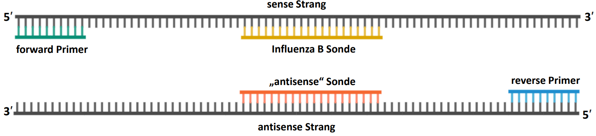

---
output:
  bookdown::pdf_document2:
    fig_caption: yes
    toc: TRUE
    toc_depth: 3
    fontsize: 12pt
    latex_engine: xelatex
bibliography: "Bachelor_quellen.bib"
csl: european-journal-of-taxonomy.csl
citation_package: biblatex
link-citations: yes
urlcolor: RoyalBlue
linkcolor: RoyalBlue
header-includes:
  \usepackage{float}
  \usepackage[ngerman]{babel}
  \usepackage[onehalfspacing]{setspace}
  \usepackage[utf8]{inputenc}
  \usepackage[dvipsnames]{xcolor}
  \usepackage[x11names]{xcolor}
  
  
---

```{r setup2, include=FALSE}
knitr::opts_chunk$set(echo = FALSE)

library(kableExtra)

```

\pagebreak

# Material und Methoden

## Bioinformatische Methoden

Das folgende Kapitel umfasst die Bioinformatisch durchgeführten Methoden wie das RPA Primerdesign sowie die Modifikation der Primer und Sonden. Des Weiteren wird die Auswertung der Messdaten und deren Analysemethoden erläutert.


### Primer- und Sondendesign für die Rekombinase Polymerase Amplifikation {#desing}

Für die Erstellung der RPA Primer und Sonden zur Detektion des Influenza A und B Virus wurde das von @Higgins2018 entwickelte Programm \emph{PrimedRPA} verwendet. Die Parameter für die Ausführung des Programms sind in Tabelle \@ref(tab:parameter) angegeben. 

```{r, parameter}

parameter <- read.csv2("Parameter.csv", fileEncoding="latin1")

kable(parameter, booktabs = TRUE, caption = "Übersicht der Parameter für das Primerdesign mit dem PrimedRPA-Programm") %>%
  kable_styling(latex_options = "hold_position")

```


Als Referenzsequenz für das Influenza B Virus diente das Virusgenomsegment 8 (GenBank Nr.: MT637911). Für das Influenza A Virus dienten die Sequenzen des Virusgenomsegmentes 7 der Subtypen H1N1 (GenBank Nr.: MT341937) und H3N2 (GenBank Nr.: MT244214) als Referenzsequenzen. Von beiden Subtypen wurde eine Konsensus-Sequenz erstellt und mithilfe dieser die Primer und Sonden designt. Die Primer und Sonden wurden so gewählt, dass sie 4 oder weniger Basenfehlpaarungen zwischen den beiden Subtypen aufweisen. Alle konstruierten Primer-Sonden-Kombinationen wurden mit dem Online-Programm \emph{PrimerDimer}^[http://www.primer-dimer.com/] von @Johnston2019 auf Eigenhybridisierung und Dimerbildung mit den anderen Konstrukten untersucht. Im Anschluss wurden die Primer-Sonden-Kombinationen mit DNA-Sequenzen des gleichen Virusgenomsegmentes von älteren Stämmen verglichen und mögliche Fehlpaarungen durch die Einführung degenerierter Primern vermieden. Für das Alignment wurde das Online-Programm \emph{Clustal Omega}^[https://www.ebi.ac.uk/Tools/msa/clustalo/] verwendet [@Sievers2017]. Für die Influenza A Primer-Sonden-Kombinationen wurden zusätzlich die Basen so angepasst, dass jeweils beide Subtypen ähnlich viele Fehlpaarungen aufweisen, um so ein optimales Alignment an die Sequenzen zu gewährleisten. Bei den Influenza B Primer-Sonden-Kombinationen war dies nicht notwendig, da die Sequenzen im gewählten Bereich homolog sind.

\pagebreak

### Fluoreszenzsonden und deren Modifikationen {#modifikation}

Das Prinzip der Signalgenerierung von Fluoreszenzsonden ist bei PCR und RPA gleich. Es beruht auf dem FRET-Prinzip (siehe \@ref(RTPCR)), welches während der Reaktion durch die räumliche Trennung des Reporterfluorophors und des Quenchers außer Kraft gesetzt wird. 

**PCR-Sonden**

Alle verwendeten PCR-Sonden (siehe Tabelle \@ref(tab:infaPSM) und \@ref(tab:infbPSM)) wurden am 5´-Ende mit einem Reporterfluorophor und am 3´-Ende mit einem Quencher markiert. Zusätzlich wurde an der 9 Basenposition ein zweiter Quencher eingebaut, um unspezifische Signale zu verringern [@Biomers2023].  

**RPA-Sonden**

Das Design der RPA-Sonden erfolgte wie in @behrmann2020c beschrieben, indem die erste Thymin-Base nach 30 bp mit dem Reporterfluorophor markiert wurde. Das nachfolgende Nukleotid wurde mit einer a-basischen Seite substituiert (siehe Abbildung \@ref(fig:probe)). Diese besteht aus einem Zuckerphosphat-Rückgrat ohne Nukleobase. Nachfolgend wurde über interne „*linker*" an die Phosphatgruppen des DNA-Rückgrades der nächsten zwei Nukleotide ein entsprechender Quencher gekoppelt (siehe Abbildung \@ref(fig:probe)A). Am 3´-Ende wurde die Sonde mit einem dreikettigen Kohlenstoff-Rest versehen, um eine Kettenverlängerung der Sonde zu unterbinden [@behrmann2020c; @Biomers1].
Für eine Sondenvergleichs-Studie wurde zusätzlich für das Influenza A Virus eine zweite _dT-Quenched_ -Sonde mit der gleichen Sequenz modifiziert. Die Kopplung des Quenchers erfolgte hierbei an das nachfolgende dT-Nukleotid (siehe Abbildung\thinspace \@ref(fig:probe)B).

(ref:label777) **Schematischer Aufbau der RPA-Sonden**: Vergleichende Gegenüberstellung der RPA-Sonden mit Reporterfluorophor (grün), Quencher (schwarz), a-basischer Seite und einem Kohlenstoffrest gebunden an die Ziel-DNA.   
**A**: Sonde mit intern gebundenem Quencher (*internally Quenched*, iQ).   
**B**: Sonde mit dT-gekoppeltem Quencher (*dT-Quenched*). Bild modifiziert nach @behrmann2020c

```{r probe, fig.align='center', fig.cap= "(ref:label777)", out.width= "75%", fig.scap= "Schematischer Aufbau der RPA-Sonden"}

knitr::include_graphics("Bilder/probes.png")

```

### Statistische Auswertung der Amplifikationen {#chipPCR}

Für die Entwicklung und Optimierung von Amplifikationsverfahren ist eine einheitliche statistische Auswertung notwendig [@Roediger2015]. Als Werkzeug einer digitalen Analyse wurde die „open source" Programmiersprache R verwendet, welche für spezifische Anwendungen durch die Verwendung sogenannter “packages” beliebig erweiterbar ist [@Pabinger2014]. Es wurde die R-Version 4.2.2 für die Auswertung der Daten verwendet.  
**Normalisierung der Fluoreszenz-Daten:**  
Für die Normalisierung der Daten wurde der Mittelwert der ersten fünf Messwerte jeder Amplifikationskurve berechnet, entsprechend @Ritz2008 und von diesem Datensatz subtrahiert.  
**Ermittlung signifikanter Amplifikationen:**  
Die Überprüfung, ob es sich bei den gemessenen Fluoreszenz-Datensatz um eine positive Amplifikation handelt, wurde mit dem \emph{chipPCR} Paket, von @Roediger2015 durchgeführt. Für die Auswertung wurden folgende Tests aus diesem Paket vorgenommen.

_**Shapiro-Wilk Test:**_  
Negative Amplifikationen unterliegen einem gleichmäßig starken Rauschen, weswegen eine Normalverteilung der Daten gegeben ist. Bei positiven Amplifikationen hingegen sind die Daten durch den linearen Anstieg in der exponentiellen Phase der Amplifikation nicht mehr normalverteilt. Anhand dieser Gesetzmäßigkeit lassen sich durch einen Test auf Normalverteilung positive von negativen Amplifikationen unterscheiden [@Roediger2022]. Mithilfe des Shapiro-Wilk Tests für Normalität [@SHAPIRO1965] wird der Datensatz auf Normalverteilung getestet. Bei errechneten P-Werten von $\geq 5*10^{-4}$ liegt keine Normalverteilung mehr vor und der Datensatz wird als positive Amplifikation gewertet.  
_**Residuen Wachstums Test:**_   
Bei diesem Test wird die Stabilität der Residuen in der linearen Phase des Anstiegs untersucht. Residuen lassen sich bei einer linearen Regression als Abweichung der einzelnen Messwerte zu der vorhergesagten Gerade verstehen. Dabei wird der horizontale Abstand der einzelnen Messpunkte zu der berechneten Geraden verwendet [@Fahrmeir2016]. Bei negativen Amplifikationen weichen die Fluoreszenzwerte von dem linearen Modell ab. Dadurch korrelieren die Residuen im Gegensatz zu positiven Amplifikationen stark mit den Fluoreszenzwerten. Anhand eines Schwellenwertes von 0,5 wird diese Korrelation untersucht und der Datensatz als positive bzw. negative Amplifikation eingestuft [@Roediger2022].  
_**Vergleichs Test:**_   
Innerhalb dieses Tests wird untersucht, ob sich die ersten 20 % des Datensatzes signifikant von den letzten 15 % unterscheiden. Dazu werden die beiden Datengruppen mit dem Wilcoxon-Mann-Whitney Test verglichen. Dieser Test erlaubt eine Aussage, ob sich zwei unabhängige Datengruppen signifikant voneinander unterscheiden [@Mann1947]. Bei einem p-Wert < 0,05 besteht ein solcher Unterschied und es handelt sich um eine positive Amplifikation.      
_**Signal Level Test:**_   
Dieser Test vergleicht zwei aus dem Datensatz berechnete Werte. Ersterer berechnet sich aus Formel \@ref(eq:eins), wobei MAD^[https://search.r-project.org/CRAN/refmans/ie2misc/html/madstat.html] (engl. _mean-absolut deviation_) für die absolute Standardabweichung steht (siehe R-Dokumentation). Der zweite Wert ist das Signal-Rausch-Verhältnis^[https://search.r-project.org/CRAN/refmans/warbleR/html/sig2noise.html] (SNR, engl. _signal noise ratio_), berechnet mit Formel \@ref(eq:zwei) (siehe R-Dokumentation). Bei einem um 25 % erhöhtem Wert des SNR im Vergleich zum ersten Wert wird die Amplifikation als positiv gewertet [@Roediger2022].  

\begin{equation} 
  Median + 2* MAD\; \; \; \; \; \; \;  mit \; \; \; \; MAD= n^{-1}\sum_{i=1}^{n}\left | O_{i}-\overline{O}\right |
  (\#eq:eins)
\end{equation} 
\begin{equation} 
  SNR=\frac{Mittelwert\: der \: Fluoreszenzwerte}{Standardabweichung\: der \: Fluoreszenzwerte}
  (\#eq:zwei)
\end{equation}

_**Polygon Test:**_   
Innerhalb dieses Tests wird der Anstieg ($\Delta y$) pro Zeitintervall ($\Delta t$) mit Formel \@ref(eq:drei) aufsummiert. Bei positiven Amplifikationen erreicht die Summe höhere Werte als bei negativen Amplifikationen, da hier das stärkere Rauschen der Daten die Endsumme niedrig hält [@Roediger2015]. Als Schwellenwert für eine positive Amplifikation wurde hier empirisch ein Wert von 10 festgelegt. 

\begin{equation}
  ((x_{2}-x_{1}))*((y_{2}+y_{1})) \; \;   \widehat{=}\; \; (\Delta t)*((y_{2}+y_{1}))
  (\#eq:drei)
\end{equation}

Des Weiteren wird oft bei Analysen von Echtzeit-Amplifikationsmethoden mit einen Schwellenwert gearbeitet. Sollte dieser während der Messung nicht überschritten werden, wird die Amplifikation als negativ eingestuft [@Aranha2021]. Um dies zu berücksichtigen, wurde der _Schwellenwert Test_, eingeführt.   
_**Schwellenwert Test:**_  
Für die Berechnung des Schwellenwertes wurde die von @Frey1998 beschriebene Methode verwendet. Diese beruht auf dem Median der gesamten Daten, zu welchem ein Faktor addiert wird. Der Faktor bildet sich dabei aus der Standardabweichung _SD_ der Daten multipliziert mit einem Term bestehend aus der Probenanzahl _n~1~_ und den Werten einer einseitigen Student's t-Verteilung (siehe Formel \@ref(eq:vier)) [@Frey1998]. Die Student's t-Verteilung ist dabei eine Art der Wahrscheinlichkeitsverteilung, welche es erlaubt möglichst genaue Berechnungen für kleine Stichproben durchzuführen [@Fisher1992]. Für die Schwellenwertberechnung wurden mindestens sechs Negativkontrollen als Datensatz verwendet. Das Konfidenzintervall für die t-Verteilung wurde bei 0,99 (99 %) festgelegt. 

\begin{equation} 
  Schwellenwert=\overline{X}+SD*t\sqrt{1+\frac{1}{n_{1}}} \; \; \; \; \; \; \; mit \; \; \; \;  SD=\sqrt{\frac{\sum (x_{i}-\overline{X})^{2}}{n_{2}-1}}
  (\#eq:vier)
\end{equation} 

Um eine Amplifikation als positiv einzustufen, müssen alle aufgeführten Tests ein positives Testergebnis aufweisen. Sobald ein oder mehrere Tests ein negatives Testergebnis zeigten, wird die Amplifikation als negativ eingestuft. 


**Ermittlung der Anstiegszeit **

Die Anstiegszeit, in der Literatur bei PCR-System als C~q~-Wert angegeben, ist der Zeitpunkt, bei dem die Fluoreszenzwerte einer Amplifikation einen vorher festgelegten Schwellenwert überschreiten und sich zusätzlich signifikant vom Grundrauschen unterscheiden [@Bustin2009]. Für die RPA wird dies als TT-Wert (engl. _threshold time_) definiert [@Diagne2020]. Zur Ermittlung der Anstiegszeit wurde der im \emph{chipPCR}-Paket vorhandene Befehl „th.cyc" verwendet. Dieser gleicht die Amplifikationskurve im Bereich des vorher festgelegten Schwellenwertes mit einer Polynomfunktion zweiten Grades an und gibt den Schnittpunkt mit dem Schwellenwert als Anstiegszeit aus. Hierzu wurde der im Schwellenwert Test beschrieben Wert (siehe Kapitel \@ref(chipPCR)) verwendet [@Roediger2015]. 

### Vergleich von Anstiegszeiten{#tt-wert}

In der deskriptiven Statistik ist der Vergleich von Datensätzen ein Standardverfahren. Bei zwei Gruppen wird dies mit dem Student's t-Test und bei drei oder mehr Gruppen mit einer einfaktoriellen Varianzanalyse durchgeführt [@Kuckartz2010]. Um diese Verfahren durchführen zu können, müssen als Voraussetzungen die Daten normalverteilt sein und gleiche Varianzen besitzen. Zusätzlich können Daten auf Ausreißer überprüft werden, um fehlerhafte Aussagen zu vermeiden [@Gehrau2022].
Der Test auf Normalverteilung wurde mit dem Shapiro-Wilk-Test auf Normalität durchgeführt [@GonzalezEstrada2022]. Anschließend wurden die Daten mit der Boxplot-Methode auf Ausreißer untersucht [@Gehrau2022]. Datenpunkte, die als Ausreißer identifiziert werden konnten, wurden für die folgenden Tests ignoriert. Der nachfolgende Test auf Varianzhomogenität mit den bereinigten Daten wurde mithilfe des Levene-Tests durchgeführt [@Gastwirth2009]. Bei zwei zu untersuchenden Gruppen mit festgestellter Varianzhomogenität wurde der Student's t-Test durchgeführt. Bei unterschiedlichen Varianzen wird die Voraussetzung für den Student's t-Test nicht mehr erfüllt und es wurde der alternative Welch t-Test durchgeführt [@WELCH1947]. Bei einem Vergleich von drei oder mehr Gruppen mit gleichen Varianzen wurde eine einfaktorielle Varianzanalyse durchgeführt, welche bei einem p-Wert von unter 0,05 mit einem nachfolgendem Tukey HSD Test kombiniert wurde, um die Verhältnisse zwischen den Gruppen zu untersuchen [@Rasch2014]. Bei unterschiedlichen Varianzen wurde eine Welch's Varianzanalyse durchgeführt. Konnten innerhalb der Welch's Varianzanalyse signifikante Unterschiede zwischen den Gruppen festgestellt werden, wurde nachfolgend ein Games Howell Test durchgeführt, um die Verhältnisse der einzelnen Gruppen zu untersuchen [@Lee2018].

   
### Probit-Analyse {#probit}

Die Probit-Analyse ist eine Form der Regressionsanalyse, welche binäre Fälle (0 und 1) mit einer fortlaufenden Variablen in Verbindung bringt. Dabei wird berechnet, mit welcher Wahrscheinlichkeit $y$ den Wert 1 an der Stelle $x$ annimmt. Vereinfacht wird die Normalverteilungsfunktion $\phi$ auf ein parametrisches Regressionsmodell (siehe Formel \@ref(eq:funf)) übertragen, d.h. es wird eine Regression von $\phi^{ -1 } \; (p_{ x })$ auf x durchgeführt [@Bingham2010]. Die sich daraus ergebende Regressionsgleichung ist in Formel \@ref(eq:sechs) gezeigt [@Stahel1999].


\begin{equation} 
p_{ x } = f(\vec{\alpha},x)+\epsilon_{ x },
(\#eq:funf)
\end{equation} 


\begin{equation}
\hat{q_{ i }} = \phi^{ -1 }(\hat{p}) = \hat{a}x_{ i } + \hat{b},i=1,...,k,
(\#eq:sechs)
\end{equation} 

Die von @Bliss1934 entwickelte Methode wurde ursprünglich für toxikologische Experimente genutzt, um die tödliche Dosis von Toxinen auf Lebewesen mathematisch zu bestimmen [@Bliss1934]. Aufgrund der gleichen Datenlage lässt sich dieses Modell jedoch auch verwenden, um das untere Detektionslimit mittels einer Konzentrationsreihe für ein Nukleinsäure-Amplifikationssystem zu ermitteln. Die Probit-Analyse anhand von Amplifikationsdaten erfolgte mittels eines R-Skripts beschrieben in @behrmann2020c. 

## Herstellung synthetischer RNA-Standards
Zur Etablierung und Optimierung der RPA-Protokolle wurde eine definierte Menge amplifizierbarer RNA-Moleküle eingesetzt, um damit die Vergleichbarkeit der Protokolle zu ermöglichen. Dafür wurden molekularbiologisch definierte Virus-RNA Standards der zu amplifizierenden Nukleinsäuren _in vitro_ hergestellt. Die RNA-Standards für das Influenza A Virus wurden, wie in den nachfolgenden Kapiteln beschrieben hergestellt. Für das Influenza B Virus war bereits eine transformierte _E. coli_ Kultur in der Arbeitsgruppe vorhanden. Aus diesem Grund sind die Arbeiten dazu erst ab Kapitel \@ref(isolation) beschrieben.

### Transformation von _E. coli_ mit Plasmid-DNA {#transformation}

Die chemische Transformation von NEB\textsuperscript{\textcopyright} 5-alpha kompetenten _E. coli_ Zellen (High Efficiency, New England BioLabs\textsuperscript{\textcopyright} GmbH) erfolgte nach Herstellerangaben (Protokoll^[https://international.neb.com/protocols/0001/01/01/high-efficiency-transformation-protocol-c2987] online verfügbar). Als Vektor dienten artifiziell synthetisierte Plasmide (Invitrogen), die eine Antibiotikaselektivkassette, die virale RNA-Sequenz als DNA-Gegenstück, sowie eine Promotorsequenz der T7 DNA-abhängigen RNA-Polymerase beinhalten (Plasmidkarten siehe Abbildung \@ref(fig:plasmidB) -  \@ref(fig:plasmidA214) im Anhang). Die entsprechenden GeneBank Referenznummern der Virus-RNA-Sequenzen wurden bereits beschrieben (Kapitel \@ref(desing)). Für die Transformation wurden jeweils 200 ng der Plasmide eingesetzt. Jeweils 25 µl des Transformationsansatzes wurde auf mit Ampicillin (Endkonzentration: 100 µg/ml, Roche diagnostics) versetzte Lennox LB-Platten (Carl Roth, Fertigmischung; 1,5\thinspace % Agar, AppliChem) als Selektivmedium ausplattiert und bei 37 °C über Nacht inkubiert. Zur Überprüfung der erfolgreichen Transformation wurde eine modifizierte Form der PCR, die Kolonie-PCR, durchgeführt. Hierbei dienen die transformierten Bakterien als Ausgangsmaterial. Mittels spezifischer PCR-Primer (siehe Tabelle \@ref(tab:infaPSM)), die das Insert innerhalb des Plasmids amplifizieren können, wird geprüft, ob die Transformation inklusive des gewünschten Inserts erfolgreich war [@Bergkessel2013]. Für die PCR wurde der Luna\textsuperscript{\textcopyright} Universal qPCR Master Mix (New England BioLabs\textsuperscript{\textcopyright} GmbH) eingesetzt. Eine Kolonie der transformieren _E. coli_ wurde in 20 µl PCR-reinem Wasser (Nuklease- und Nukleinsäure-frei, DEPC behandelt, Carl Roth, H~2~O~DEPC~) resuspendiert. Von dieser Bakteriensuspension wurden 2 µl mit 18 µl PCR-Mix (nach Herstellerangaben hergestellt, Protokoll^[https://international.neb.com/protocols/2016/11/08/luna-universal-qpcr-master-mix-protocol-m3003] online verfügbar) gemischt und eine PCR im Light Cycler 480 II (Roche diagnostics) durchgeführt. Das Temperaturprogramm der 2-stufigen PCR ist in Tabelle \@ref(tab:kPCR) angegeben. Weitere 5 µl der Suspension wurden auf einer mit Ampicillin versetzten Lennox LB-Platte ausplattiert und bei 37 °C über Nacht inkubiert, um eine Folgekultur der überprüften Transformande zu erhalten.


```{r, kPCR}

parameter <- read.csv2("koloniePCR.csv", header = FALSE, fileEncoding="latin1")

kable(parameter, booktabs = TRUE, col.names = NULL, caption = "Temperaturprotokoll für die Kolonie-PCR") %>%
   add_header_above(c("Temperatur"= 1, "Zeit"= 1, "Zyklen Anzahl"=1), line_sep=0) %>%
  kable_styling(latex_options = "hold_position") %>%
  footnote( symbol = c("Messung der Fluoreszenz"))%>%
  pack_rows("Zellaufschluss", 1, 1) %>%
  pack_rows("Amplifikation", 2, 3) %>%
  pack_rows("Kühlung", 4, 4) %>%
  column_spec(1, width = "0.8in") %>%
  column_spec(2, width = "0.8in") %>%
  column_spec(3, width = "0.4in") 
  

```

### Extraktion der Plasmid-DNA aus Übernachtkulturen {#isolation}

Die transformierten Bakterien wurden submers bei 37 °C und 200 RPM über Nacht in 25 ml Lennox LB-Medium (mit 100 µg/ml Ampicillin) kultiviert. 
Die Isolierung der Plasmid-DNA erfolgte mit dem Plasmid Midi Kit (Qiagen) nach Herstellerangaben (Protokoll^[https://www.qiagen.com/us/resources/download.aspx?id=0bd0c5fb-c271-43e7-af43-32d539374fa9&lang=en] online verfügbar). Das Prinzip der Qiagen DNA-Reinigung beruht dabei auf einer speziellen alkalischen Lyse der Bakterien kombiniert mit einem Ionen Austausch [@QIAGEN2021]. Hierbei wird die negativ geladene DNA an ein positiv geladenes Säulenmaterial wie Diethylaminoethyl (DEAE) Zellulose gebunden [@Gautam2022]. Durch in Salzkonzentrationen variierende Puffer kann die gebundene DNA von Unreinheiten befreit und eluiert werden [@Prazeres1998]. Die Elution der DNA im letzten Schritt wurde mit 30 µl H~2~O~DEPC~ durchgeführt. Eine anschließende Messung der DNA-Konzentration erfolgte mit dem NanoDrop 8000 Spektrophotometer (Thermo Fisher Scientific).

### Sequenzierung der extrahierten Plasmide {#sequenzierung}

Zur Prüfung der Vollständigkeit der inserierten DNA-Zielsequenz, wurde die extrahierte Plasmid-DNA mittels Sequenzierung untersucht. Dabei wird der Plasmidabschnitt mit der Virussequenz über eine PCR amplifiziert und mittels der von @Sanger1977 beschriebenen Kettenabbruchmethode mit fluoreszenzmarkierten Didesoxynukleotiden amplifiziert. [@Muelhardt2009]. Als Primer für die extrahierte Plasmid-DNA (\@ref(isolation)) wurde der Vorwärtsprimer M13 (5'-GTAAAACGACGGCCAG-3') und der Rückwärtsprimer M13r (5'-CAGGAAACAGCTATGAC-3') verwendet. Die Sequenzierung erfolgte bei der Firma Microsynth Seqlab.

### Restriktionsverdau zur Linearisierung des Plasmids {#verdau}

In Vorbereitung für eine _in vitro_ Transkription zum Erstellen der viralen RNA-Standards wurde die extrahierte Plasmid-DNA (\@ref(isolation)) linearisiert. Dafür wurden Restriktions-Endonukleasen benutzt, welche innerhalb ihrer spezifischen Erkennungssequenzen den DNA-Doppelstrang schneiden [@Smitha].
Für das Influenza B Plasmid (Abbildung \@ref(fig:plasmidB), Anhang) wurde das Enzym *Sac*I (Fast Digest, Thermo Fisher Scientific) verwendet. Der Restriktionsverdau erfolgte in 30 µl einfach konzentriertem Fast Digest Puffer (Thermo Fisher Scientific), der mit 6 µl Enzym und 3 µg Plasmid-DNA versetzt wurde. Der Restriktionsansatz wurde für 30 min bei 37 °C im Wasserbad inkubiert und anschließend bei 65 °C für 5 min inaktiviert.
Für die Influenza A Plasmide (siehe Abbildung \@ref(fig:plasmidA937) - \@ref(fig:plasmidA214) im Anhang) wurde das Enzym *Psh*AI (Thermo Fisher Scientific) verwendet. Der Restriktionsverdau erfolgte mit einer Enzymkonzentration von 1,5 U/µl in 40 µl einfach konzentriertem Tango Puffer (Thermo Fisher Scientific), welcher mit 3 µg Plasmid-DNA versetzt wurde. Der Restriktionsansatz wurde für 2 h im Wasserbad bei 37\thinspace °C inkubiert und anschließend bei 80 °C für 20 min inaktiviert.   
Zur Überprüfung des Restriktionsverdaus wurde eine Agarose-Gelelektrophorese durchgeführt. Die negativ geladene DNA wandert durch das Anlegen einer Spannung durch ein Trägermaterial (Agarose-Gel) Richtung Anode. Dabei wandern kürzere DNA-Moleküle schneller durch das Trägermaterial als längere, wodurch DNA-Moleküle anhand ihrer Sequenzlänge aufgetrennt werden. Plasmide laufen je nach Konformation bei gleichen Sequenzlängen unterschiedlich schnell. So zeigen ungeschnittene Plasmide eine stark verdrillte („*supercoiled*") Form, welche eine schwächere sterische Beeinträchtigung der Gittermatrix erfährt als die linearisierte Plasmid-DNA. Des Weiteren wandern durch einen Einzelstrangbruch entdrillte zirkuläre Plasmide („*nicked circular*") langsamer durch die Gittermatrix. Somit lassen sie die unterschiedlichen Plasmidformen (linear, *supercoil*, *nicked circular*) im Gel unterscheiden [@Ali2012; @Schmidt1999]. Zur visuellen Detektion der DNA-Fragmente wird die aufgetrennte DNA durch einen Farbstoff markiert [@Muelhardt2009]. Als Trägermaterial diente ein Agarosegel mit 1 % (w/v) Agarose in 1X TRIS-Borat-EDTA-Puffer (Roti\textsuperscript{\textcopyright}fair, Carl Roth) versetzt mit 1,5 µl GreenGel DNA/RNA Stain (Bio & Sell). Pro Geltasche wurden  100 ng DNA-Material mit 1 µl 6X *orange loading DYE* (Thermo Fisher Scientific) in einem finalen Volumen von 6 µl  analysiert. Als Referenz wurden jeweils  3 µl einer 100 bp plus DNA-Leiter (GeneRuler, Thermo Fisher Scientific) und einer 1 kb DNA-Leiter (PeqGOLD, Thermo Fisher Scientific) mitgeführt. Die angelegte Spannung betrug 80 V für 60\thinspace min. Nach der erfolgten Elektrophorese wurde das Gel bei UV-Licht mithilfe des Geldokumentationsgeräts BIORAD universal Hood II (Bio-Rad) ausgewertet.

### DNA-Reinigung des Restriktionsverdaus {#cleaning}

Zur Entfernung von Puffer- und Enzymbestandteilen des inaktivierten Restriktionsansatzes, wurde das DNA clean & concentrator Kit (Zymo Research) nach Herstellerangaben verwendet. (Protokoll^[https://files.zymoresearch.com/protocols/_d4003t_d4003_d4004_d4013_d4014_dna_clean_concentrator_-5.pdf] online verfügbar). Die Elution im letzten Schritt des Herstellerprotokolls erfolgte mit 10 µl DNA Elutionspuffer (10 mM Tris-HCl; 0,1 mM EDTA; pH 8,5; bereitgestellt im Kit). Anschließend wurde die Quantität und Reinheit der DNA mittels NanoDrop 8000 Spektrophotometer bestimmt.

### _In vitro_ Transkription zur Herstellung von viralen RNA-Standards {#transkription}

Da RNA das genomische Material der Influenza Viren ist, wurden die DNA-Fragmente in RNA transkribiert. Für diesen Zweck wurde die T7 Promotor-Region vor der viralen Sequenz auf dem Plasmid verwendet (Plasmidkarten \@ref(fig:plasmidB) - \@ref(fig:plasmidA214) im Anhang).   
Die _in vitro_ Transkription erfolgte mit dem HiScribe\textsuperscript{TM} T7 High Yield RNA Synthesis Kit (New England BioLabs) nach Herstellerangaben (Protokoll^[https://international.neb.com/protocols/0001/01/01/standard-rna-synthesis-e2040] online verfügbar). Pro Reaktion wurde 1 µg linearisierte und gereinigte DNA aus Kapitel \@ref(verdau) eingesetzt. Anschließend wurde die Reaktion für 2 h bei 37 °C im Wasserbad inkubiert. Zur Entfernung residualer Anfangs-DNA aus der RNA-Lösung wurde anschließend ein DNAse-Verdau durchgeführt, da diese bei späteren Amplifikationen ebenfalls als Ausgangsmaterial verwendet werden würde und so die Messergebnisse verfälscht. Dazu wurde der Mix mit 70 µl  H~2~O~DEPC~ verdünnt und 10 µl 10X DNAse-Puffer (New England Biolabs) dazugegeben. Die entstandene Reaktionslösung wurde mit 4\thinspace U DNAse I (New England Biolabs) versetzt und abermals bei 37 °C für 15 min inkubiert.
Um Puffer- und Enzymbestandteile aus den vorherigen Arbeitsschritten zu entfernen und eine reine RNA-Lösung zu erhalten, wurde das EchoCLEAN RNA CleanUp Kit (BioEcho Life Sciences) nach Herstellerangaben durchgeführt (Protokoll^[https://bioecho-prod-media-hp.s3.sbg.perf.cloud.ovh.net/media/e8/6b/93/1650492291/Protocol_EchoCLEANRNACleanupcolumn_001_EN.pdf] online verfügbar). Das Prinzip der RNA-Reinigungsmethode von BioEcho basiert dabei auf einer Matrix, welche durchlässig für Nukleinsäuren ist, jedoch andere Verunreinigungen bindet [@BioEcho2022]. 

### RiboGreen Assay zur Quantifizierung von RNA {#ribogreen}

Zur präzisen Bestimmung der RNA-Konzentration wurde das Quant-iT RiboGreen RNA-Kit (Thermo Fisher Scientific) verwendet. Das Prinzip basiert auf der Bindung eines gleichnamigen Fluoreszenzfarbstoffes an eine einzelsträngige RNA. Durch die Bindung erhöht sich die Fluoreszenz des Farbstoffes um den Faktor 1000, so dass eine sensitive Detektion von bis zu 1 ng/ml RNA ermöglicht wird [@Jones1998]. Vor der RNA-Konzentrationsbestimmung wurde eine Kalibriergerade im „*High-Range*" Bereich erstellt. Dazu wurden mit dem im Kit enthaltenen RNA-Standard fünf Kalibrierlösungen im Bereich zwischen 2000 ng/ml und 50 ng/ml mit 1X TE-Puffer (Thermo Fisher Scientific) hergestellt. Die zu messende RNA-Probe wurde ebenfalls mit 1X TE-Puffer auf eine innerhalb der Kalibriergerade liegende Konzentration verdünnt. Jede Messlösung der Kalibriergerade sowie die zu bestimmende RNA-Lösung wurde 1:1 mit einer Farblösung (RiboGreen 1:200 in 1X TE-Puffer) gemischt. Diese wurde homogenisiert, für 2 min auf Eis im Dunklen gelagert und anschließend nochmal gemischt. Die Fluoreszenzmessung erfolgte im Nanodrop 3300 Fluoreszenzspektrometer bei 525 nm.

## Erstellung von RNA-Referenzproben mit humanem Nukleinsäure-Hintergrund {#klinischeproben}

Zur Überprüfung, ob die Detektion von RNA mittels RT-RPA von einem humanen Probenhintergrund beeinflusst wird, wurden Referenzproben erstellt. Dazu wurden von gesunden Mitarbeitern nasopharyngeale-Abstriche mithilfe der Mini UTM Kit 1 ml Swabs (360c, Copan) entnommen und die humane Gesamt-Nukleinsäure mithilfe des QiAamp Viral RNA Mini Kits (Qiagen) nach Herstellerangaben isoliert (Protokoll online^[https://www.qiagen.com/us/resources/resourcedetail?id=c80685c0-4103-49ea-aa72-8989420e3018&lang=en] Verfügbar). Die Elution erfolgte in 60 µl AVE-Puffer (Bereitgestellt vom Kit). In die RNA-Extrakte wurde in einem 1:10 Verhältnis die entsprechende virale Standard-RNA zugegeben und die Referenzprobe homogenisiert.   


## Nukleinsäure Amplifikation

In diesem Kapitel werden die durchgeführten NAATs beschrieben. Darunter fallen die RT-qPCR, die RT-RPA sowie die verschiedenen Optimierungen der isothermen Amplifikations- bzw. Detektionssysteme des Influenza A und B Virus.

###  Reverse Transkription Real Time Polymerase Kettenreaktion (RT-qPCR) {#rtpcr}

Die Amplifikation viraler Standard RNA mit der RT-qPCR Methode wurde mit dem Luna\textsuperscript{\textcopyright} Universal Probe One-Step RT-qPCR Kit durchgeführt. Pro Reaktion wurden 19 µl Reaktionsmix (siehe Tabelle \@ref(tab:infPCR)) mit 1 µl des jeweiligen Virus-RNA-Standards versetzt. Für den in Tabelle \@ref(tab:infPCR) angegebenen Primer-Sonden-Mix (PSM) wurden je nach Detektionssystem die für Influenza A (siehe Tabelle \@ref(tab:infaPSM)) bzw. Influenza B (siehe Tabelle \@ref(tab:infbPSM)) angegebenen Primer und Sonden verwendet. Die verwendeten Primer und Sonden sind durch das Nationale Center für Immunisierung und Respiratorische Krankheiten (NCIRD) beschrieben [@NCIRD2021]. Dabei sind jeweils die Oligonukleotid-Sequenz und die verwendeten Fluorophore und Quencher (siehe \@ref(desing)) dargestellt. Der finale 20 µl Reaktionsmix wurde nach dem in Tabelle \@ref(tab:infbTEMP) angegebenen Temperaturprotokoll im LightCycler\textsuperscript{\textcopyright} 480 (Roche) gemessen. Für das Hexachlorofluorescein (HEX) Fluorophor wurde im HEX-Kanal (Extinktion: 523 nm, Emission: 586 nm) gemessen. Die Erfassung des Cyanine 5 (Cy5) Fluorophors erfolgte im Cy5-Kanal (Extinktion: 615 nm, Emission 670 nm) Die Auswertung der Daten erfolgte, wie bereits in Kapitel \@ref(chipPCR) beschrieben.


(ref:tablepcr) bei Wasserkontrollen wurde die Virus-RNA mit H~2~O~DEPC~ substituiert

```{r, infPCR}
infbPCR <- read.csv2("infbPCR.csv", fileEncoding="latin1")
kable(infbPCR, booktabs = TRUE, format = "latex", escape = FALSE, caption = "Zusammensetzung des Influenza PCR-Reaktionsmixes") %>%
  kable_styling(latex_options = "hold_position") %>%
  footnote(symbol = "(ref:tablepcr)",threeparttable = T, escape= FALSE, footnote_as_chunk =TRUE)
```

```{r, infaPSM}
infaPSM <- read.csv2("infaPSM.csv", header = FALSE, fileEncoding="latin1")
kable(infaPSM, booktabs = TRUE, col.names = NULL, caption = "Zusammensetzung des Influenza A Primer-Sonden-Mixes") %>%
  add_header_above(c("Name"= 1, "Sequenz (5´->3´)"= 1, "Endkonzentration"=1, "Modifikation"=1), line_sep=0) %>%
  kable_styling(latex_options = "scale_down") %>%
  kable_styling(latex_options = "hold_position") %>%
  column_spec(4, width = "1.5in") %>%
  footnote( symbol = c("Y=C oder T; V=A, C oder T", "(ref:design)"), symbol_manual = c('*', '**', '***'), fixed_small_size = TRUE, general_title = "Notiz:", escape= FALSE, footnote_as_chunk =TRUE)

```

```{r, infbPSM}
infbPSM <- read.csv2("infbPSM.csv", header = FALSE, fileEncoding="latin1")
kable(infbPSM, booktabs = TRUE, col.names = NULL, caption = "Zusammensetzung des Influenza B Primer-Sonden-Mixes") %>%
  add_header_above(c("Name"= 1, "Sequenz (5´->3´)"= 1, "Endkonzentration"=1, "Modifikation"=1), line_sep=0) %>%
  kable_styling(latex_options = "hold_position") %>%
  kable_styling(latex_options = "scale_down")%>%
  column_spec(4, width = "1.5in")%>%
   footnote(symbol = c("Y=C oder T; V=A, C oder T", "(ref:design)"), symbol_manual = c('*', '**', '***'), fixed_small_size = TRUE, general_title = "Notiz:", escape= FALSE, footnote_as_chunk =TRUE)
```

```{r, infbTEMP}

infbTEMP <- read.csv2("infbTEMP.csv", fileEncoding="latin1")

kable(infbTEMP, booktabs = TRUE, caption = "Temperaturprotokoll für die Influenza PCR") %>%
  footnote( symbol = c("Messung der Fluoreszenz"))%>%
  kable_styling(latex_options = "hold_position") %>%
  pack_rows("Reverse Transkription", 1, 2) %>%
  pack_rows("Amplifikation", 3, 4) %>%
  pack_rows("Kühlung", 5, 5) %>%
  column_spec(1, width = "0.8in") %>%
  column_spec(2, width = "0.8in") %>%
  column_spec(3, width = "0.6in")
  

```

\pagebreak

### Reverse Transkription Rekombinase Polymerase Amplifikation im 50 µl Ansatz {#RPAnormal}
\hfill
Für die Amplifikation von Nukleinsäuren mittels RT-RPA wurde das TwistAmp\textsuperscript{\textcopyright} exo Kit (TwistDX\texttrademark{}) verwendet. Die für die RT-RPA verwendeten Oligonukleotide sind für Influenza B in Tabelle \@ref(tab:infboligo) und für Influenza A in Tabelle \@ref(tab:infaoligo) angegeben. Pro Reaktion wurde 46,5 µl Rehydrationsmix (Zusammensetzung siehe Tab. \@ref(tab:RPAMM)) hergestellt und auf das lyophilisierte RPA-Enzympellet zur Resuspension übertragen. Die Lösung wurde für ca. 2 min bei Raumtemperatur inkubiert und anschließend gut gemischt. Die resuspendierte RT-RPA-Reaktion (46,5 µl) wurde in eine Kavität eines 8-ter Streifens (Carl Roth) übertragen und kurz zentrifugiert. Nachfolgend wurde 1 µl zu amplifizierende Virus-RNA bzw. 1 µl H~2~O~DEPC~ (Wasserkontrolle ohne Ziel-RNA) zum Reaktionsmix gegeben, sowie 2,5 µl Magnesium Acetat (280 mM) in den Deckel der Kavität pipettiert. Zum Start der Reaktion wurde der Messstreifen kurz zentrifugiert und homogenisiert, um das Magnesium-acetat in den Reaktionsmix einzubringen und somit den benötigten Co-Faktor der _Sau_ DNA-Polymerase bereitzustellen [@Kueck2005]. Die Messung erfolgte nach einer einminütigen Equilibrierungszeit im ESEQuant TS2.4 (Qiagen) bei 38 - 42 °C. Für das Fluorophor FAM erfolgte die Anregung bei 470 nm und die Messung der Fluoreszenz bei 520 nm. Die Anregung des Fluorophors ATTO565 erfolgte bei 560 nm und die Messung der Fluoreszenz wurde bei 625 nm detektiert. Dabei wurden die Parameter des Geräts mit dem vom Hersteller vorgegebenem Programm TS2 Studio v1.17.1.1 (Qiagen) eingestellt. Je nach Versuch wurde die Messung für einen zusätzlichen Mischschritt unterbrochen. Die Auswertung der Daten erfolgte, wie bereits in Kapitel \@ref(chipPCR) beschrieben.

(ref:design) Modifiziert wie in Kapitel \@ref(modifikation) beschrieben.

(ref:weiter) Primer/Sonden modifiziert nach @Ehnts2013

(ref:weiter11) Mit PrimedRPA designte Primer (siehe \@ref(desing))

(ref:weiter111) Sonde für die Primerasymmetrie-Untersuchung (siehe \@ref(asymetrexperi))


```{r, infboligo}
RPAoligo <- read.csv2("infB_oligos.csv", header = FALSE)
kable(RPAoligo, booktabs = TRUE, col.names = NULL, format = "latex", escape = FALSE, caption = "Entwickelte Primer und Sonden für die Influenza B RT-RPA") %>%
  add_header_above(c("Name"= 1, "Sequenz (5´->3´)"= 1, "Modifikation"=1), line_sep=0) %>%
  column_spec(3, width = "1.5in")%>%
    pack_rows("(ref:weiter11)", 1, 11) %>%
  pack_rows("(ref:weiter111)", 12, 12) %>%
  kable_styling(latex_options = "hold_position") %>%
  kable_styling(latex_options = "scale_down") %>%
  footnote( symbol = c("1: Reporterfluorophor; 2: a-basische Seite; 3: Quencher" , "(ref:design)"), symbol_manual = c('*', '**', '***'), fixed_small_size = TRUE, general_title = "Notiz:", escape= FALSE, footnote_as_chunk =TRUE)
```


```{r, infaoligo}
RPAoligo <- read.csv2("infA_oligos.csv", header = FALSE)
kable(RPAoligo, booktabs = TRUE, col.names = NULL, format = "latex", escape = FALSE, caption = "Entwickelte Primer und Sonden für die Influenza A RT-RPA") %>%
  add_header_above(c("Name"= 1, "Sequenz (5´->3´)"= 1, "Modifikation"=1), line_sep=0) %>%
  column_spec(3, width = "1.5in")%>%
  pack_rows("(ref:weiter11)", 1, 10) %>%
  pack_rows("(ref:weiter)", 11, 15) %>%
  kable_styling(latex_options = "hold_position") %>%
  kable_styling(latex_options = "scale_down") %>%
  footnote( symbol = c("1: Reporterfluorophor; 2: a-basische Seite; 3: Quencher" , "(ref:design)"), symbol_manual = c('*', '**', '***'), fixed_small_size = TRUE, general_title = "Notiz:", escape= FALSE, footnote_as_chunk =TRUE)
```


```{r, RPAoligo}
#RPAoligo <- read.csv2("RPAoligo.csv", header = FALSE)
#kable(RPAoligo, booktabs = TRUE, col.names = NULL, format = "latex", escape = FALSE, caption = "Entwickelte Primer und Sonden für die Recombinase Polymerase Amplifikation") %>%
#  add_header_above(c("Name"= 1, "Sequenz (5´->3´)"= 1, "3´-Position"=1, "Modifikation"=1), line_sep=0) %>%
 # pack_rows("Influenza B", 1, 4) %>%
#  pack_rows("Influenza A", 5, 7) %>%
 # column_spec(4, width = "2in")%>%
#  kable_styling(latex_options = "hold_position") %>%
#  kable_styling(latex_options = "scale_down") %>%
#  footnote( symbol = c("Y=C oder T; 1: Repoterfluorophor; 2: a-basische Seite; 3: Quencher" , "(ref:rr2a)"), symbol_manual = c('*', '**', '***'), fixed_small_size = TRUE, general_title = "Notiz:", escape= FALSE, footnote_as_chunk =TRUE)
```

```{r, RPAMM}

RPAMM <- read.csv2("RPAMM.csv", header = FALSE, fileEncoding="latin1")

kable(RPAMM, booktabs = TRUE, col.names = NULL, format = "latex", escape = FALSE, caption = "Zusammensetzung des Rehydrationsmixes") %>%
  kable_styling(latex_options = "hold_position") %>%
  add_header_above(c("Bestandteil"= 1, "Endkonzentration"= 1, "Volumen"=1, "Hersteller"=1), line_sep=0)%>%
  footnote(symbol = "(ref:tablepcr)",threeparttable = T, escape= FALSE, footnote_as_chunk =TRUE)

```

\pagebreak 

### Reverse Transkription Rekombinase Polymerase Amplifikation im geringvolumigen Ansatz {#8telRPA}
Wie bereits in @behrmann2020c und @Lillis2016 beschrieben, kann das Reaktionsvolumen der RPA deutlich verringert werden. Die Vorteile sind hier nicht nur eine Kosteneinsparung durch weniger Materialverbrauch, sondern auch die Möglichkeit, den Mischschritt während der Reaktion vernachlässigen zu können [@Lillis2016]. Durch das geringere Volumen der RPA sind auch mikrofluidische Anwendungen möglich [@behrmann2020c]. 
Für den geringvolumigen Ansatz wurde die Standard RT-RPA-Reaktion mit 50 µl Gesamtvolumen ein neues Reaktionsvolumen von 6,5 µl reduziert. Für acht Reaktionen wurde dabei insgesamt 40,8 µl Rehydrationsmix (Zusammensetzung siehe Tab. \@ref(tab:achtRPA)) hergestellt und auf das lyophilisierte RPA-Enzympellet zur Resuspension übertragen. Die Zusammensetzung des in Tabelle \@ref(tab:achtRPA) aufgeführten 50X PSM´s ist in Tabelle \@ref(tab:psmRPA) gezeigt. Die Lösung wurde für ca. 2 min bei Raumtemperatur inkubiert und anschließend gut gemischt. Die resuspendierte RT-RPA-Reaktion wurden auf einen 8-ter Streifen aufgeteilt (4,8 µl pro Kavität) und dieser kurz zentrifugiert. Jeweils pro Kavität wurde 1 µl zu amplifizierende Virus-RNA bzw. 1 µl H~2~O~DEPC~ (Wasserkontrolle) zum Reaktionsmix gegeben. Darauffolgend wurden 15 µl Mineralöl (Carl Roth) in den Gefäß-Deckel pipettiert, zur Verhinderung einer möglichen Evaporation des Reaktionsmixes während der Messung. Als Letztes wurden jeweils 0,64 µl Magnesium-Acetat (140mM) an die Innenseite der Kavität pipettiert. Zum Start der Messung wurde der Messstreifen kurz zentrifugiert und homogenisiert, um das Magnesium in den Reaktionsmix einzubringen und ihn mit Mineralöl zu überschichten. Die Messung erfolgte nach einer einminütigen Equilibrierungszeit im ESEQuant TS2.4 (Qiagen) bei 38 - 42 °C. Für das FAM-Fluorophor erfolgte die Anregung bei 470 nm und die Messung der Fluoreszenz bei 520 nm. Die Anregung des Fluorophors ATTO565 erfolgte bei 560 nm und die Messung der Fluoreszenz wurde bei 625 nm detektiert. Dabei wurden die Parameter des Geräts mit dem vom Hersteller vorgegebenem Programm TS2 Studio v1.17.1.1 (Qiagen) eingestellt. Je nach Versuch wurde die Messung für einen zusätzlichen Mischschritt unterbrochen. Die Auswertung der Daten erfolgte, wie in Kapitel \@ref(chipPCR) beschrieben.

\pagebreak

```{r, achtRPA}

achtRPA <- read.csv2("achtRPA.csv", header = FALSE, fileEncoding="latin1")

kable(achtRPA, booktabs = TRUE, format = "latex", escape = FALSE, col.names = NULL, caption = "Zusammensetzung des Rehydrationsmixes für den geringvolumigen Ansatz") %>%
  kable_styling(latex_options = "hold_position") %>%
  add_header_above(c("Bestandteil"= 1, "Endkonzentration"= 1, "Volumen"=1, "Hersteller"=1), line_sep=0)

```

```{r, psmRPA}
psmRPA <- read.csv2("psmRPA.csv", header = FALSE, fileEncoding="latin1")

kable(psmRPA, booktabs = TRUE, col.names = NULL, caption = "Zusammensetzung des Primer-Sonden-Mixes für den geringvolumigen Ansatz") %>%
  kable_styling(latex_options = "hold_position") %>%
  add_header_above(c("Bestandteil"= 1, "Endkonzentration"= 1, "Hersteller"=1), line_sep=0)

```


### Primer- und Sondenauswahl für die RT-RPA {#screening}

Für die Entwicklung der RT-RPA wurden die in Kapitel \@ref(desing) designten Sonden mit ihren jeweiligen forward und reverse Primern auf eine positive Amplifikation getestet. Dabei wurden Anstiegszeit, maximale Fluoreszenzauslenkung und Ausprägung des Anstiegs als Kriterien für die Auswahl festgelegt. Zusätzlich wurde darauf geachtet, dass die Wasserkontrollen keine Amplifikation aufweisen. Die RT-RPA für die Primer- und Sondenauswahl erfolgte im 50 µl Ansatz (siehe Kapitel \@ref(RPAnormal)) bei 40 °C. Als Template-RNA wurden bei Influenza B 10^6^ Kopien/µl und bei Influenza A 10^7^ Kopien/µl (H1N1 Subtyp) des RNA-Standards eingesetzt.

### Adaption des Reaktionsvolumens der RT-RPA {#reaktadapt}

Die Reduzierung des Reaktionsvolumens der RPA bringt einige Vorteile mit sich (Kapitel \@ref(8telRPA)). Um eine Adaptierung des geringvolumigen Ansatzes der ausgewählten Primer-Sonden-Kombination für den Einsatz als _Lab-on-a-chip_ Applikation zu prüfen, wurde ein Vergleich der beiden Reaktionsvolumina (50 µl Ansatz (Kapitel \@ref(RPAnormal)) und geringvolumiger Ansatz (Kapitel \@ref(8telRPA)) durchgeführt. Die Influenza B RT-RPA wurde bei 40 °C, ohne zusätzlichen Mischschritt und einer eingesetzten RNA-Konzentration von 10^6^ Molekülen/µl gemessen. Die Influenza A RT-RPA wurde bei 42 °C, ohne zusätzlichen Mischschritt und einer eingesetzten RNA-Konzentration von 10^8^ Kopien/µl (H1N1-Subtyp) durchgeführt.

### Optimierung der Reaktionstemperatur für die RT-RPA {#optimierungT}

Die klassische RPA ist für einen Temperaturbereich von 37 - 42 °C ausgelegt [@TwistDx2018], wobei verschiedene RPA-Systeme unterschiedliche Temperaturoptima aufweisen [@Li2019]. Dementsprechend wurden die Temperaturoptima der ausgewählten Primer-Sonden-Kombination untersucht. Die Optimierung erfolgte im Temperaturintervall zwischen 38 - 42 °C. Es wurden je die Temperaturen 38 °C, 40 °C, 42 °C für die RT-RPA getestet. Für Influenza B erfolgte die Temperaturoptimierung im geringvolumigen Ansatz (siehe Kapitel \@ref(8telRPA)), mit einer eingesetzten RNA-Konzentration von 10^6^ Kopien/µl. Das Temperaturoptimum bei Influenza A wurde im 50 µl Ansatz (siehe Kapitel \@ref(RPAnormal)) bei einer RNA-Konzentration von 10^7^ Kopien/µl (H1N1 Subtyp) bestimmt.

### Testung asymmetrischer Primerkonzentrationen {#asymetrexperi}

Die Primerasymmetrie, sprich die ungleiche Verteilung der benötigten Primer ist für die PCR bereits in der Literatur beschrieben. Die ungleichmäßige Verteilung der Primer führt in der dazu, dass spezifisch der sense- oder antisense-Strang öfter amplifiziert wird und somit eine einzelsträngige DNA entsteht [@Chen2010]. Der asymmetrische Ansatz konnte von @Kersting2014 und @Wang_2019 auf die RPA angewendet werden, um über die entstandene einzelsträngige DNA einen Nachweis mittels Microarray bzw. über einen enzymkatalysierten Farbumschlag durchzuführen [@Kersting2014; @Wang_2019]. Innerhalb der qPCR konnte gezeigt werden, dass die entstehende einzelsträngige DNA zu einer erhöhten Hybridisierungskinetik von „*molecular beacon*"-Sonden führt und somit ein erhöhtes Fluoreszenz-Signal zur Folge hat [@Poddar2000].

_**Einführung der Primerasymmetrie in die RT-RPA:**_

Um das von @Poddar2000 beschriebene Prinzip auf die RT-RPA zu adaptieren wurde eine Primerasymmetrie auf die Influenza B RT-RPA angewendet. Es wurde eine 2X reverse Primerasymmetrie (0,9 µM) eingeführt, um den zur verwendeten Exo-Sonde komplementären sense-Strang asymmetrisch zu vervielfältigen. Die Messung erfolgte im geringvolumigen Ansatz (Kapitel \@ref(8telRPA)) bei 40 °C mit einer eingesetzten RNA-Konzentration von 10^7^ Kopien/µl. Als Referenz wurde eine RT-RPA ohne Primerasymmetrie mitgeführt. Als Kontrolle wurde die forward Primer-Konzentration auf 0,9 µM angeglichen und so ein equimolares Primerverhältnis hergestellt. Die Messung erfolgte bei den gleichen Reaktionsparametern. 

_**Einfluss der Hybridisierungs-Orientierung der Sonde:**_

Laut dem von @Poddar2000 beschriebenem Prinzip, hängt die Fluoreszenzerhöhung mit einer erhöhte Hybridisierungskinetik der Sonde an die, durch die Primerasymmetrie vorliegende einzelsträngige DNA zusammen. Dadurch würde in der RT-RPA eine häufigere Spaltung der Sonde (d.h. ein höheres Fluoreszenzsignal) entstehen. Zur Überprüfung dieser Theorie wurde eine neue Sonde (antisense Sonde), welche an gleicher Position auf an dem entgegengesetzten (antisense) Strang hybridisiert, eingeführt (Tabelle \@ref(tab:infboligo), Abbildung \@ref(fig:asynetriesonde)). Mit dieser Sonde wurden jeweils Influenza B RT-RPA's mit einer asymmetrisch erhöhten forward oder reverse Primer-Konzentration (0,9 µM) sowie eine Messung mit normalen Primer-Konzentrationen als Referenz durchgeführt. Die Messungen erfolgten bei 40 °C im geringvolumigen Ansatz (siehe Kapitel \@ref(8telRPA)) mit einer eingesetzten RNA-Konzentration von 10^7^ Kopien/µl.

(ref:siondeasy) **Schematische Darstellung der verwendeten Sonden** Die antisense Sonde hybridisiert auf dem antisense Strang an gleicher Position wie die verwendete Influenza B Sonde. 

```{r asynetriesonde, fig.align='center', fig.cap= "(ref:siondeasy)", out.width= "90%", fig.scap= "Schematische Darstellung der verwendeten Sonden"}



```

\pagebreak

_**Optimierung der Primerasymmetrie:**_

Für die Optimierung der Primerasymmetrie wurden sowohl für Influenza B als auch Influenza A die verschiedenen Reverse Primer-Konzentrationen 1X, 1,5X und 2X untersucht. Die Messung für Influenza A erfolgte im 50 µl Ansatz (siehe Kapitel \@ref(RPAnormal)) bei 42 °C mit einer RNA-Konzentration von 10^7^ Kopien/µl (H1N1 Subtyp). Es wurde für die jeweiligen Messungen die reverse Primer-Konzentration im hergestellten Reaktionsmix von 0,45 µM auf 0,675 µM und 0,9 µM erhöht. Alle anderen Konzentrationen blieben unverändert.  
Bei Influenza B erfolgte die Messung im geringvolumigen Ansatz (siehe Kapitel \@ref(8telRPA)) bei 40 °C und einer RNA-Konzentration von 10^6^ Kopien/µl. Hierbei wurden die reverse Primer-Konzentrationen im Primer-Sonden-Mix von 21 µM auf 31,5 µM und 42 µM angepasst.


### Optimierung des Mischzeitpunktes der Rekombinase Polymerase Amplifikation {#optimischen}

Die Einführung und Optimierung eines zusätzlichen Mischzeitpunktes während der Reaktion ist notwendig, um entstehende lokale Reagenzienknappheit durch eine erneute Homogenisierung der Reaktionslösung auszugleichen (Kapitel \@ref(rpa)). Der zusätzliche Mischschritt ist vor allem bei niedrigen RNA-Konzentration auschlaggebend, da hier die lokale Reagenzienknappheit den größten Einfluss hat [@Lillis2016]. Die Untersuchung verschiedener Mischzeitpunkte in der RT-RPA erfolgte bei Influenza B im geringvolumigen Ansatz (siehe Kapitel \@ref(8telRPA)) bei 40 °C. Der Zeitpunkt des Mischens nach 5 min, 4 min und 3 min nach Messbeginn wurde bei einer RNA-Konzentration von 10^3^ Kopien/µl und einer 1,5X erhöhten reverse Primer-Konzentration getestet. Zusätzlich wurde der Mischzeitpunkt von 5 Minuten bei geringeren RNA-Konzentrationen von 10^2^, 10^1^ und 10^0^ RNA-Kopien/µl untersucht. Als Referenz wurde bei jeder Messung eine Reaktion ohne zusätzlichen Mischschritt mitgeführt.   
Für Influenza A erfolgte die Optimierung des Mischzeitpunktes im 50 µl Ansatz (siehe Kapitel \@ref(RPAnormal)) bei 42\thinspace °C und einer 1,5X erhöhten reverse Primer-Konzentration. Als Mischzeitpunkte wurden 7 min, 5 min, 3min, 2 min, bzw. 1,5 min nach Messbeginn bei einer RNA-Konzentration von 10^3^ Kopien/µl (H1N1 Subtyp) untersucht. Als Referenz wurde bei jeder Messung eine Reaktion ohne zusätzlichen Mischschritt mitgeführt.

### Ermittlung der analytischen Sensitivität von RT-PCR und RT-RPA {#sensitivitat}

Die analytische Sensitivität gibt Auskunft über die geringste detektierbare Molekülanzahl und gibt zusammen mit der Spezifität die Grenzen des entwickelten Systems an [@Saah1997]. Des Weiteren erlaubt sie einen Vergleich mit anderen Detektionssystemen um gezielte Aussagen treffen zu können. Es wurden die analytischen Sensitivitäten der entwickelten RT-RPAs sowie der RT-PCRs für die Influenza A und B Viren, jeweils unter optimalen Reaktionsparametern, ermittelt und verglichen. Die Ermittlung der analytischen Sensitivität erfolgte in dekadischen Verdünnungsstufen von $2*10^7$ RNA-Kopien/µl bis $2*10^0$ RNA-Kopien/µl. Die Amplifikationen wurden anschließend mit der in Kapitel \@ref(chipPCR) beschriebenen Methode ausgewertet. Das 95 %ige Detektionslimit, d.h. die niedrigste RNA-Kopienzahl, welche mit einer 95 %igen Wahrscheinlichkeit detektierbar ist, wurde mit der in Kapitel \@ref(probit) beschriebenen Probit-Analyse berechnet.    
Alle RT-PCR's wurden dabei nach der in Kapitel \@ref(rtpcr) beschriebenen Methode durchgeführt.     
Die Influenza B RT-RPA wurde jeweils im 50 µl Ansatz (siehe Kapitel \@ref(RPAnormal)) und im geringvolumigen Ansatz (siehe Kapitel \@ref(8telRPA)) bei 40 °C, einer 1,5X erhöhten reverse Primer-Konzentration und mit einem zusätzlichen Mischschritt nach 5 min gemessen.  
Bei der Influenza A RT-RPA wurde die analytische Sensitivität für den H1N1-Subtyp und den H3N2-Subtyp im 50 µl Ansatz (siehe Kapitel \@ref(RPAnormal)) bei 42 °C, einer 1,5X erhöhten reverse Primer-Konzentration und einem zusätzlichen Mischschritt nach 2 min ermittelt.
Zusätzlich wurde die Sensitivität der RT-RPA Systeme mit Referenzproben (Kapitel \@ref(klinischeproben)) ermittelt, um den Einsatz von Patientenproben zu simulieren und eine eventuelle Veränderung der Sensitivität in einem humanen Nukleinsäure-Probenhintergrund („*background*") zu untersuchen. Dafür wurden die Konzentrationen von $2*10^5$ RNA-Kopien/µl bis $2*10^0$ RNA-Kopien/µl in dekadischen Verdünnungsstufen mit den gleichen Reaktionsparametern durchgeführt. Die Amplifikationen wurden anschließend mit der in Kapitel \@ref(chipPCR) beschriebenen Methode ausgewertet. Das Detektionslimit wurde mit der in Kapitel \@ref(probit) beschriebenen Probit-Analyse berechnet.

### Untersuchung des Einflusses der Sondenmodifikation auf die RT-RPA {#sondenbumbs}

Die verwendeten Sonden lassen sich als _iQ_-Sonden oder _dT-Quencend_-Sonden modifizieren (Kapitel \@ref(modifikation)). Damit untersucht werden kann, ob die unterschiedlichen Sondenmodifikationen einen Einfluss auf die RT-RPA ausüben, wurde die Amplifikation beider Sonden innerhalb der Influenza A RT-RPA untersucht. Die RT-RPA erfolgte bei 42 °C mit einer 1,5X erhöhten reverse Primer-Konzentration und einem zusätzlichen Mischschritt nach 2 min bei einer eingesetzten RNA-Konzentration von 10^3^ Kopien/µl (H1N1-Subtyp). Zusätzlich wurde die Sensitivität nach Kapitel \@ref(sensitivitat) mit der _dT-Quenched_-Sonde für beide Influenza Subtypen (H1N1, H3N2) ermittelt.


### Ermittlung der Spezifität der RT-RPA

Die Spezifität ist ein wichtiger Faktor in der Diagnostik, da eine geringe Spezifität zu falsch positiven Ergebnissen führt und so falsche Behandlungsansätze gewählt werden [@Saah1997]. Zur Überprüfung der Spezifität wurde folgendes Virus-Material mittels RT-RPA in einer Doppelbestimmung auf eine Amplifikation getestet: Influenza B Virus (Yamagata-, Victoria-Linie), Influenza A (H1N1, H3N2, H7N5) Rhinovirus B, Rhinovirus\thinspace C, Humanes Respiratorisches Synzytial-Virus (hRSV) Typ A, Humanes Metapneumovirus (hMPV) Typ A1 und Adenovirus Typ 34. Bei jeder durchgeführten Messung wurde eine Wasserkontrolle und eine Positivkontrolle (1 µl 10^7^ RNA-Kopien/µl) mitgeführt. Die jeweiligen Viren wurden aus Zellkultur-Überständen mithilfe des QiAamp Viral RNA Mini Kits (Qiagen) nach Herstellerangaben isoliert (Protokoll online^[https://www.qiagen.com/us/resources/resourcedetail?id=c80685c0-4103-49ea-aa72-8989420e3018&lang=en] verfügbar). Die Elution erfolgte in 60 µl AVE-Puffer (bereitgestellt vom Kit). Von den erhaltenen Extrakten wurde je\thinspace 1 µl in die entsprechende RT-RPA eingesetzt. Die Spezifitätstestung für die Influenza B RT-RPA erfolgte im geringvolumigen Ansatz (siehe Kapitel \@ref(8telRPA)) bei 40 °C, einer 1,5X erhöhten reverse Primer-Konzentration und mit einem zusätzlichen Mischschritt nach 5 min. Die Testung der Spezifität für die Influenza A RT-RPA erfolgte im 50 µl Ansatz (siehe Kapitel \@ref(RPAnormal)) bei 42 °C, einer 1,5X erhöhten reverse Primer-Konzentration und einem zusätzlichen Mischschritt nach 2 min. 

\pagebreak

